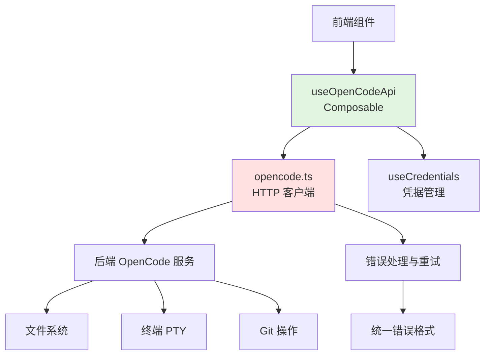

本页面详细说明 OpenCode REST API 的集成架构、核心实现与使用方式。OpenCode 作为本应用的核心扩展层，通过 RESTful API 提供文件操作、命令执行、工具调用等能力，是连接前端 UI 与后端服务的关键桥梁。

## 架构概览
OpenCode REST API 集成采用分层架构：前端通过 `useOpenCodeApi` composable 暴露声明式接口 → 调用 `opencode.ts` 工具层的 HTTP 客户端 → 与后端 OpenCode 服务通信。该架构实现了关注点分离：UI 层只需关注业务语义，工具层处理协议细节。



上图展示 OpenCode REST API 的调用链：组件通过 `useOpenCodeApi` 发起语义化操作（如读取文件、执行命令），该 composable 内部调用 `opencode.ts` 的 HTTP 客户端函数，这些函数构造符合 OpenCode 规范的 REST 请求并发送到后端服务。后端服务处理请求后操作实际资源（文件系统、终端等），并将结果以 JSON 格式返回。

## 核心模块实现

### useOpenCodeApi Composable
`useOpenCodeApi` 是前端层访问 OpenCode 能力的主要入口，提供了一系列响应式函数，涵盖文件操作、目录浏览、命令执行、工具调用等核心场景。

| 函数名称 | 功能描述 | 返回值类型 | 典型用例 |
|---------|---------|-----------|---------|
| `readFile` | 读取文件内容 | `Promise<string>` | 显示代码文件内容 |
| `writeFile` | 写入文件内容 | `Promise<void>` | 保存编辑结果 |
| `listFiles` | 列出目录内容 | `Promise<FileInfo[]>` | 文件树展示 |
| `runCommand` | 执行 shell 命令 | `Promise<CommandResult>` | 构建、测试、Git 操作 |
| `callTool` | 调用 OpenCode 工具 | `Promise<ToolResult>` | LSP、代码搜索、补丁应用 |

这些函数的实现封装了 HTTP 请求的细节，包括 URL 构造、请求头设置、错误处理和类型转换。例如 `readFile` 函数会调用 `opencode.readFile`，并自动注入当前项目的 sandbox ID 和凭据信息。

### opencode.ts 工具层
`opencode.ts` 是实际的 HTTP 客户端实现，定义了所有 OpenCode REST 端点的映射。该模块采用函数式组织，每个函数对应一个 REST 端点，负责请求的构造、发送和响应的解析。

关键实现特征：
- **基础 URL 管理**：根据当前选中的项目动态确定 OpenCode 服务地址
- **凭据注入**：自动从 `useCredentials` 获取并添加 Authorization 头
- **错误标准化**：将各种网络错误和服务器错误转换为统一错误格式
- **超时控制**：为长时间运行的操作设置合理的超时阈值

 Sources: [app/composables/useOpenCodeApi.ts](app/composables/useOpenCodeApi.ts) [app/utils/opencode.ts](app/utils/opencode.ts)

## REST 端点映射
以下是 OpenCode REST API 的主要端点及其与前端函数的对应关系：

| HTTP 方法 | 端点路径 | 前端函数 | 参数说明 | 响应格式 |
|-----------|---------|---------|---------|---------|
| GET | `/files/{path}` | `readFile(path)` | path: 文件相对路径 | `{ content: string }` |
| PUT | `/files/{path}` | `writeFile(path, content)` | content: 文件内容 | `{ success: boolean }` |
| GET | `/list/{path}` | `listFiles(path)` | path: 目录路径 | `{ files: FileInfo[] }` |
| POST | `/command` | `runCommand(cmd, cwd)` | cmd: 命令字符串, cwd: 工作目录 | `{ stdout, stderr, exitCode }` |
| POST | `/tool/{name}` | `callTool(name, params)` | name: 工具名, params: 工具参数 | `{ result: any }` |

每个端点都要求提供 `sandboxId` 参数（通过查询字符串或请求头），用于标识目标项目环境。OpenCode 服务根据 sandboxId 路由到对应的沙箱实例，实现多项目隔离。

## 凭据与认证
OpenCode REST API 使用基于 Token 的认证机制。`useCredentials` composable 负责管理 OpenCode 服务的凭据，包括 Token 的存储、刷新和自动注入。

认证流程：
1. 用户通过设置界面配置 OpenCode 服务地址和访问令牌
2. `useCredentials` 将凭据持久化到 localStorage
3. 每次 API 调用时，`opencode.ts` 从 `useCredentials` 获取当前 Token
4. Token 添加到请求的 Authorization 头：`Authorization: Bearer <token>`
5. 若 Token 失效（401 响应），自动触发刷新流程或提示用户重新登录

 Sources: [app/composables/useCredentials.ts](app/composables/useCredentials.ts) [app/utils/opencode.ts](app/utils/opencode.ts#L50-L70)

## 错误处理策略
OpenCode REST API 集成实现了多层错误处理，确保前端能够优雅地处理各种异常情况：

1. **网络层错误**：连接超时、DNS 解析失败、CORS 问题 → 转换为可重试的网络异常
2. **协议层错误**：非 2xx HTTP 状态码 → 解析错误消息并抛出结构化异常
3. **业务层错误**：文件不存在、权限不足、命令执行失败 → 提供用户友好的错误描述
4. **未知错误**：捕获所有未预期异常 → 记录日志并显示通用错误信息

所有错误都包含错误码、人类可读消息和技术详情三个字段，便于前端根据错误类型采取不同策略（如自动重试、用户提示、日志上报）。

## 与 SSE 通信的协同
OpenCode REST API 与 SSE（服务器发送事件）机制协同工作，实现请求-响应模型与事件流模型的互补。REST API 用于显式请求-响应式操作（如读取文件、执行命令），而 SSE 用于推送异步事件（如命令输出流、文件系统变化通知）。

典型工作流：
1. 前端通过 REST API 发起 `runCommand` 请求
2. 后端启动命令执行，并建立 SSE 连接推送实时输出
3. 前端同时处理 REST 响应（命令启动确认）和 SSE 事件（输出流、完成事件）
4. 命令完成后，REST 响应返回最终状态，SSE 连接关闭

这种设计实现了长时操作的响应式体验：用户立即看到命令开始执行，同时实时观察输出流，最终获取完整结果。

 Sources: [app/utils/sseConnection.ts](app/utils/sseConnection.ts) [docs/SSE.md](docs/SSE.md)

## 使用示例
以下是在 Vue 组件中使用 `useOpenCodeApi` 的典型示例：

```vue
<script setup>
import { useOpenCodeApi } from '@/composables/useOpenCodeApi'
import { ref } from 'vue'

const { readFile, writeFile, runCommand } = useOpenCodeApi()
const fileContent = ref('')
const commandOutput = ref('')

// 读取文件
async function loadFile(relativePath) {
  try {
    fileContent.value = await readFile(relativePath)
  } catch (error) {
    console.error('读取文件失败:', error.message)
  }
}

// 执行命令
async function executeBuild() {
  try {
    const result = await runCommand('npm run build', './')
    commandOutput.value = result.stdout
  } catch (error) {
    commandOutput.value = `错误: ${error.message}`
  }
}
</script>
```

该示例展示了如何以声明式方式调用 OpenCode API，无需关心 HTTP 细节、凭据管理或错误解析。`useOpenCodeApi` 自动处理所有底层复杂性，使组件代码保持简洁和可测试。

 Sources: [app/composables/useOpenCodeApi.ts](app/composables/useOpenCodeApi.ts#L100-L150)

## 测试策略
OpenCode REST API 集成包含完整的测试覆盖，确保接口的可靠性和向后兼容性：

- **单元测试**：`useOpenCodeApi.test.ts` 验证每个函数的参数构造和错误处理逻辑
- **集成测试**：`opencode.test.ts` 模拟真实 HTTP 响应，测试端点映射和解析逻辑
- **契约测试**：确保请求/响应格式符合 OpenCode 服务端的规范定义

测试采用依赖注入和模拟（mock）技术，将实际 HTTP 请求替换为模拟响应，从而在隔离环境中验证前端逻辑。所有测试都包含边界条件、错误场景和回归用例。

 Sources: [app/composables/useOpenCodeApi.test.ts](app/composables/useOpenCodeApi.test.ts) [app/utils/opencode.test.ts](app/utils/opencode.test.ts)

## 性能优化考量
OpenCode REST API 集成在设计时考虑了性能因素：

- **请求合并**：多个连续的文件读取操作可能被批量化处理（通过 `batchSessionTargets` 工具）
- **缓存策略**：频繁访问的静态资源（如配置文件）可配置缓存策略，减少重复请求
- **并发控制**：使用 `mapWithConcurrency` 限制同时进行的 API 调用数量，避免 overwhelming 后端服务
- **懒加载**：大文件内容采用分块读取或流式传输，避免单次响应过大阻塞 UI

这些优化通过 composables 和工具函数透明地应用，组件开发者无需手动干预即可享受性能收益。

## 总结
OpenCode REST API 集成是本应用与后端服务通信的核心机制，通过精心设计的抽象层将复杂的 HTTP 交互转化为简单的函数调用。其分层架构确保了可测试性、可维护性和扩展性，使前端开发者能够专注于业务逻辑而非通信细节。

作为后续学习路径，建议依次阅读：
- [SSE 实时通信机制](9-sse-shi-shi-tong-xin-ji-zhi) 了解事件流模型
- [工具窗口通信协议](11-gong-ju-chuang-kou-tong-xin-xie-yi) 理解工具调用机制
- [REST API 完整参考](26-rest-api-wan-zheng-can-kao) 获取所有端点的详细规格