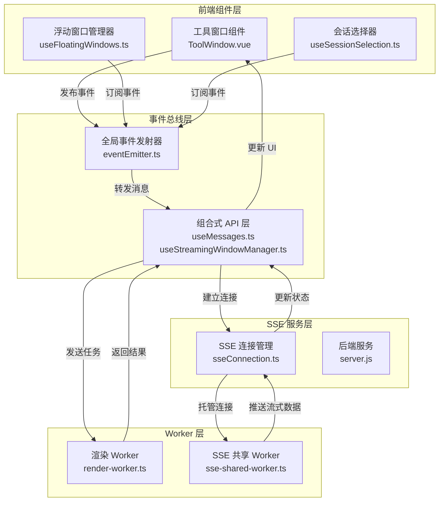

工具窗口通信协议定义了应用中各种工具窗口（如 Bash、Read、Edit、Grep 等）之间以及它们与主应用、后端服务之间的数据交换规范。该协议基于事件驱动架构，结合 SSE（Server-Sent Events）实时通信和 Web Worker 并行计算，实现高内聚、低耦合的模块化设计。

## 一、协议架构概览

工具窗口通信协议采用分层架构，包含三个核心通信层：**前端事件总线层**负责组件间即时消息传递；**Web Worker 层**处理计算密集型任务并隔离渲染；**SSE 服务层**维持与后端的持久连接，推送实时更新。各层通过标准化消息格式交互，确保类型安全与可追踪性。

Sources: [utils.ts](app/components/ToolWindow/utils.ts#L1-L174), [eventEmitter.ts](app/utils/eventEmitter.ts), [sseConnection.ts](app/utils/sseConnection.ts), [workers](app/workers)

## 二、消息类型规范

协议定义了两类消息格式：**控制消息**用于窗口生命周期管理（创建、聚焦、销毁）；**数据消息**承载工具执行结果、进度更新与错误信息。所有消息均包含 `type` 字段标识语义，`id` 字段跟踪请求-响应链，以及可选的 `payload` 携带具体数据。

| 消息类型 | 方向 | 用途 | 示例 |
|---------|------|------|------|
| `tool:create` | 主应用 → 工具窗口 | 创建新工具实例 | `{type: 'tool:create', id: 'uuid', payload: {tool: 'read', filePath: '/src/App.vue'}}` |
| `tool:update` | 工具窗口 → 主应用 | 推送执行进度 | `{type: 'tool:update', id: 'uuid', payload: {progress: 0.5, stage: 'reading'}}` |
| `tool:result` | 工具窗口 → 主应用 | 返回最终结果 | `{type: 'tool:result', id: 'uuid', payload: {content: '...', language: 'typescript'}}` |
| `tool:error` | 工具窗口 → 主应用 | 报告执行错误 | `{type: 'tool:error', id: 'uuid', payload: {error: 'File not found', code: 404}}` |
| `window:focus` | 主应用 ↔ 工具窗口 | 切换焦点状态 | `{type: 'window:focus', id: 'uuid', payload: {focused: true}}` |
| `session:select` | 主应用 → 工具窗口 | 关联会话上下文 | `{type: 'session:select', id: 'uuid', payload: {sessionId: 'sess_123'}}` |

Sources: [useMessages.ts](app/composables/useMessages.ts), [useStreamingWindowManager.ts](app/composables/useStreamingWindowManager.ts)

## 三、核心通信机制

### 3.1 事件总线模式

全局事件发射器 `eventEmitter` 提供发布-订阅机制，允许组件在不直接引用的情况下交换消息。工具窗口通过 `useMessages` 组合式函数注册事件处理器，自动处理消息去重、顺序保证与内存清理。关键事件通道包括 `tool:created`、`tool:updated`、`tool:destroyed`，所有事件均携带窗口唯一标识符以便路由。

Sources: [eventEmitter.ts](app/utils/eventEmitter.ts#L1-L100), [useMessages.ts](app/composables/useMessages.ts)

### 3.2 SSE 流式推送

对于长时间运行的工具（如 `bash`、`grep`、`codesearch`），协议采用 SSE 建立持久连接。`sseConnection` 管理连接生命周期，处理自动重连与心跳检测；`sse-shared-worker` 在后台线程维护多个工具的数据流，通过 `postMessage` 将增量数据转发至对应窗口。每个 SSE 事件包含 `toolId` 与 `sequence` 字段，确保消息有序到达且不丢失。

Sources: [sseConnection.ts](app/utils/sseConnection.ts#L1-L150), [sse-shared-worker.ts](app/workers/sse-shared-worker.ts), [SSE.md](docs/SSE.md)

### 3.3 Web Worker 隔离渲染

内容渲染任务（如代码高亮、Markdown 解析）委托给 `render-worker` 并行执行，避免阻塞 UI 线程。主线程通过 `workerRenderer` 发送渲染请求，指定输入内容、语言类型与渲染选项；Worker 返回 DOM 片段或 HTML 字符串，主线程将其注入工具窗口的 `CodeContent` 组件。该机制确保即使处理大型文件（10MB+），界面仍保持响应。

Sources: [workerRenderer.ts](app/utils/workerRenderer.ts), [render-worker.ts](app/workers/render-worker.ts), [CodeContent.vue](app/components/CodeContent.vue)

## 四、工具窗口生命周期

每个工具窗口经历 **创建 → 初始化 → 运行 → 销毁** 四阶段，各阶段触发特定协议事件：

1. **创建阶段**：主应用调用 `useStreamingWindowManager.createWindow()` 生成 UUID，发布 `window:create` 事件，携带工具类型与初始参数。对应工具组件（如 `Read.vue`、`Bash.vue`）监听该事件，实例化自身并注册到全局状态。

2. **初始化阶段**：工具窗口向 `sseConnection` 订阅其专属事件通道 `channel:tool:{toolId}`，建立数据流；同时向 `render-worker` 发送初始渲染请求（若需要显示内容）。

3. **运行阶段**：工具执行核心逻辑，周期性发布 `tool:update` 事件报告进度；若涉及用户交互（如 `Question.vue`），则通过 `useDialogHandler` 弹出输入框，结果作为 `tool:result` 返回。

4. **销毁阶段**：主应用或用户关闭窗口时，发布 `window:destroy` 事件；工具窗口清理订阅、关闭 SSE 连接、终止 Worker 任务，并从 DOM 移除。

Sources: [useStreamingWindowManager.ts](app/composables/useStreamingWindowManager.ts), [useDialogHandler.ts](app/composables/useDialogHandler.ts), [Question.vue](app/components/Question.vue)

## 五、会话与会话树集成

工具窗口可关联到特定会话（`sessionId`），通过 `useSessionSelection` 共享上下文信息。会话树结构在 `useFileTree` 中维护，工具窗口订阅 `session:changed` 事件以更新工作目录、环境变量等配置。例如，`Bash.vue` 根据当前会话的 `cwd` 设置初始路径；`Grep.vue` 使用会话的 `excludeGlob` 过滤搜索结果。

Sources: [useSessionSelection.ts](app/composables/useSessionSelection.ts), [useFileTree.ts](app/composables/useFileTree.ts), [Bash.vue](app/components/ToolWindow/Bash.vue)

## 六、错误处理与恢复

协议定义标准化错误代码：`E_TOOL_NOT_FOUND`（工具未注册）、`E_SESSION_EXPIRED`（会话失效）、`E_WORKER_TIMEOUT`（Worker 超时）、`E_SSE_DISCONNECTED`（连接中断）。错误发生时，工具窗口发布 `tool:error` 事件，包含 `retryable` 标志指示是否可自动重试。对于可恢复错误（如 SSE 连接断开），`sseConnection` 指数退避重连；对于不可恢复错误（如文件权限拒绝），窗口显示错误摘要并提供“重试”或“取消”操作按钮。

Sources: [sseConnection.ts](app/utils/sseConnection.ts#L200-L250), [useMessages.ts](app/composables/useMessages.ts#L50-L80)

## 七、性能优化策略

协议实施多项优化以确保大规模工具窗口场景下的性能：**消息批处理**将高频更新（如 `bash` 输出流）合并为 100ms 间隔的批量事件，减少渲染开销；**虚拟滚动**在 `CodeContent.vue` 中仅渲染可视区域内容，支持 10 万行文件流畅浏览；**懒加载**延迟初始化非活跃窗口的 SSE 连接与 Worker 任务，仅在窗口聚焦时激活。

Sources: [useDeltaAccumulator.ts](app/composables/useDeltaAccumulator.ts), [CodeContent.vue](app/components/CodeContent.vue), [useStreamingWindowManager.ts](app/composables/useStreamingWindowManager.ts#L120-L150)

## 八、调试与监控

协议内置可观测性：`StatusMonitorModal.vue` 实时展示所有活动工具窗口的连接状态、消息速率与 Worker 内存占用。`useMessages` 提供调试模式，在控制台输出完整消息流（含时间戳与序列号），便于追踪竞态条件。消息总线支持中间件注入，允许开发者在特定消息类型上挂载日志、指标收集或权限检查逻辑。

Sources: [StatusMonitorModal.vue](app/components/StatusMonitorModal.vue), [useMessages.ts](app/composables/useMessages.ts#L150-L180)

## 相关文档

- 了解 SSE 详细机制：[SSE 实时通信机制](9-sse-shi-shi-tong-xin-ji-zhi)
- 理解窗口架构设计：[窗口架构设计文档](29-chuang-kou-jia-gou-she-ji-wen-dang)
- 探索组件实现：[工具窗口组件系统](15-gong-ju-chuang-kou-zu-jian-xi-tong)
- 查看 API 参考：[REST API 完整参考](26-rest-api-wan-zheng-can-kao)