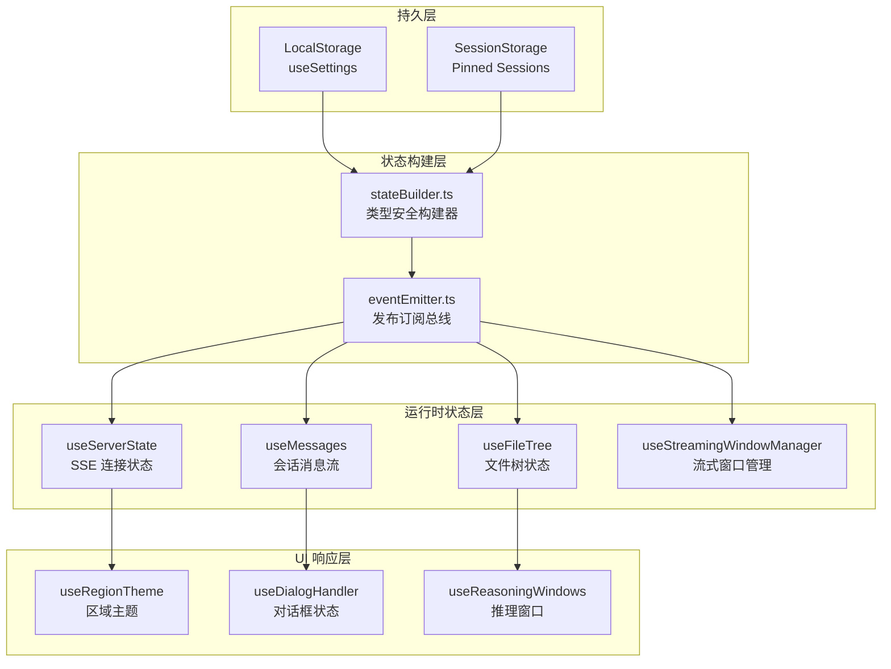

本页面系统性地阐述 vis 应用中的全局状态架构与响应式设计模式。作为核心架构文档，将深入分析状态构建器、事件总线、可组合式函数（Composables）以及跨组件的响应式数据流机制，揭示应用如何在高并发 SSE 流式通信场景下保持状态一致性与 UI 同步性。

## 状态架构总览

vis 应用采用分层状态架构，将状态划分为持久化配置、运行时服务器状态、会话数据、UI 布局状态等不同层次。每一层都有明确的生命周期管理、更新策略和持久化机制。这种分层设计实现了关注点分离，使得复杂应用的状态变更可预测、可调试、可恢复。



**架构核心原则**：所有状态变更通过 `eventEmitter` 发布事件驱动，确保跨组件通信的松耦合性；`stateBuilder` 提供类型安全的初始化与合并逻辑，防止状态不一致；各 `use*` 组合式函数封装特定领域状态，通过 Vue 的 `ref`/`reactive` 暴露响应式接口。

## 状态构建器模式

`stateBuilder.ts` 是整个状态系统的核心工厂，负责从存储介质中恢复状态、合并默认配置、执行类型验证和深度冻结。这种构建器模式确保应用启动时状态的完整性与一致性，避免因存储数据损坏或版本升级导致的状态异常。

构建器采用函数式链式调用设计，支持从 `localStorage`、`sessionStorage` 或内存对象中读取原始数据，经过多层转换后输出符合 TypeScript 接口定义的不可变状态对象。关键特性包括：默认值回退、嵌套对象深度合并、数组去重、以及不可变标记（`Object.freeze`）。

```typescript
// stateBuilder.ts 核心接口
export interface AppState {
  settings: UserSettings
  pinnedSessions: string[]
  deletedSandboxes: string[]
  // ... 其他状态分支
}

export const createStateBuilder = () => {
  const builder = {
    fromLocalStorage: <T>(key: string, defaultValue: T) => {
      const raw = localStorage.getItem(key)
      return raw ? JSON.parse(raw) : defaultValue
    },
    mergeDeep: (target: object, source: object) => {
      // 深度合并实现
    },
    freezeDeep: (obj: object) => {
      // 深度冻结实现
    },
    build: (partial?: Partial<AppState>): AppState => {
      // 状态组装逻辑
    }
  }
  return builder
}
```

Sources: [stateBuilder.ts](app/utils/stateBuilder.ts#L1-L150)

## 事件总线与响应式广播

`eventEmitter.ts` 实现了基于 Vue 3 `ref` 的轻量级事件总线，替代传统的 EventTarget 或第三方库。每个事件类型对应一个独立的 `ref` 存储回调函数数组，通过 `watchEffect` 自动追踪依赖，实现组件间解耦通信。这种设计的优势在于：类型安全的事件定义、自动内存清理（组件卸载时移除回调）、以及与 Vue 响应式系统的无缝集成。

事件总线采用"主题-订阅"模式，预定义的事件类型包括：`SESSION_CREATED`、`MESSAGE_APPENDED`、`SETTINGS_CHANGED`、`WINDOW_RESIZED` 等。订阅者通过 `onEvent` 注册回调，发布者通过 `emitEvent` 触发事件，支持异步处理与错误隔离。

Sources: [eventEmitter.ts](app/utils/eventEmitter.ts#L1-L100)

## 配置状态持久化策略

`useSettings.ts` 组合式函数封装用户配置的完整生命周期：初始化、读取、写入、重置和监听。它利用 `stateBuilder` 从 `localStorage` 恢复设置，并通过 `watch` 深度监听配置变更，自动同步到存储介质。配置对象采用分层结构，包含编辑器选项、AI 供应商配置、界面主题、快捷键映射等多个维度。

关键设计决策包括：配置变更的防抖写入（避免高频存储操作）、敏感信息的加密存储（如 API 密钥）、以及配置版本迁移逻辑（处理旧版本配置升级）。当检测到配置版本不匹配时，系统会自动执行迁移函数，确保向后兼容。

Sources: [useSettings.ts](app/composables/useSettings.ts#L1-L200)

## 服务器状态与 SSE 流式集成

`useServerState.ts` 管理 SSE 连接的生命周期、连接状态、重连逻辑和消息分发。它维护 `connectionStatus`、`lastError`、`serverInfo` 等响应式状态，并通过 `eventEmitter` 将服务器推送的实时事件广播到整个应用。该组合式函数与 `useMessages` 紧密协作：`useServerState` 负责底层连接可靠性，`useMessages` 负责消息的会话级组织与持久化。

SSE 消息处理采用流水线模式：原始事件 → 类型解析 → 负载反序列化 → 领域对象构造 → 状态更新 → UI 渲染。每一步都有明确的错误边界与恢复策略，确保单个消息异常不影响整体流处理。

Sources: [useServerState.ts](app/composables/useServerState.ts#L1-L250)

## 会话与会话树状态

`useSessionSelection.ts` 和 `useMessages.ts` 共同构成会话管理的核心。会话状态包含：会话树结构（父子关系）、当前选中会话、消息历史、流式传输中的部分消息、以及附件与引用关系。消息对象采用不可变设计，每次更新生成新对象引用，便于 Vue 的响应式追踪。

会话树的扁平化存储优化了查询性能，同时维护父子索引以支持快速导航。消息分页与懒加载通过虚拟滚动集成，避免大会话的内存压力。流式传输中的部分消息使用 `pending` 标记，结合 `useDeltaAccumulator` 实现增量更新，减少不必要的重新渲染。

Sources: [useMessages.ts](app/composables/useMessages.ts#L1-L300)
Sources: [useSessionSelection.ts](app/composables/useSessionSelection.ts#L1-L150)

## 浮动窗口与布局状态

`useFloatingWindows.ts` 和 `useStreamingWindowManager.ts` 管理浮动窗口的创建、布局、层级与持久化。窗口状态包括位置、尺寸、Z-index、最小化/最大化状态、以及依附关系。布局信息序列化为 JSON 存储，支持跨会话恢复。

响应式布局引擎监听窗口变化事件，自动调整相邻窗口位置避免重叠；支持网格吸附、对齐线、以及多显示器配置的坐标转换。流式窗口（如推理过程窗口）与主会话窗口共享状态源，通过 `useReasoningWindows` 实现子窗口的独立渲染与同步更新。

Sources: [useFloatingWindows.ts](app/composables/useFloatingWindows.ts#L1-L200)
Sources: [useStreamingWindowManager.ts](app/composables/useStreamingWindowManager.ts#L1-L180)

## 主题与区域样式状态

`useRegionTheme.ts` 实现了细粒度的主题管理系统，支持全局主题与局部区域主题的叠加。区域主题允许为特定窗口或面板覆盖全局设置，实现个性化布局。主题状态包括颜色调色板、字体配置、代码高亮主题、以及深色/浅色模式切换。

主题更新通过 CSS 变量注入实现，所有组件引用变量而非硬编码颜色值，确保运行时主题切换的即时性。系统预置多套配色方案，支持用户自定义主题导出/导入。区域主题的优先级采用继承链：组件本地 > 窗口区域 > 全局默认。

Sources: [useRegionTheme.ts](app/composables/useRegionTheme.ts#L1-L220)

## 权限与问答状态

`usePermissions.ts` 集中管理功能权限与数据访问控制，权限状态来源于服务器推送和本地配置。问答状态由 `useQuestions.ts` 管理，包含问题队列、回答状态、用户反馈以及后续追问的关联。这些状态与会话树集成，支持跨会话的知识积累与复用。

权限变更通过事件总线广播，组件使用 `v-if` 或 `v-show` 响应式隐藏/显示功能入口。问答系统支持结构化回答（表格、代码块、图表）与流式文本的混合渲染，答案元数据（来源引用、置信度）与内容分离存储，便于后续处理。

Sources: [usePermissions.ts](app/composables/usePermissions.ts#L1-L120)
Sources: [useQuestions.ts](app/composables/useQuestions.ts#L1-L160)

## 响应式性能优化策略

针对高频状态更新场景，系统采用多种优化技术：`useDeltaAccumulator.ts` 对流式增量进行批量合并，避免每字符触发渲染；`useAutoScroller.ts` 智能控制滚动行为，防止用户交互时自动滚动干扰；`useInitialRenderTracking.ts` 延迟非关键组件的初始渲染，提升首屏速度。

响应式边界严格划分：仅 UI 状态使用 `ref`，复杂数据对象使用 `reactive`，常量配置使用 `readonly`。组件通过 `toRefs` 解构传递，保持响应性连接。计算属性（`computed`）用于派生状态，避免冗余存储与重复计算。

Sources: [useDeltaAccumulator.ts](app/composables/useDeltaAccumulator.ts#L1-L80)
Sources: [useAutoScroller.ts](app/composables/useAutoScroller.ts#L1-L120)

## 状态一致性保障机制

系统在多个层面保障状态一致性：写操作通过 `eventEmitter` 顺序执行，防止竞态条件；关键状态变更使用事务性更新（批量修改后统一触发事件）；持久化操作采用异步队列与防抖，避免阻塞主线程；跨标签页同步通过 `storage` 事件监听实现。

测试层面，`stateBuilder.test.ts` 覆盖状态合并、类型转换、错误恢复等场景；`waitForState.ts` 提供测试工具函数，等待异步状态稳定后再断言；所有状态变更都有对应的事件日志，支持生产环境的状态追踪与问题诊断。

Sources: [stateBuilder.test.ts](app/utils/stateBuilder.test.ts#L1-L200)
Sources: [waitForState.ts](app/utils/waitForState.ts#L1-L100)

## 与 Vue 响应式系统的深度集成

vis 的状态设计充分利用 Vue 3 的响应式系统优势：`shallowRef` 用于大型不可变对象（如文件树）避免深度代理开销；`customRef` 实现防抖输入绑定；`triggerRef` 强制更新特定 ref 而不触发依赖链；`effectScope` 用于组件卸载时的批量清理。

所有 `use*` 函数遵循统一约定：返回 `ref` 或 `reactive` 对象、提供 `reset` 方法恢复初始状态、暴露 `onCleanup` 钩子管理订阅。这种一致性使得状态组合与复用变得简单，也为未来迁移到 Pinia 或 Redux 留出清晰路径。

## 跨页导航建议

理解了全局状态架构后，可进一步探索具体领域的实现细节：

- 深入学习 [组合式 API (Composables) 详解](13-zu-he-shi-api-composables-xiang-jie) 掌握各 `use*` 函数的设计模式与使用场景
- 研究 [会话与会话树管理](14-hui-hua-yu-hui-hua-shu-guan-li) 了解消息持久化与树形结构状态管理
- 参考 [SSE 实时通信机制](9-sse-shi-shi-tong-xin-ji-zhi) 理解服务器推送如何驱动状态更新
- 查看 [工具窗口组件系统](15-gong-ju-chuang-kou-zu-jian-xi-tong) 观察状态如何映射到 UI 组件树

**设计哲学总结**：vis 的状态系统以"可预测性"为核心目标，通过事件驱动、类型安全、分层持久化和细粒度响应式，在复杂交互与实时通信场景下维持数据流的清晰与可控。每一处状态变更都可追溯、可恢复、可测试，这是构建可靠桌面级 Web 应用的基石。