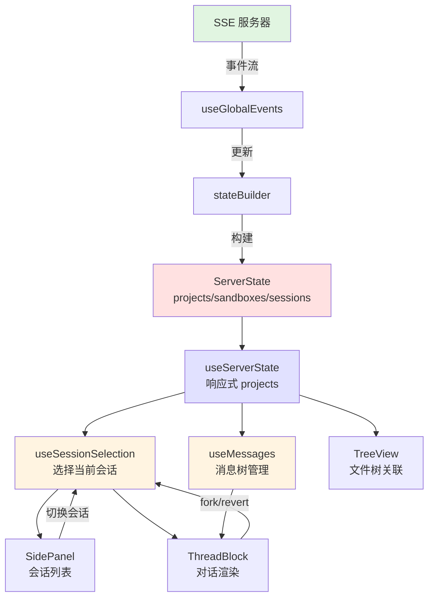

会话与会话树管理是 OpenCode 应用的核心状态架构，负责管理用户对话的层级结构、会话生命周期以及跨项目的会话导航。该模块替代了原有的 956 行 `sessionGraph.ts` 闭包存储，采用扁平化存储与索引化的现代状态管理模式，实现了高效的状态更新与响应式渲染。

## 核心架构概览

会话管理系统采用分层状态架构，由状态构建器、选择器、消息管理器三层组成，通过 SSE 事件流实时同步服务器状态。



**架构关键决策**：
- **SSOT（单一事实来源）**：`worker-state.ts` 定义核心状态类型，所有状态变更通过 `stateBuilder` 集中处理
- **扁平化存储**：所有会话（包括子会话）存储在 `sandbox.sessions` Map 中，通过 `parentID` 建立层级关系
- **索引优化**：维护 `projectIdByDirectory` 和 `sessionLocationById` 索引，实现 O(1) 会话查找
- **批处理更新**：`useMessages` 采用微任务批量触发机制，减少流式传输时的重渲染次数

## 会话状态模型

会话状态模型定义了项目、沙盒、会话三层结构，其中沙盒代表 VCS 分支/worktree，会话代表对话线程。

**类型定义参考**：[worker-state.ts](app/types/worker-state.ts#L1-L89)

```typescript
// 会话状态（单次对话）
type SessionState = {
  id: string;                    // 唯一标识
  title?: string;                // 会话标题
  parentID?: string;             // 父会话ID（形成会话树）
  status?: 'busy' | 'idle' | 'retry';
  directory?: string;            // 关联工作目录
  timeCreated?: number;
  timeUpdated?: number;          // 用于排序
  timeArchived?: number;         // 归档时间
  timePinned?: number;           // 固定时间（优先排序）
  revert?: {                     // 回滚信息
    messageID: string;
    partID?: string;
    snapshot?: string;
    diff?: string;
  };
};

// 沙盒状态（VCS 分支 + 会话集合）
type SandboxState = {
  directory: string;             // 工作目录路径
  name: string;                  // VCS 分支名
  rootSessions: string[];        // 根会话ID列表（显示顺序）
  sessions: Record<string, SessionState>; // 扁平存储
};

// 项目状态
type ProjectState = {
  id: string;
  worktree: string;              // 主工作树
  sandboxes: Record<string, SandboxState>; // 按目录索引
};
```

**设计要点**：
- 所有子会话都存储在**父会话的沙盒**中，确保会话与工作目录的关联性
- `rootSessions` 数组维护显示顺序（按 `timeUpdated` 降序）
- `status` 是会话自身状态，与消息状态独立

## 会话选择与导航

`useSessionSelection` 组合式函数负责当前会话的选中、切换与生命周期管理，是整个会话树的导航控制器。

**实现参考**：[useSessionSelection.ts](app/composables/useSessionSelection.ts#L1-L151)

### 核心 API

| 函数 | 签名 | 说明 |
|------|------|------|
| `ensureSession` | `(projectIdHint?: string) => Promise<string>` | 确保存在可用会话，若无则创建 |
| `switchSession` | `(projectId: string, sessionId: string) => Promise<void>` | 切换到指定会话 |
| `initialize` | `() => Promise<string>` | 初始化默认会话选择 |

### 会话选择策略

`ensureSession` 按以下优先级选择会话：

1. **显式提示**：若传入 `projectIdHint` 且项目存在，则选择该项目首个会话
2. **已选恢复**：若 `selectedSessionId` 已设置，直接返回
3. **最近会话**：调用 `findMostRecentSession` 查找全局最近会话（按 `timePinned` > `timeUpdated` 排序）
4. **首个项目**：选择第一个可用项目的首个会话
5. **自动创建**：若项目无会话，调用 `createSessionFn` 创建新会话

```typescript
// 查找最近会话算法（useSessionSelection.ts:28-53）
function findMostRecentSession(projects: Record<string, ProjectState>) {
  let best = null;
  for (const [projectId, project] of Object.entries(projects)) {
    for (const sandbox of listSandboxes(project)) {
      for (const session of Object.values(sandbox.sessions)) {
        if (session.parentID) continue;        // 仅考虑根会话
        if (session.timeArchived) continue;    // 忽略已归档
        const pinnedAt = session.timePinned ?? 0;
        const time = session.timeUpdated ?? session.timeCreated ?? 0;
        if (!best || pinnedAt > best.pinnedAt || (pinnedAt === best.pinnedAt && time > best.time)) {
          best = { projectId, sessionId: session.id, pinnedAt, time };
        }
      }
    }
  }
  return best;
}
```

**关键约束**：
- 仅根会话参与“最近会话”排序，子会话通过父会话关联显示
- `switchSession` 使用 `waitForState` 等待状态同步，确保目标会话已加载

## 消息与会话树管理

`useMessages` 组合式函数管理消息的流式更新、线程聚合与状态计算，是会话内容的核心存储。

**实现参考**：[useMessages.ts](app/composables/useMessages.ts#L1-L530)

### 数据组织结构

```typescript
type MessageEntry = {
  info?: MessageInfo;                      // 消息元数据
  parts: Set<ShallowRef<MessagePart>>;     // 消息片段（工具调用、推理等）
};

// 模块级单例状态
const messages = shallowRef(new Map<string, ShallowRef<MessageEntry>>());
const parts = new Map<string, ShallowRef<MessagePart>>();
```

### 批处理更新系统

为优化流式传输性能，`useMessages` 实现微任务批处理机制，避免每个 token 触发重渲染：

```typescript
// useMessages.ts:16-39
const pendingMessageTriggers = new Set<ShallowRef<MessageEntry>>();
const pendingCollectionTrigger = { value: false };
let flushScheduled = false;

function scheduleFlush() {
  if (flushScheduled) return;
  flushScheduled = true;
  queueMicrotask(() => {
    flushScheduled = false;
    for (const ref of pendingMessageTriggers) triggerRef(ref);
    pendingMessageTriggers.clear();
    if (pendingCollectionTrigger.value) {
      pendingCollectionTrigger.value = false;
      triggerRef(messages);
    }
  });
}
```

**性能收益**：在连续 SSE 事件流中，将 N 次更新合并为 ⌈N/批处理大小⌉ 次渲染，显著降低组件重渲染频率。

### 会话树遍历

```typescript
// 根消息：用户消息或无父消息的助手消息
const roots = computed(() => {
  const result: MessageInfo[] = [];
  for (const messageRef of messages.value.values()) {
    const info = messageRef.value.info;
    if (!info) continue;
    if (info.role === 'user') { result.push(info); continue; }
    const parent = messages.value.get(info.parentID)?.value.info;
    if (!parent) result.push(info);  // 无父消息视为根
  }
  return result.sort(byTimeThenId);
});

// 子消息分组
const childrenByParent = computed(() => {
  const index = new Map<string, MessageInfo[]>();
  for (const messageRef of messages.value.values()) {
    const info = messageRef.value.info;
    if (!info) continue;
    if (info.role === 'user') continue;  // 用户消息无子消息
    const parent = messages.value.get(info.parentID)?.value.info;
    if (parent && parent.role === 'assistant') {
      const bucket = index.get(info.parentID) ?? [];
      bucket.push(info);
      index.set(info.parentID, bucket);
    }
  }
  return index;
});
```

### 线程获取 API

```typescript
// 获取某消息的完整线程（消息 + 所有子消息）
function getThread(rootId: string): MessageInfo[] {
  const result: MessageInfo[] = [];
  const stack = [rootId];
  while (stack.length > 0) {
    const current = stack.pop()!;
    const entry = messages.value.get(current)?.value;
    if (!entry?.info) continue;
    result.push(entry.info);
    const children = childrenByParent.value.get(current);
    if (children) stack.push(...children.map(c => c.id));
  }
  return result.sort(byTimeThenId);
}
```

## 状态构建与索引

`stateBuilder` 是状态管理的核心引擎，负责将 SSE 事件转换为内部状态，维护多级索引以支持高效查询。

**实现参考**：[stateBuilder.ts](app/utils/stateBuilder.ts#L1-L826)

### 索引结构

```typescript
const stateBuilder = createStateBuilder();

// 内部索引
const projectIdByDirectory = new Map<string, string>();    // 目录 → 项目ID
const sessionLocationById = new Map<string, SessionLocation>(); // 会话ID → {projectId, directory}
const ephemeralLastSeenAt = new Map<string, number>();    // 临时会话活跃时间
const ephemeralLastActiveAt = new Map<string, number>();  // 临时会话活动时间
```

### 会话位置解析

`sessionLocationById` 索引在状态更新时重建，支持 O(1) 会话位置查找：

```typescript
function rebuildIndexes() {
  projectIdByDirectory.clear();
  sessionLocationById.clear();
  
  Object.values(state.projects).forEach(project => {
    // 索引项目目录
    const root = normalizeDirectory(project.worktree);
    if (root) projectIdByDirectory.set(root, project.id);
    
    // 索引所有沙盒目录与会话
    Object.entries(project.sandboxes).forEach(([directory, sandbox]) => {
      const normalized = normalizeDirectory(directory);
      Object.keys(sandbox.sessions).forEach(sessionId => {
        sessionLocationById.set(sessionId, { projectId: project.id, directory: normalized });
      });
    });
  });
}
```

### 子会话修剪策略

为控制内存占用，状态构建器实施 TTL 策略自动清理长时间未见的子会话：

```typescript
const CHILD_SESSION_PRUNE_TTL_MS = 20 * 60 * 1000;  // 20分钟

function rebuildIndexes() {
  // ... 索引重建逻辑
  // 清理临时会话记录
  Array.from(ephemeralLastSeenAt.keys()).forEach(sessionId => {
    if (!knownSessionIds.has(sessionId)) ephemeralLastSeenAt.delete(sessionId);
  });
}
```

**修剪触发时机**：每次状态更新重建索引时，自动清理超过 TTL 且未再出现的临时会话。

## SSE 事件处理

`useGlobalEvents` 建立 SSE 连接并分发事件，是状态更新的入口点。

**实现参考**：[useGlobalEvents.ts](app/composables/useGlobalEvents.ts#L1-L520)

### 事件分发流程

```typescript
const KNOWN_EVENT_TYPES = new Set<EventKey>([
  'message.updated', 'message.removed', 'message.part.updated',
  'session.created', 'session.updated', 'session.deleted',
  'session.diff', 'session.error', 'session.status',
  // ... 其他事件类型
]);

function createDirectTransport(callbacks) {
  const connection = createSseConnection({
    onPacket(packet) { callbacks.onPacket(packet); },
    onOpen(isReconnect) { /* 连接建立 */ },
    onError(message, statusCode) { /* 错误处理 */ }
  });
  // ...
}
```

### 会话过滤机制

事件处理器根据会话权限规则过滤事件，确保用户仅访问授权会话：

```typescript
function computeAllowedSessionIds(rootId: string, parents: Record<string, string>): Set<string> {
  const allowed = new Set<string>();
  if (!rootId) return allowed;
  
  // 构建子会话索引
  const childrenByParent = new Map<string, string[]>();
  Object.entries(parents).forEach(([sessionId, parentId]) => {
    if (!parentId) return;
    const bucket = childrenByParent.get(parentId) ?? [];
    bucket.push(sessionId);
    childrenByParent.set(parentId, bucket);
  });
  
  // 深度优先遍历收集子树
  const stack = [rootId];
  while (stack.length > 0) {
    const current = stack.pop();
    if (!current || allowed.has(current)) continue;
    allowed.add(current);
    const children = childrenByParent.get(current);
    if (children) stack.push(...children);
  }
  return allowed;
}
```

## UI 组件集成

### 侧边栏会话导航

`SidePanel` 组件集成会话列表、待办事项与文件树，提供全局导航入口。

**组件参考**：[SidePanel.vue](app/components/SidePanel.vue#L1-L402)

```vue
<SidePanel
  :collapsed="collapsed"
  :activeTab="activeTab"
  :selectedSessionId="selectedSessionId"
  :pinnedSessions="pinnedSessions"
  :treeNodes="treeNodes"
  @select-session="switchSession"
  @toggle-dir="toggleDirectory"
/>
```

**会话项数据结构**：
```typescript
type SessionPanelItem = {
  sessionId: string;
  projectId: string;
  directory: string;
  title: string;
  projectName: string;
  branch: string;  // 从 Git 状态解析
};
```

### 线程块渲染

`ThreadBlock` 组件渲染单轮对话（用户消息 + 助手回复），支持 fork、revert、历史查看等操作。

**组件参考**：[ThreadBlock.vue](app/components/ThreadBlock.vue#L1-L684)

```vue
<ThreadBlock
  :root="messageInfo"
  :theme="theme"
  :filesWithBasenames="fileList"
  @fork-message="forkThread"
  @revert-message="revertThread"
  @show-thread-history="showHistory"
/>
```

**线程状态计算**：
- `threadMessages`：通过 `msg.getThread(root.id)` 获取完整线程
- `assistantMessages`：过滤出助手消息
- `threadError`：检查线程内错误消息
- `threadContextPercent`：计算上下文使用率

### 文件树与会话关联

`TreeView` 组件显示文件系统结构，并与当前会话的工作目录关联，支持 Git 操作。

**组件参考**：[TreeView.vue](app/components/TreeView.vue#L1-L1664)

**核心交互**：
- **目录切换**：`@toggle-dir` 事件更新 `activeDirectory`
- **文件选择**：`@select-file` 触发文件编辑器
- **差异查看**：`@open-diff` / `@open-diff-all` 显示 Git 差异
- **分支操作**：集成分支选择器，支持 merge、fork、delete、fetch

## 会话树操作

### 会话固定

固定会话将其置于侧边栏顶部，不受时间排序影响：

```typescript
// 固定操作（示例）
function pinSession(sessionId: string) {
  // 设置 session.timePinned = Date.now()
  // stateBuilder 重建索引，findMostRecentSession 优先选择
}
```

### 会话分叉

分叉（fork）基于现有消息创建新会话，复制消息历史并重置上下文：

```typescript
// 分叉流程
1. 用户点击 ThreadBlock.fork 按钮
2. 调用 createSession(projectId) 创建新会话
3. 复制原会话所有消息到新会话（保持 parentID 关系）
4. 切换至新会话并更新 UI
```

### 会话回滚

回滚（revert）基于指定消息的快照恢复工作目录：

```typescript
// 回滚数据结构
type RevertInfo = {
  messageID: string;   // 目标消息
  partID?: string;     // 可选片段ID
  snapshot?: string;   // 快照内容
  diff?: string;       // 差异补丁
};
```

## 性能优化策略

### 1. 懒加载与分片

`useMessages` 按需加载历史消息，使用 `HISTORY_CHUNK_SIZE = 40` 控制分片大小：

```typescript
// 历史消息分片加载
function loadMoreHistory(before: number, limit = HISTORY_CHUNK_SIZE) {
  // 仅加载必要消息，避免全量渲染
}
```

### 2. 虚拟化渲染

`MessageViewer` 与 `ThreadBlock` 结合虚拟滚动，仅渲染可视区域消息。

### 3. 状态批处理

见前述 `scheduleFlush` 机制，将多个 `triggerRef` 合并为单次渲染周期。

### 4. 缓存策略

- **目录快照缓存**：`directorySidebarCache` 缓存最多 12 个目录的文件树
- **Git 状态去抖**：`GIT_STATUS_RELOAD_DEBOUNCE_MS = 120ms` 防止频繁 Git 调用
- **分支列表缓存**：`branchEntriesLoadedForDirectory` 标记避免重复加载

## 错误处理与恢复

### 会话状态错误

```typescript
type SessionStatusInfo =
  | { type: 'idle' }
  | { type: 'busy' }
  | { type: 'retry'; attempt: number; message: string; next: number };
```

`useMessages` 自动检测错误消息并标记状态：

```typescript
function resolveStatus(info?: MessageInfo): MessageStatus {
  if (!info) return 'streaming';
  if (info.role === 'user') return 'complete';
  if (info.error || info.finish === 'error') return 'error';
  if (info.time.completed !== undefined || info.finish) return 'complete';
  return 'streaming';
}
```

### 连接恢复

`useGlobalEvents` 支持 SSE 自动重连，通过 `onReconnected` 回调重新同步状态。

## 配置与扩展

### 子会话修剪 TTL

```typescript
const CHILD_SESSION_PRUNE_TTL_MS = 20 * 60 * 1000;  // stateBuilder.ts:13
```

调整此值可控制内存中保留的子会话时长。

### 历史分片大小

```typescript
const HISTORY_CHUNK_SIZE = 40;  // useMessages.ts:14
```

增大分片可减少请求次数，但单次渲染压力增加。

## 相关文档链接

会话管理模块与其他核心模块紧密集成，建议按以下顺序深入阅读：

- **[浮动窗口管理系统](6-fu-dong-chuang-kou-guan-li-xi-tong)**：会话在浮动窗口中的生命周期
- **[SSE 实时通信机制](9-sse-shi-shi-tong-xin-ji-zhi)**：会话更新的底层传输协议
- **[全局状态管理与响应式设计](12-quan-ju-zhuang-tai-guan-li-yu-xiang-ying-shi-she-ji)**：状态管理架构全景
- **[工具窗口通信协议](11-gong-ju-chuang-kou-tong-xin-xie-yi)**：会话与工具交互

## 源代码引用

- 会话选择逻辑：[useSessionSelection.ts](app/composables/useSessionSelection.ts#L1-L151)
- 消息批处理系统：[useMessages.ts](app/composables/useMessages.ts#L1-L530)
- 状态构建器索引：[stateBuilder.ts](app/utils/stateBuilder.ts#L1-L826)
- 服务器状态管理：[useServerState.ts](app/composables/useServerState.ts#L1-L68)
- 全局事件分发：[useGlobalEvents.ts](app/composables/useGlobalEvents.ts#L1-L520)
- 线程块 UI 组件：[ThreadBlock.vue](app/components/ThreadBlock.vue#L1-L684)
- 侧边栏导航：[SidePanel.vue](app/components/SidePanel.vue#L1-L402)
- 文件树与会话关联：[TreeView.vue](app/components/TreeView.vue#L1-L1664)
- 核心状态类型：[worker-state.ts](app/types/worker-state.ts#L1-L89)
- SSE 类型定义：[sse.ts](app/types/sse.ts#L1-L581)