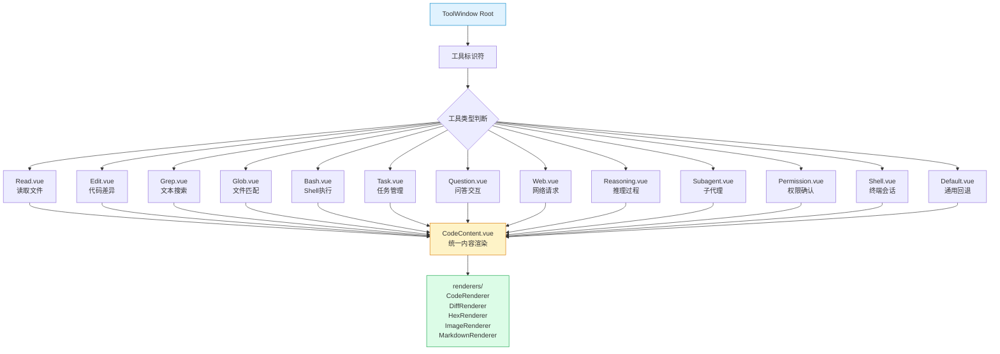
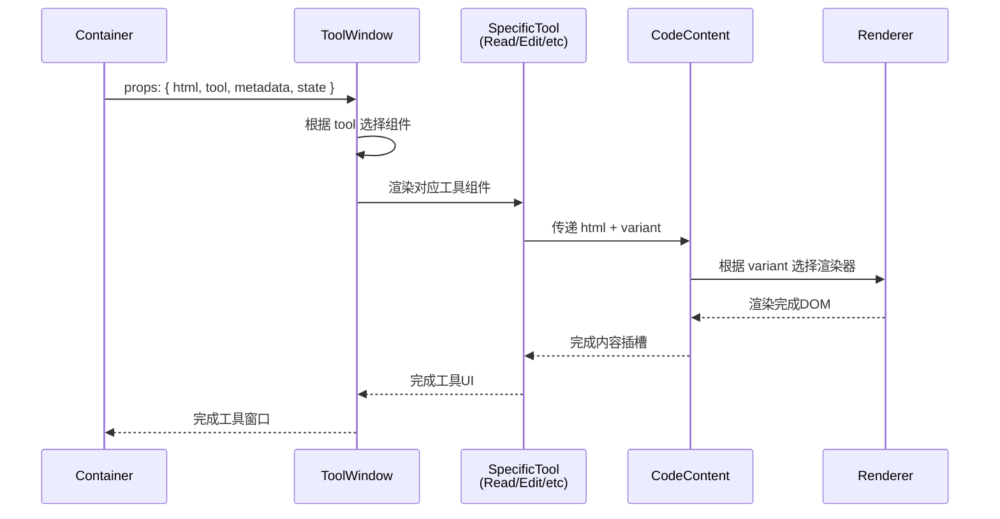

工具窗口组件系统是应用的核心UI架构之一，负责将各类工具执行结果（如代码读取、文件搜索、网络请求等）以结构化、可交互的方式呈现给用户。该系统基于Vue 3的组件化设计，通过统一的渲染契约和丰富的类型推导，实现了多态内容展示与高效的状态管理。其核心目标是提供一致且可扩展的用户体验，使不同工具的输出能够在同一框架下无缝集成。

## 系统架构概览

工具窗口组件系统采用分层架构设计，由组件层、工具适配层、渲染层和逻辑层组成。组件层定义了各个具体工具的UI表现；工具适配层通过工具标识符将运行时数据映射到对应组件；渲染层负责复杂内容的最终呈现；逻辑层处理标题格式化、语言推断、颜色分配等辅助功能。各层之间通过明确定义的接口通信，确保了系统的可维护性和可扩展性。



上图展示了工具窗口的组件路由机制：根组件根据`tool`字段判断具体类型，动态加载对应的子组件，所有子组件最终都汇聚到`CodeContent.vue`进行统一渲染，而`CodeContent.vue`则根据内容特性选择合适的渲染器。这种设计实现了关注点分离，使得新增工具只需添加对应组件即可无缝接入系统。

## 工具组件规范

每个工具窗口组件遵循相同的接口契约，接收`html`属性作为渲染内容，并通过`variant`或隐式约定指定渲染模式。例如，`Edit.vue`使用`diff`变体展示代码差异，`Read.vue`使用`code`变体展示源代码，而`Default.vue`则作为未识别工具的回退方案。组件本身不包含业务逻辑，纯粹作为UI适配器存在。

| 组件名称 | 工具标识符 | 渲染模式 | 主要用途 | 颜色标识 |
|---------|-----------|---------|---------|---------|
| Read.vue | read | code | 文件内容读取 | `#60a5fa` (蓝) |
| Edit.vue | edit/diff | diff | 代码编辑差异 | `#f97316` (橙) |
| Grep.vue | grep | code | 文本搜索结果 | `#facc15` (黄) |
| Glob.vue | glob | code | 文件模式匹配 | `#facc15` (黄) |
| Bash.vue | bash | code | Shell命令执行 | `#a855f7` (紫) |
| Task.vue | task | markdown | 任务描述与计划 | `#818cf8` (靛) |
| Question.vue | question | markdown | 用户问答内容 | `#818cf8` (靛) |
| Web.vue | webfetch/websearch | markdown | 网络获取结果 | `#2dd4bf` (青) |
| Reasoning.vue | reasoning | markdown | 推理过程展示 | `#2dd4bf` (青) |
| Default.vue | (未知) | code | 通用回退渲染 | `#64748b` (灰) |

所有组件均采用`<script setup>`语法糖，通过`defineProps`声明`html: string`属性，确保类型安全。模板部分直接委托给`CodeContent`组件，实现了极简的适配器模式。这种设计使得添加新工具的成本极低，同时保持了渲染逻辑的集中管理。

**Sources: [app/components/ToolWindow/Read.vue](app/components/ToolWindow/Read.vue#L1-L12), [app/components/ToolWindow/Edit.vue](app/components/ToolWindow/Edit.vue#L1-L12), [app/components/ToolWindow/Default.vue](app/components/ToolWindow/Default.vue#L1-L12)**

## 工具标题格式化

工具窗口的标题并非直接使用原始输入，而是经过一系列格式化函数处理，提取关键信息生成用户友好的标题。`utils.ts`模块提供了针对不同工具类型的专用格式化函数，每种函数都遵循"优先字段提取"策略：按预定义顺序检查输入对象中的字段，返回第一个有效值。

```typescript
// 典型格式化流程示例
formatGlobToolTitle({ pattern: "*.ts", path: "/src", include: "node_modules" })
// → "*.ts @ /src include node_modules"

formatReadLikeToolTitle({ filePath: "/home/user/config.json" })
// → "/home/user/config.json"

formatWebfetchToolTitle({ url: "https://api.example.com/data" })
// → "https://api.example.com/data"
```

格式化函数的设计具有防御性编程特征：所有字段访问都经过`typeof`检查，字符串值调用`trim()`去除首尾空白，空结果返回`undefined`而非空字符串，这为标题栏的空状态处理提供了便利。这种严谨的数据清洗策略确保了UI展示的整洁性。

**Sources: [app/components/ToolWindow/utils.ts](app/components/ToolWindow/utils.ts#L1-L75)**

## 路径解析优先级

对于读写类工具（如`read`、`edit`、`write`），系统实现了多级路径解析策略`resolveReadWritePath`。该函数按优先级顺序检查四个可能的路径来源：`input.filePath` → `input.path` → `metadata.filepath` → `state.title`。这种设计允许不同数据源（用户输入、工具元数据、会话状态）在缺失字段时能够优雅降级，确保最终总能生成一个有意义的路径标识。

```typescript
// 多级路径解析示例
resolveReadWritePath(
  { path: "/src/App.vue" },           // input
  { filepath: "/lib/utils.ts" },      // metadata
  { title: "/config/settings.json" }  // state
)
// → "/src/App.vue" (input.path 优先级最高)
```

当所有字段都缺失时，函数返回`undefined`，这通常意味着工具调用信息不完整，UI层应相应显示占位符或错误提示。该函数还展示了统一的类型守卫模式：`typeof === 'string'`配合`trim()`，以及`undefined`的显式返回，这些都是TypeScript严格模式下的最佳实践。

**Sources: [app/components/ToolWindow/utils.ts](app/components/ToolWindow/utils.ts#L24-L37)**

## 语言推断与语法高亮

`guessLanguageFromPath`函数实现了基于文件扩展名的编程语言推断，支持超过30种常见语言和文件格式。该函数采用`switch`语句进行精确匹配，包括复合扩展名处理（如`.tsx`、`.jsx`）、多义词区分（如`.h`/`.hpp`映射为C++）以及特殊类型识别（如`.diff`/`.patch`映射为diff格式）。无法识别时返回`'text'`，这是Prism.js等语法高亮库的合法语言标识。

该函数的设计体现了生产级代码的特征：扩展名统一转为小写比较，使用`?.`可选链处理无扩展名路径，`pop()`获取最后一个点号后的部分作为扩展名。值得注意的是，对于某些扩展名（如`.yml`和`.yaml`）存在多对一映射，这反映了实际文件系统的多样性。

**Sources: [app/components/ToolWindow/utils.ts](app/components/ToolWindow/utils.ts#L111-L173)**

## 工具色彩编码系统

`toolColor`函数为每个工具类型分配了唯一的颜色标识，这些颜色采用Tailwind CSS的十六进制色值。色彩系统遵循语义化原则：文件操作类（read/list）使用蓝色系，搜索类（grep/glob）使用黄色系，编辑类（edit/write）使用橙色系，网络类（webfetch/websearch）使用青色系，任务类（task/batch）使用靛青色系，规划类使用灰色系。这种视觉编码使用户能够通过颜色快速识别工具类型，提升了信息扫描效率。

色彩映射采用穷尽式`switch`语句，`default`分支返回中性灰`#64748b`，确保未知工具也能获得合理的视觉呈现。所有颜色值均为6位十六进制，与Tailwind配置兼容，可在CSS中直接使用或通过`style`绑定动态应用。

**Sources: [app/components/ToolWindow/utils.ts](app/components/ToolWindow/utils.ts#L77-L109)**

## 渲染器架构集成

工具窗口组件最终都将HTML内容委托给`CodeContent.vue`组件进行渲染。该组件作为统一的渲染入口，根据`variant`属性（`code`、`diff`、`markdown`等）选择对应的子渲染器。系统内置了五种渲染器：`CodeRenderer.vue`用于语法高亮代码，`DiffRenderer.vue`用于差异对比展示，`HexRenderer.vue`用于二进制数据十六进制视图，`ImageRenderer.vue`用于图像预览，`MarkdownRenderer.vue`用于富文本渲染。

这种多层渲染架构实现了内容类型与UI表现的解耦：工具组件只关心"我要显示什么类型的内容"，而`CodeContent`组件负责"如何以最佳方式显示该类型内容"。当新增内容类型时，只需扩展`CodeContent`的渲染器集合，无需修改任何工具组件，符合开闭原则。

**Sources: [app/components/ToolWindow/Default.vue](app/components/ToolWindow/Default.vue#L10), [app/components/renderers/CodeRenderer.vue](app/components/renderers/CodeRenderer.vue), [app/components/renderers/DiffRenderer.vue](app/components/renderers/DiffRenderer.vue)**

## 组件间数据流

工具窗口的数据流遵循单向数据流原则：父级组件（通常是浮动窗口或标签页容器）通过props传递`html`、`tool`、`metadata`等数据给`ToolWindow`根组件，根组件根据`tool`值动态选择具体工具组件，工具组件再将`html`传递给`CodeContent`，最终由渲染器完成DOM生成。状态变更通过事件冒泡向上传递，确保数据源的唯一性。



该数据流体现了Vue的组合式API优势：每个组件只关注自身职责，通过props接收数据，通过事件发射信号，复杂的工具逻辑被封装在工具组件之外（如composables或store），保持了组件的纯净性。

**Sources: [app/components/FloatingWindow.vue](app/components/FloatingWindow.vue), [app/components/ToolWindow/](app/components/ToolWindow/)**

## 扩展性与维护性

工具窗口系统在设计上高度关注扩展性。添加新工具只需三步：在`ToolWindow/`目录下创建新组件（如`MyTool.vue`），在工具路由逻辑中注册该组件，并可选地在`utils.ts`中添加对应的格式化函数和颜色定义。由于所有工具组件共享相同的props接口，新工具可以立即获得完整的渲染能力支持。

维护性方面，系统通过集中式`utils.ts`管理所有格式化逻辑，避免了代码重复；通过`variant`属性抽象渲染模式，避免了条件渲染的分散化；通过颜色编码函数，确保了视觉一致性。单元测试覆盖了`utils.ts`中的核心函数（见`mapWithConcurrency.test.ts`、`stateBuilder.test.ts`等），而组件测试则通过Vue Test Utils进行快照比对。

**Sources: [app/components/ToolWindow/utils.ts](app/components/ToolWindow/utils.ts), [app/utils/stateBuilder.test.ts](app/utils/stateBuilder.test.ts)**

## 性能优化考量

工具窗口渲染涉及潜在的大型内容（如整个文件、大量搜索结果），系统在多个层面进行了性能优化。首先，`CodeContent`组件默认启用语法高亮缓存，相同内容的重复渲染可直接复用高亮结果。其次，渲染器组件采用按需加载策略，例如`HexRenderer`仅在检测到二进制内容时才激活，避免不必要的DOM节点创建。第三，工具组件本身是无状态的函数式组件（`<script setup>`不包含响应式状态），Vue的编译时优化可以将其转化为高效的渲染函数。

对于流式内容（如Shell会话的持续输出），系统通过`useStreamingWindowManager`组合式函数管理增量更新，仅将新增内容追加到DOM而非全量重渲染。这种设计确保了即使长时间运行的命令也能保持界面响应性。

**Sources: [app/composables/useStreamingWindowManager.ts](app/composables/useStreamingWindowManager.ts), [app/components/renderers/HexRenderer.vue](app/components/renderers/HexRenderer.vue)**

## 下一步探索

工具窗口组件系统是整个应用UI层的重要支柱，与之紧密相关的还有：
- [浮动窗口管理系统](6-fu-dong-chuang-kou-guan-li-xi-tong)：了解工具窗口如何被创建、排列、停靠和销毁
- [渲染器与查看器架构](7-xuan-ran-qi-yu-cha-kan-qi-jia-gou)：深入理解内容渲染管线的底层机制
- [全局状态管理与响应式设计](12-quan-ju-zhuang-tai-guan-li-yu-xiang-ying-shi-she-ji)：掌握工具窗口数据如何与全局状态同步

这些主题共同构成了应用前端架构的核心知识体系。