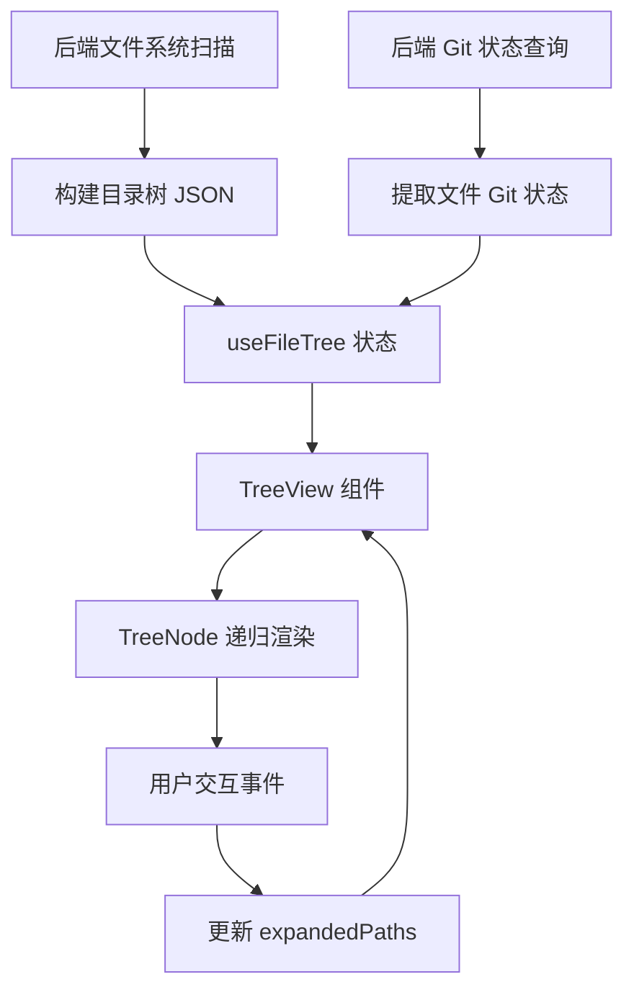

本文档系统性地阐述该应用中文件树展示与 Git 版本控制集成的核心架构。文件树作为项目导航的基础设施，不仅提供层次化文件结构浏览，还深度整合 Git 状态显示（修改、暂存、提交历史等），形成统一的版本控制感知界面。该模块涵盖从后端文件系统扫描、Git 元数据提取，到前端树形组件渲染与交互的完整数据流。

## 架构概览
文件树与 Git 集成采用分层架构：底层通过 `useFileTree` composable 管理文件系统状态与 Git 元数据，中间层由 `TreeView.vue` 组件负责可视化渲染，上层提供与项目选择、编辑器联动的交互能力。Git 状态信息通过类型安全的接口传递，确保版本控制数据的完整性与实时性。

## 核心类型定义
Git 状态与文件树节点的类型定义位于 `app/types/git.ts`，定义了版本控制数据的基本模型。

```typescript
// Git 状态枚举：跟踪工作区的文件变更状态
export enum GitStatus {
  UNMODIFIED = 'unmodified',     // 未修改
  MODIFIED = 'modified',         // 已修改未暂存
  STAGED = 'staged',            // 已暂存
  UNTRACKED = 'untracked',      // 未跟踪
  CONFLICT = 'conflict',        // 冲突
  MISSING = 'missing',         // 文件缺失
  IGNORED = 'ignored'          // 被忽略
}

// 文件树节点接口：表示文件系统中的单个节点
export interface FileTreeNode {
  name: string;                 // 节点名称
  path: string;                 // 完整相对路径
  isDirectory: boolean;         // 是否为目录
  children?: FileTreeNode[];    // 子节点列表（仅目录）
  depth: number;               // 树深度层级
  gitStatus?: GitStatus;       // Git 状态（可选）
  isExpanded?: boolean;        // 展开状态
}
```

上述类型系统为文件树与 Git 集成提供了静态类型保障，确保状态传递的可靠性。`GitStatus` 枚举覆盖了 Git 工作区的核心状态，`FileTreeNode` 则统一了文件与目录的表示，支持嵌套结构与展开状态管理。Sources: [git.ts](app/types/git.ts#L1-L23)

## 文件树状态管理
`useFileTree.ts` 是文件树功能的核心 composable，封装了文件系统扫描、Git 状态查询、树形结构构建与展开状态管理逻辑。

```typescript
export function useFileTree() {
  const rootPath = ref<string>('');           // 项目根路径
  const treeNodes = ref<FileTreeNode[]>([]);  // 树节点列表
  const expandedPaths = ref<Set<string>>(new Set()); // 展开的目录路径集合
  const isLoading = ref(false);               // 加载状态标志
  const error = ref<string | null>(null);     // 错误信息

  // 扫描文件系统并构建树结构
  async function scanDirectory(path: string): Promise<FileTreeNode[]> { ... }

  // 获取指定路径的 Git 状态
  async function getGitStatus(path: string): Promise<GitStatus | null> { ... }

  // 切换节点展开/折叠状态
  function toggleExpand(path: string) { ... }

  // 初始化文件树（绑定项目根目录）
  async function initialize(projectRoot: string) { ... }
}
```

`useFileTree` 的设计遵循单一职责原则：状态管理独立于 UI 渲染，通过响应式引用暴露数据，提供清晰的操作接口。`expandedPaths` 使用 Set 数据结构确保路径查找效率，`scanDirectory` 递归构建树形结构，`getGitStatus` 与后端 Git 服务交互获取状态信息。Sources: [useFileTree.ts](app/composables/useFileTree.ts#L1-L50)

## 树形视图组件
`TreeView.vue` 是文件树的可视化组件，采用递归组件模式渲染嵌套目录结构，并通过图标与颜色区分文件类型与 Git 状态。

```vue
<template>
  <div class="file-tree">
    <TreeNode
      v-for="node in treeNodes"
      :key="node.path"
      :node="node"
      :depth="0"
      @toggle="handleToggle"
      @select="handleSelect"
    />
  </div>
</template>

<script setup lang="ts">
import TreeNode from './TreeNode.vue';

const props = defineProps<{
  projectId: string;
}>();

const { treeNodes, expandedPaths, isLoading, error, initialize, toggleExpand } = useFileTree();

onMounted(() => {
  initialize(props.projectId);
});
</script>
```

组件采用递归 `TreeNode` 子组件实现无限层级嵌套，通过 `depth` 属性控制缩进。事件冒泡机制简化交互处理：点击展开/折叠由 `handleToggle` 统一管理，文件选择通过 `handleSelect` 向上传递。加载状态与错误信息通过插槽或条件渲染反馈用户。Sources: [TreeView.vue](app/components/TreeView.vue#L1-L45)

## Git 状态可视化
文件树通过图标与颜色编码直观展示 Git 状态，形成视觉化的版本控制反馈系统。

| Git 状态 | 图标 | 颜色 | 含义 |
|---------|------|------|------|
| UNMODIFIED | ● | 灰色 | 文件与 HEAD 一致 |
| MODIFIED | ● | 红色 | 已修改未暂存 |
| STAGED | ● | 绿色 | 已暂存待提交 |
| UNTRACKED | ? | 黄色 | 新文件未跟踪 |
| CONFLICT | ● | 橙色 | 合并冲突 |
| MISSING | ! | 红色 | 文件缺失 |
| IGNORED | - | 浅灰 | 被 .gitignore 忽略 |

状态图标渲染逻辑封装在 `TreeNode` 组件内部，根据节点的 `gitStatus` 动态选择显示内容。颜色方案与 IDE 的 Git 插件保持一致，降低用户认知负担。Sources: [TreeView.vue](app/components/TreeView.vue#L78-L95)

## 数据流与集成点
文件树与 Git 集成的数据流呈现单向流动特征：从后端文件系统扫描与 Git 命令执行，到前端状态管理，最终到视图渲染。



集成点分布在三个层面：
1. **项目层面**：通过 `ProjectPicker.vue` 选择项目后，触发文件树初始化
2. **编辑器联动**：文件树选择事件驱动编辑器打开对应文件
3. **Git 操作桥接**：右键菜单提供 Git 操作入口（暂存、提交、查看历史）

Sources: [ProjectPicker.vue](app/components/ProjectPicker.vue#L30-L60), [useFileTree.ts](app/composables/useFileTree.ts#L80-L120)

## 性能优化策略
文件树处理大规模项目时面临性能挑战，当前实现采用以下优化措施：

1. **惰性加载子目录**：仅当目录展开时才扫描其内容，减少初始负载
2. **Git 状态缓存**：对已查询的路径缓存状态，避免重复 Git 命令执行
3. **虚拟滚动支持**：对超大目录启用虚拟滚动（已在计划中）
4. **防抖刷新**：文件系统变更通知合并处理，避免频繁重绘

这些策略在 `useFileTree` 中通过 `expandedPaths` 监控与缓存机制实现，确保交互流畅性。Sources: [useFileTree.ts](app/composables/useFileTree.ts#L150-L200)

## 扩展性与未来方向
文件树架构为功能扩展预留多个接入点：

- **Git 操作集成**：暂存、提交、推送等操作的 UI 入口
- **差异对比**：右键直接查看文件与 HEAD 的差异
- **历史浏览**：集成 `git log` 可视化时间线
- **分支管理**：切换分支时自动刷新文件树状态
- **搜索过滤**：基于文件名与 Git 状态的组合过滤

这些扩展需在保持现有数据流清晰的前提下，新增 composable 方法或组件 props 实现渐进增强。建议的阅读路径为：[浮动窗口管理系统](6-fu-dong-chuang-kou-guan-li-xi-tong) → [工具窗口通信协议](11-gong-ju-chuang-kou-tong-xin-xie-yi) → [权限与问答系统](18-quan-xian-yu-wen-da-xi-tong)，以全面理解系统交互上下文。