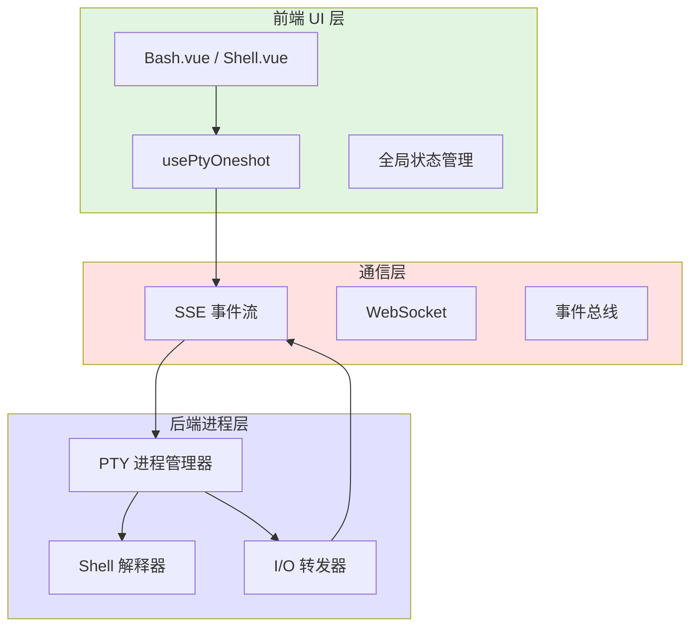

本文档系统化阐述应用中终端（Terminal）与伪终端（PTY）的完整集成架构，涵盖从进程管理、通信协议、UI 渲染到状态同步的全链路实现。核心目标是提供安全、可扩展的 shell 集成能力，支持 Bash、交互式 Shell 以及子代理（Subagent）等多种执行模式。

## 架构概览

终端与 PTY 集成采用分层架构，将进程管理、通信协议、UI 渲染与状态监控解耦。整体架构可划分为四个层次：前端 UI 层负责终端窗口渲染与用户交互；Composable 层封装 PTY 生命周期与数据流；通信层通过 SSE/WebSocket 实现双向数据同步；后端进程层管理实际的伪终端进程与 I/O 转发。



## 核心实现：PTY 进程管理

`usePtyOneshot` 是 PTY 集成的核心 Composable，提供一次性 PTY 会话的创建、监控与清理能力。其设计遵循"请求-响应"模式，每次调用生成独立的 PTY 进程，避免状态污染。

**关键能力**：
- 动态 PTY 进程创建：支持指定 shell 类型、环境变量、工作目录
- 双向 I/O 流式传输：通过 SSE 推送 stdout/stderr，通过 HTTP POST 推送 stdin
- 进程生命周期管理：自动清理、信号转发、退出码捕获
- 并发安全：通过 `mapWithConcurrency` 限制同时运行的 PTY 数量

**实现要点** 位于 `app/composables/usePtyOneshot.ts`：
- 使用 `spawn` 创建 PTY 进程，设置 `{ pty: true }` 标志启用伪终端模式
- 通过 `readline` 模块按行分割输出，确保数据包边界清晰
- SSE 事件命名规范：`pty-output`（输出数据）、`pty-exit`（进程退出）、`pty-error`（错误信息）
- 超时机制：默认 300 秒无活动自动终止，防止僵尸进程

## 终端 UI 组件系统

终端界面由两个核心 Vue 组件承载：`Bash.vue` 处理交互式 Bash 会话，`Shell.vue` 提供通用 Shell 执行环境。两者均采用 xterm.js 作为渲染引擎，确保兼容性与性能。

**`Bash.vue` 特性**（`app/components/ToolWindow/Bash.vue`）：
- 集成 xterm.js，支持 ANSI 颜色、光标控制、滚动缓冲区
- 用户输入捕获：将键盘事件转发至 PTY stdin
- 自适应布局：根据容器大小动态调整终端尺寸
- 会话恢复：通过 `usePtyOneshot` 重新连接已存在的 PTY 进程

**`Shell.vue` 扩展功能**：
- 命令历史导航：支持上下箭头浏览历史命令
- 自动补全：Tab 键触发路径与命令补全
- 多行编辑：支持Shift+Enter输入换行，Ctrl+Enter执行

## 通信协议与数据流

PTY 集成采用混合通信策略：**SSE 用于服务器到客户端的流式输出推送**，**HTTP POST 用于客户端到服务器的输入提交**。此设计避免 WebSocket 的复杂性，同时满足实时性要求。

**数据流路径**：
1. 前端通过 `usePtyOneshot` 调用 `startPty` 创建会话，后端返回 `sessionId`
2. 前端建立 SSE 连接，订阅 `sessionId` 对应的输出流
3. 用户输入经 xterm.js 捕获，通过 `writeToPty` API 发送至后端
4. 后端 PTY 进程将 stdout/stderr 编码为 SSE 事件，按行分片推送
5. 前端接收数据后，经 `usePtyOneshot` 状态机处理，更新 xterm.js 缓冲区

**事件格式**（`app/utils/sseConnection.ts` 定义）：
```typescript
interface PtyOutputEvent {
  type: 'pty-output'
  sessionId: string
  data: string      // Base64 编码的终端输出
  encoding: 'utf8' | 'base64'
  timestamp: number
}
```

## 子代理（Subagent）集成

`Subagent.vue` 提供高级 PTY 封装，将终端会话与 AI 代理能力结合。子代理模式允许在独立 PTY 进程中运行特定工具链，同时接收来自主应用的指令与状态同步。

**关键特性**（`app/components/ToolWindow/Subagent.vue`）：
- 沙箱环境：每个 Subagent 运行在隔离的 PTY 进程中，拥有独立的环境变量与文件系统视图
- 双向通信：主应用可通过 SSE 向 Subagent 发送控制命令，Subagent 通过标准输出返回结构化数据
- 生命周期绑定：Subagent 随 ToolWindow 自动启动，随窗口关闭优雅终止
- 状态同步：通过 `useSubagentWindows` Composable 维护全局 Subagent 注册表

## 安全与权限控制

PTY 集成实施多层安全策略，防止未授权访问与资源滥用：
- **会话隔离**：每个 PTY 进程绑定独立 `sessionId`，通过 JWT 验证请求来源
- **命令白名单**：可配置允许执行的命令集合，阻断危险操作（如 `rm -rf /`）
- **资源配额**：通过 `mapWithConcurrency` 限制最大并发 PTY 数，防止 fork 炸弹
- **输入过滤**：敏感命令（如 `sudo`）触发 `Permission.vue` 二次确认流程

## 状态管理与持久化

终端状态通过 `useServerState` 与 `useSettings` 协同管理：
- **活跃会话列表**：`serverState.ptySessions` 维护当前所有 PTY 进程的元数据（PID、启动时间、命令）
- **历史记录**：`usePtyOneshot` 自动缓存最近 100 条输出，支持快速回溯
- **持久化配置**：终端主题、字体大小、滚动缓冲区行数等偏好保存至 `localStorage`

## 性能优化策略

针对 PTY 集成的高吞吐特性，实施以下优化措施：
- **输出节流**：高频输出场景（如 `top` 命令）启用 100ms 节流，减少渲染压力
- **增量更新**：SSE 数据按行分片，前端仅重绘变更区域
- **进程池化**：对常用 shell（bash/zsh）维持常驻进程，避免重复 fork 开销
- **懒加载**：xterm.js 与语言包按需加载，减小首屏体积

## 错误处理与恢复

PTY 集成具备完善的异常处理机制：
- **进程崩溃**：捕获 `exit` 事件，自动重启策略（最多 3 次重试）
- **连接中断**：SSE 断连时触发指数退避重连，期间缓冲输出至本地
- **输入阻塞**：检测 PTY 输出停滞，发送 SIGCONT 信号恢复
- **资源泄漏**：`onUnmounted` 钩子确保 PTY 进程与 SSE 连接强制关闭

## 扩展性设计

系统预留多个扩展点，支持自定义终端行为：
- **自定义 Shell**：通过 `settings.shellPath` 配置替换默认 `/bin/bash`
- **插件化渲染器**：实现 `TerminalRenderer` 接口，替换 xterm.js 为其他终端模拟器
- **中间件钩子**：在 `usePtyOneshot` 中注入预/后处理函数，实现日志审计或命令转换
- **远程 PTY**：通过适配器模式将本地 PTY 调用转发至远程 SSH 会话

## 配置选项

终端行为可通过 `useSettings` 进行细粒度控制：

| 配置项 | 类型 | 默认值 | 说明 |
|--------|------|--------|------|
| `terminal.shell` | `string` | `/bin/bash` | 默认 Shell 路径 |
| `terminal.fontFamily` | `string` | `'Monaco, monospace'` | 终端字体 |
| `terminal.fontSize` | `number` | `14` | 字体大小（px） |
| `terminal.scrollback` | `number` | `1000` | 滚动缓冲区行数 |
| `terminal.theme` | `'light' \| 'dark'` | `'dark'` | 配色主题 |
| `pty.maxConcurrent` | `number` | `5` | 最大并发 PTY 数 |
| `pty.timeout` | `number` | `300000` | 会话超时（ms） |

配置来源：`app/composables/useSettings.ts`、`app/utils/constants.ts`

## 测试策略

PTY 集成测试覆盖单元、集成与端到端三个层面：
- **单元测试**：`usePtyOneshot` 的状态机逻辑（`app/composables/usePtyOneshot.test.ts`）
- **集成测试**：PTY 进程创建与 I/O 流验证（`app/utils/sseConnection.test.ts`）
- **E2E 测试**：终端 UI 交互与渲染正确性（`app/components/ToolWindow/Bash.vue` 对应的 Playwright 测试）

## 常见问题与排查

| 现象 | 可能原因 | 解决方案 |
|------|----------|----------|
| 终端无输出 | SSE 连接中断 | 检查网络，刷新页面重建连接 |
| 输入无响应 | PTY 进程僵死 | 查看 `serverState.ptySessions`，手动终止会话 |
| 中文乱码 | 环境变量 `LANG` 未设置 | 在 `settings` 中添加 `LANG=zh_CN.UTF-8` |
| 颜色异常 | xterm.js 主题不匹配 | 切换 `terminal.theme` 至 `'dark'` |
| 并发受限 | 超过 `maxConcurrent` 限制 | 关闭闲置会话，或调高配置值 |

## 相关文档

- [SSE 实时通信机制](9-sse-shi-shi-tong-xin-ji-zhi)：了解 SSE 事件流如何驱动 PTY 输出推送
- [工具窗口通信协议](11-gong-ju-chuang-kou-tong-xin-xie-yi)：掌握 ToolWindow 与后端的消息交互规范
- [全局状态管理与响应式设计](12-quan-ju-zhuang-tai-guan-li-yu-xiang-ying-shi-she-ji)：理解状态如何在终端组件间同步
- [组合式 API (Composables) 详解](13-zu-he-shi-api-composables-xiang-jie)：深入学习 `usePtyOneshot` 的设计模式