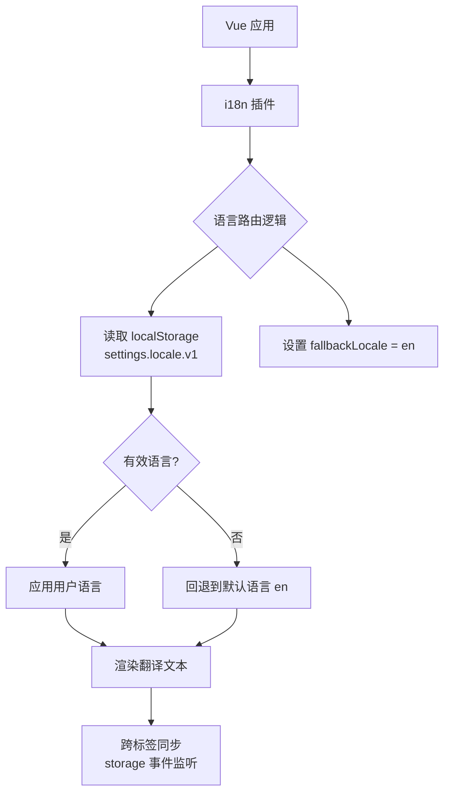

本页面系统性地介绍 Vis 项目中国际化 (i18n) 的架构设计与实现方式，涵盖核心概念、配置方法、扩展流程以及最佳实践。读者将学习如何添加新语言、维护翻译键以及在不同场景下正确使用翻译功能。

## 架构概览
Vis 采用 **vue-i18n** 作为国际化核心库，结合 **Composition API** 模式构建响应式翻译系统。整体架构分为三层：存储层负责语言偏好的持久化与跨标签同步，核心层提供 i18n 实例与类型安全的翻译接口，翻译层则维护各语言的键值映射。



**关键特性**：
- **自动语言检测**：优先读取本地存储的用户偏好，未设置时回退到英语
- **跨标签同步**：通过 `storage` 事件监听器实时同步多个标签页的语言切换
- **类型安全**：通过 `LocaleMessages` 接口约束所有翻译键的结构，防止运行时错误
- **按需加载准备**：当前所有翻译打包在一起，但架构支持未来按需加载

Sources: [app/i18n/index.ts](app/i18n/index.ts#L1-L55), [app/main.ts](app/main.ts#L1-L28)

## 目录结构
国际化相关文件集中在 `app/` 目录下的三个子目录中，职责分离清晰：

```
app/
├── i18n/              # 国际化核心逻辑层
│   ├── index.ts      # i18n 实例创建、语言存取、事件监听
│   ├── useI18n.ts    # 包装的 Composition API hook
│   └── types.ts      # TypeScript 类型定义（Locale, LocaleMessages）
├── locales/          # 翻译资源层
│   ├── en.ts        # 英文翻译（默认语言）
│   └── zh-CN.ts     # 简体中文翻译
└── utils/
    └── storageKeys.ts  # 本地存储键常量定义
```

**数据流向**：
- 用户操作 → `setLocale()` → 更新 `i18n.global.locale` + 写入 `localStorage`
- 页面加载 → `getStoredLocale()` → 读取 `localStorage` → 初始化 i18n 实例
- 多标签页 → `window.addEventListener('storage')` → 同步语言状态

Sources: [app/i18n/index.ts](app/i18n/index.ts#L1-L55), [app/locales/en.ts](app/locales/en.ts#L1-L20), [app/locales/zh-CN.ts](app/locales/zh-CN.ts#L1-L20)

## 核心模块详解

### i18n 实例管理 (`app/i18n/index.ts`)
该文件是国际化系统的核心入口，负责创建 i18n 实例、管理语言状态以及处理跨标签同步。

```typescript
// 关键常量
const LOCALE_STORAGE_KEY = 'settings.locale.v1';  // 本地存储键
const DEFAULT_LOCALE: Locale = 'en';              // 默认语言

// 语言读取逻辑：优先读取存储，无效则回退默认
export function getStoredLocale(): Locale {
  const stored = storageGet(LOCALE_STORAGE_KEY);
  if (stored === 'zh-CN') return 'zh-CN';
  return DEFAULT_LOCALE;
}

// vue-i18n 配置
export const i18n = createI18n<any>({
  legacy: false,              // 启用 Composition API 模式
  locale: getStoredLocale(),  // 初始语言
  fallbackLocale: 'en',       // 缺失键时的回退语言
  messages: { en, 'zh-CN': zhCN },  // 语言包映射
});

// 语言切换：同时更新实例与本地存储
export function setLocale(locale: Locale) {
  i18n.global.locale.value = locale;  // 响应式更新
  setStoredLocale(locale);
}

// 跨标签同步：监听 storage 事件
if (typeof window !== 'undefined') {
  window.addEventListener('storage', (event) => {
    if (event.key === storageKey(LOCALE_STORAGE_KEY)) {
      const newLocale = event.newValue as Locale | null;
      if (newLocale && (newLocale === 'en' || newLocale === 'zh-CN')) {
        i18n.global.locale.value = newLocale;  // 实时同步
      }
    }
  });
}
```

**重要设计决策**：
- **`legacy: false`**：强制使用 Composition API（`useI18n()`）而非旧版 `$t` 注入方式，与 Vue 3 生态保持一致
- **响应式 locale**：通过 `i18n.global.locale.value` 直接修改触发组件重新渲染
- **防御性编程**：`storage` 事件监听仅在浏览器环境执行，避免 SSR 错误

Sources: [app/i18n/index.ts](app/i18n/index.ts#L1-L55), [app/utils/storageKeys.ts](app/utils/storageKeys.ts#L1-L20)

### 类型安全体系 (`app/i18n/types.ts`)
类型定义确保翻译键在开发阶段即可被 TypeScript 检查，避免拼写错误或缺失键的问题。

```typescript
// 语言枚举
export type Locale = 'en' | 'zh-CN';

// 完整的翻译结构接口（部分展示）
export interface LocaleMessages {
  app: {
    title: string;
    loading: string;
    login: {
      title: string;
      username: string;
      // ... 嵌套结构
    };
    // ... 更多命名空间
  };
  topPanel: { /* ... */ };
  statusMonitor: { /* ... */ };
  // ... 总计 800+ 行定义
}
```

**设计优势**：
- **编译时验证**：在 `locales/*.ts` 文件中，`const messages: LocaleMessages` 会强制所有语言实现相同键结构
- **智能提示**：IDE 可基于类型提供 `$t('app.login.')` 的自动补全
- **可维护性**：新增键时只需在 `types.ts` 声明一次，各语言文件必须同步实现

Sources: [app/i18n/types.ts](app/i18n/types.ts#L1-L830)

### 自定义 Hook (`app/i18n/useI18n.ts`)
提供统一入口包装 `vue-i18n` 的原生 hook，便于未来扩展（如添加调试逻辑或日志）。

```typescript
import { useI18n as useVueI18n } from 'vue-i18n';

export function useI18n() {
  return useVueI18n();
}
```

Sources: [app/i18n/useI18n.ts](app/i18n/useI18n.ts#L1-L6)

## 翻译文件组织

### 键命名规范
翻译采用 **嵌套命名空间** 组织，格式为 `{namespace}.{category}.{key}`，例如：
- `app.login.title`：登录对话框标题
- `topPanel.management.pin`：置顶按钮文本
- `statusMonitor.mcp.connected`：MCP 连接状态

**命名空间映射**：
| 命名空间 | 对应 UI 区域 | 主要用途 |
|---------|-------------|---------|
| `app` | 全局应用状态 | 加载提示、错误消息、连接状态 |
| `topPanel` | 顶部面板 | 会话管理、项目设置、搜索框 |
| `statusMonitor` | 状态监控窗口 | 服务器、MCP、LSP 状态显示 |
| `providerManager` | 提供商管理器 | 模型选择、认证流程 |
| `sidePanel` | 侧边栏 | 待办事项、会话列表、文件树 |
| `inputPanel` | 输入面板 | 消息输入、模型选择、快捷键提示 |
| `settings` | 设置对话框 | 字体、主题配置 |

### 动态参数支持
翻译值支持 **占位符插值**，通过 `$t('key', { param: value })` 传递：

```typescript
// 定义（所有语言必须提供相同占位符）
error: {
  attachmentFailed: '附件失败: {message}',
  filesChanged: '{count} files changed',
  sessionIdle: '{session} is now idle.',
}

// 使用
$t('error.attachmentFailed', { message: error.message })
$t('topPanel.badges.pinned', { count: 5 })
```

**占位符规则**：
- 命名与 `types.ts` 中的字符串参数位置无关，仅按名称匹配
- 缺失占位符将被原样保留（如 `{message}`），便于调试
- 支持嵌套对象传递复杂参数

Sources: [app/locales/en.ts](app/locales/en.ts#L35-L40), [app/locales/zh-CN.ts](app/locales/zh-CN.ts#L35-L40)

## 在代码中使用 i18n

### 在 Vue 模板中
Composition API 模式下，所有组件自动注入 `$t` 和 `$tc` 方法：

```vue
<template>
  <!-- 基础用法 -->
  <h1>{{ $t('app.title') }}</h1>
  
  <!-- 带参数的动态文本 -->
  <div>{{ $t('error.attachmentFailed', { message: errorMsg }) }}</div>
  
  <!-- 结合属性绑定 -->
  <button :aria-label="$t('sidePanel.expandPanel')">
    <Icon />
  </button>
</template>
```

**最佳实践**：
- 优先使用 **命名空间完整路径**（如 `app.login.title`），避免同名键冲突
- 界面文案全部通过 `$t` 获取，避免硬编码字符串
- 动态内容（如文件名、数量）必须使用参数插值

Sources: [app/components/SidePanel.vue](app/components/SidePanel.vue#L1-L30)

### 在组合式函数中
通过 `useI18n()` 获取翻译函数，适用于非模板上下文：

```typescript
import { useI18n } from '../i18n/useI18n';

export function useFileTree() {
  const { t } = useI18n();
  
  const errorMessage = computed(() => 
    t('error.fileLoadFailed', { message: error.value?.message })
  );
  
  return { errorMessage };
}
```

Sources: [app/composables/useFileTree.ts](app/composables/useFileTree.ts#L1-L6)（通过 grep 搜索结果）

### 切换语言
应用已内置语言切换功能，可通过设置界面或代码触发：

```typescript
import { setLocale, getLocale } from '../i18n';

// 切换至中文
setLocale('zh-CN');

// 获取当前语言
const current = getLocale();  // 'en' | 'zh-CN'
```

语言变更会立即响应到所有使用 `$t` 的组件，无需刷新页面。

Sources: [app/i18n/index.ts](app/i18n/index.ts#L26-L31)

## 添加新语言的完整流程

### 步骤 1：更新类型定义
在 `app/i18n/types.ts` 中扩展 `Locale` 类型：

```typescript
export type Locale = 'en' | 'zh-CN' | 'ja';  // 添加 'ja'
```

同时需完整实现 `LocaleMessages` 接口（或通过 `Partial<LocaleMessages>` 允许部分翻译）。

### 步骤 2：创建翻译文件
在 `app/locales/` 下新增 `ja.ts`：

```typescript
import type { LocaleMessages } from '../i18n/types';

const messages: LocaleMessages = {
  app: {
    title: 'Vis - OpenCode Visualizer',
    loading: 'セッションを読み込み中...',
    // ... 完整翻译
  },
  // ... 其他命名空间
};

export default messages;
```

**重要**：必须严格遵循 `LocaleMessages` 接口结构，TS 编译器会检查缺失的键。

### 步骤 3：注册到 i18n 实例
修改 `app/i18n/index.ts`：

```typescript
import ja from '../locales/ja';  // 导入新语言

export const i18n = createI18n<any>({
  // ...
  messages: {
    en,
    'zh-CN': zhCN,
    'ja': ja,  // 注册
  },
});
```

### 步骤 4：更新存储键（可选）
若新语言需要独立的设置存储，可在 `app/utils/storageKeys.ts` 添加相关键（通常不需要）。

### 步骤 5：测试
1. 在开发环境调用 `setLocale('ja')`
2. 验证所有界面元素是否正确渲染日语文本
3. 检查控制台是否有 `Missing translation` 警告

## 常见问题排查

### 翻译未生效
- **检查路径**：确保 `$t('namespace.key')` 与 `locales/*.ts` 中的嵌套结构完全匹配
- **验证注册**：确认新语言已在 `i18n/index.ts` 的 `messages` 对象中注册
- **查看回退**：缺失键会显示为 `en` 语言的值，检查浏览器控制台警告

### 类型错误
- **实现完整接口**：`locales/*.ts` 中的 `messages` 必须满足 `LocaleMessages` 的所有必填字段
- **占位符一致**：动态参数 `{param}` 在所有语言中的命名需保持一致

### 跨标签不同步
- **存储键匹配**：确保 `LOCALE_STORAGE_KEY` 与 `storageKeys.ts` 中的前缀逻辑一致
- **事件触发**：`storage` 事件仅在不同标签页间触发，同标签页修改不会触发

Sources: [app/i18n/index.ts](app/i18n/index.ts#L38-L50), [app/utils/storageKeys.ts](app/utils/storageKeys.ts#L1-L10)

## 扩展建议

### 未来优化方向
当前所有翻译打包在单一包中，若语言数量增加（如 10+ 种），可考虑：
- **动态导入**：按需加载语言包，减少首屏体积
- **异步加载**：通过 `import()` 在切换语言时动态加载翻译文件
- **社区协作**：使用 Crowdin 等平台管理社区翻译贡献

### 与设置系统集成
语言选择应暴露在设置界面中（参考 `settings.theme` 区域主题逻辑），实现用户友好的切换入口。

## 下一步学习
- **[字体与主题管理](20-zi-ti-yu-zhu-ti-guan-li)**：了解区域主题如何与语言协同工作
- **[供应商与模型管理](21-gong-ying-shang-yu-mo-xing-guan-li)**：查看提供商界面中的国际化实践
- **[全局状态管理](12-quan-ju-zhuang-tai-guan-li-yu-xiang-ying-shi-she-ji)**：深入响应式设计模式