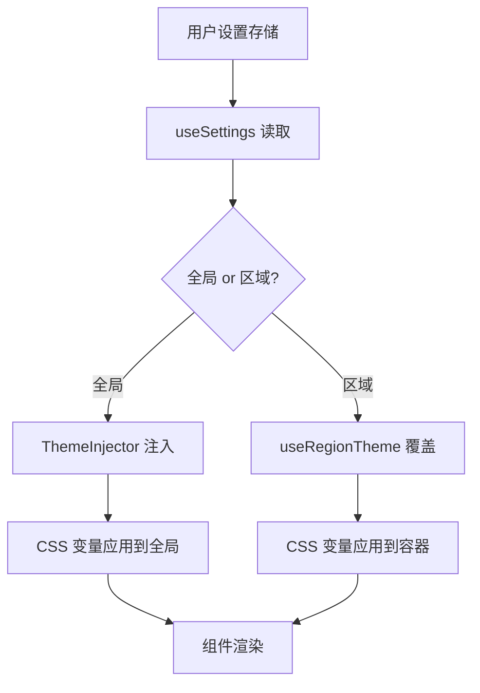

本页面涵盖系统中字体发现、主题注入、区域主题切换及用户偏好存储的完整架构，适用于需要自定义视觉风格或适配多语言排版的开发者。

## 主题系统架构概览
系统采用**双层主题策略**：全局基础主题通过 CSS 变量注入，区域主题在组件层级动态切换。`ThemeInjector` 组件负责将主题配置转换为 `<style>` 标签注入 document.head，确保所有子组件继承统一的颜色和字体变量。区域主题则通过 `useRegionTheme` 组合式 API 在特定容器内覆盖变量，实现代码块、终端等差异化渲染。

## 核心模块详解
### 1. 主题配置与注入（`theme.ts` + `ThemeInjector.vue`）
`theme.ts` 定义默认主题对象，包含颜色 palette、字体 family、字号 scale 等字段，并提供 `generateCSSVariables` 函数将对象转换为 `--var-name: value` 形式的 CSS 字符串。`ThemeInjector.vue` 在 mounted 阶段调用该函数，创建/style 标签插入 head，并在配置变化时更新或移除旧标签，确保主题切换的即时性。

Sources: [theme.ts](app/utils/theme.ts)  
Sources: [ThemeInjector.vue](app/components/ThemeInjector.vue#L1-L100)

### 2. 字体发现与回退（`fontDiscovery.ts`）
`fontDiscovery` 模块通过 `document.fonts.ready` 和 `FontFace` API 检测系统可用字体，并维护一个优先级列表。当用户选择的字体在系统中不存在时，自动回退到下一个候选字体，避免文本渲染闪烁或缺失。该模块还提供 `measureText` 工具用于比较不同字体的渲染宽度，辅助等宽字体选择。

Sources: [fontDiscovery.ts](app/utils/fontDiscovery.ts)

### 3. 区域主题切换（`useRegionTheme.ts` + `regionTheme.ts`）
`useRegionTheme` 组合式 API 接收一个 DOM 元素引用，在其 `style` 属性上动态设置 CSS 变量，实现局部覆盖。`regionTheme.ts` 预定义了多种区域主题（如 "code-dark"、"terminal-light"），每种主题继承全局基础色板并调整对比度和语法高亮颜色。该机制允许同一页面内同时存在深浅不同的代码块。

Sources: [useRegionTheme.ts](app/composables/useRegionTheme.ts)  
Sources: [regionTheme.ts](app/utils/regionTheme.ts)

### 4. 用户偏好持久化（`useSettings.ts` + `storageKeys.ts`）
`useSettings` 组合式 API 封装 localStorage 读写，键名由 `storageKeys` 统一管理（如 `STORAGE_KEYS.THEME`、`STORAGE_KEYS.FONT_FAMILY`）。设置变更时触发全局事件，`ThemeInjector` 和 `useRegionTheme` 监听该事件并重新渲染，保证状态同步。

Sources: [useSettings.ts](app/composables/useSettings.ts)  
Sources: [storageKeys.ts](app/utils/storageKeys.ts)

## 配置选项与数据流
主题和字体设置通过统一的设置面板（`SettingsModal.vue`）暴露给用户，选项包括：

| 配置项 | 类型 | 默认值 | 说明 |
|--------|------|--------|------|
| `theme` | 'light' \| 'dark' \| 'system' | 'system' | 全局颜色主题 |
| `fontFamily` | string | 'system-ui' | 界面字体族 |
| `codeFontFamily` | string | 'Menlo, monospace' | 代码字体族 |
| `fontSize` | number | 14 | 基础字号（px） |
| `regionThemeOverrides` | Record&lt;string, RegionTheme&gt; | {} | 区域主题覆盖 |

数据流为单向：用户操作 → `useSettings` 更新 localStorage → 触发 `EVENT_THEME_CHANGE` → `ThemeInjector` 重新注入 → 视图更新。区域主题的切换不写入持久化存储，仅在当前会话生效。

Sources: [SettingsModal.vue](app/components/SettingsModal.vue#L50-L120)

## 集成与扩展
主题系统与其他模块的集成点包括：
- **代码渲染器**（`useCodeRender`）：读取 `codeFontFamily` 并应用到语法高亮容器。
- **终端组件**（`OutputPanel.vue`、`Terminal.vue`）：使用 `useRegionTheme` 应用终端专属主题。
- **消息查看器**（`MessageViewer.vue`）：根据消息类型动态切换区域主题以区分用户/AI 内容。

扩展新主题只需在 `theme.ts` 添加预设对象，并在 `regionTheme.ts` 定义区域变体即可，无需修改注入逻辑。

Sources: [useCodeRender.ts](app/utils/useCodeRender.ts)  
Sources: [MessageViewer.vue](app/components/MessageViewer.vue#L30-L80)

## 后续阅读
- 了解主题如何与全局状态交互，参见 [全局状态管理与响应式设计](12-quan-ju-zhuang-tai-guan-li-yu-xiang-ying-shi-she-ji)。
- 如需自定义组件样式，参考 [工具窗口组件系统](15-gong-ju-chuang-kou-zu-jian-xi-tong) 中的样式注入章节。