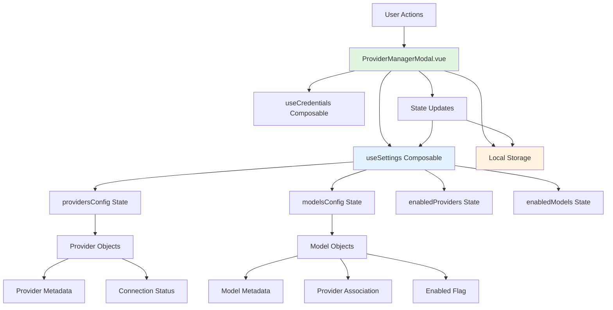

本页面详细说明系统中供应商（Provider）与模型（Model）的配置、连接状态管理以及可用性控制机制。该功能通过统一的模态界面提供可视化操作，支持供应商的连接/断开、全局启用/禁用，以及按供应商分组的模型列表管理和搜索过滤。理解供应商与模型管理对于配置 AI 服务来源、控制模型可用性、优化资源使用至关重要。

## 供应商与模型管理界面架构
ProviderManagerModal.vue 是供应商与模型管理的核心界面组件，采用双标签页设计（Providers/Models），通过响应式状态管理连接全局设置。界面布局分为三个主要区域：顶部标题栏、反馈消息区、标签页内容区。在 Providers 标签页中，界面进一步分为"已连接供应商"与"所有供应商"两个逻辑区块；在 Models 标签页中，则包含搜索工具栏与分组模型列表。

组件通过 `useSettings` composable 访问全局设置中的供应商与模型配置，通过 `useCredentials` composable 管理认证凭据。操作状态通过 `busyProviderId` 标记防止并发操作冲突。反馈消息系统提供即时操作结果确认，支持成功、警告、错误等不同语调。所有状态变更最终持久化到本地存储，确保配置在会话间保持。

| 界面区域 | 核心功能 | 数据来源 |
|---------|---------|---------|
| 已连接供应商区块 | 显示已建立连接的供应商，支持全局启用/禁用、断开操作 | `connectedProviders` computed from settings |
| 所有供应商面板 | 显示所有可用供应商，支持连接新供应商或切换已有供应商 | `allProvidersForView` computed |
| 模型管理面板 | 按供应商分组显示模型，支持搜索过滤、启用/禁用单个模型 | `filteredGroups` computed with search |

供应商与模型管理的架构遵循 **"配置即状态"** 的设计原则，所有界面元素直接反映全局设置状态，所有用户操作通过事件回调或直接修改响应式数据触发状态更新。这种设计确保了界面与数据的一致性，同时简化了状态持久化的实现复杂度。

**架构说明**：ProviderManagerModal 作为视图层，直接绑定到 `useSettings` 提供的响应式状态。所有配置数据通过状态计算属性派生，用户操作触发状态变更，变更自动同步到本地存储。认证凭据通过独立 composable 管理，确保安全隔离。

## 供应商连接状态管理
供应商连接状态分为已连接（connected）和未连接（disconnected）两种基础状态，每种状态具有不同的界面表现和可用操作。已连接供应商显示为卡片列表，包含名称、ID、统计信息和操作控件；未连接供应商在"所有供应商"面板中以迷你卡片形式展示，点击可触发连接流程。

连接状态的判断基于供应商配置中的 `credentialsId` 字段是否存在且有效。`isProviderDisconnected()` 辅助方法封装了这一判断逻辑。连接操作通过 `connectProvider()` 方法执行，该方法检查供应商类型，必要时打开凭据配置对话框。断开操作通过 `disconnectProvider()` 执行，清除供应商的凭据引用并更新状态。所有状态变更立即反映在界面中，无需手动刷新。

**连接状态流转**：
1. **初始状态**：供应商配置存在，但 `credentialsId` 为空或无效 → 显示为"断开"状态
2. **连接操作**：用户点击未连接供应商卡片 → 触发 `connectProvider()` → 检查凭据 → 如需要则打开凭据对话框 → 设置有效 `credentialsId` → 状态变为"已连接"
3. **断开操作**：用户点击已连接供应商的"断开"按钮 → 触发 `disconnectProvider()` → 清除 `credentialsId` → 状态变为"断开"
4. **状态同步**：任何状态变更自动同步到本地存储，并通知其他组件重新计算可用供应商列表

每个供应商卡片还显示统计信息：模型总数和已启用模型数，这些数据通过 `providerModelCount()` 和 `providerEnabledModelCount()` 计算得出。对于特殊供应商（如 OpenAI），系统显示额外说明文本，通过 `providerNote()` 方法提供上下文信息。

Sources: [app/components/ProviderManagerModal.vue](app/components/ProviderManagerModal.vue#L63-L128)

## 全局供应商启用与禁用
供应商级别的全局开关控制该供应商下所有模型的可用性。开关状态由 `enabledProviders` Set 类型状态管理，通过 `isProviderEnabled()` 方法查询。切换开关触发 `toggleProvider()` 方法，该方法更新 `enabledProviders` 集合，并递归更新该供应商下所有模型的启用状态以保持一致性。

启用/禁用供应商时，系统执行以下原子操作：
- 从 `enabledProviders` 集合中添加或移除供应商 ID
- 遍历该供应商的所有模型，将 `model.enabled` 设置为与供应商状态一致
- 同步更新 `enabledModels` Set 状态
- 触发配置变更事件，通知其他组件刷新

这种父子状态的联动机制确保了模型可用性与供应商状态的强一致性，避免了模型启用而供应商禁用的不一致状态。禁用供应商时，系统自动禁用其所有模型，但保留模型的具体配置，以便重新启用时恢复。

**状态同步机制**：
供应商全局状态存储在 `settings.providersConfig` 和 `settings.enabledProviders` 中。`providersConfig` 是对象映射，键为供应商 ID，值为包含 `name`、`models`、`credentialsId` 等字段的配置对象；`enabledProviders` 是 Set 类型，仅存储启用的供应商 ID 集合。模型级状态存储在 `settings.modelsConfig` 和 `settings.enabledModels` 中，结构与供应商状态类似。这种分离设计允许灵活的组合策略：可以启用供应商但禁用特定模型，也可以完全禁用供应商。

Sources: [app/components/ProviderManagerModal.vue](app/components/ProviderManagerModal.vue#L107-L117)

## 模型分组与搜索过滤
模型管理面板以供应商为单位对模型进行分组展示，每个分组包含该供应商的所有可用模型。模型数据通过 `settings.modelsConfig` 获取，按 `providerId` 字段进行分组计算。分组结构为数组，每个元素包含 `provider` 对象和 `models` 数组，通过 `groupModelsByProvider()` 计算属性生成。

搜索功能基于模型名称和 ID 实现，搜索框绑定的 `modelSearch` 字符串触发 `filteredGroups` 计算属性的重新计算。过滤逻辑遍历所有分组，对每个分组内的模型执行名称匹配检查，仅保留匹配的模型。如果分组内所有模型均被过滤，则整个分组被排除。这种设计保持了供应商分组结构不变，同时支持跨供应商的模型搜索。

**过滤流程**：
1. 用户输入搜索关键词
2. `filteredGroups` 计算属性检测到 `modelSearch` 变化
3. 遍历原始分组 `Object.entries(modelsByProvider)`
4. 对每个分组的模型数组执行 `model.name.toLowerCase().includes(query)`
5. 如果分组保留且过滤后模型数组非空，则加入结果列表
6. 界面自动响应更新，仅显示匹配的模型项

搜索统计区域显示过滤后的模型总数和已禁用的模型数量。`disabledModelCount` 计算过滤结果中 `model.enabled === false` 的模型数量，帮助用户快速识别被排除的模型。

Sources: [app/components/ProviderManagerModal.vue](app/components/ProviderManagerModal.vue#L177-L199)

## 模型启用与禁用
每个模型项独立控制其启用状态，通过 `model.enabled` 布尔字段表示。模型级别的开关允许细粒度控制：即使供应商已启用，用户仍可选择禁用特定模型；反之，供应商禁用时，其下所有模型自动禁用，但模型级的 `enabled` 标志保留，以便供应商重新启用时恢复。

模型开关通过 `toggleModel()` 方法处理。该方法接收供应商 ID 和模型 ID 作为参数，从 `modelsConfig` 中定位目标模型对象，切换其 `enabled` 字段，然后同步更新 `enabledModels` Set 状态。如果模型被启用且其供应商当前处于禁用状态，系统自动启用该供应商以保持逻辑一致性。

**模型开关状态计算**：
模型开关的视觉状态（是否勾选）由 `model.enabled` 字段直接决定。但实际可用性受双重约束：`model.enabled` 为 true 且供应商 ID 存在于 `enabledProviders` 中。模型禁用时，开关显示为未选中状态；模型启用但供应商禁用时，开关仍显示为选中，但模型实际不可用。这种设计向用户明确显示了模型的配置意图，而实际可用性由系统统一计算。

模型配置对象的结构包含以下关键字段：
- `id`: 模型唯一标识符（如 "gpt-4"）
- `name`: 显示名称（如 "GPT-4"）
- `providerId`: 所属供应商 ID
- `enabled`: 启用标志
- `maxContext`: 最大上下文长度（可选）
- `supportsVision`: 视觉能力标志（可选）
- `supportsFunctions`: 函数调用能力标志（可选）

Sources: [app/components/ProviderManagerModal.vue](app/components/ProviderManagerModal.vue#L200-L260)

## 凭据管理与供应商连接流程
供应商连接的核心是凭据管理。每个供应商类型需要特定格式的凭据配置，存储在 `credentials` 对象中，通过 `credentialsId` 与供应商关联。连接流程通过 `connectProvider()` 启动，该方法检查供应商的现有凭据配置：若无有效凭据，则触发凭据配置对话框；若已有凭据，则仅设置 `credentialsId` 引用并更新 `enabledProviders`。

凭据类型由供应商定义，每种供应商类型（如 "openai"、"anthropic"）具有对应的凭据模式。凭据数据存储为加密或明文字符串，具体取决于安全策略。连接状态的实质是供应商配置与有效凭据的关联，断开操作即解除此关联。

**连接流程细节**：
1. 用户点击未连接供应商卡片
2. `connectProvider(provider)` 方法执行
3. 检查 `provider.credentialsId` 是否存在且凭据有效
4. 若无效或不存在，打开 `SettingsModal` 并定位到凭据配置区域（通过 `openCredentialsForProvider` 参数）
5. 用户在凭据配置界面输入 API 密钥等认证信息并保存
6. 保存操作创建/更新凭据记录，并返回凭据 ID
7. 连接流程完成，供应商状态更新为已连接

凭据管理通过 `useCredentials` composable 提供统一的 CRUD 接口，确保不同供应商类型的凭据操作遵循一致的接口规范。凭据数据不直接暴露给 ProviderManagerModal，而是通过抽象方法访问，实现安全隔离。

Sources: [app/components/ProviderManagerModal.vue](app/components/ProviderManagerModal.vue#L151-L159)

## 配置持久化与响应式更新
所有供应商和模型配置变更均自动持久化到本地存储，确保持久性。持久化机制通过 `useSettings` composable 内部实现，该 composable 使用 `watch` 深度监听配置对象的变更，并将变更序列化后写入 `localStorage`。同时，配置变更触发自定义事件（如 `settings-change`），通知其他组件（如聊天界面、工具窗口）更新可用模型列表。

配置数据结构在内存中以响应式对象形式存在，使用 Vue 3 的 `reactive()` 或 `ref()` 包装。持久化时，系统将响应式对象转换为纯 JSON 对象，仅包含可序列化的字段，排除函数和响应式代理。加载配置时，系统执行反向转换，将纯对象重新包装为响应式结构。

**持久化流程**：
1. 用户操作触发状态变更（如切换供应商开关）
2. Vue 响应式系统检测到数据变化
3. `useSettings` 中的 `watch` 回调执行
4. 将当前配置对象序列化为 JSON 字符串
5. 写入 `localStorage` 的特定键（如 `app-settings`）
6. 触发全局事件总线通知配置更新
7. 其他监听组件接收事件并重新计算依赖状态

配置加载在应用启动时执行，`useSettings` 的初始化函数从 `localStorage` 读取保存的 JSON，合并默认配置，然后创建响应式状态。这种设计允许用户在不同会话间保持供应商和模型偏好，同时提供默认值确保首次运行的可用性。

Sources: [app/components/ProviderManagerModal.vue](app/components/ProviderManagerModal.vue#L1-L1380]

## 下一步学习路径
要深入理解供应商与模型管理的实现细节，建议按以下顺序阅读相关文档：
- **[全局状态管理与响应式设计](12-quan-ju-zhuang-tai-guan-li-yu-xiang-ying-shi-she-ji)**：理解 `useSettings` 和 `useCredentials` composables 的内部机制，掌握状态持久化与响应式更新的完整流程
- **[组合式 API (Composables) 详解](13-zu-he-shi-api-composables-xiang-jie)**：学习 `useSettings`、`useCredentials` 等核心 composables 的 API 设计和使用方法
- **[国际化 (i18n) 与本地化](19-guo-ji-hua-i18n-yu-ben-di-hua)**：查看 `app/locales/zh-CN.ts` 中的 `providerManager` 键值，了解界面文本的本地化实现