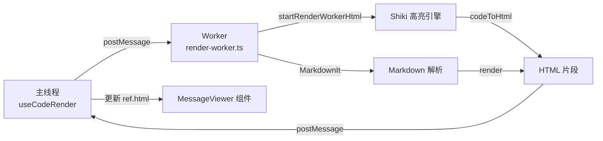

本页面系统性地阐述该 Vue 3 应用在渲染性能、资源加载、并发控制等方面的优化策略。项目通过 Web Worker 离屏渲染、多级缓存、条件挂载、智能滚动等机制，在高频率流式更新的场景下维持流畅的交互体验。

## 渲染架构优化

### Worker 渲染管线

代码高亮与 Markdown 渲染被完全移至 Web Worker 中执行，避免主线程阻塞。`useCodeRender` 组合式 API 封装了任务调度、请求取消与结果订阅的完整生命周期。



Worker 渲染的关键特性包括：

- **请求去重与取消**：每次参数变更递增 `requestId`，旧请求被 `cancel()` 丢弃，仅最新结果被应用 [app/utils/useCodeRender.ts#L19-L31](app/utils/useCodeRender.ts#L19-L31)
- **双级缓存结构**：
  - `completedCache`（LRU，上限 200 项）：存储已完成的渲染结果
  - `pending` Map：追踪未完成请求，用于取消操作 [app/utils/workerRenderer.ts#L67-L73](app/utils/workerRenderer.ts#L67-L73)
- **语言按需加载**：仅加载实际出现的语言包，失败时降级为 `text` 纯文本 [app/workers/render-worker.ts#L94-L142](app/workers/render-worker.ts#L94-L142)

### 缓存键生成策略

缓存命中依赖 `getCacheKey` 生成的稳定字符串。该函数串联代码内容、语言、主题、行号偏移、差异补丁等 15 个字段，以 `\u0000` 分隔，确保不同参数的渲染结果互不污染 [app/utils/workerRenderer.ts#L48-L66](app/utils/workerRenderer.ts#L48-L66)。

缓存采用 LRU 驱逐策略：当 `codeHtmlCache` 或 `mdHighlightCache` 超过 `HIGHLIGHT_CACHE_MAX`（512）时，删除最旧的 50% 条目 [app/workers/render-worker.ts#L67-L71](app/workers/render-worker.ts#L67-L71)。

## 懒加载与条件挂载

### 图片懒加载

附件图片使用原生 `loading="lazy"` 属性，延迟视口外资源的下载与解码 [app/components/ThreadBlock.vue#L33-L38](app/components/ThreadBlock.vue#L33-L38)。

### 组件条件挂载

`MessageViewer` 组件根据当前激活模式动态挂载子渲染器。当同时支持 Markdown 与代码模式时，两者均保持挂载；否则仅在需要时挂载对应组件，减少初始渲染成本 [app/components/MessageViewer.vue#L71-L88](app/components/MessageViewer.vue#L71-L88)。

```typescript
const shouldMountMarkdownRenderer = computed(
  () => supportsMarkdownMode.value && (keepBothRenderersMounted.value || showMarkdownRenderer.value),
);
```

### 过渡动画优化

`ThreadBlock` 使用 Vue `<Transition>` 组件包裹助手回复内容，通过 `deferredTransitionKey` 控制动画触发时机，避免在数据流高速更新时重复执行过渡 [app/components/ThreadBlock.vue#L59-L69](app/components/ThreadBlock.vue#L59-L69)。

## 并发与节流控制

### 增量更新累积

`useDeltaAccumulator` 通过 SSE 事件流接收增量数据（`message.part.delta`），累积到 `AccumulatedMessage.parts` 映射中。相比全量替换，该策略显著减少渲染器的重复调用次数 [app/composables/useDeltaAccumulator.ts#L34-L61](app/composables/useDeltaAccumulator.ts#L34-L61)。

### 批量会话操作

`mapWithConcurrency` 工具函数限制并发任务数，防止同时发起过多网络请求或渲染任务导致浏览器崩溃。默认并发度为 1，可在调用处配置 [app/utils/mapWithConcurrency.ts#L1-L36](app/utils/mapWithConcurrency.ts#L1-L36)。

### 流式窗口管理

`useStreamingWindowManager` 为每个会话维护独立的窗口条目与关闭定时器。`clearCloseTimer` 与 `scheduleClose` 确保在内容持续更新时不会误关闭窗口，而在静默期自动回收 [app/composables/useStreamingWindowManager.ts#L38-L58](app/composables/useStreamingWindowManager.ts#L38-L58)。

## 智能滚动系统

### 滚动跟随状态机

`useAutoScroller` 实现四态滚动模式：

| 模式 | 行为 |
|------|------|
| `follow` | 自动滚动到底部，除非用户手动上滚 |
| `force` | 强制滚动到底部，忽略用户意图 |
| `manual` | 仅响应显式滚动调用 |
| `none` | 禁用自动滚动 |

### 用户意图检测

系统通过 `hasRecentUserScrollIntent()` 判断用户是否在主动浏览。若在 `USER_SCROLL_INTENT_WINDOW_MS`（240ms）内发生滚动或指针交互，则暂停自动跟随，防止干扰用户操作 [app/composables/useAutoScroller.ts#L35-L41](app/composables/useAutoScroller.ts#L35-L41)。

### 平滑滚动引擎

支持两种平滑滚动后端：

- **RAF 引擎**：使用 `requestAnimationFrame` 逐帧插值，可检测滚动干预（用户手动滚动超过 `INTERVENTION_TOLERANCE_PX` 时停止）
- **原生引擎**：调用 `element.scrollTo({ behavior: 'smooth' })`，监听 `scrollend` 事件与超时回退 [app/composables/useAutoScroller.ts#L141-L189](app/composables/useAutoScroller.ts#L141-L189)

### 初始渲染跟踪

`useInitialRenderTracking` 监控首屏所有消息的渲染完成状态。通过 `pendingInitialRenderKeys` 集合追踪待渲染项，在全部完成后触发 `onInitialRenderComplete`，并设置 5 秒安全超时防止卡死 [app/composables/useInitialRenderTracking.ts#L20-L45](app/composables/useInitialRenderTracking.ts#L20-L45)。

## 构建时代码分割

### 手动分块策略

`vite.config.ts` 中的 `manualChunks` 将依赖分组打包，减少单文件体积并利用浏览器缓存：

| Chunk 名称 | 包含依赖 |
|------------|----------|
| `vendor-vue-i18n` | vue-i18n |
| `vendor-vue` | vue 核心 |
| `vendor-ui` | @headlessui、@iconify |
| `vendor-terminal` | @xterm/xterm |
| `vendor-utils` | marked、date-fns、lodash |

### Worker 构建配置

Worker 以 ES 模块格式构建，与主应用分离，加载时不阻塞主线程解析 [vite.config.ts#L27-L29](vite.config.ts#L27-L29)。

## 状态管理响应式优化

### 精细化订阅

项目广泛使用 `watch` 而非 `watchEffect`，明确指定依赖源，避免不必要的重复执行。例如 `useCodeRender` 仅监听 `params` 对象的变化 [app/utils/useCodeRender.ts#L14-L31](app/utils/useCodeRender.ts#L14-L31)。

### 计算属性缓存

`availableModes`、`shouldMountMarkdownRenderer` 等派生状态均通过 `computed` 定义，仅在依赖变更时重新计算，避免模板中的内联表达式重复执行 [app/components/MessageViewer.vue#L37-L59](app/components/MessageViewer.vue#L37-L59)。

## 资源清理策略

### 生命周期钩子

所有组合式函数均实现资源清理：
- `useCodeRender`：`onBeforeUnmount` 取消活跃渲染任务 [app/utils/useCodeRender.ts#L62-L68](app/utils/useCodeRender.ts#L62-L68)
- `useAutoScroller`：`onUnmounted` 清理 RAF 与定时器 [app/composables/useAutoScroller.ts#L287-L289](app/composables/useAutoScroller.ts#L287-L289)
- `useStreamingWindowManager`：`onUnmounted` 清理关闭定时器与事件订阅 [app/composables/useStreamingWindowManager.ts#L133-L139](app/composables/useStreamingWindowManager.ts#L133-L139)

### 事件监听器释放

`useDeltaAccumulator` 返回的 `listen` 函数注册 SSE 事件监听，其清理函数在组件卸载时移除所有监听器，防止内存泄漏 [app/composables/useDeltaAccumulator.ts#L19-L29](app/composables/useDeltaAccumulator.ts#L19-L29)。

## 总结

该应用的性能优化策略呈现以下特征：

1. **异步优先**：所有高耗时操作（高亮、Markdown 解析）均移交 Worker
2. **缓存驱动**：多级 LRU 缓存覆盖渲染路径的关键节点
3. **按需执行**：懒加载图片、条件挂载组件、增量数据累积
4. **用户感知优化**：智能滚动、意图检测、平滑动画提升体验流畅度
5. **资源可回收**：完整的生命周期管理防止内存泄漏

这些策略共同构成了一个能够在高并发流式场景下保持响应性的前端架构。

**延伸阅读**：
- [浮动窗口管理系统](6-fu-dong-chuang-kou-guan-li-xi-tong) — 窗口生命周期与状态管理
- [内容渲染管线](8-nei-rong-xuan-ran-guan-xian) — 从 SSE 到 HTML 的完整流程
- [SSE 实时通信机制](9-sse-shi-shi-tong-xin-ji-zhi) — 流式数据的来源与协议
- [组合式 API (Composables) 详解](13-zu-he-shi-api-composables-xiang-jie) — 各优化策略的集成方式