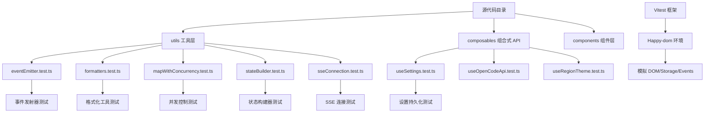

本页面系统化阐述 OpenCode Visualizer 项目的测试基础设施、单元测试架构、以及开发者可用的测试工具链。项目采用 Vitest 作为核心测试框架，结合 Happy-dom 模拟浏览器环境，形成一套覆盖 utils 工具层、composables 组合式 API、以及事件通信机制的完整测试体系。

## 测试架构概览
项目的测试体系采用分层策略，确保核心逻辑与 UI 逻辑分离。测试文件与源代码保持同步目录结构，所有测试文件以 `.test.ts` 后缀命名，便于 Vite 自动发现与执行。测试配置在 `vite.config.ts` 中统一管理，指定 `happy-dom` 作为测试环境以模拟浏览器 API，同时配置 `globals: false` 强制显式导入，提升代码可读性与维护性。



## 测试脚本与执行
通过 `package.json` 定义统一的测试入口，开发者可以使用 `pnpm test` 执行完整测试套件，或使用 `vitest` 的交互模式进行开发时测试。测试覆盖率报告可通过 Vitest 内置功能生成，帮助识别未覆盖的代码路径。

**测试相关 npm scripts**:

| 命令 | 功能描述 | 使用场景 |
|------|---------|---------|
| `pnpm test` | 运行所有测试（非 watch 模式） | CI/CD 流水线、预提交检查 |
| `pnpm test -- --watch` | 监听模式，文件变更自动重跑 | 开发阶段持续验证 |
| `pnpm test -- --coverage` | 生成代码覆盖率报告 | 质量门禁、测试完整性审查 |
| `pnpm lint` | 运行 Oxlint 与 Vue TypeScript 检查 | 代码规范统一 |

Sources: [package.json](package.json#L22-L37)

## 核心测试模式解析

### 1. 事件发射器测试 (`eventEmitter.test.ts`)
`TypedEmitter` 类实现了一个类型安全的事件系统，其测试覆盖了事件注册、注销、多监听器、清理等核心场景。测试采用模拟函数（`vi.fn()`）验证调用次数与参数传递，确保事件分发的正确性与内存安全性。

**关键测试场景**:
- **单播事件**: 验证单一监听器能正确接收事件负载
- **多播事件**: 同一事件可注册多个监听器，互不干扰
- **精准注销**: 通过 `on()` 返回的取消函数可精确移除指定监听器，不影响其他监听器
- **资源清理**: `dispose()` 方法可一次性清除所有监听器，防止内存泄漏

Sources: [app/utils/eventEmitter.test.ts](app/utils/eventEmitter.test.ts#L1-L54)

### 2. 格式化工具测试 (`formatters.test.ts`)
格式化函数的测试采用表格化数据驱动方法，覆盖边界值、无效输入、以及正常场景。`formatTokenCount` 实现千位分隔与单位缩放（K/M），`formatElapsedTime` 处理毫秒到分钟的格式化，`contextSeverityClass` 将数值映射为 CSS 严重性类名。

**格式化函数规范**:

| 函数名 | 输入 | 输出 | 示例 |
|--------|------|------|------|
| `formatTokenCount` | 负数 → "0" | 零或正整数字符串 | `1500 → "1.5K"` |
| `formatElapsedTime` | <500ms → "" | 空字符串 | `490 → ""` |
| `formatMessageTime` | 时间戳 → "YYYY-MM-DD HH:mm" | 日期字符串 | `1705275900000 → "2024-01-15 09:05"` |
| `contextSeverityClass` | 0-100 → 类名字符串 | CSS 类名 | `75 → "ib-ctx-high"` |

Sources: [app/utils/formatters.test.ts](app/utils/formatters.test.ts#L1-L86)

### 3. 并发控制测试 (`mapWithConcurrency.test.ts`)
`mapWithConcurrency` 实现了一个并发限制的异步映射函数，测试采用 Deferred Promise 模式精确控制任务完成时机，验证并发上限是否被严格遵守，以及结果顺序是否与输入数组一致。测试同时验证失败捕获机制，确保单个任务抛出异常不会中断整个批量操作。

**并发控制特性**:
- **并发上限**: 同时运行的任务数不超过指定并发数
- **顺序保持**: 返回结果数组与输入数组顺序严格对应
- **错误隔离**: 任务失败被捕获为 `{status: 'rejected', reason}` 对象，不影响其他任务执行
- **动态调度**: 任务完成时立即调度等待中的下一个任务

Sources: [app/utils/mapWithConcurrency.test.ts](app/utils/mapWithConcurrency.test.ts#L1-L67)

### 4. SSE 连接测试 (`sseConnection.test.ts`)
Server-Sent Events (SSE) 连接器的测试覆盖了网络请求、数据解析、错误处理、重连机制等完整生命周期。测试使用 `vi.stubGlobal` 模拟全局 `fetch` 函数，通过 `TransformStream` 构造可控制的请求/响应流，验证 `parsePacket` 对 SSE 数据帧的解析逻辑，以及连接器对 401 认证错误、空 URL、正常断开等场景的处理。

**SSE 连接状态机**:

| 状态 | 触发条件 | 回调 | 后续行为 |
|------|---------|------|---------|
| `connecting` | `connect()` 调用 | `onOpen` | 进入 `connected` |
| `connected` | fetch 成功 | `onPacket(data)` | 持续接收事件 |
| `error` | HTTP 401 或网络错误 | `onError(message, code)` | 401 不重连，其他错误指数退避重连 |
| `disconnected` | `disconnect()` 调用 | 无 | 清理资源，停止重连 |

Sources: [app/utils/sseConnection.test.ts](app/utils/sseConnection.test.ts#L1-L255)

### 5. 状态构建器测试 (`stateBuilder.test.ts`)
`createStateBuilder` 负责聚合来自后端的会话与项目数据，构建前端全局状态。测试验证了部分更新时时间戳的保留逻辑（如 pinned/archived 时间戳在仅更新 `updated` 字段时不应丢失），以及沙箱目录移除时的索引清理机制。这些回归测试确保状态迁移的原子性与一致性。

Sources: [app/utils/stateBuilder.test.ts](app/utils/stateBuilder.test.ts#L1-L62)

### 6. 设置组合式 API 测试 (`useSettings.test.ts`)
`useSettings` 组合式函数管理应用级配置，持久化到 `localStorage`。测试采用模拟 `Storage` 对象与事件监听器，验证默认值、持久化读写、值变更监听、以及跨标签页同步。特别关注了 `pinnedSessionsLimit` 的边界限制（1-200）、字体家族空白值回退到默认值、以及 `showMinimizeButtons` 与 `dockAlwaysOpen` 的联动约束。

**设置键命名规范**:
所有设置键采用版本化命名格式：`opencode.settings.{key}.v1`，确保未来配置结构升级时能够平滑迁移。

Sources: [app/composables/useSettings.test.ts](app/composables/useSettings.test.ts#L1-L162)

## 测试工具链集成

### Vitest 配置要点
`vite.config.ts` 中的 `test` 配置指定了以下关键参数：

```typescript
test: {
  environment: 'happy-dom',      // 模拟浏览器环境
  globals: false,                // 禁用全局注入，强制显式导入
  include: ['**/*.test.ts'],     // 自动发现测试文件
}
```

同时，Vite 的 `worker` 配置指定 Web Worker 输出格式为 ES 模块，确保 `sse-shared-worker.ts` 等 worker 脚本在现代浏览器中的兼容性。构建时的 `manualChunks` 配置将依赖项拆分为多个 vendor  chunk，优化首屏加载性能。

Sources: [vite.config.ts](vite.config.ts#L1-L55)

### 测试驱动开发建议
在添加新功能或修改现有逻辑时，建议遵循 "红-绿-重构" 循环：
1. **编写失败测试**: 先编写描述预期行为的测试用例，此时测试应失败
2. **实现最小功能**: 编写刚好使测试通过的最简代码
3. **重构优化**: 在测试保护下重构代码结构，保持行为不变
4. **提交验证**: 确保 `pnpm test` 全部通过后再提交

对于涉及异步操作（如 SSE 事件流、并发任务）的模块，推荐使用 Vitest 的 `vi.waitFor` 与 `vi.advanceTimersByTime` 控制虚拟时钟，避免测试因真实时间等待而变慢。

## 测试覆盖率与质量门禁
项目当前测试聚焦于纯逻辑层（utils、composables），UI 组件层（Vue 单文件组件）的测试相对较少。建议后续扩展组件测试，使用 `@vue/test-utils` 与 `happy-dom` 验证组件渲染、事件响应、插槽内容等交互行为。持续集成环境中应配置覆盖率阈值（如语句覆盖率 ≥ 80%），确保核心逻辑始终受测试保护。

Sources: [package.json](package.json#L22-L37)

## 下一步阅读建议
- 若需深入理解 SSE 通信机制的实现细节，请阅读 [SSE 实时通信机制](9-sse-shi-shi-tong-xin-ji-zhi)
- 若想了解全局状态如何构建与更新，请参阅 [全局状态管理与响应式设计](12-quan-ju-zhuang-tai-guan-li-yu-xiang-ying-shi-she-ji)
- 若关注组合式 API 的设计模式，请参考 [组合式 API (Composables) 详解](13-zu-he-shi-api-composables-xiang-jie)
- 若需了解如何在开发环境中调试与扩展测试，请参阅 [开发环境搭建](23-kai-fa-huan-jing-da-jian)