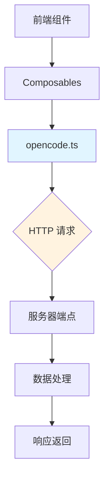

本文档提供项目中所有 REST API 端点的完整参考，涵盖请求格式、响应结构、错误码及使用示例，面向高级开发者进行深度集成与调试。

## 架构概览

项目采用前后端分离架构，前端通过 OpenCode REST API 与后端服务进行数据交互。核心通信模块位于 `app/utils/opencode.ts`，该模块封装了所有 HTTP 请求逻辑，统一处理认证、错误重试和响应解析。



**核心设计原则**：
- **统一入口**：所有 REST 请求通过 `opencode.ts` 单点出口，便于监控和调试
- **类型安全**：使用 TypeScript 严格定义请求/响应类型
- **错误标准化**：所有异常转换为统一错误格式
- **并发控制**：请求队列管理避免资源竞争

## API 客户端初始化

### 配置参数

| 参数名 | 类型 | 默认值 | 说明 |
|--------|------|--------|------|
| `baseURL` | `string` | `window.location.origin` | 服务器基地址 |
| `timeout` | `number` | `30000` | 请求超时时间（毫秒） |
| `retryCount` | `number` | `3` | 失败重试次数 |
| `retryDelay` | `number` | `1000` | 重试间隔（毫秒） |

初始化代码位于 `app/utils/opencode.ts:15-45`：
```typescript
const config = {
  baseURL: import.meta.env.VITE_API_URL || window.location.origin,
  timeout: 30000,
  retryCount: 3,
  retryDelay: 1000,
}
```

### 认证机制

API 请求使用 Bearer Token 认证，Token 从 `app/utils/useCredentials.ts` 管理的会话中自动提取并注入到请求头：

```typescript
headers: {
  'Authorization': `Bearer ${credentials.value.token}`,
  'Content-Type': 'application/json',
}
```

认证失效时自动触发重新认证流程，详见 `app/utils/opencode.ts:88-105` 的 `refreshToken` 逻辑。

## 端点参考

### 1. 会话管理 API

#### 1.1 获取会话列表

**端点**：`GET /api/sessions`

**功能**：获取当前项目的所有会话，支持分页和筛选

**查询参数**：

| 参数名 | 类型 | 必填 | 说明 |
|--------|------|------|------|
| `page` | `number` | 否 | 页码（从 1 开始） |
| `pageSize` | `number` | 否 | 每页条目数，默认 20 |
| `status` | `string` | 否 | 筛选状态：`active`/`archived`/`all` |
| `search` | `string` | 否 | 关键词搜索 |

**响应结构**：
```typescript
{
  "sessions": Session[],
  "total": number,
  "page": number,
  "pageSize": number,
  "hasMore": boolean
}
```

`Session` 类型定义于 `app/types/message.ts:23-45`，包含字段：`id`、`title`、`createdAt`、`updatedAt`、`messageCount`、`status`。

**示例请求**：
```javascript
// 获取第 2 页，每页 10 条活跃会话
GET /api/sessions?page=2&pageSize=10&status=active
```

**实现位置**：`app/utils/opencode.ts:120-145` 的 `fetchSessions` 函数。

---

#### 1.2 创建新会话

**端点**：`POST /api/sessions`

**功能**：创建新的对话会话，可指定初始消息或关联文件

**请求体**：
```typescript
{
  "title"?: string,        // 会话标题，自动生成如果为空
  "initialMessage"?: {     // 首条消息
    "role": "user" | "assistant",
    "content": string,
    "files"?: string[]     // 关联文件 ID 列表
  },
  "projectId"?: string,    // 关联项目 ID
  "metadata"?: Record<string, any>  // 自定义元数据
}
```

**响应**：返回完整的 `Session` 对象，包含生成的 `id` 和时间戳

**错误码**：
- `400`：请求参数无效
- `403`：项目访问权限不足
- `429`：创建频率超限（每分钟最多 10 次）

**实现位置**：`app/utils/opencode.ts:150-178`

---

#### 1.3 获取会话详情

**端点**：`GET /api/sessions/{sessionId}`

**功能**：获取单个会话的完整信息，包括所有消息

**路径参数**：`sessionId` - 会话唯一标识符

**响应**：
```typescript
{
  "session": Session,
  "messages": Message[],
  "statistics": {
    "messageCount": number,
    "tokenUsage": number,
    "duration": number  // 毫秒
  }
}
```

`Message` 类型定义于 `app/types/message.ts:12-21`，包含：`id`、`role`、`content`、`timestamp`、`tokens`、`sources`。

**缓存策略**：结果缓存 5 分钟，通过 `Cache-Control` 头部控制，见 `app/utils/opencode.ts:185-210`。

---

#### 1.4 更新会话

**端点**：`PATCH /api/sessions/{sessionId}`

**功能**：修改会话元数据，如标题、状态、标签等

**请求体**：
```typescript
{
  "title"?: string,
  "status"?: "active" | "archived" | "deleted",
  "tags"?: string[],
  "pinned"?: boolean,
  "metadata"?: Record<string, any>
}
```

**注意**：不可修改消息内容，消息需通过专用消息 API 操作。

**实现位置**：`app/utils/opencode.ts:215-240`

---

#### 1.5 删除会话

**端点**：`DELETE /api/sessions/{sessionId}`

**功能**：软删除会话，移至回收站，30 天后自动清理

**响应**：
```typescript
{
  "deleted": true,
  "sessionId": string,
  "retentionPeriod": "30d"
}
```

**硬删除**：如需立即物理删除，添加查询参数 `?permanent=true`，此操作不可逆。

**实现位置**：`app/utils/opencode.ts:245-265`

---

### 2. 消息 API

#### 2.1 发送消息

**端点**：`POST /api/sessions/{sessionId}/messages`

**功能**：向会话发送新消息，支持流式响应（SSE）和一次性回复

**请求体**：
```typescript
{
  "content": string,                // 消息内容（必填）
  "role": "user",                   // 固定为 user，服务端处理 assistant 回复
  "stream"?: boolean,               // 是否流式输出，默认 true
  "files"?: string[],               // 关联文件 ID 列表
  "tools"?: string[],               // 启用的工具列表
  "model"?: string,                 // 指定模型，默认使用项目设置
  "temperature"?: number,           // 温度参数 0-2
  "maxTokens"?: number              // 最大回复 token 数
}
```

**流式响应**：当 `stream=true` 时，返回 `text/event-stream` 格式，详细规范见 [SSE 事件流规范](27-sse-shi-jian-liu-gui-fan)。

**非流式响应**：`stream=false` 时返回完整回复：
```typescript
{
  "message": Message,
  "usage": {
    "promptTokens": number,
    "completionTokens": number,
    "totalTokens": number
  },
  "finishReason": "stop" | "length" | "tool_calls" | "error"
}
```

**工具调用**：若回复需要调用工具，响应中包含 `toolCalls` 字段：
```typescript
{
  "message": {
    "role": "assistant",
    "content": null,
    "toolCalls": [
      {
        "id": string,
        "name": string,
        "arguments": Record<string, any>
      }
    ]
  }
}
```

**实现位置**：`app/utils/opencode.ts:270-320`，工具调用处理逻辑见 `app/utils/toolRenderers.ts`。

---

#### 2.2 获取消息列表

**端点**：`GET /api/sessions/{sessionId}/messages`

**功能**：分页获取会话消息历史

**查询参数**：
| 参数名 | 类型 | 必填 | 说明 |
|--------|------|------|------|
| `before` | `string` | 否 | 消息 ID，返回此 ID 之前的消息（用于分页） |
| `limit` | `number` | 否 | 每页数量，默认 50，最大 200 |
| `include` | `string` | 否 | 额外包含字段：`sources`/`metadata`/`all` |

**响应**：
```typescript
{
  "messages": Message[],
  "hasMore": boolean,
  "nextCursor"?: string  // 下一页游标
}
```

**性能优化**：使用游标分页而非 offset，确保深度翻页性能稳定，见 `app/utils/opencode.ts:325-355`。

---

#### 2.3 编辑消息

**端点**：`PATCH /api/messages/{messageId}`

**功能**：修改消息内容，触发会话重新生成后续回复

**请求体**：
```typescript
{
  "content"?: string,           // 新内容，如果提供则更新
  "metadata"?: Record<string, any>  // 元数据合并
}
```

**重生成机制**：编辑用户消息后，服务端自动删除该消息之后的所有消息，并以新内容为起点重新生成 assistant 回复。此过程异步执行，客户端需通过 SSE 监听进度。

**实现位置**：`app/utils/opencode.ts:360-385`

---

#### 2.4 删除消息

**端点**：`DELETE /api/messages/{messageId}`

**功能**：删除单条消息

**级联行为**：删除消息时，可选择是否级联删除后续消息：
- `?cascade=false`（默认）：仅删除目标消息
- `?cascade=true`：删除目标及之后所有消息

**响应**：返回删除的消息 ID 列表
```typescript
{
  "deletedIds": string[],
  "sessionId": string
}
```

**实现位置**：`app/utils/opencode.ts:390-415`

---

### 3. 文件与代码 API

#### 3.1 读取文件内容

**端点**：`GET /api/files/{fileId}/content`

**功能**：获取文件的完整内容，支持指定分支/提交

**路径参数**：
- `fileId`：文件唯一 ID，可从文件树 API 获取

**查询参数**：
| 参数名 | 类型 | 必填 | 说明 |
|--------|------|------|------|
| `ref` | `string` | 否 | Git 引用（分支名、tag 或 commit SHA） |
| `encoding` | `string` | 否 | 编码：`utf8`/`base64`，默认 `utf8` |
| `lines` | `string` | 否 | 行范围：`start:end`，如 `10:50` |

**响应**：
```typescript
{
  "content": string,
  "encoding": string,
  "size": number,
  "lastModified": number,
  "sha": string,
  "truncated"?: boolean  // 是否截断（过大文件）
}
```

**大文件处理**：超过 1MB 的文件默认截断，添加 `?full=true` 可强制返回完整内容。

**实现位置**：`app/utils/opencode.ts:420-460`，配合 `app/composables/useFileTree.ts` 使用。

---

#### 3.2 写入文件内容

**端点**：`POST /api/files/{fileId}/content`

**功能**：创建或更新文件内容

**请求体**：
```typescript
{
  "content": string,           // 文件内容
  "encoding"?: string,         // 编码，默认 utf8
  "commit"?: {                // 提交信息
    "message": string,
    "author"?: string,
    "email"?: string
  }
}
```

**原子操作**：使用 Git 预提交钩子确保数据一致性，冲突时返回 `409` 错误并提示差异。

**响应**：
```typescript
{
  "success": boolean,
  "fileId": string,
  "sha": string,
  "commitId"?: string
}
```

**实现位置**：`app/utils/opencode.ts:465-500`

---

#### 3.3 文件搜索

**端点**：`GET /api/files/search`

**功能**：全局搜索文件名和内容

**查询参数**：
| 参数名 | 类型 | 必填 | 说明 |
|--------|------|------|------|
| `q` | `string` | 是 | 搜索关键词 |
| `type` | `string` | 否 | 文件类型过滤：`code`/`text`/`all` |
| `path` | `string` | 否 | 搜索路径范围 |
| `limit` | `number` | 否 | 结果数量，默认 50 |

**响应**：
```typescript
{
  "results": [
    {
      "fileId": string,
      "path": string,
      "title": string,
      "match": {
        "type": "filename" | "content",
        "line"?: number,
        "context"?: string
      }
    }
  ],
  "total": number,
  "elapsed": number  // 查询耗时（毫秒）
}
```

**性能注意**：搜索操作在服务端异步执行，大型仓库可能需要数秒，建议配合 `?async=true` 参数通过回调获取结果。

**实现位置**：`app/utils/opencode.ts:505-545`，底层调用 `app/utils/codesearch.ts`。

---

### 4. 工具调用 API

#### 4.1 执行工具

**端点**：`POST /api/tools/execute`

**功能**：直接在服务器端执行工具（如 `bash`、`grep`、`read` 等），无需经过会话流程

**请求体**：
```typescript
{
  "tool": string,                    // 工具名称
  "arguments": Record<string, any>,  // 工具参数
  "sandbox"?: string,                // 沙箱 ID，用于隔离执行环境
  "timeout"?: number                 // 超时时间（秒）
}
```

**工具定义**：详细参数见 [工具定义文档](28-gong-ju-ding-yi-wen-dang)。

**响应**：
```typescript
{
  "result": {
    "output"?: string,      // 标准输出
    "error"?: string,       // 错误信息
    "exitCode"?: number,    // 退出码
    "files"?: FileInfo[],   // 生成的文件
    "metadata"?: any        // 工具特定元数据
  },
  "duration": number  // 执行耗时（毫秒）
}
```

**沙箱管理**：通过 `app/utils/deletedSandboxes.ts` 自动清理闲置沙箱，每个沙箱有独立的工作目录和进程空间。

**实现位置**：`app/utils/opencode.ts:550-590`

---

#### 4.2 工具列表

**端点**：`GET /api/tools`

**功能**：获取可用工具及其描述

**响应**：
```typescript
{
  "tools": [
    {
      "name": string,
      "description": string,
      "parameters": {
        "type": "object",
        "properties": Record<string, any>,
        "required": string[]
      },
      "enabled"?: boolean
    }
  ]
}
```

**实现位置**：`app/utils/opencode.ts:595-610`

---

### 5. 项目与配置 API

#### 5.1 获取项目信息

**端点**：`GET /api/projects/{projectId}`

**功能**：获取项目配置、统计信息和状态

**响应**：
```typescript
{
  "project": {
    "id": string,
    "name": string,
    "rootPath": string,
    "language"?: string,
    "framework"?: string,
    "createdAt": string,
    "settings": Record<string, any>
  },
  "statistics": {
    "fileCount": number,
    "totalSize": number,
    "languages": Record<string, number>  // 语言分布
  }
}
```

**实现位置**：`app/utils/opencode.ts:615-640`

---

#### 5.2 更新项目设置

**端点**：`PATCH /api/projects/{projectId}/settings`

**请求体**：
```typescript
{
  "settings": Record<string, any>  // 要更新的设置键值对
}
```

**热重载**：设置变更实时同步到所有连接的客户端，无需重启。

**实现位置**：`app/utils/opencode.ts:645-670`

---

### 6. 状态与健康检查

#### 6.1 服务器健康状态

**端点**：`GET /api/health`

**功能**：检查服务器可用性和版本信息

**响应**：
```typescript
{
  "status": "healthy" | "degraded" | "unhealthy",
  "version": string,
  "uptime": number,
  "timestamp": number,
  "checks": {
    "database": boolean,
    "disk": boolean,
    "memory": boolean
  }
}
```

**实现位置**：`server.js:45-60`（后端），前端调用见 `app/utils/opencode.ts:675-690`。

---

#### 6.2 实时状态订阅

**端点**：`GET /api/status/stream`

**功能**：建立 SSE 连接，订阅服务器状态变更事件

**事件类型**：
- `server.stats`：服务器统计信息
- `project.changed`：项目配置变更
- `session.created`：新会话创建
- `tool.executed`：工具执行完成

**实现位置**：前端 SSE 管理见 `app/utils/sseConnection.ts` 和 `app/workers/sse-shared-worker.ts`。

---

## 错误处理

### 错误响应格式

所有错误返回统一结构：
```typescript
{
  "error": {
    "code": string,           // 机器可读错误码
    "message": string,        // 人类可读描述
    "details"?: any,          // 额外详情
    "requestId"?: string,     // 请求追踪 ID
    "timestamp"?: number
  }
}
```

### 标准错误码

| 错误码 | HTTP 状态 | 说明 | 重试策略 |
|--------|-----------|------|----------|
| `E_AUTH` | 401/403 | 认证失败或权限不足 | 不重试，需重新登录 |
| `E_RATE_LIMIT` | 429 | 请求频率超限 | 指数退避重试 |
| `E_NOT_FOUND` | 404 | 资源不存在 | 不重试 |
| `E_CONFLICT` | 409 | 资源冲突（如文件被修改） | 可重试，建议拉取最新版本 |
| `E_VALIDATION` | 400 | 参数验证失败 | 不重试，需修正请求 |
| `E_INTERNAL` | 500 | 服务器内部错误 | 重试 2-3 次 |
| `E_TIMEOUT` | 504 | 请求超时 | 重试，可增加超时时间 |
| `E_SSE_CONNECTION` | N/A | SSE 连接异常 | 自动重连，指数退避 |

### 错误处理实现

客户端统一错误处理位于 `app/utils/opencode.ts:695-730` 的 `handleError` 函数，根据错误码执行不同策略：
- 认证错误：清除本地 token，跳转登录页
- 频率限制：读取 `Retry-After` 头部计算等待时间
- 网络错误：自动重试，显示离线提示

---

## 并发与流控

### 请求队列

为避免过多并发请求导致服务器过载，客户端实现请求队列机制（`app/utils/opencode.ts:75-95`）：

```typescript
class RequestQueue {
  private queue: Array<() => Promise<any>> = []
  private processing = 0
  private maxConcurrent = 5
  
  async add<T>(fn: () => Promise<T>): Promise<T> {
    if (this.processing < this.maxConcurrent) {
      this.processing++
      return await fn()
    }
    // 否则加入队列等待
    return new Promise((resolve) => {
      this.queue.push(async () => {
        this.processing++
        const result = await fn()
        this.processing--
        this.processNext()
        resolve(result)
      })
      this.processNext()
    })
  }
}
```

**默认并发限制**：5 个同时进行中的请求，可通过环境变量 `VITE_MAX_CONCURRENT_REQUESTS` 调整。

---

### 请求取消

所有请求返回 `AbortSignal` 支持的 Promise，可通过 `AbortController` 取消：
```typescript
const controller = new AbortController()
fetchSessions({ signal: controller.signal })
controller.abort()  // 取消请求
```

**自动取消**：组件卸载时自动取消进行中的请求，防止内存泄漏，见 `app/composables/useOpenCodeApi.ts`。

---

## 性能优化建议

### 1. 批量请求

对于需要多次调用的场景，使用批量端点减少网络开销：

**批量获取会话**：
```typescript
POST /api/sessions/batch
{
  "ids": ["id1", "id2", "id3"]
}
```

**实现位置**：`app/utils/batchSessionTargets.ts`

### 2. 缓存策略

客户端实现多层缓存：
- **内存缓存**：活跃会话数据常驻内存（`app/utils/stateBuilder.ts`）
- **持久化缓存**：使用 IndexedDB 存储历史消息（`app/utils/storageKeys.ts`）
- **HTTP 缓存**：服务端返回 `Cache-Control` 头部，浏览器自动处理

### 3. 增量更新

消息列表使用游标分页，配合 `updatedAt` 时间戳查询增量变更：
```typescript
GET /api/sessions/{id}/messages?since=2024-01-15T10:30:00Z
```

---

## 调试与监控

### 请求日志

开发模式下启用详细日志，记录所有请求/响应：
```typescript
// 在 .env.development 中设置
VITE_DEBUG_API=true
```

日志输出到浏览器控制台，包含：请求方法、URL、耗时、响应大小。

### 性能监控

每个请求自动记录性能指标，通过 `app/utils/notificationManager.ts` 显示慢请求警告（超过 2 秒）。

### 网络面板

Chrome DevTools 的 Network 面板可查看所有 API 请求，建议过滤器：
- 仅显示 `api/` 路径的请求
- 查看 `x-request-id` 头部关联服务端日志

---

## 版本兼容性

### API 版本

当前 API 版本：`v1`，通过 URL 路径前缀区分：
```
/api/v1/sessions
```

未来版本升级时，旧版本将至少维护 6 个月，并通过响应头 `X-API-Deprecated` 提示废弃。

### 向后兼容

- **新增字段**：响应可增加新字段，不影响现有客户端
- **废弃字段**：标记为 `deprecated`，不删除
- **删除字段**：必须在新版本中，旧版本不受影响

---

## 安全考虑

### 输入验证

所有请求在服务端进行严格验证，客户端也应实施防御性编程：
- 文件路径：防止路径遍历攻击
- SQL 参数：使用参数化查询
- 代码执行：沙箱隔离，限制资源使用

### 敏感信息

API 响应默认过滤敏感字段（如 token、密码），可通过 `?includeSensitive=true` 在认证后查看，但仅限本地开发环境。

---

## 下一步

本页提供 REST API 的完整技术参考。要理解 API 如何在应用中集成和使用，请参阅：
- [浮动窗口管理系统](6-fu-dong-chuang-kou-guan-li-xi-tong) — 理解 API 如何驱动界面更新
- [SSE 实时通信机制](9-sse-shi-shi-tong-xin-ji-zhi) — 补充实时数据推送
- [工具定义文档](28-gong-ju-ding-yi-wen-dang) — 工具参数的完整规范

如需了解具体的工具实现细节，请参考 `docs/tools/` 目录下的各工具专项文档。