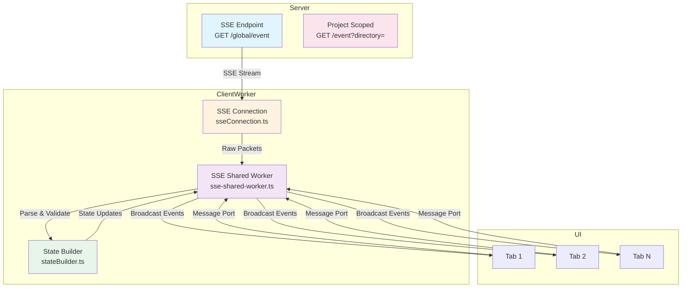

本页定义应用中 SSE（Server-Sent Events）实时通信协议的完整规范，涵盖服务器端点、数据包结构、事件类型及客户端实现模式。本文档独立完整，可实现一个兼容的 SSE 客户端解析器。

---

## 一、架构概览

SSE 通信采用双层架构：**全局聚合端点**向单一流中广播所有项目的混合事件，**项目作用域端点**则为每个项目或工作区提供独立的 filtered 流。客户端通过 `sse-shared-worker.ts` 维护单一长连接，将事件广播到多个 UI 标签页，并在 worker 内部维护全局状态索引，实现高效的状态同步与查询。



---

## 二、端点定义

### 2.1 全局事件聚合端点 `GET /global/event`

该端点将所有项目实例的事件聚合到单一流中，适用于需要监控全局状态的场景（如状态栏、通知系统）。

**请求头要求**：
- `Accept: text/event-stream`

**响应格式**：
```text
data: {"directory?":"string","payload":{"type":"string","properties":{...}}}
```

字段说明：

| 字段 | 类型 | 描述 |
|------|------|------|
| `directory` | `string` (可选) | 事件源的目录标识符。通常为项目路径；对于工作区同步事件，可以是工作区 ID（`wrk...` 前缀）。`server.connected` 和 `server.heartbeat` 事件不包含此字段。`global.disposed` 事件设置为 `"global"`。 |
| `payload.type` | `string` | 事件名称，见第 3 节完整列表 |
| `payload.properties` | `object` | 事件特定的属性对象 |

实现参考：[app/utils/sseConnection.ts](app/utils/sseConnection.ts#L29-L42) 的 `parsePacket` 函数展示了解析逻辑。

### 2.2 项目作用域端点 `GET /event`

该端点流式传输特定项目/工作区范围的事件，通过查询参数或请求头选择作用域。

**查询参数**：
- `?directory=` — 项目目录路径
- `?workspace=` — 工作区 ID（可选）

**请求头替代方案**：
- `X-OpenCode-Directory`
- `X-OpenCode-Workspace`

**响应格式**：
```text
data: {"type":"string","properties":{...}}
```

注意：该端点的数据帧**不包含** `directory` 或 `payload` 包装层，直接发送扁平的事件对象。

服务器不使用 SSE 的 `event:`、`id:`、`retry:` 字段。

---

## 三、事件类型规范

以下列出所有 `payload.type` 及其 `payload.properties` 结构。嵌套对象采用行内表示法（如 `time: { created: number }` 对应 JSON 的 `{"time":{"created":123}}`）。可选字段标记为 `?`。

### 3.1 服务器生命周期

| 事件名称 | 属性结构 | 描述 |
|----------|----------|------|
| `server.connected` | `{}` | 服务器连接建立时发送 |
| `server.heartbeat` | `{}` | 心跳包，定期发送以保持连接活跃 |
| `server.instance.disposed` | `directory: string` | 单个项目实例被销毁 |
| `global.disposed` | `{}` | 全局连接即将关闭 |

### 3.2 安装与更新

| 事件名称 | 属性结构 | 描述 |
|----------|----------|------|
| `installation.updated` | `version: string` | 安装版本已更新 |
| `installation.update-available` | `version: string` | 检测到新版本可用 |

### 3.3 IDE 集成

| 事件名称 | 属性结构 | 描述 |
|----------|----------|------|
| `ide.installed` | `ide: string` | IDE 插件安装完成 |

### 3.4 LSP（语言服务器协议）

| 事件名称 | 属性结构 | 描述 |
|----------|----------|------|
| `lsp.client.diagnostics` | `serverID: string`<br/>`path: string` | 客户端诊断信息 |
| `lsp.updated` | `{}` | LSP 状态更新 |

### 3.5 消息系统

消息系统支持完整的内容流式更新、部分增量（delta）更新和删除操作。

| 事件名称 | 属性结构 | 描述 |
|----------|----------|------|
| `message.updated` | `info: Message` | 消息整体更新 |
| `message.removed` | `sessionID: string`<br/>`messageID: string` | 消息删除 |
| `message.part.updated` | `part: Part` | 消息部分更新（如工具执行状态） |
| `message.part.delta` | `sessionID: string`<br/>`messageID: string`<br/>`partID: string`<br/>`field: string`<br/>`delta: string` | 消息部分字段的增量更新（如流式输出） |
| `message.part.removed` | `sessionID: string`<br/>`messageID: string`<br/>`partID: string` | 消息部分移除 |

**`Message` 类型定义**（[app/types/message.ts](app/types/message.ts#L25-L55)）：

```typescript
type Message = {
  id: string;
  parentId?: string;
  sessionId: string;
  role: 'user' | 'assistant';
  content: string;
  status: 'streaming' | 'complete' | 'error';
  agent?: string;
  model?: string;
  providerId?: string;
  modelId?: string;
  variant?: string;
  time?: number;
  usage?: MessageUsage;
  attachments?: MessageAttachment[];
  diffs?: MessageDiffEntry[];
  error?: { name: string; message: string } | null;
  classification?: 'real_user' | 'system_injection' | 'unknown';
};
```

### 3.6 权限系统

权限事件处理用户对工具操作的授权请求。

| 事件名称 | 属性结构 | 描述 |
|----------|----------|------|
| `permission.asked` | `id: string`<br/>`sessionID: string`<br/>`permission: string`<br/>`patterns: string[]`<br/>`metadata: Record<string, unknown>`<br/>`always: string[]`<br/>`tool?: { messageID: string; callID: string }` | 请求权限 |
| `permission.replied` | `sessionID: string`<br/>`requestID: string`<br/>`reply: "once" \| "always" \| "reject"` | 权限回复 |
| `permission.updated` | (已弃用) | 旧版权限更新事件 |

### 3.7 问答系统

问答系统支持多选项交互式问题。

| 事件名称 | 属性结构 | 描述 |
|----------|----------|------|
| `question.asked` | `id: string`<br/>`sessionID: string`<br/>`questions: QuestionInfo[]`<br/>`tool?: { messageID: string; callID: string }` | 提出问题 |
| `question.replied` | `sessionID: string`<br/>`requestID: string`<br/>`answers: string[][]` | 回答完成 |
| `question.rejected` | `sessionID: string`<br/>`requestID: string` | 问题被拒绝 |

**`QuestionInfo` 结构**：
```typescript
type QuestionInfo = {
  question: string;       // 问题文本
  header: string;         // 标题
  options: QuestionOption[]; // 选项列表
  multiple?: boolean;     // 是否多选
  custom?: boolean;       // 是否允许自定义输入
};

type QuestionOption = {
  label: string;          // 选项标签
  description: string;    // 选项描述
};
```

### 3.8 会话管理

会话是对话的独立单元，包含完整的状态流转。

| 事件名称 | 属性结构 | 描述 |
|----------|----------|------|
| `session.status` | `sessionID: string`<br/>`status: SessionStatus` | 会话状态变更（`idle`/`busy`/`retry`） |
| `session.created` | `info: Session` | 会话创建 |
| `session.updated` | `info: Session` | 会话更新 |
| `session.deleted` | `info: Session` | 会话删除 |
| `session.compacted` | `sessionID: string` | 会话压缩（归档旧消息） |
| `session.diff` | `sessionID: string`<br/>`diff: FileDiff[]` | 会话相关的文件差异 |
| `session.error` | `sessionID?: string`<br/>`error?: ErrorObject` | 会话错误 |
| `session.idle` | `sessionID: string` (已弃用) | 旧版空闲状态 |

**`Session` 核心结构**（[app/types/sse.ts](app/types/sse.ts#L78-L127)）：

```typescript
type SessionInfo = {
  id: string;
  slug: string;
  projectID: string;
  directory: string;
  parentID?: string;
  summary?: {
    additions: number;
    deletions: number;
    files: number;
    diffs?: FileDiff[];
  };
  share?: { url: string };
  title: string;
  version: string;
  time: {
    created: number;
    updated: number;
    compacting?: number;
    archived?: number;
    pinned?: number;
  };
  permission?: PermissionRule[];
  revert?: {
    messageID: string;
    partID?: string;
    snapshot?: string;
    diff?: string;
  };
};
```

### 3.9 文件系统

| 事件名称 | 属性结构 | 描述 |
|----------|----------|------|
| `file.edited` | `file: string` | 文件被编辑 |
| `file.watcher.updated` | `file: string`<br/>`event: "add" \| "change" \| "unlink"` | 文件监视器事件 |

### 3.10 Todo 系统

| 事件名称 | 属性结构 | 描述 |
|----------|----------|------|
| `todo.updated` | `sessionID: string`<br/>`todos: Todo[]` | Todo 列表更新 |

### 3.11 命令执行

| 事件名称 | 属性结构 | 描述 |
|----------|----------|------|
| `command.executed` | `name: string`<br/>`sessionID: string`<br/>`arguments: string`<br/>`messageID: string` | 命令执行 |

### 3.12 项目管理

| 事件名称 | 属性结构 | 描述 |
|----------|----------|------|
| `project.updated` | `properties: ProjectInfo` | 项目信息更新 |

### 3.13 工作区与工作树

| 事件名称 | 属性结构 | 描述 |
|----------|----------|------|
| `workspace.ready` | `name: string` | 工作区就绪 |
| `workspace.failed` | `message: string` | 工作区加载失败 |
| `worktree.ready` | `name: string`<br/>`branch: string` | Git 工作树就绪 |
| `worktree.failed` | `message: string` | 工作树加载失败 |

### 3.14 版本控制系统

| 事件名称 | 属性结构 | 描述 |
|----------|----------|------|
| `vcs.branch.updated` | `branch?: string` | Git 分支变更 |

---

## 四、客户端实现模式

### 4.1 SSE 连接管理

`createSseConnection`（[app/utils/sseConnection.ts](app/utils/sseConnection.ts#L44-L146)）提供连接生命周期管理，包含自动重连机制。

**核心特性**：
- **AbortController 驱动的中断**：允许优雅关闭连接
- **指数退避重连**：1秒固定延迟（当前实现），可扩展为指数策略
- **URL 归一化**：自动去除尾部斜杠
- **连接键计算**：基于 `baseUrl + authorization` 的唯一标识，用于检测配置变更

**连接状态机**：
```typescript
type ConnectionState = 'disconnected' | 'connecting' | 'connected';
```

**使用示例**：
```typescript
const connection = createSseConnection({
  onPacket: (packet) => handleEvent(packet),
  onOpen: (isReconnect) => console.log('Connected', isReconnect),
  onError: (msg, status) => console.error('SSE Error:', msg, status),
});

connection.connect({
  baseUrl: 'http://localhost:3000',
  authorization: 'Bearer token123',
});
```

### 4.2 数据包解析

`parsePacket` 函数（[app/utils/sseConnection.ts](app/utils/sseConnection.ts#L17-L42)）执行严格的验证：

1. JSON 解析失败则返回 `null`
2. 验证 `payload` 对象存在且 `payload.type` 为字符串
3. 验证 `payload.properties` 为对象
4. 规范化 `directory` 字段（缺失时为空字符串）

**防御性设计**：任何格式错误的数据帧都会被静默丢弃，不会中断流处理。

### 4.3 流处理循环

`handleStream` 函数（[app/utils/sseConnection.ts](app/utils/sseConnection.ts#L57-L98)）实现 SSE 协议的完整解析：

- 使用 `TextDecoder` 处理 UTF-8 字节流
- 以 `\n\n` 分割 SSE 数据块
- 仅处理以 `data: ` 前缀开头的行
- 支持不完整的块跨 chunk 边界（通过 `buffer` 累积）

**错误恢复策略**：当流意外终止时，触发 `onError` 回调并调度重连。

---

## 五、Worker 端实现

### 5.1 Shared Worker 架构

`sse-shared-worker.ts`（[app/workers/sse-shared-worker.ts](app/workers/sse-shared-worker.ts)）作为所有标签页的 SSE 连接代理，提供：

- **单一物理连接**：无论打开多少项目标签页，仅维持一个 SSE 流
- **消息端口广播**：所有连接标签页通过 `MessagePort` 接收事件
- **状态聚合**：维护所有项目的合并状态，避免每个标签页独立同步
- **会话水合控制**：按需加载完整会话数据，减少初始负载

**连接映射表**：
```typescript
const connections = new Map<string, ConnectionState>();
```
键由 `toKey(baseUrl, authorization)` 生成，支持多服务器实例切换。

### 5.2 状态构建器

`createStateBuilder`（[app/utils/stateBuilder.ts](app/utils/stateBuilder.ts)）实现 CRDT 风格的状态合并：

**核心数据结构**：
- `ServerState`：顶层状态树，包含 `projects: Record<projectId, ProjectState>`
- `ProjectState`：项目信息，包含 `sandboxes: Record<directory, SandboxState>`
- `SandboxState`：目录沙盒，包含 `rootSessions`（根会话列表）和 `sessions`（会话字典）
- `SessionState`：会话完整状态，包括工具执行历史、权限规则、时间戳

**索引维护**：
- `projectIdByDirectory`：目录 → 项目 ID 的反向映射，支持快速目录查找
- `sessionLocationById`：会话 ID → 所在项目/目录的定位映射

**会话去重与修剪**：
- 根会话判断：`!parentID || !parentID.trim()`
- 子会话 TTL：20 分钟未活跃则从内存清除（`CHILD_SESSION_PRUNE_TTL_MS`）
- 会话排序：按 `timePinned` → `timeUpdated` → `timeCreated` 降序

### 5.3 事件验证与类型守卫

Worker 对每个事件类型实现运行时类型验证，防止畸形数据破坏状态：

| 验证函数 | 对应事件 | 位置 |
|----------|----------|------|
| `isSessionEventProperties` | `session.created/updated/deleted` | [L263-L271](app/workers/sse-shared-worker.ts#L263-L271) |
| `isSessionStatusProperties` | `session.status` | [L273-L281](app/workers/sse-shared-worker.ts#L273-L281) |
| `isProjectInfo` | `project.updated` | [L283-L320](app/workers/sse-shared-worker.ts#L283-L320) |
| `isPermissionAskedProperties` | `permission.asked` | [L337-L357](app/workers/sse-shared-worker.ts#L337-L357) |
| `isPermissionRepliedProperties` | `permission.replied` | [L377-L390](app/workers/sse-shared-worker.ts#L377-L390) |

验证失败的包会被 `parseWorkerStatePacket` 丢弃，不更新状态。

### 5.4 任务队列与序列化

`queueOpencodeTask` 函数（[app/workers/sse-shared-worker.ts](app/workers/sse-shared-worker.ts#L595-L607)）确保 OpenCode API 调用按顺序执行，避免并发竞争：

```typescript
function queueOpencodeTask<T>(state: ConnectionState, task: () => Promise<T>): Promise<T> {
  const run = opencodeQueue.then(async () => {
    setBaseUrl(state.baseUrl);
    setAuthorization(state.authorization);
    return task();
  });
  opencodeQueue = run.then(() => undefined, () => undefined);
  return run;
}
```

此模式保证：
1. 同一时间仅有一个 OpenCode 任务在执行
2. 任务失败不影响队列中后续任务
3. 全局单例队列，跨连接共享

---

## 六、状态同步策略

### 6.1 目录收集与项目发现

`collectProjectDirectories`（[app/workers/sse-shared-worker.ts](app/workers/sse-shared-worker.ts#L552-L580)）从项目列表中提取所有目录：

- 主工作树目录
- 沙盒目录（sandboxes 数组）
- 去重并归一化路径

用于初始化时批量订阅项目事件。

### 6.2 会话水合（Hydration）级别

Worker 支持两种会话加载模式，以平衡性能与数据完整性：

| 级别 | 触发条件 | 加载内容 |
|------|----------|----------|
| `preview` | 初始目录扫描 | 仅根会话（`rootSessions`），不加载子会话历史 |
| `full` | 用户选择会话 | 完整会话树，包括所有子会话和消息历史 |

状态字段：
```typescript
sessionHydrationLevelByDirectory: Map<string, 'preview' | 'full'>;
sessionHydrationInFlightByDirectory: Map<string, { mode: 'preview' | 'full'; promise: Promise<void> }>;
```

防止重复加载：同一目录的重复请求会被合并为单个 Promise。

### 6.3 VCS 状态缓存

`vcsHydratedDirectories` 记录已加载 Git 信息的目录，避免重复调用 OpenCode VCS API。

---

## 七、连接恢复与容错

### 7.1 重连机制

连接断开时（网络故障、服务器重启），SSE 客户端按以下策略恢复：

1. **中止当前请求**：`abortController.abort()` 取消进行中的 fetch
2. **清除重连定时器**：防止并发重连
3. **调度重连**：1秒后尝试重新连接
4. **重连计数器**：`reconnectAttempt` 递增，可用于未来扩展指数退避
5. **配置变更检测**：若 `baseUrl` 或 `authorization` 改变，立即断开旧连接并建立新连接

**关键代码**：[app/utils/sseConnection.ts](app/utils/sseConnection.ts#L48-L66)

### 7.2 错误分类处理

| 错误类型 | 检测点 | 处理方式 |
|----------|--------|----------|
| HTTP 401 | `response.status === 401` | 触发 `authenticationFailed`，停止重连 |
| HTTP 错误 | `!response.ok` | 记录状态码，调度重连 |
| 网络异常 | `catch` 块 | 记录错误，调度重连 |
| 流意外结束 | `reader.read()` 返回 `done` | 触发 `streamClosed`，调度重连 |
| JSON 解析失败 | `parsePacket` 返回 `null` | 静默丢弃，继续处理后续包 |

### 7.3 优雅关闭

调用 `disconnect()` 将：
- 设置 `disconnectRequested = true`，阻止重连调度
- 中止当前请求
- 重置所有状态（包括 `reconnectAttempt`）

---

## 八、协议设计原则

1. **无状态事件**：每个事件独立包含完整上下文，不依赖事件顺序重建状态
2. **最小化传输**：使用增量更新（`message.part.delta`）而非全量重传
3. **作用域隔离**：通过 `directory` 字段实现多项目数据隔离
4. **前向兼容**：未知事件类型被安全忽略，不破坏客户端
5. **验证优先**：Worker 端严格验证数据结构，防止内存污染

---

## 九、与其他系统的集成点

SSE 事件流与以下系统紧密耦合：

- **OpenCode 后端 API**：`app/utils/opencode.ts` 提供 `listProjects`、`getSessionStatusMap` 等函数供 worker 调用
- **状态构建器**：接收 SSE 事件并更新内存状态树，供 UI 查询
- **消息系统**：`message.updated` 和 `message.part.delta` 驱动对话UI的实时渲染
- **权限系统**：`permission.asked` 触发模态框，`permission.replied` 提交用户决策
- **会话管理**：所有 `session.*` 事件同步会话树和状态栏

---

## 十、参考文件位置

| 组件 | 文件路径 | 说明 |
|------|----------|------|
| 类型定义 | [app/types/sse.ts](app/types/sse.ts) | 所有 SSE 事件的 TypeScript 类型 |
| 客户端连接 | [app/utils/sseConnection.ts](app/utils/sseConnection.ts) | 浏览器端 SSE 连接器 |
| Worker 实现 | [app/workers/sse-shared-worker.ts](app/workers/sse-shared-worker.ts) | Shared Worker 事件处理器 |
| 状态管理 | [app/utils/stateBuilder.ts](app/utils/stateBuilder.ts) | 内存状态构建与更新逻辑 |
| 协议文档 | [docs/SSE.md](docs/SSE.md) | 本文档的源文件 |
| API 端点 | [server.js](server.js) | Node.js 服务器 SSE 路由实现 |

---

## 十一、下一步阅读建议

根据开发角色，推荐以下进阶文档：

- **前端组件开发**：查看 `MessageViewer.vue` 如何消费 `message.part.delta` 事件实现流式渲染 [消息查看器组件架构](7-xuan-ran-qi-yu-cha-kan-qi-jia-gou)
- **状态管理深入**：研究 `useMessages.ts` 和 `useServerState.ts` 如何封装 SSE 事件流 [全局状态管理与响应式设计](12-quan-ju-zhuang-tai-guan-li-yu-xiang-ying-shi-she-ji)
- **后端集成**：参考 [OpenCode REST API 集成](10-opencode-rest-api-ji-cheng) 了解 SSE 端点如何与工具调用结合
- **错误处理策略**：阅读 `useThinkingAnimation.ts` 中的 `question.asked` / `permission.asked` 交互模式 [权限与问答系统](18-quan-xian-yu-wen-da-xi-tong)