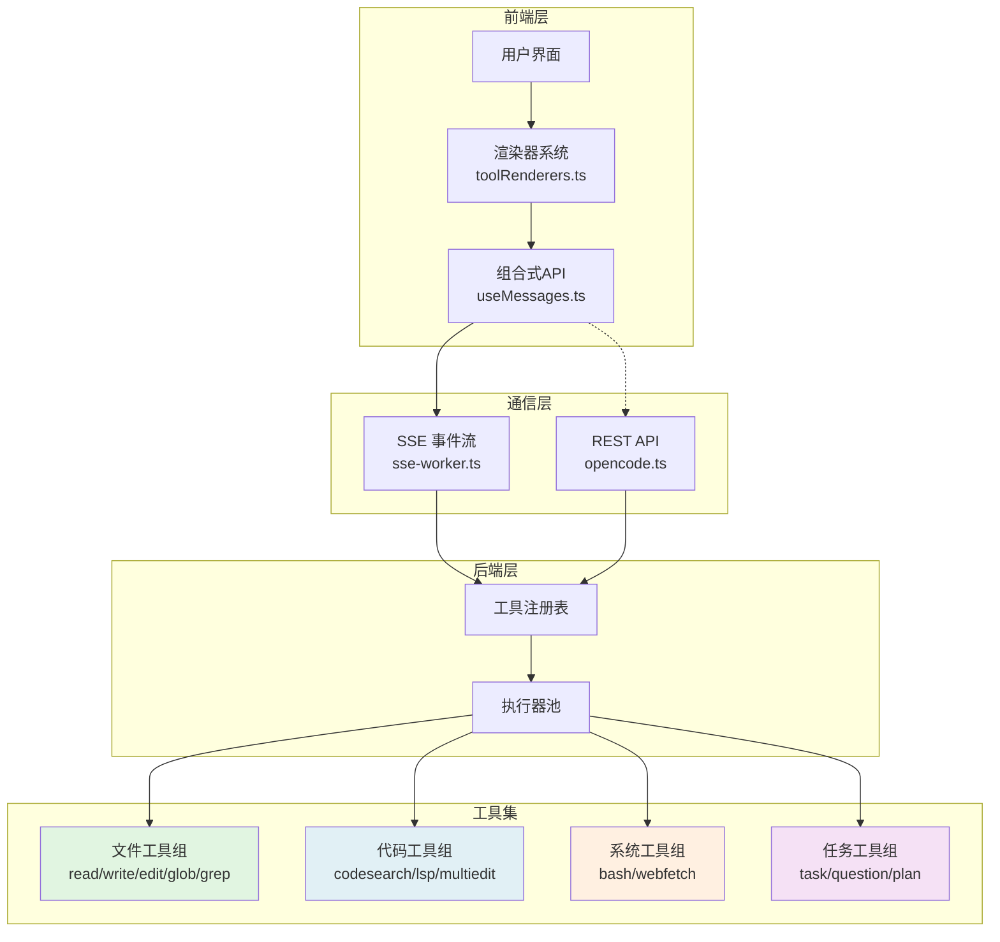
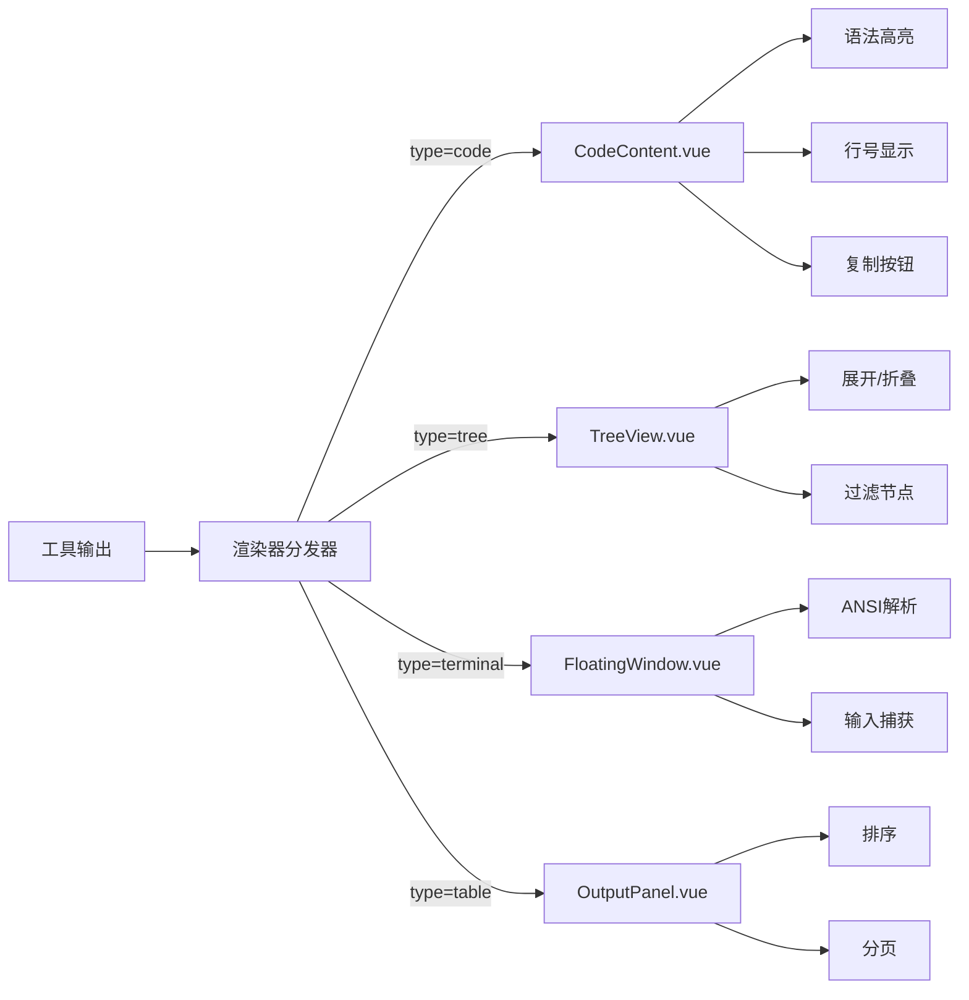

本文档系统化定义和描述 vis 应用中所有可用工具的结构、接口和实现方式。工具是应用与外部系统（文件系统、终端、网络等）交互的核心抽象，每个工具都有明确的职责边界、参数模式、执行流程和返回格式。本页汇总所有工具的通用设计原则、分类体系和实现模式，为工具开发者和高级用户提供完整参考。

## 工具架构概览
vis 应用的工具系统采用声明式定义与运行时注入相结合的架构。每个工具在服务器端作为独立的能力单元暴露，通过 SSE 或 REST 接口与前端通信，前端则通过统一的渲染器系统进行可视化呈现。工具分为四大类：文件操作类（read、write、edit、apply_patch、glob、grep、ls）、代码操作类（codesearch、multiedit、lsp）、任务管理类（task、question、plan-enter、plan-exit、todoread、todoread）和系统交互类（bash、webfetch、websearch）。

该架构确保工具调用在异步事件流中处理，支持流式输出、中断恢复和状态同步。前端通过 `utils/toolRenderers.ts` 根据工具类型动态选择渲染组件，每个渲染组件对应一个 Viewer 或 Renderer 类。

Sources: [docs/tools/bash.md](docs/tools/bash.md) [docs/tools/edit.md](docs/tools/edit.md) [utils/toolRenderers.ts](app/utils/toolRenderers.ts)

## 工具定义模式
所有工具遵循统一的定义模式，包含以下核心字段：`name`（工具唯一标识符）、`description`（人类可读描述）、`inputSchema`（JSON Schema 格式的输入定义）、`outputSchema`（可选输出模式）、`permissions`（执行权限要求）、`timeout`（超时设置）和 `stream`（是否支持流式输出）。定义文件位于服务器端配置，前端通过 API 动态获取工具清单。

### 通用输入参数结构
尽管各工具的具体参数不同，但所有工具共享一套通用参数模式：`path`（文件系统路径，绝对或相对工作目录）、`content`（文本内容，用于写入操作）、`pattern`（glob 模式匹配）、`cwd`（当前工作目录，默认继承会话上下文）、`encoding`（字符编码，默认 utf-8）、`timeout`（执行超时，秒）和 `env`（环境变量对象，仅 bash 工具支持）。输入必须通过 JSON Schema 验证，前端使用 `@effect/schema` 或 `zod` 进行类型推导。

Sources: [app/utils/constants.ts](app/utils/constants.ts) [docs/tools/read.md](docs/tools/read.md)

## 文件操作类工具详解
文件操作类工具是应用的基础能力层，提供对文件系统的安全访问。所有文件工具默认以**只读模式**运行，除非显式指定 `write` 权限。文件路径解析遵循优先级：绝对路径 > 相对于 `cwd` > 相对于项目根目录（从项目选择器获取）。工具在执行前会进行路径安全检查，禁止访问 `node_modules`、`.git`、`dist` 等系统目录。

| 工具名称 | 核心功能 | 输入模式 | 输出类型 | 典型场景 |
|---------|---------|---------|---------|---------|
| `read` | 读取文件内容 | `{ path: string, startLine?: number, endLine?: number }` | `{ content: string, totalLines: number }` | 查看源代码、配置文件 |
| `write` | 写入文件内容 | `{ path: string, content: string, append?: boolean }` | `{ written: boolean, bytes: number }` | 修改代码、保存配置 |
| `edit` | 编辑文件片段 | `{ path: string, edits: Array<{ oldString: string, newString: string, offset?: number }> }` | `{ applied: number, failed: number }` | 精准代码修改 |
| `apply_patch` | 应用补丁文件 | `{ path: string, patch: string }` | `{ success: boolean, hunks: number }` | Git 风格批量修改 |
| `glob` | 路径模式匹配 | `{ pattern: string, cwd?: string, dot?: boolean }` | `{ files: string[] }` | 查找特定类型文件 |
| `grep` | 内容模式搜索 | `{ pattern: string, path?: string, include?: string[], exclude?: string[] }` | `{ matches: Array<{ file: string, line: number, content: string }> }` | 代码搜索、错误定位 |
| `ls` | 目录列表 | `{ path: string, depth?: number, includeHidden?: boolean }` | `{ entries: Array<{ name: string, type: 'file'|'dir', size?: number }> }` | 浏览项目结构 |

文件工具的执行结果通过 `utils/formatters.ts` 格式化后，由对应的 Viewer 组件渲染。`read` 工具触发 `CodeContent.vue` 显示带行号的高亮代码；`grep` 工具使用 `TreeView.vue` 展示搜索结果树；`glob` 结果以扁平列表呈现。

Sources: [docs/tools/read.md](docs/tools/read.md) [docs/tools/write.md](docs/tools/write.md) [docs/tools/edit.md](docs/tools/edit.md) [docs/tools/apply_patch.md](docs/tools/apply_patch.md) [docs/tools/glob.md](docs/tools/glob.md) [docs/tools/grep.md](docs/tools/grep.md) [docs/tools/ls.md](docs/tools/ls.md)

## 代码操作类工具详解
代码操作类工具构建在 Language Server Protocol (LSP) 之上，提供智能代码分析和转换能力。`codesearch` 工具使用 ripgrep 引擎进行跨文件正则搜索，支持多编码和二进制文件过滤；`lsp` 工具通过 LSP 客户端与语言服务器通信，支持代码补全、跳转定义、查找引用、符号搜索和诊断信息获取；`multiedit` 工具允许在多个文件中同时应用相同的编辑操作，通过并行处理提升效率。

### LSP 工具交互流程
LSP 工具的执行涉及前端→后端→LSP 服务器三层通信。前端发送初始化请求后，后端启动 LSP 客户端，加载项目根目录对应的语言服务器（如 typescript-language-server、python-lsp-server），随后所有 LSP 请求通过该客户端代理。工具支持的方法包括：`textDocument/completion`（补全）、`textDocument/definition`（跳转）、`textDocument/references`（引用）、`workspace/symbol`（符号搜索）和 `textDocument/diagnostic`（诊断）。每个方法的响应通过 SSE 流式返回，前端根据方法类型路由到不同的渲染器。

Sources: [docs/tools/codesearch.md](docs/tools/codesearch.md) [docs/tools/lsp.md](docs/tools/lsp.md) [docs/tools/multiedit.md](docs/tools/multiedit.md)

## 系统交互类工具详解
系统交互类工具突破文件系统边界，与外部环境进行数据交换。`bash` 工具在受控的 PTY（伪终端）中执行 shell 命令，支持环境变量注入、超时控制和输出流式捕获；`webfetch` 工具执行 HTTP 请求，支持 GET/POST/PUT/DELETE 方法，可设置请求头、超时和响应大小限制；`websearch` 工具调用搜索引擎 API（如 Google、Bing），返回结构化的搜索结果摘要。

### Bash 工具安全沙箱设计
bash 工具的执行并非在宿主终端直接运行，而是通过 `usePtyOneshot.ts` 创建的独立 PTY 进程。该进程继承会话的环境变量集合，但工作目录被限制在项目根目录或安全子目录内。命令输出通过流式通道传输，前端在 `FloatingWindow.vue` 中渲染终端界面，支持 ANSI 颜色代码解析和交互式输入（如 sudo 密码提示）。进程异常退出时，返回非零状态码和错误输出，前端据此显示错误消息。

Sources: [docs/tools/bash.md](docs/tools/bash.md) [docs/tools/webfetch.md](docs/tools/webfetch.md) [docs/tools/websearch.md](docs/tools/websearch.md) [app/composables/usePtyOneshot.ts](app/composables/usePtyOneshot.ts)

## 任务管理类工具详解
任务管理类工具用于协调复杂工作流，支持计划、分解、追踪和完成闭环。`task` 工具创建待办事项并分配状态；`question` 工具发起查询并等待回答；`plan-enter` 工具开始规划阶段，生成任务清单；`plan-exit` 工具结束规划并标记完成；`todoread` 工具读取任务列表；`todorewrite` 工具批量更新任务状态。这些工具的数据存储在后端会话状态中，通过 `useTodos.ts` 组合式 API 进行前端访问。

### 任务工具状态机
任务工具的数据模型采用有限状态机设计，每个任务包含 `id`、`title`、`description`、`status`（pending、in_progress、completed、cancelled）、`assignee`、`dueDate` 和 `dependencies` 字段。状态转换受规则约束：`pending` → `in_progress` 需显式开始；`in_progress` → `completed` 需验证完成条件；任何状态均可直接 `cancelled`。工具调用时，后端验证状态转换合法性并更新会话树，前端通过 `TodoPanel.vue` 实时同步变更。

Sources: [docs/tools/task.md](docs/tools/task.md) [docs/tools/question.md](docs/tools/question.md) [docs/tools/plan-enter.md](docs/tools/plan-enter.md) [docs/tools/plan-exit.md](docs/tools/plan-exit.md) [docs/tools/todoread.md](docs/tools/todoread.md) [docs/tools/todowrite.md](docs/tools/todowrite.md) [app/composables/useTodos.ts](app/composables/useTodos.ts)

## 工具渲染器系统
前端通过 `utils/toolRenderers.ts` 注册的工具渲染器映射，将工具输出转换为相应的 Vue 组件。渲染器分为三类：**文本渲染器**（显示纯文本、日志、错误），**代码渲染器**（显示高亮代码、diff、语法树），**结构渲染器**（显示表格、树、图表）。每个渲染器接收标准化的 `RenderPayload` 对象，包含 `toolName`、`content`、`metadata`、`timestamp` 和 `sessionId` 字段。渲染器通过异步组件加载实现懒加载，减少初始包体积。

Sources: [utils/toolRenderers.ts](app/utils/toolRenderers.ts) [app/components/CodeContent.vue](app/components/CodeContent.vue) [app/components/TreeView.vue](app/components/TreeView.vue)

## 工具调用生命周期
从用户发起工具调用到结果呈现，完整生命周期包含以下阶段：**请求构造**（前端组合参数并验证 Schema）、**传输**（通过 SSE POST 或 REST POST 发送）、**排队**（后端根据优先级和资源占用排队）、**执行**（在隔离进程或容器中运行）、**流式输出**（分块发送 stdout/stderr 或进度事件）、**完成**（发送结束事件并附带元数据）、**渲染**（前端接收并路由到渲染器）、**交互**（用户可中断、重试或衍生新操作）。每个阶段都有超时和重试机制，确保系统韧性。

Sources: [docs/SSE.md](docs/SSE.md) [app/types/sse.ts](app/types/sse.ts) [app/utils/sseConnection.ts](app/utils/sseConnection.ts)

## 工具权限与安全模型
工具执行受细粒度权限系统控制。权限类型包括：`read`（读取文件）、`write`（修改文件）、`execute`（运行命令）、`network`（外部网络访问）、`sandbox`（访问沙箱环境）、`git`（版本控制操作）。权限在项目设置中配置，也可在会话级别覆盖。工具执行前，后端校验调用者的权限集合，缺失权限则返回 `403 Forbidden` 并记录审计日志。敏感操作（如删除文件、执行 bash）要求二次确认，前端通过 `SettingsModal.vue` 或 `ProjectSettingsDialog.vue` 进行交互。

Sources: [app/composables/usePermissions.ts](app/composables/usePermissions.ts) [app/components/SettingsModal.vue](app/components/SettingsModal.vue) [app/components/ProjectSettingsDialog.vue](app/components/ProjectSettingsDialog.vue)

## 工具错误处理与恢复
工具错误分为四类：**验证错误**（参数不符合 Schema，HTTP 400）、**权限错误**（无权执行，HTTP 403）、**执行错误**（命令失败、文件不存在，HTTP 500）、**超时错误**（执行超时，HTTP 504）。前端根据错误类型展示不同的恢复选项：验证错误可直接修改参数重试；权限错误引导用户申请权限；执行错误提供日志查看和问题诊断；超时错误允许延长超时或分块处理。所有错误附带 `errorCode` 和 `suggestions` 字段，支持自动化修复建议。

Sources: [docs/API.md](docs/API.md) [app/utils/notificationManager.ts](app/utils/notificationManager.ts) [app/components/MessageViewer.vue](app/components/MessageViewer.vue)

## 工具开发指南
开发新工具需遵循以下步骤：1) 在服务器端工具注册表中添加条目，定义 `name`、`inputSchema`、`handler`；2) 实现 `handler` 函数，执行核心逻辑并返回符合 `outputSchema` 的结果；3) 在前端 `utils/toolRenderers.ts` 注册渲染器组件；4) 在 `docs/tools/` 添加文档页面；5) 编写单元测试覆盖输入验证、权限检查和边界条件；6) 更新国际化文件添加多语言描述。工具代码应保持单一职责，避免超过 200 行逻辑复杂度；复杂工具应拆分为子工具或可组合的工作流。

Sources: [docs/tools/apply_patch.md](docs/tools/apply_patch.md) [app/utils/toolRenderers.test.ts](app/utils/toolRenderers.test.ts)

## 下一步阅读建议
如需深入特定工具的实现细节，请参阅各工具的独立文档页面；若需了解工具与 SSE 通信机制，请阅读 [SSE 实时通信机制](9-sse-shi-shi-tong-xin-ji-zhi)；若需理解前端状态如何管理工具调用，请阅读 [组合式 API (Composables) 详解](13-zu-he-shi-api-composables-xiang-jie)；若需集成外部工具，请参考 [REST API 完整参考](26-rest-api-wan-zheng-can-kao)。