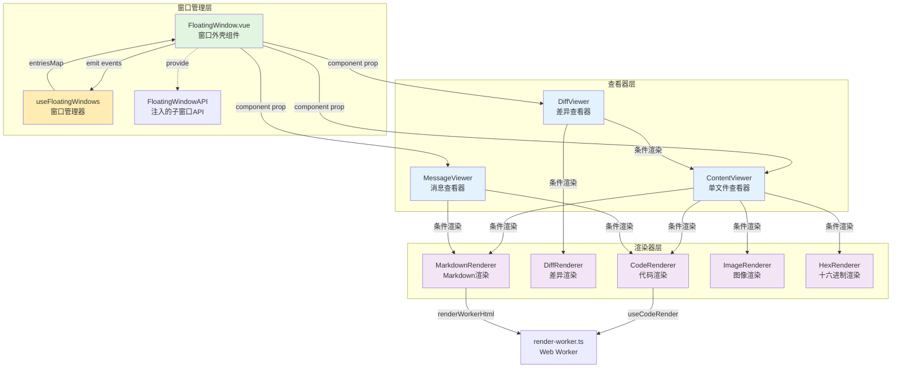

本页面系统阐述 vis 应用中的浮动窗口系统设计，涵盖从底层窗口管理器到上层渲染组件的完整架构。作为核心架构文档，将深入分析 **FloatingWindow 窗口壳**、**Viewer 查看器层** 与 **Renderer 渲染器层** 的三层分离模式，以及窗口生命周期管理、z-index 调度、内容更新机制等关键设计决策。

## 架构概览

整个窗口系统采用**分层渲染架构**，核心设计原则是**关注点分离**：窗口外壳专注于位置、大小、层级和生命周期管理；查看器负责根据内容类型选择适当的渲染器；渲染器则专注于单一内容类型的纯展示。



**数据流向**：
1. 调用方通过 `useFloatingWindows.open(key, options)` 创建窗口
2. 管理器在 `entriesMap` 中注册 `FloatingWindowEntry`
3. `App.vue` 根据 `entry.component` 渲染对应的查看器
4. 查看器根据文件类型和内容动态切换渲染器
5. 渲染器通过 Web Worker 异步处理高开销操作（如 Markdown 渲染）

Sources: [window-arch.md](docs/window-arch.md#L1-L50), [useFloatingWindows.ts](app/composables/useFloatingWindows.ts#L1-L100)

## FloatingWindow 窗口壳组件

`FloatingWindow.vue` 是所有浮动窗口的通用外壳，提供**拖拽、调整大小、标题栏、层级控制、搜索、自动滚动**等通用窗口功能。它不关心具体显示什么内容，只负责作为容器承载任意组件。

### 核心职责

窗口壳的核心职责包括：
- **几何管理**：维护 `x, y, width, height` 属性，处理拖拽和调整大小逻辑
- **z-index 调度**：点击窗口时提升层级，支持手动层级偏移
- **滚动控制**：三种滚动模式 (`follow` | `force` | `manual` | `none`) 和流式内容自动跟随
- **内容搜索**：内置搜索框，支持键盘快捷键 (Ctrl+F) 和高亮匹配
- **状态注入**：通过 `provide(FLOATING_WINDOW_KEY)` 向下层组件暴露 `FloatingWindowAPI`

```typescript
// FloatingWindowAPI 接口定义
interface FloatingWindowAPI {
  key: string;
  content: computed<string>;
  html: computed<string>;
  title: computed<string>;
  status: computed<string>;
  notifyContentChange(smooth?: boolean): void;
  setContent(text: string): void;
  appendContent(text: string): void;
  setTitle(title: string): void;
  setStatus(status: 'running' | 'completed' | 'error'): void;
  setColor(color: string): void;
  bringToFront(): void;
  close(): void;
  minimize(): void;
}
```

Sources: [FloatingWindow.vue](app/components/FloatingWindow.vue#L1-L150)

### 滚动与流式跟随

窗口壳实现**智能滚动保留**机制：当流式内容更新时，若用户未手动滚动，则自动跟随到底部；若用户已手动滚动，则保留当前位置，避免打断阅读。该逻辑通过 `useAutoScroller` 组合式函数实现：

```typescript
// 滚动状态保留的核心判断
function shouldPreserveScrollPosition() {
  if (scrollMode.value === 'manual' || scrollMode.value === 'none') return true;
  return scrollMode.value === 'follow' && !isFollowing.value;
}
```

Sources: [FloatingWindow.vue](app/components/FloatingWindow.vue#L50-L100)

### 样式与主题

窗口样式通过 CSS 变量动态注入，支持不同窗口类型的差异化渲染：

| 变量名 | 用途 | 特殊处理 |
|--------|------|----------|
| `--win-x` / `--win-y` | 窗口绝对定位 | 始终像素值 |
| `--window-color` | 标题栏背景色 | 默认 `#3a4150` |
| `--floating-font-family` | 内容字体 | 终端窗口使用等宽字体 |
| `--floating-font-size` | 字体大小 | 终端窗口 14px，其他 13px |
| `--floating-line-height` | 行高 | 终端窗口 1.5，其他 1.5 |

Sources: [FloatingWindow.vue](app/components/FloatingWindow.vue#L200-L250)

## useFloatingWindows 窗口管理器

`useFloatingWindows.ts` 是窗口系统的**单一事实来源**，维护所有窗口的注册表、生命周期和全局状态。其设计包含以下关键模式：

### 数据模型：FloatingWindowEntry

每个窗口对应一个 `FloatingWindowEntry` 对象，包含位置、大小、内容、组件、状态等完整信息。重要字段说明：

| 字段 | 类型 | 说明 |
|------|------|------|
| `key` | `string` | 全局唯一标识符，如 `"file:/path/to/file"` |
| `component` | `Component` | 要渲染的 Vue 组件（已 `markRaw`） |
| `props` | `Record<string, unknown>` | 传递给组件的属性 |
| `resolvedHtml` | `string` | 已解析的 HTML 内容（用于 CodeContent 渲染） |
| `variant` | `'code' \| 'diff' \| 'message' \| 'binary' \| 'term' \| 'plain'` | 内容类型，决定 gutter 模式 |
| `scroll` | `'follow' \| 'force' \| 'manual' \| 'none'` | 滚动行为 |
| `zIndex` | `number` | 当前层级，手动窗口 +10000 偏移 |
| `expiresAt` | `number` | 自动关闭时间戳（TTL 机制） |
| `beforeOpen` / `afterOpen` | `() => Promise<void> \| void` | 生命周期钩子 |

Sources: [useFloatingWindows.ts](app/composables/useFloatingWindows.ts#L1-L80)

### z-index 分层策略

窗口系统采用**双层 z-index 策略**：普通窗口从 100 开始递增；需要用户交互的窗口（如权限请求、问答弹窗）获得 `MANUAL_ZINDEX_OFFSET` (10000) 的额外偏移，确保始终在最上层：

```typescript
function isManualTier(key: string, closable?: boolean): boolean {
  if (closable) return true;  // 可关闭窗口通常需要用户交互
  return key.startsWith('permission:') || key.startsWith('question:');
}
```

Sources: [useFloatingWindows.ts](app/composables/useFloatingWindows.ts#L100-L130)

### TTL 自动清理机制

窗口系统内置**基于状态的生存时间 (TTL)** 管理，避免无限制堆积：

| 状态 | TTL | 说明 |
|------|-----|------|
| `running` | 10 分钟 | 工具运行中，保留较长时间供用户查看 |
| `completed` / `error` | 2 秒 | 完成后快速自动关闭 |
| `Infinity` | 永久 | 明确设置为永久的窗口（如主文件编辑器） |

`resolveExpiresAt` 函数实现优先级逻辑：显式 `expiresAt` > `expiry` 配置 > 状态推断 > 继承现有 > 默认运行中 TTL。

Sources: [useFloatingWindows.ts](app/composables/useFloatingWindows.ts#L150-L200)

### 窗口打开流程

打开窗口的完整流程涉及多个异步阶段：

1. **合并配置**：`open(key, opts)` 合并默认值、现有条目和新选项
2. **生成 Render ID**：`nextRenderId()` 创建唯一标识符（用于 Vue 的 `:key`）
3. **内容预加载**：若 `opts.content` 为函数，则 `await` 预取内容
4. **注册条目**：`entriesMap.set(key, entry)` 触发响应式更新
5. **调度 TTL**：`scheduleExpiry(key, expiresAt)` 设置自动关闭计时器
6. **DOM 后置钩子**：`afterOpen` 在元素挂载后执行（如聚焦输入框）

Sources: [useFloatingWindows.ts](app/composables/useFloatingWindows.ts#L200-L300)

## 查看器层 (Viewer Layer)

查看器层是**模式选择器**，根据内容类型、文件扩展名和用户偏好，决定使用哪个渲染器。该层实现**多标签页切换**和**模式降级**逻辑。

### ContentViewer 单文件查看器

`ContentViewer` 用于显示单个文件、图像或调试文本转储。其模式选择逻辑如下表：

| 条件 | 可用模式 | 默认模式 | 渲染器 |
|------|----------|----------|--------|
| `imageSrc` 存在 | Image, Hex | Image | ImageRenderer, HexRenderer |
| 二进制文件或图像扩展名 | Hex | Hex | HexRenderer |
| Markdown 文件且有内容 | Rendered, Source | Rendered | MarkdownRenderer, CodeRenderer |
| 其他文本文件 | Source | Source | CodeRenderer |

**用户选择持久化**：`userSelectedMode` 独立存储用户手动选择的模式，仅在文件切换时重置，提升用户体验。

Sources: [ContentViewer.vue](app/components/viewers/ContentViewer.vue#L1-L150)

### DiffViewer 差异查看器

`DiffViewer` 用于 Git 差异、消息差异和提交差异展示。其架构包含**两级标签页**：文件级标签页（多文件差异）和模式级标签页（Original/Modified/Diff）。当查看 Markdown 文件的 Original 或 Modified 模式时，会额外出现 Rendered/Source 子标签页。

**模式降级逻辑**：若文件为位图（PNG/JPG等），则仅提供 Original 和 Modified 模式（跳过 Diff 和 Source 模式），直接显示图像对比。

Sources: [DiffViewer.vue](app/components/viewers/DiffViewer.vue#L1-L150)

### MessageViewer 消息查看器

`MessageViewer` 是会话消息（用户输入、助手输出、工具窗口文本）的元查看器。它根据 `html`、`code` 和 `lang` 属性智能选择渲染方式：
- 若提供 `html` 属性，直接使用 `MarkdownRenderer`（跳过 Worker）
- 若提供 `code + lang`，通过 Worker 异步渲染
- 若 `allowModeToggle=true` 且 `lang="markdown"`，显示 Rendered/Source 切换标签

Sources: [window-arch.md](docs/window-arch.md#L100-L130)

## 渲染器层 (Renderer Layer)

渲染器层是**无状态、单一职责的展示组件**，每个渲染器只懂得绘制一种内容类型。

### CodeRenderer 代码渲染器

- **Props**: `path`, `fileContent`, `rawHtml`, `lang`, `isBinary`, `gutterMode`, `theme`, `lines`
- **核心依赖**: `useCodeRender` 组合式函数 + `CodeContent.vue` 组件
- **高亮范围**: 通过 `lines` 属性指定（如 `"5-10,20"`），用于显示错误堆栈片段
- **事件**: 渲染完成后发射 `rendered` 事件

`useCodeRender` 内部使用 `renderWorkerHtml` Web Worker 执行 Shiki 语法高亮，避免阻塞主线程。

Sources: [window-arch.md](docs/window-arch.md#L40-L60)

### DiffRenderer 差异渲染器

- **Props**: `path`, `diffCode`, `diffAfter`, `diffPatch`, `diffTabs`, `gutterMode`, `lang`, `theme`
- **多文件支持**: 当 `diffTabs` 包含多个条目时，显示文件选择标签页
- **渲染模式**: 调用 `useCodeRender` 并传入 `after` 和 `patch` 参数生成 unified diff
- **事件**: `rendered`

Sources: [window-arch.md](docs/window-arch.md#L60-L80)

### MarkdownRenderer Markdown 渲染器

- **Props**: `code`, `lang`, `theme`, `html`, `files`, `copyButton`
- **异步渲染**: 将 Markdown 发送至 `renderWorkerHtml` Web Worker（集成 markdown-it + Shiki）
- **预渲染优化**: 若直接提供 `html` 属性，则跳过 Worker 直接渲染
- **代码块交互**: 处理代码块上的复制按钮点击事件
- **事件**: `rendered`

Sources: [window-arch.md](docs/window-arch.md#L80-L100)

### ImageRenderer 与 HexRenderer

- **ImageRenderer**: 支持滚轮缩放、拖拽平移、双击重置的交互式图像查看器
- **HexRenderer**: `CodeContent` 的薄包装，设置 `variant="binary"` 显示十六进制转储

Sources: [window-arch.md](docs/window-arch.md#L100-L120)

## 内容渲染管线

内容从原始数据到最终 DOM 的完整流程涉及**多层转换**：

1. **数据获取**：`openFileViewer` 通过 REST API 获取文件内容（二进制或文本）
2. **内容解析**：`useCodeRender` 将原始文本转换为 Shiki 高亮后的 HTML
3. **Worker 卸载**：Markdown 渲染通过 `renderWorkerHtml` 在独立线程执行
4. **DOM 注入**：`CodeContent.vue` 接收 `rawHtml` 并使用 `v-html` 注入
5. **后期处理**：`useContentSearch` 在注入后建立搜索索引

对于二进制文件，额外步骤包括 Base64 解码、`hexdump` 转换、图像 Data URL 生成。

Sources: [FloatingWindow.vue](app/components/FloatingWindow.vue#L300-L350), [utils/workerRenderer.ts](app/utils/workerRenderer.ts)

## 窗口通信与 API

每个 `FloatingWindow` 实例通过 `provide(FLOATING_WINDOW_KEY)` 向其子组件树暴露 `FloatingWindowAPI`，使得渲染器可以：
- 通知内容变化：`api.notifyContentChange(smooth?)` 触发自动滚动逻辑
- 动态更新标题：`api.setTitle("Processing...")` 用于工具运行状态显示
- 动态更新状态颜色：`api.setColor("#ff6b6b")` 表示错误状态
- 请求关闭：`api.close()`（子组件可触发自身关闭）

该设计实现**反向通信**：子组件无需直接访问父级即可控制窗口行为。

Sources: [FloatingWindow.vue](app/components/FloatingWindow.vue#L130-L180)

## 窗口生命周期与事件

窗口系统定义完整的**生命周期钩子**，支持精细的初始化与清理控制：

| 钩子 | 时机 | 典型用途 |
|------|------|----------|
| `beforeOpen` | 打开前（await） | 预加载数据、权限检查 |
| `afterOpen` | DOM 挂载后 | 聚焦输入框、初始化第三方库 |
| `beforeClose` | 关闭前（await） | 确认保存、清理资源 |
| `afterClose` | 条目移除后 | 释放内存、取消订阅 |

此外，`onResize` 回调允许组件响应窗口尺寸变化，用于图表或可视化内容的自适应重绘。

Sources: [useFloatingWindows.ts](app/composables/useFloatingWindows.ts#L80-L120)

## 性能优化策略

窗口系统实施多项性能优化：

1. **组件标记 Raw**: `markRaw(entry.component)` 防止 Vue 深度响应式代理，避免 `<component :is>` 的性能损耗
2. **防抖内容更新**: `useDeltaAccumulator` 组合式函数累积高频内容更新，批量刷新 DOM
3. **Web Worker 卸载**: Markdown 和代码高亮在独立线程执行，主线程仅负责 DOM 注入
4. **懒加载渲染器**: 渲染器组件仅在激活模式下才被实际渲染
5. **搜索索引缓存**: `useContentSearch` 仅在内容变化时重建索引

Sources: [useFloatingWindows.ts](app/composables/useFloatingWindows.ts#L120-L140), [composables/useDeltaAccumulator.ts](app/composables/useDeltaAccumulator.ts)

## 窗口标识符约定

窗口 `key` 采用**命名空间前缀**约定，支持系统级区分和特殊处理：

| 前缀模式 | 示例 | 含义 |
|----------|------|------|
| `file:` | `file:/home/user/foo.py` | 文件查看器 |
| `shell:` | `shell:123` | 终端窗口（使用等宽字体） |
| `tool:` | `tool:grep` | 工具输出窗口 |
| `diff:` | `diff:commit-abc` | 差异查看器 |
| `permission:` | `permission:read` | 权限请求（手动层级） |
| `question:` | `question:confirm` | 问答弹窗（手动层级） |
| `reasoning:` | `reasoning:chain` | 推理过程窗口 |
| `subagent:` | `subagent:planner` | 子代理窗口 |

该约定使得 `isManualTier` 等逻辑能够基于 key 模式做出决策，而无需额外元数据。

Sources: [useFloatingWindows.ts](app/composables/useFloatingWindows.ts#L100-L110), [FloatingWindow.vue](app/components/FloatingWindow.vue#L80-L90)

## 窗口位置策略

默认窗口位置通过 `getRandomPosition` 生成，在视口范围内添加 20px 内边距并随机分布，避免完全重叠。对于连续打开的相关窗口（如多文件差异），可通过计算偏移量实现**级联布局**，但当前实现采用随机策略简化。

`setExtent` 方法允许监听窗口大小变化并更新边界计算，确保新窗口始终在可视区域内。

Sources: [useFloatingWindows.ts](app/composables/useFloatingWindows.ts#L60-L80)

## 扩展点与自定义

开发者可通过以下方式扩展窗口系统：

1. **自定义查看器**：创建新的 Viewer 组件，实现模式切换逻辑，在 `App.vue` 的调用点注册
2. **自定义渲染器**：创建新的 Renderer 组件，在对应的 Viewer 中条件渲染
3. **自定义窗口类型**：通过 `variant` 属性影响 gutter 模式，或通过 `key` 前缀触发特殊逻辑
4. **生命周期钩子**：利用 `beforeOpen`/`afterOpen` 注入第三方库（如 Monaco Editor）

Sources: [window-arch.md](docs/window-arch.md#L150-L170)

## 与上下游的集成

窗口系统在应用架构中的位置：

```
调用方 (App.vue / ToolWindow / ThreadBlock)
    ↓ useFloatingWindows.open()
useFloatingWindows (状态管理)
    ↓ <FloatingWindow v-for>
FloatingWindow (窗口壳 + 逻辑)
    ↓ component prop
ContentViewer / DiffViewer / MessageViewer (查看器)
    ↓ 条件渲染
CodeRenderer / DiffRenderer / ... (渲染器)
    ↓ useCodeRender / Worker
Web Worker (高负载计算)
```

常见调用路径：
- **文件打开**: `openFileViewer(path, lines)` → `fw.open(key, { component: ContentViewer, props: { path, lang } })`
- **图像打开**: `handleOpenImage({ url, filename })` → `fw.open(key, { component: ContentViewer, props: { imageSrc } })`
- **差异查看**: `openGitDiff(...)` → `fw.open(key, { component: DiffViewer, props: { diffCode, diffAfter } })`

Sources: [window-arch.md](docs/window-arch.md#L180-L220), [App.vue](app/App.vue)

## 未来演进方向

基于当前架构，潜在的改进方向包括：

- **窗口布局持久化**：保存和恢复窗口位置、大小、层级到本地存储
- **窗口分组与平铺**：支持选项卡式分组或网格平铺布局
- **跨窗口拖拽**：允许拖拽标签页在窗口间移动
- **渲染器插件系统**：动态注册自定义渲染器类型
- **窗口快照**：保存窗口内容快照用于离线查看

这些演进应在不破坏现有三层分离原则的前提下进行。

---

**延伸阅读**：
- [浮动窗口管理系统](6-fu-dong-chuang-kou-guan-li-xi-tong) — 深入 `useFloatingWindows` 组合式函数
- [渲染器与查看器架构](7-xuan-ran-qi-yu-cha-kan-qi-jia-gou) — 渲染器组件详解
- [内容渲染管线](8-nei-rong-xuan-ran-guan-xian) — 从文本到 DOM 的完整流程
- [全局状态管理与响应式设计](12-quan-ju-zhuang-tai-guan-li-yu-xiang-ying-shi-she-ji) — 窗口状态在全局状态中的位置