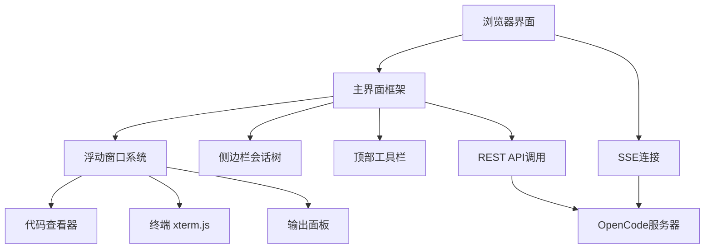

本页面面向初学者开发者，介绍Vis的核心概念、快速启动流程和基本界面操作。Vis是为OpenCode构建的浏览器端可视化界面，通过浮动窗口管理系统提供会话管理、工具输出查看和实时交互能力。掌握基本使用是深入理解[系统架构概览](5-xi-tong-jia-gou-gai-lan)和[浮动窗口管理系统](6-fu-dong-chuang-kou-guan-li-xi-tong)的前提。

## 项目概述与核心概念
Vis是OpenCode的第三方Web UI，通过浏览器提供窗口式交互界面。其核心设计理念是"Review-first"——将工具输出和AI推理过程以浮动窗口形式保持在上下文可见区域，避免信息割裂。系统主要由以下三部分组成：**主界面框架**承载会话树、工具窗口和状态栏；**浮动窗口系统**管理工具输出、代码查看器和终端等可悬浮元素；**通信层**通过SSE与OpenCode服务器保持实时连接，并调用REST API执行操作。

可视化架构如Mermaid图所示：


核心特性包括：多项目和工作树支持、语法高亮代码差异查看器、权限与问答交互提示、嵌入xterm.js的终端。界面组件分布在`app/components/`目录下，状态管理通过`app/composables/`中的组合式API实现。

## 环境要求与安装
Vis需要Node.js 18+和pnpm包管理器。项目当前版本基于上游仓库并增加了中文本地化、字体管理、供应商模型管理等增强功能[README.md](README.md#L1-L35)。

克隆仓库并安装依赖：
```bash
git clone https://github.com/qiyuanhuakai/opencode-visualizer-cn
cd opencode-visualizer-cn
pnpm install
```

开发模式运行：
```bash
pnpm dev
```
这将启动Vite开发服务器，默认监听3000端口（可通过`vite.config.ts`配置调整）。

生产构建：
```bash
pnpm build
node server.js
```
建议使用`nohup node server.js 2>&1 &`将服务器置于后台持久运行[README.md](README.md#L36-L59)。

## 连接OpenCode服务器
Vis作为客户端连接到运行中的OpenCode服务器。连接方式取决于部署环境：

**云端部署**：访问托管版本`https://xenodrive.github.io/vis/`，需在OpenCode服务器启用CORS：
```bash
opencode serve --cors https://xenodrive.github.io
```
或在配置文件中添加：
```json
{
  "$schema": "https://opencode.ai/config.json",
  "server": {
    "cors": ["https://xenodrive.github.io"]
  }
}
```
[README.md](README.md#L60-L87)

**本地开发**：若浏览器阻止本地服务器连接，可本地启动UI：
```bash
npx @xenodrive/vis
```
同时启动OpenCode API服务器：
```bash
opencode serve
```
访问`http://localhost:3000`[README.md](README.md#L88-L101)。

连接配置通过界面右上角的连接设置面板完成，支持自定义服务器地址和端口。默认端口已调整以减少WSL环境下的Windows服务冲突[README.md](README.md#L30-L32)。

## 界面概览与导航
Vis界面采用经典IDE布局，主要区域包括：

**顶部工具栏**：包含项目选择器、会话管理按钮、批量操作管理入口和供应商模型快速切换。项目选择器组件实现位于`app/components/ProjectPicker.vue`，支持多项目和工作树切换。

**左侧会话面板**：显示会话树结构，支持pin常用会话、批量选择和归档管理。会话状态和选择逻辑由`app/composables/useSessionSelection.ts`管理。

**中央工作区**：默认显示欢迎界面`app/components/Welcome.vue`，会话激活后显示对话内容和工具调用流。

**右侧工具窗口区域**：承载浮动窗口系统，包括代码查看器、终端、输出面板等。浮动窗口生命周期和位置管理由`app/composables/useFloatingWindows.ts`和`useStreamingWindowManager.ts`协调。

**底部Dock栏**：存放最小化的浮动窗口，支持快速恢复。最小化状态与`app/utils/notificationManager.ts`中的通知系统协同工作。

**状态栏**：显示服务器连接状态、MCP/LSP/plugin/skills状态监控入口。状态查看功能通过`app/components/StatusBar.vue`和`StatusMonitorModal.vue`实现[README.md](README.md#L23-L26)。

## 基本操作流程
典型使用流程遵循"选择会话 → 发送指令 → 查看工具输出 → 审查代码"的模式：

1. **会话选择**：在左侧面板点击会话条目，或使用顶部项目选择器切换项目。会话pin功能通过`useFavoriteMessages.ts`记录常用会话。

2. **发送指令**：在中央输入面板（`app/components/InputPanel.vue`）输入自然语言或@快捷命令召唤代理。@命令支持显式指定代理类型，由`useQuestions.ts`处理问答流程。

3. **工具输出查看**：Agent执行工具调用时，浮动窗口自动弹出显示实时输出。输出面板`app/components/OutputPanel.vue`支持语法高亮和流式渲染，由`useMessages.ts`管理消息状态。

4. **代码审查**：工具输出中的代码片段可通过代码查看器（`app/components/viewers/`目录下的渲染器）进行语法高亮和diff对比。代码渲染逻辑位于`app/utils/useCodeRender.ts`和`workerRenderer.ts`。

5. **终端交互**：嵌入式终端基于xterm.js，由`app/composables/usePtyOneshot.ts`处理PTY进程管理，支持交互式shell操作。

6. **会话管理**：批量操作通过顶部Management按钮触发，支持多选会话进行归档、取消归档等操作。批量会话目标逻辑在`app/utils/batchSessionTargets.ts`中实现。

## 快捷键与@命令
系统支持@快捷命令显式召唤代理，格式为`@<agent-type> <query>`。例如`@coder 重构这个函数`直接调用coder代理。@命令解析由`app/utils/opencode.ts`处理，与OpenCode服务器API协同工作。

字体设置支持shell字体和界面等宽字体分别配置，系统字体自动发现依赖浏览器API，字体命中确认功能减少渲染不一致问题[README.md](README.md#L10-L15)。

## 权限与问答系统
当Agent需要执行敏感操作时，系统弹出权限请求对话框。问答流程由`app/composables/useQuestions.ts`管理，支持批准、拒绝和修改参数。权限提示组件位于`app/components/MessageViewer.vue`和`ThreadBlock.vue`中。

## 下一步学习路径
掌握基本使用后，建议按以下顺序深入：
- [系统架构概览](5-xi-tong-jia-gou-gai-lan)：理解整体组件关系和通信协议
- [浮动窗口管理系统](6-fu-dong-chuang-kou-guan-li-xi-tong)：掌握窗口生命周期、位置管理和最小化逻辑
- [SSE实时通信机制](9-sse-shi-shi-tong-xin-ji-zhi)：了解服务端事件流如何处理实时更新
- [组合式API (Composables)详解](13-zu-he-shi-api-composables-xiang-jie)：深入学习状态管理模式