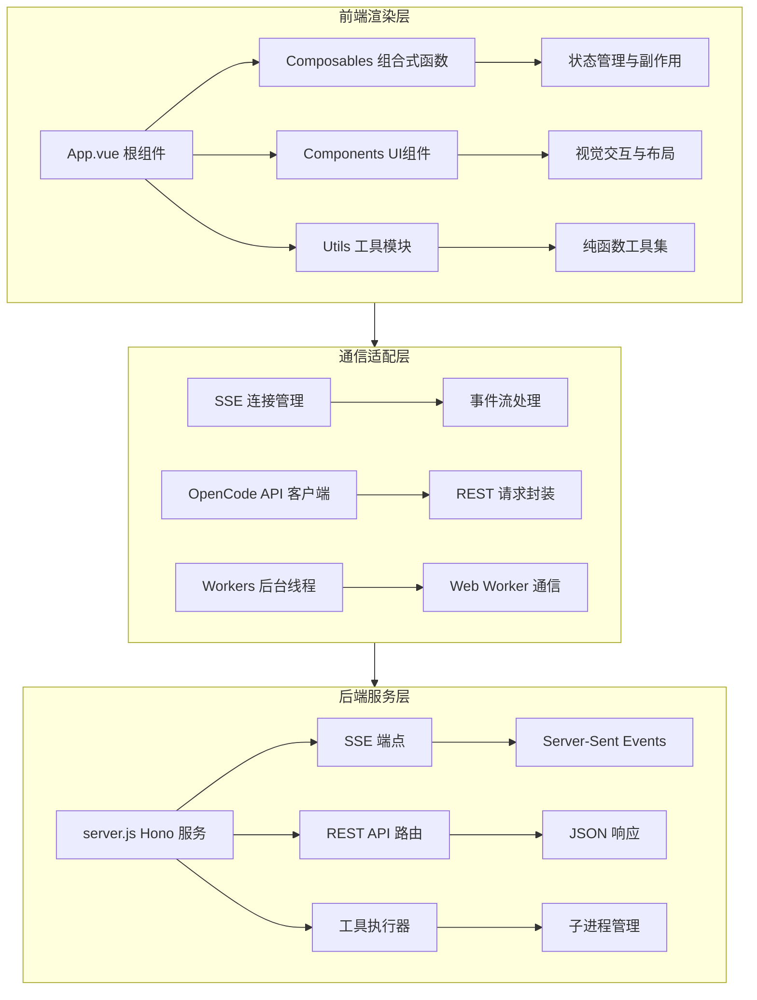

本页面提供 Vis 项目的整体架构概览，帮助开发者理解系统的核心设计理念、模块划分和数据流向。Vis 是一个基于 Web 的 OpenCode 可视化工具，采用前后端分离架构，前端使用 Vue 3 + TypeScript 构建交互界面，后端使用 Hono 框架提供 API 服务与实时通信能力。

## 架构概览

Vis 项目采用**模块化微前端架构**设计，核心由三层组成：前端渲染层、通信适配层和后端服务层。前端层负责用户交互与内容展示，通信层管理实时数据流（SSE）与 REST API 调用，后端层处理业务逻辑、状态管理与工具执行。

上图展示了系统核心分层：前端通过组合式函数（Composables）抽象复杂状态逻辑，UI 组件提供可复用的视觉元素；通信层封装 SSE 与 REST 接口差异，Workers 负责密集型渲染任务；后端使用轻量级 Hono 框架，通过统一的入口 `server.js` 提供 API 与事件流服务。三层之间通过明确定义的协议解耦，支持独立演进与测试。

## 项目结构

项目采用 monorepo 风格的组织方式，核心代码位于 `app/` 目录，文档位于 `docs/`，构建配置与脚本位于根目录。以下是关键目录的结构说明：

| 目录/文件 | 用途 | 关键技术 |
|---|---|---|
| `app/` | 前端源代码根目录 | Vue 3 + TypeScript + Vite |
| `app/components/` | Vue UI 组件库 | 组合式 API + 模板 |
| `app/composables/` | 状态与逻辑复用模块 | Composition Functions |
| `app/utils/` | 纯函数工具集 | 无副作用函数 |
| `app/workers/` | Web Worker 后台线程 | 并行渲染与 SSE 共享 |
| `docs/` | 技术文档（Markdown） | Diátaxis 结构 |
| `server.js` | 后端入口（Hono 服务） | 嵌入式 Node 服务器 |
| `vite.config.ts` | 构建与打包配置 | 代码分割与优化 |
| `package.json` | 依赖与脚本定义 | pnpm 工作区 |

`app/` 下的 `types/` 目录定义了全局 TypeScript 类型（如 `message.ts`、`sse.ts`、`worker-state.ts`），为前后端数据契约提供类型安全保证 [app/types/message.ts](app/types/message.ts) [app/types/sse.ts](app/types/sse.ts)。`app/locales/` 目录包含多语言资源文件（`en.ts`、`zh-CN.ts`），通过 `i18n/` 模块实现国际化 [app/i18n/index.ts](app/i18n/index.ts)。

## 核心入口与配置

项目的构建与开发由 Vite 驱动，配置位于 `vite.config.ts`。根目录设置为 `app/`，输出目录为 `dist/`，并通过 `manualChunks` 实现依赖代码分割：Vue 生态、终端库（@xterm）、工具库（marked、date-fns）分别打包以优化缓存 [vite.config.ts](vite.config.ts:1-55)。构建时注入 Git 提交短哈希 `__GIT_REVISION__` 用于版本标识。

`package.json` 定义了核心依赖与脚本，前端依赖包括 Vue 3、Vue I18n、Tailwind CSS、Markdown-it 和 Shiki（语法高亮）；后端依赖为 Hono 框架及其 Node 服务器适配器 [package.json](package.json:1-63)。开发脚本包括 `dev`（Vite 开发服务器）、`build`（生产构建）和 `test`（Vitest 单元测试）。

## 前端架构模式

前端架构的核心设计模式是**组合式优先**：复杂的 UI 状态与副作用被提取为可复用的组合式函数（Composables），放置在 `app/composables/` 目录。例如 `useMessages.ts` 管理消息会话的增删改查与流式更新，`useSettings.ts` 封装用户配置的读写与默认值合并 [app/composables/useSettings.ts](app/composables/useSettings.ts)。这种模式使得逻辑可独立测试（如 `useSettings.test.ts`）并在多个组件间共享，同时保持组件的声明式渲染职责。

UI 组件分为三类：基础组件（如 `Dropdown.vue`、`StatusBar.vue`）、功能面板（如 `InputPanel.vue`、`OutputPanel.vue`）与容器组件（如 `SidePanel.vue`、`TopPanel.vue`）。`App.vue` 作为根组件，负责整体布局（侧边栏、顶部栏、主内容区）与全局事件总线的初始化 [app/App.vue](app/App.vue)。

## 通信机制

系统采用双通道通信策略：**REST API** 用于请求-响应模式操作（如获取文件列表、读取内容、Git 状态查询），**SSE（Server-Sent Events）** 用于服务器向客户端的实时推送（如工具执行进度、消息流更新）。SSE 连接由 `app/utils/sseConnection.ts` 统一管理，封装重连、事件监听与错误处理逻辑 [app/utils/sseConnection.ts](app/utils/sseConnection.ts)。`app/workers/sse-shared-worker.ts` 实现共享 Worker，允许多个组件并发消费同一 SSE 流而不会重复建立连接。

后端在 `server.js` 中定义 SSE 端点（`/api/sse`）与 REST 路由（`/api/*`），使用 Hono 的轻量级路由与上下文模型处理请求。工具执行器通过子进程或内联函数运行，结果通过 SSE 事件分块推送，确保 UI 能够渐进式展示长时间运行任务的输出。

## 状态管理

全局状态采用**分散式响应式设计**，而非集中式 Store。每个领域（消息、会话、设置、权限、文件树）都有对应的组合式函数提供响应式状态与操作接口。例如 `useFileTree.ts` 管理项目文件树与展开状态，`usePermissions.ts` 控制用户操作权限（如编辑、执行） [app/composables/usePermissions.ts](app/composables/usePermissions.ts)。状态持久化通过 `app/utils/storageKeys.ts` 定义的键名与 `localStorage` 或 `sessionStorage` 实现，配合 `waitForState.ts` 提供异步状态依赖解析 [app/utils/waitForState.ts](app/utils/waitForState.ts)。

事件总线 `app/utils/eventEmitter.ts` 用于组件间解耦通信，发布-订阅模式支持命名事件与携带负载，广泛用于跨组件通知（如主题切换、窗口状态同步） [app/utils/eventEmitter.ts](app/utils/eventEmitter.ts)。

## 渲染管线

内容渲染采用**分层渲染策略**：文本内容（Markdown、代码块）由 `markdown-it` 与 `shiki` 处理生成 HTML，复杂交互组件（如线程视图、代码查看器）由专门的渲染器（`app/utils/workerRenderer.ts`）与查看器（`app/components/viewers/`）负责 [app/utils/workerRenderer.ts](app/utils/workerRenderer.ts)。`app/workers/render-worker.ts` 在后台线程执行语法高亮与格式化，避免阻塞主线程交互。

`app/utils/toolRenderers.ts` 定义了工具输出（如 `read`、`grep`、`bash` 结果）的渲染逻辑，将结构化数据转换为用户可读的表格、代码块或日志视图 [app/utils/toolRenderers.ts](app/utils/toolRenderers.ts)。主题与颜色方案通过 `app/utils/theme.ts` 与 `app/utils/regionTheme.ts` 动态计算，支持深浅色模式切换与区域高亮 [app/utils/theme.ts](app/utils/theme.ts)。

## 下一步阅读建议

要深入理解系统的具体子模块，建议按以下顺序查阅文档：
- **[浮动窗口管理系统](6-fu-dong-chuang-kou-guan-li-xi-tong)** 详解多窗口布局与状态同步机制
- **[SSE 实时通信机制](9-sse-shi-shi-tong-xin-ji-zhi)** 了解服务器推送的事件流设计
- **[组合式 API (Composables) 详解](13-zu-he-shi-api-composables-xiang-jie)** 掌握状态逻辑复用的核心模式
- **[工具窗口组件系统](15-gong-ju-chuang-kou-zu-jian-xi-tong)** 学习可插拔工具 UI 的架构设计