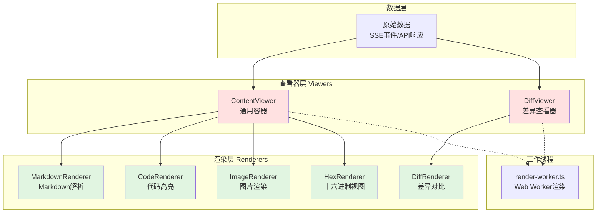
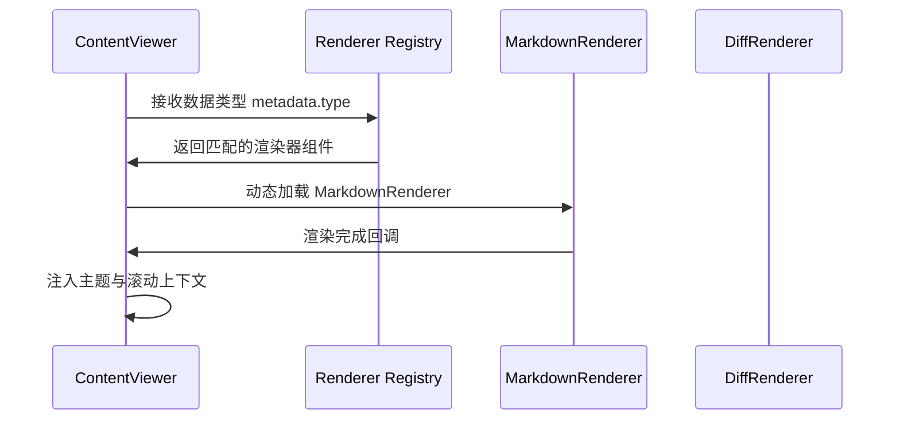

本文档详细解析系统中渲染器（Renderers）与查看器（Viewers）的分层架构设计。该架构遵循**单一职责原则**与**关注点分离**，将内容渲染逻辑与内容展示逻辑解耦，形成可插拔、可扩展的视图组件体系。

## 架构概览

系统采用**双层渲染架构**：渲染器负责将原始数据转换为富媒体内容（代码高亮、Markdown解析、图片展示等），查看器负责提供通用的内容容器与交互框架（滚动、搜索、主题适配等）。两者通过**组合模式**协作，查看器动态加载合适的渲染器来处理特定数据类型。



## 渲染器组件体系

渲染器位于 `app/components/renderers/` 目录，每个渲染器封装特定内容类型的呈现逻辑，通过 Vue 的组合式 API 实现高度可复用的渲染单元。

### 核心渲染器列表

| 渲染器 | 职责 | 关键技术 | 适用场景 |
|--------|------|----------|----------|
| [MarkdownRenderer.vue](app/components/renderers/MarkdownRenderer.vue) | Markdown 语法解析与渲染 | marked.js / highlight.js | 文档、说明文本、富文本内容 |
| [CodeRenderer.vue](app/components/renderers/CodeRenderer.vue) | 代码语法高亮与行号显示 | Prism.js / Shiki | 源代码展示、代码块 |
| [ImageRenderer.vue](app/components/renderers/ImageRenderer.vue) | 图片加载与缩放控制 | Canvas / URL.createObjectURL | 截图、图表、二进制图像 |
| [HexRenderer.vue](app/components/renderers/HexRenderer.vue) | 十六进制字节视图 | 自定义表格渲染 | 二进制文件分析、内存dump |
| [DiffRenderer.vue](app/components/renderers/DiffRenderer.vue) | 文本差异对比视图 | diff-match-patch | 代码变更、文件对比 |

### 渲染器设计模式

所有渲染器遵循**统一接口约定**：

```typescript
interface Renderer {
  // 接收原始数据并转换为渲染上下文
  parse(data: any): RenderContext
  
  // 响应式更新机制
  watch(update: (ctx: RenderContext) => void): void
  
  // 清理资源（如 Web Worker）
  dispose(): void
}
```

实际实现中，渲染器通过 Vue 的 `defineComponent` 声明，利用 `props` 接收输入数据，通过 `emits` 输出交互事件，形成**声明式渲染管道**。

例如，`MarkdownRenderer.vue` 的核心结构：

```vue
<script setup lang="ts">
import { computed } from 'vue'
import { useMarkdown } from '@/composables/useMarkdown'

const props = defineProps<{
  content: string
  inline?: boolean
}>()

const { html, ast } = useMarkdown(props.content)
</script>

<template>
  <div class="markdown-body" v-html="html" />
</template>
```

这种设计使渲染器可独立测试、复用，并支持**懒加载**以优化初始包体积。

## 查看器组件体系

查看器位于 `app/components/viewers/` 目录，提供内容的**展示容器**与**交互框架**，负责滚动、搜索、主题适配、响应式布局等通用功能。

### 核心查看器

**ContentViewer.vue** 是通用内容容器，具备以下核心能力：

- **智能渲染器选择**：根据数据类型自动匹配最合适的渲染器
- **虚拟滚动支持**：处理大规模内容的高性能渲染
- **全局搜索集成**：与 `useContentSearch` 组合式 API 协同工作
- **主题同步**：自动适配亮/暗主题与区域主题（通过 `useRegionTheme`）

**DiffViewer.vue** 专为差异对比场景设计，提供：

- 并排对比与内联对比两种视图模式
- 语法高亮支持
- 变更块折叠/展开

查看器与渲染器的**协作流程**：



## 渲染管线与 Web Worker

为保持主线程响应性，密集型渲染任务（如大型 Markdown 解析、图片处理）被卸载到 **Web Worker** 中执行。相关实现位于 `app/workers/render-worker.ts`。

### Worker 通信协议

渲染Worker 通过 **消息传递** 接收任务，处理完成后返回序列化结果：

```typescript
// render-worker.ts 核心接口
interface RenderMessage {
  type: 'render'
  payload: {
    format: 'markdown' | 'code' | 'diff'
    data: string
    options?: RenderOptions
  }
}

self.onmessage = (event: MessageEvent<RenderMessage>) => {
  const { format, data, options } = event.data.payload
  
  let result: RenderResult
  switch (format) {
    case 'markdown':
      result = parseMarkdown(data, options)
      break
    case 'code':
      result = highlightCode(data, options)
      break
  }
  
  self.postMessage({ type: 'result', id: event.data.id, result })
}
```

主线程通过 `useCodeRender` 组合式 API 管理Worker生命周期，实现**异步渲染队列**与**结果缓存**。

## 渲染器注册与发现机制

系统采用**策略模式**实现渲染器的动态注册与发现。`utils/toolRenderers.ts` 维护渲染器映射表：

```typescript
export const RENDERERS: Record<string, Component> = {
  markdown: MarkdownRenderer,
  code: CodeRenderer,
  image: ImageRenderer,
  hex: HexRenderer,
  diff: DiffRenderer,
}
```

查看器通过 `resolveRenderer(type)` 函数查找合适的渲染器，该机制支持**插件式扩展**——新的渲染器只需注册到映射表即可被系统识别。

## 性能优化策略

渲染器架构内置多项性能优化：

1. **组件懒加载**：通过 Vue 的 `defineAsyncComponent` 实现按需加载
2. **渲染结果缓存**：相同输入复用已渲染的 DOM 或 Worker 结果
3. **虚拟滚动**：`ContentViewer` 集成 `vue-virtual-scroller` 处理超长内容
4. **防抖更新**：频繁数据流（如实时日志）通过 `useDeltaAccumulator` 合并渲染请求

## 与相关系统的集成

渲染器与查看器架构与以下系统紧密协作：

- **[浮动窗口管理系统](6-fu-dong-chuang-kou-guan-li-xi-tong)**：渲染器作为浮动窗口的内容提供者
- **[SSE 实时通信机制](9-sse-shi-shi-tong-xin-ji-zhi)**：流式数据通过渲染器实时呈现
- **[内容渲染管线](8-nei-rong-xuan-ran-guan-xian)**：完整的渲染流程涵盖从数据到视图的转换
- **[工具窗口通信协议](11-gong-ju-chuang-kou-tong-xin-xie-yi)**：渲染器响应工具窗口的生命周期事件

## 总结

渲染器与查看器架构体现了**分层设计**与**策略模式**的典型应用。通过将渲染逻辑（如何展示）与容器逻辑（在哪里展示）分离，系统获得了高度的可维护性与扩展性。开发者在新增内容类型时，只需实现对应的渲染器组件并注册到系统，即可无缝集成到现有查看器中，无需修改查看器核心代码。