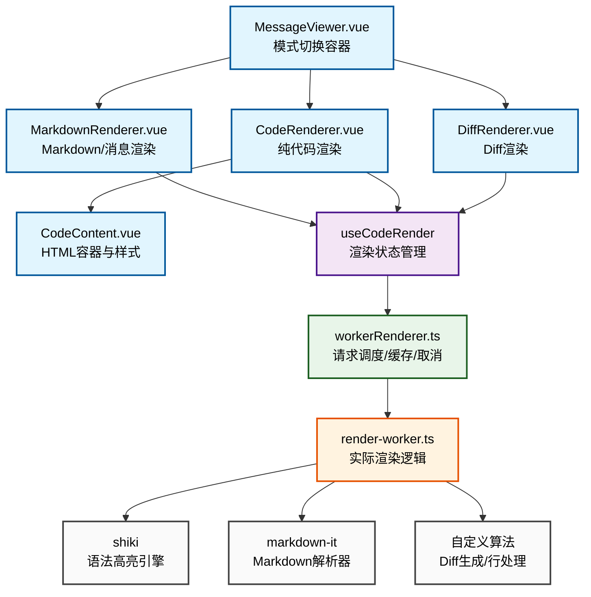
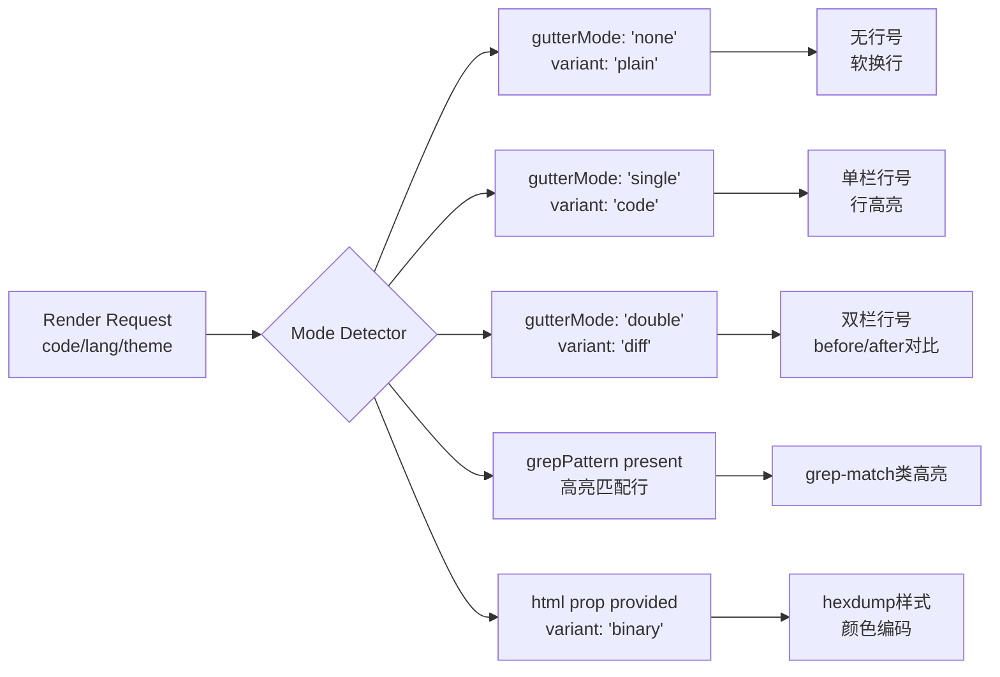

本页面系统性地阐述 Vis 应用中的内容渲染管线架构。该管线是一个基于 Web Worker 的异步渲染系统，负责将源代码、Markdown、Diff 等文本内容转换为带有语法高亮的 HTML 界面。管线设计核心目标包括：**非阻塞渲染**（通过 Worker 隔离）、**多模式支持**（代码/Diff/Markdown/二进制）、**智能缓存**（LRU策略），以及**可访问性**（复制按钮、行号高亮等）。

## 一、渲染管线架构概览

内容渲染管线采用分层架构，从组件层到渲染核心层逐层下沉，实现关注点分离。下图展示其核心数据流与模块交互：



**架构设计原则**：

| 层级 | 职责 | 关键特性 |
|------|------|----------|
| **组件层** | 接收props、决定渲染模式、绑定事件 | 条件渲染、模式切换、插槽集成 |
| **Composables层** | 响应式参数追踪、触发渲染请求 | watch深度监听、生命周期管理 |
| **Worker管理层** | 请求去重、LRU缓存、并发控制 | 256字符缓存键、200项LRU、请求取消令牌 |
| **Worker执行层** | 实际HTML生成、语言解析 | 异步高亮器加载、Markdown-it插件化 |
| **渲染引擎** | 语法高亮、文本转换 | Shiki主题化、markdown-it扩展 |

**相关组件位置**：
- 组件入口：[app/components/MessageViewer.vue](app/components/MessageViewer.vue#L1-L172)
- 核心渲染器：[app/components/renderers/CodeRenderer.vue](app/components/renderers/CodeRenderer.vue#L1-L149), [app/components/renderers/MarkdownRenderer.vue](app/components/renderers/MarkdownRenderer.vue#L1-L562)
- 内容容器：[app/components/CodeContent.vue](app/components/CodeContent.vue#L1-L201)
- Diff渲染：[app/components/renderers/DiffRenderer.vue](app/components/renderers/DiffRenderer.vue#L1-L167)

## 二、渲染模式与变体系统

管线支持多种内容变体，每种变体对应不同的视觉呈现与功能特性：



**变体类型定义**（[CodeContent.vue:10](app/components/CodeContent.vue#L10-L11)）：

| Variant | gutterMode | 样式特性 | 适用场景 |
|---------|------------|----------|----------|
| `code` | `'single'` | 行号列、line-highlight支持 | 标准代码查看 |
| `diff` | `'double'` | 双栏行号（旧/新）、颜色区分（增/删） | 差异对比 |
| `message` | `'none'` | 无行号、软换行、复制按钮 | 消息内容渲染 |
| `binary` | - | 十六进制视图、多色编码 | 二进制文件 |
| `term` | `'none'` | 等宽字体、预格式化 | 终端输出 |
| `plain` | `'none'` | 最小样式 | 纯文本 |

**样式映射逻辑**（[CodeContent.vue:13-24](app/components/CodeContent.vue#L13-L24)）：

```typescript
const rootClass = computed(() => {
  const v = props.variant ?? 'code';
  return {
    'is-diff': v === 'diff',
    'is-message': v === 'message',
    'is-binary': v === 'binary',
    'is-term': v === 'term',
    'is-plain': v === 'plain',
    'no-gutter': v === 'message' || v === 'binary' || v === 'term' || v === 'plain',
    'wrap-soft': v === 'message' || v === 'term',
  };
});
```

**Diff 颜色编码**（[CodeContent.vue:130-164](app/components/CodeContent.vue#L130-L164)）：
- 新增行：`line-added` → 绿色背景 (`rgba(46, 160, 67, 0.22)`) + 左侧绿条
- 删除行：`line-removed` → 红色背景 (`rgba(248, 81, 73, 0.2)`) + 左侧红条
- Hunks 头：`line-hunk` → 蓝色背景 + 左侧蓝条
- 元数据行：`line-header` → 灰色背景 + 左侧灰条

## 三、渲染请求生命周期

每个渲染请求从发起至完成经历完整的生命周期管理，包含**请求标识、缓存检查、Worker投递、响应处理、错误恢复**等阶段。

### 3.1 请求发起与参数规范化

渲染参数类型定义于 [useCodeRender.ts:8-19](app/utils/useCodeRender.ts#L8-L19)：

```typescript
export type CodeRenderParams = {
  code: string;              // 源代码
  lang: string;              // 语言标识
  theme: string;             // Shiki主题
  patch?: string;            // unified diff补丁
  after?: string;            // "after"版本代码（用于生成diff）
  gutterMode?: 'none' | 'single' | 'double'; // 行号模式
  gutterLines?: string[];    // 自定义行号
  grepPattern?: string;      // 高亮匹配正则
  lineOffset?: number;       // 分页偏移
  lineLimit?: number;        // 分页限制
};
```

**参数规范化**（[workerRenderer.ts:60-78](app/utils/workerRenderer.ts#L60-L78)）：生成缓存键时，各字段按固定顺序使用 `\u0000` 分隔符拼接，确保不同参数组合生成唯一键：

```typescript
function getCacheKey(payload: RenderRequest) {
  return [
    payload.code,
    payload.patch ?? '',
    payload.after ?? '',
    payload.lang,
    payload.theme,
    payload.gutterMode ?? '',
    normalizeLines(payload.gutterLines),
    payload.grepPattern ?? '',
    String(payload.lineOffset ?? ''),
    String(payload.lineLimit ?? ''),
    normalizeFiles(payload.files),
    // ... 本地化字符串
  ].join('\u0000');
}
```

### 3.2 请求调度与缓存策略

**双级缓存架构**（[workerRenderer.ts:48-88](app/utils/workerRenderer.ts#L48-L88)）：

1. **内存缓存**（`completedCache`）：保存最近 200 个渲染结果，采用 FIFO 淘汰策略
2. **Worker 内缓存**（`codeHtmlCache` / `mdHighlightCache`）：各缓存上限 512 项，独立管理

```typescript
const completedCache = new Map<string, string>();
const CACHE_LIMIT = 200;

function cacheRenderedHtml(key: string, html: string) {
  if (completedCache.has(key)) {
    completedCache.delete(key); // 移动到最新
  }
  completedCache.set(key, html);
  if (completedCache.size <= CACHE_LIMIT) return;
  const oldestKey = completedCache.keys().next().value;
  if (oldestKey) completedCache.delete(oldestKey); // 淘汰最旧
}
```

**Worker 单例模式**（[workerRenderer.ts:90-107](app/utils/workerRenderer.ts#L90-L107)）：整个应用共享单一 Render Worker，避免重复初始化开销。

### 3.3 Worker 请求处理流程

Worker 接收请求后，根据请求类型路由至不同渲染函数（[render-worker.ts:987-1028](app/workers/render-worker.ts#L987-L1028)）：

```typescript
function renderRequest(request: RenderRequest): Promise<string> {
  // 1. Diff 模式：有 patch 参数
  if (request.patch) {
    return buildDiffHtmlFromCode(...);
  }

  // 2. Before/After 模式：有 after 参数（无 patch）
  if (request.after !== undefined) {
    const patch = generateUnifiedDiff(request.code, request.after);
    if (patch) return buildDiffHtmlFromCode(...);
  }

  // 3. Grep 模式：有高亮模式
  if (request.grepPattern !== undefined) {
    return Promise.resolve(buildHtmlFromRows(renderGrepRows(...)));
  }

  // 4. Markdown 模式：语言为 markdown 且 gutterMode 为 none
  const resolvedLang = languageCandidates(request.lang)[0] ?? 'text';
  if ((resolvedLang === 'markdown' || resolvedLang === 'md') && request.gutterMode === 'none') {
    return renderMarkdownHtml(request);
  }

  // 5. 默认：纯代码渲染
  return renderCodeHtml(request);
}
```

**请求取消机制**（[workerRenderer.ts:129-171](app/utils/workerRenderer.ts#L129-L171)）：每个 `startRenderWorkerHtml` 返回 `RenderTask`，包含 `promise` 和 `cancel` 方法。组件卸载或参数变更时调用 `cancel()`，通过 `RenderCancelledError` 静默终止旧请求，避免竞态条件。

## 四、核心渲染算法

### 4.1 代码高亮渲染

**Shiki 集成**（[render-worker.ts:86-96](app/workers/render-worker.ts#L86-L96)）：高亮器按主题缓存，主题变更时重建。语言按需加载，失败则回退到 `text`：

```typescript
function getHighlighter(theme: string) {
  if (!highlighterPromise || cachedTheme !== theme) {
    cachedTheme = theme;
    highlighterPromise = createHighlighter({ themes: [theme], langs: ['text'] });
    loadedLanguageCache = new Set(['text']);
    failedLanguageCache = new Set();
    codeHtmlCache = new Map();
    mdHighlightCache = new Map();
  }
  return highlighterPromise;
}
```

**语言解析策略**（[render-worker.ts:98-120](app/workers/render-worker.ts#L98-L120)）：通过 `languageCandidates` 生成候选列表，按优先级尝试加载。特殊别名映射（如 `shellscript` → `bash`/`sh`）确保语言兼容性。

**安全渲染**（[render-worker.ts:151-169](app/workers/render-worker.ts#L151-L169)）：`safeCodeToHtml` 捕获高亮异常并降级到纯文本，防止单个语言错误阻塞整个渲染。

### 4.2 差异对比渲染

**Unified Diff 生成**（[render-worker.ts:210-362](app/workers/render-worker.ts#L210-L362)）：当同时提供 `code` 与 `after` 时，使用 Myers 差分算法（O(ND) 时间，线性空间）生成 unified diff 格式。

```typescript
function generateUnifiedDiff(before: string, after: string, contextLines = 3): string {
  // Myers diff 核心：追踪对角线路径
  const v = new Int32Array(vSize);
  const trace: Array<Int32Array> = [];
  outer: for (let d = 0; d <= max; d++) {
    // 更新 V 数组并记录轨迹
  }
  // 回溯生成编辑脚本
  // 分组为 hunks（上下文合并）
}
```

**Diff HTML 构建**（[render-worker.ts:660-754](app/workers/render-worker.ts#L660-L754)）：`buildDiffHtmlFromCode` 同时渲染 before/after 两段代码的 Shiki HTML，提取行级 span，再与 diff 行合并生成双栏或单栏视图。

**双栏 Gutter 计算**（[render-worker.ts:427-487](app/workers/render-worker.ts#L427-L487)）：`buildDiffGutterLines` 解析 diff 元数据，生成旧行号与新行号两个数组，用于双栏显示。

### 4.3 Markdown 渲染

**Markdown-it 配置**（[render-worker.ts:874-958](app/workers/render-worker.ts#L874-L958)）：集成 Shiki 高亮器作为 `highlight` 函数，启用 `transformerNotationDiff` 以支持代码块内的 diff 语法。自定义插件包括：

- **任务列表表情**（`taskListEmojiPlugin`）：`[ ]` → ☐，`[x]` → ✅
- **文件引用解析**（`code_inline` 规则）：识别文件路径与行号，添加 `data-file-ref` 属性
- **提交引用解析**：7-40 位十六进制字符串识别为 commit ref
- **颜色预览**：内联颜色值自动注入 CSS 变量 `--preview-color`

**代码块复制按钮**（[render-worker.ts:975-985](app/workers/render-worker.ts#L975-L985)）：Markdown 渲染后通过正则替换，在每个 `<pre class="shiki">` 外包裹复制按钮容器，按钮文本使用本地化字符串。

### 4.4 Grep 高亮渲染

**正则匹配**（[render-worker.ts:512-548](app/workers/render-worker.ts#L512-L548)）：`highlightGrepMatches` 逐行扫描，将匹配内容包裹 `<span class="grep-match"><strong>...</strong></span>`，支持多匹配与全局标志。

## 五、组件集成与响应式绑定

### 5.1 MessageViewer：多模式容器

[MessageViewer.vue](app/components/MessageViewer.vue#L1-L172) 作为统一入口，根据 `lang` 与 `mode` 属性决定渲染策略：

```typescript
const availableModes = computed(() => {
  if (props.html != null) return [{ id: 'markdown', label: t('messageViewer.rendered') }];
  if (props.mode === 'markdown') return [{ id: 'markdown', label: t('messageViewer.rendered') }];
  if (props.mode === 'code') return [{ id: 'code', label: t('messageViewer.source') }];
  if (props.lang === 'markdown') {
    if (props.allowModeToggle) {
      return [
        { id: 'markdown', label: t('messageViewer.rendered') },
        { id: 'code', label: t('messageViewer.source') },
      ];
    }
    return [{ id: 'markdown', label: t('messageViewer.rendered') }];
  }
  return [{ id: 'code', label: t('messageViewer.source') }];
});
```

**条件挂载策略**（[MessageViewer.vue:116-121](app/components/MessageViewer.vue#L116-L121)）：`shouldMountMarkdownRenderer` 与 `shouldMountCodeRenderer` 控制组件实际挂载。当 `keepBothRenderersMounted` 为真（多标签模式）时两者同时挂载；否则按需挂载以节省内存。

### 5.2 CodeRenderer：代码视图

[CodeRenderer.vue](app/components/renderers/CodeRenderer.vue#L1-L149) 将 `fileContent` 传递给 `useCodeRender`，并处理行高亮选择：

```typescript
function parseLineSpecs(raw?: string): Array<{ start: number; end: number }> {
  if (!raw) return [];
  const specs: Array<{ start: number; end: number }> = [];
  for (const part of raw.split(',')) {
    const m = part.match(/^(\d+)(?:-(\d+))?$/);
    if (!m) continue;
    const s = Number(m[1]);
    const e = m[2] != null ? Number(m[2]) : s;
    if (s >= 1 && e >= s) specs.push({ start: s, end: e });
  }
  return specs;
}
```

### 5.3 DiffRenderer：差异视图

[DiffRenderer.vue](app/components/renderers/DiffRenderer.vue#L1-L167) 支持多文件 diff 标签页，每个标签维护独立的 before/after 内容。语言猜测通过 `guessLanguageFromPath` 基于文件扩展名自动推断。

## 六、性能优化与缓存机制

### 6.1 缓存键设计

缓存键综合考虑以下维度，确保相同渲染请求命中缓存：
- 源代码内容（code）
- 补丁内容（patch）
- 目标代码（after）
- 语言与主题
- 行号模式与自定义行号
- Grep 模式与匹配模式
- 文件列表（用于 Markdown 文件引用）

### 6.2 多级缓存淘汰

| 缓存层级 | 数据结构 | 容量 | 淘汰策略 |
|----------|----------|------|----------|
| 主缓存（workerRenderer） | Map<string, string> | 200 项 | FIFO |
| 代码高亮缓存（render-worker） | Map<string, string> | 512 项 | LRU（半量清理） |
| Markdown 高亮缓存（render-worker） | Map<string, string> | 512 项 | LRU（半量清理） |

**LRU 清理实现**（[render-worker.ts:77-84](app/workers/render-worker.ts#L77-L84)）：

```typescript
function pruneHighlightCache(cache: Map<string, string>) {
  if (cache.size <= HIGHLIGHT_CACHE_MAX) return;
  const target = Math.floor(HIGHLIGHT_CACHE_MAX / 2);
  for (const key of cache.keys()) {
    if (cache.size <= target) break;
    cache.delete(key); // 从头开始删除，实现近似 LRU
  }
}
```

### 6.3 请求去重与竞态处理

**请求 ID 跟踪**：每个渲染请求携带唯一 ID（时间戳 + 随机字符串），响应时验证当前请求 ID 是否匹配，丢弃过期响应。

**取消令牌模式**（[useCodeRender.ts:26-91](app/utils/useCodeRender.ts#L26-L91)）：

```typescript
let requestId = 0;
let cancelActiveRender: (() => void) | null = null;

watch(params, (p) => {
  requestId += 1;
  const current = requestId;
  cancelActiveRender?.(); // 取消前一个请求
  // ... 启动新任务
  task.promise
    .then((result) => {
      if (current !== requestId) return; // 忽略过期响应
      html.value = result;
    });
});
```

## 七、可访问性与用户体验

**复制按钮设计**（[MarkdownRenderer.vue:63-86](app/components/renderers/MarkdownRenderer.vue#L63-L86)）：

- 代码块复制：复制 `<pre>` 内的纯文本
- Markdown 源复制：从 `<template.md-raw-source>` 提取原始 Markdown
- 点击反馈：按钮添加 `copied` 类，1500ms 后自动清除
- 国际化：按钮标签与 ARIA 标签全部本地化

**行号与高亮**：
- 行号列：使用 `tabular-nums` 等宽数字，避免抖动
- 行选择：`parseLineSpecs` 支持 `1,3-5,7` 格式范围
- 自动滚动：首行高亮时自动滚动至视图中心

## 八、扩展点与配置

**主题支持**：通过 `theme` 参数传递 Shiki 主题名称（如 `'github-dark'`、`'vitesse-dark'`），主题变更时重建高亮器实例。

**语言扩展**：支持动态加载 Shiki  bundled 语言，可通过 `bundledLanguages` 与 `allBundledLanguages` 映射表注册自定义语言。

**Gutter 模式**：
- `'none'`：无行号列，适用于消息或终端输出
- `'single'`：单栏行号（标准代码视图）
- `'double'`：双栏行号（Diff 视图显示旧/新行号）

**Grep 集成**：通过 `grepPattern` 启用行内正则高亮，配合 `gutterLines` 显示自定义行号（如 grep 结果的文件路径）。

---

**后续阅读路径**：
- 了解 Markdown 渲染详细流程，参见 [MarkdownRenderer.vue](app/components/renderers/MarkdownRenderer.vue) 与 [render-worker.ts 的 Markdown 章节](app/workers/render-worker.ts#L786-985)
- 深入 Diff 算法实现，参见 [generateUnifiedDiff](app/workers/render-worker.ts#L210-L362) 与 [buildDiffHtmlFromCode](app/workers/render-worker.ts#L660-L754)
- 理解缓存策略配置，参见 [workerRenderer.ts 缓存管理](app/utils/workerRenderer.ts#L48-L88)
- 查看完整渲染器接口，参见 [useCodeRender 类型定义](app/utils/useCodeRender.ts#L8-L24)