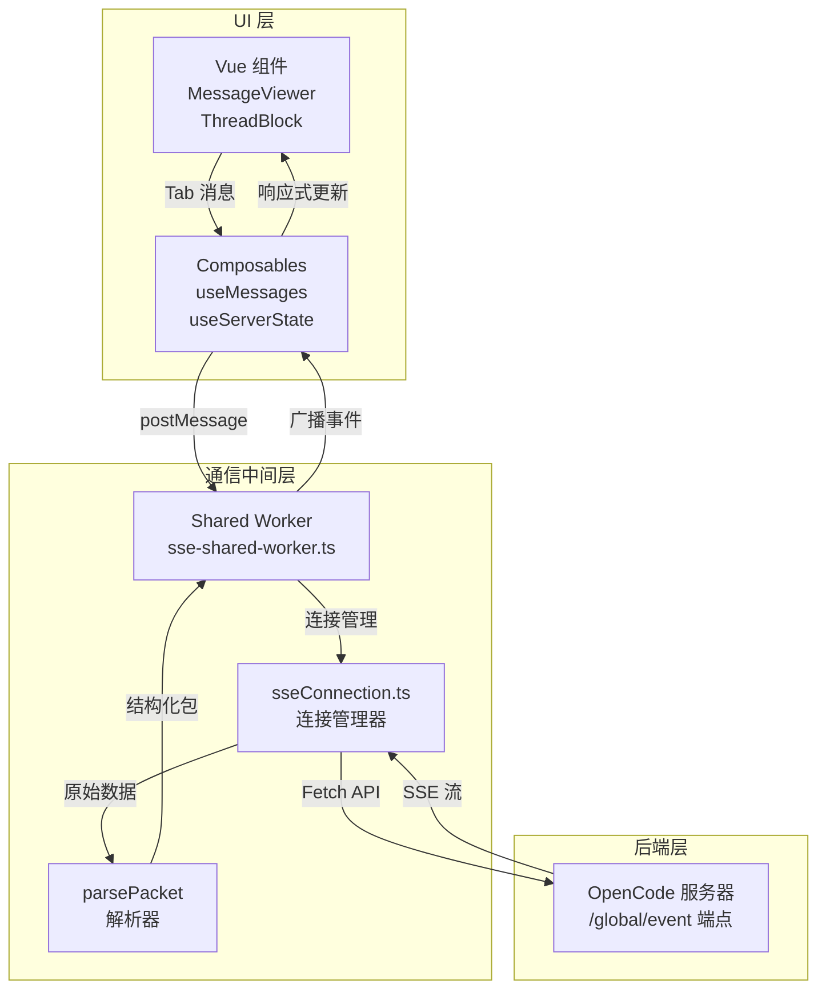

SSE（Server-Sent Events）实时通信机制是 OpenCode 应用与后端服务器保持双向事件同步的核心基础设施。该机制通过长连接方式实现服务器向客户端的实时事件推送，支持会话更新、权限请求、工具执行状态等多种事件类型的即时传递。本页将系统性地阐述 SSE 通信的架构设计、连接生命周期、事件处理流程以及错误恢复策略。

## 架构概览

SSE 通信架构采用分层设计，由三个核心层构成：**连接管理层**负责建立和维护 HTTP长连接，处理重连逻辑；**消息解析层**负责将原始 SSE 数据流解析为结构化的事件包；**状态同步层**负责将事件应用到本地状态并广播给所有连接的 UI 组件。这种分层设计确保了关注点分离，使系统具备良好的可维护性和可扩展性。



上图展示了完整的数据流向：UI 组件通过 Composables 与 Shared Worker 通信，Worker 内部使用 `sseConnection` 模块管理与服务器的长连接，接收到的 SSE 数据经过解析后转换为类型安全的事件包，最终广播到所有关注的客户端端口。这种设计实现了**连接共享**——多个标签页或组件可以共享同一个 SSE 连接，显著降低了服务器资源消耗。

## 连接生命周期管理

SSE 连接的生命周期由 `createSseConnection` 工厂函数创建的对象控制，该对象暴露 `connect`、`disconnect` 和 `isConnected` 三个核心方法。连接过程遵循严格的初始化序列：首先规范化基础 URL（去除尾部斜杠），然后根据 `baseUrl` 和 `authorization` 生成唯一连接键，用于判断是否需要重建连接。

连接建立采用 `fetch` API 配合 `ReadableStream` 读取响应体，请求头必须包含 `Accept: text/event-stream` 以告知服务器返回 SSE 格式数据。若提供认证令牌，则通过 `Authorization` 头传递。服务器端点 `/global/event` 返回聚合事件流，包含所有项目实例的事件，这是应用默认使用的端点 [app/utils/sseConnection.ts:152-160]。

```typescript
const response = await fetch(`${effectiveBaseUrl}/global/event`, {
  signal: abortController!.signal,
  headers,
});
```

流读取采用异步循环模式：`TextDecoder` 将字节流解码为字符串，缓冲区按 `\n\n` 分割为 SSE 块，每个块必须带有 `data: ` 前缀才能被识别为有效事件 [app/utils/sseConnection.ts:103-112]。这种块处理策略确保即使事件在传输过程中被拆分到多个网络包中，也能在客户端正确重组。

## 事件包解析规范

SSE 数据帧遵循严格的 JSON 结构。全局事件流（`/global/event`）的每个 `data:` 行包含一个带有 `directory` 和 `payload` 包装层的对象，其中 `payload.type` 表示事件类型，`payload.properties` 包含事件特定字段 [docs/SSE.md:9-13]。这种设计使客户端能够根据 `directory` 字段对事件进行作用域路由——通常 `directory` 对应项目目录路径，但对于工作区同步事件，它可能以 `wrk` 开头的 workspace ID。

解析函数 `parsePacket` 实施防御性验证：检查 JSON 可解析性、确保 `payload` 对象存在且 `type` 为字符串、验证 `properties` 为对象。任何验证失败都会导致包被丢弃并记录警告，这防止了 malformed 数据污染应用状态 [app/utils/sseConnection.ts:33-49]。类型定义位于 `app/types/sse.ts`，其中 `SsePacket` 是顶层类型，`ToolState` 联合类型描述工具执行状态的全生命周期（pending → running → completed/error）[app/types/sse.ts:1-58]。

## Shared Worker 多标签页协调

应用采用 **Shared Worker** 而非 Dedicated Worker，这是多标签页架构的关键设计。Shared Worker 的生命周期独立于任何特定标签页，多个标签页可以通过 `port` 消息系统连接到同一个 Worker 实例，实现连接和状态的跨标签页共享 [app/workers/sse-shared-worker.ts:1-15]。

Worker 内部维护 `connections` Map，以 `baseUrl\0authorization` 为键存储连接状态。每个 `ConnectionState` 包含：`ports` Set 记录所有连接的客户端端口，`stateBuilder` 负责累积状态变更，`notificationManager` 处理权限和问答通知，以及 `bufferedStatePackets` 用于在状态初始化阶段缓存事件 [app/workers/sse-shared-worker.ts:35-54]。这种设计使 Worker 能够在 bootstrap 阶段（状态重建期间）缓冲事件，避免状态不一致。

## 自动重连与指数退避

连接失败时，系统实施自动重连机制。重连逻辑包含以下关键参数：`reconnectAttempt` 计数器记录尝试次数，`disconnectRequested` 标志区分主动断开与意外断开，`reconnectTimer` 实现延迟重连以避免服务器压垮 [app/utils/sseConnection.ts:62-91]。当前实现使用固定 1000ms 延迟，但架构上已预留扩展空间——`scheduleReconnect` 函数可轻松替换为指数退避算法。

重连触发条件包括：流意外关闭、HTTP 错误（非 401）、网络异常。对于 401 未授权错误，系统不重连而是直接触发 `onError` 回调，通知用户认证失败 [app/utils/sseConnection.ts:171-176]。若连接参数（`baseUrl` 或 `authorization`）发生变化，系统会先清空现有连接（调用 `abortController.abort()`）再建立新连接，确保连接键一致性 [app/utils/sseConnection.ts:136-142]。

## 状态初始化与 Bootstrap

Shared Worker 的状态初始化采用**延迟加载**策略。当第一个标签页连接时，Worker 触发 OpenCode 初始化序列：设置基础 URL 和授权令牌，然后通过 `listProjects`、`listSessions`、`getVcsInfo` 等函数获取完整状态快照。此过程可能耗时，因此 Worker 在 bootstrap 期间缓冲所有到达的 SSE 包，待状态就绪后按顺序重放这些包，确保状态一致性 [app/workers/sse-shared-worker.ts:662-696]。

`sessionHydrationLevelByDirectory` Map 跟踪每个目录的hydration级别（`preview` 或 `full`），支持渐进式状态加载。当用户导航到新目录时，系统可先加载预览数据（轻量级会话列表），再在后台加载完整信息，这优化了 perceived 性能 [app/workers/sse-shared-worker.ts:48-49]。

## 事件路由与通知系统

事件路由基于 `directory` 字段实现多路复用。全局事件流包含所有项目的事件，Worker 根据 `packet.directory` 判断事件归属：若匹配当前激活选择（`activeSelection`），则立即处理并可能显示通知；否则事件被累积到状态构建器供后续查询 [app/workers/sse-shared-worker.ts:570-596]。

通知系统区分三种类型：`permission`（权限请求）、`question`（问答交互）、`idle`（空闲状态）。当收到 `notification.show` 事件时，Worker 向相关标签页发送通知，UI 层据此弹出模态对话框或状态栏提示 [app/types/sse-worker.ts:54-61]。权限请求（`permission.asked`）和问答（`question.asked`）都需要用户交互响应，系统通过 `port` 消息将用户决策回传至 Worker，再转发给服务器 [docs/SSE.md:89-102]。

## 类型安全与验证

整个 SSE 栈采用 TypeScript 严格模式，类型定义源自 OpenCode 服务端的 Zod 模式，确保客户端与服务端数据契约一致。Worker 内部实现多个运行时验证函数（如 `isPermissionRule`、`isFileDiff`、`isSessionInfo`），在将原始属性转换为类型化对象前执行结构检查，防御服务端模式变更导致的类型漂移 [app/workers/sse-shared-worker.ts:76-166]。

这种**双重保障**策略——编译时类型检查 + 运行时验证——使系统在服务端演进过程中保持健壮性。当新增事件类型时，现有客户端可安全忽略未知事件，而不会崩溃。

## 配置与自定义

SSE 连接配置通过 `SseConnectionOptions` 对象传递，支持以下字段：
- `baseUrl`（必需）：服务器基础 URL
- `authorization`（可选）：认证令牌，用于 Bearer 认证
- `errorMessages`（可选）：自定义错误消息映射，支持 `emptyBaseUrl`、`authenticationFailed`、`streamClosed` 和 `httpError` 函数

错误消息的可配置性使应用能够本地化用户可见的错误文本，提升国际化支持 [app/utils/sseConnection.ts:8-15]。

## 性能考量

SSE 连接设计注重资源效率：Shared Worker 确保跨标签页连接复用；缓冲区大小受控（通过 `INITIAL_DIRECTORY_SESSION_LIMIT` 限制初始加载量）；事件处理采用异步非阻塞模式，避免主线程阻塞。对于高事件频率场景（如文件监视器频繁触发 `file.watcher.updated`），系统通过状态合并（state accumulation）而非直接更新 UI 来降低渲染压力。

## 后续探索

理解 SSE 机制后，建议继续深入研究以下相关架构组件：
- [OpenCode REST API 集成](10-opencode-rest-api-ji-cheng) — 了解 SSE 之外的命令式 API 调用模式
- [工具窗口通信协议](11-gong-ju-chuang-kou-tong-xin-xie-yi) — 探索工具执行请求如何通过 SSE 通道传输
- [全局状态管理与响应式设计](12-quan-ju-zhuang-tai-guan-li-yu-xiang-ying-shi-she-ji) — 理解 SSE 事件如何驱动应用级状态更新