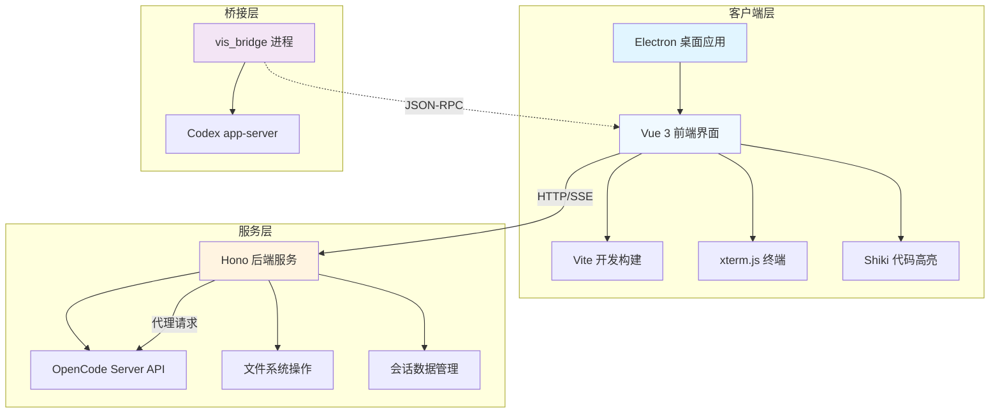
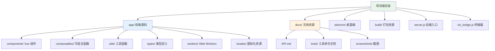

本文档提供 OpenCode Visualizer CN 项目的全面概述，包括项目背景、核心功能、技术架构和快速入门信息。本项目是 [OpenCode](https://github.com/sst/opencode) 的第三方 Web UI 实现，fork 自 [vis](https://github.com/xenodrive/vis) 并进行了深度本地化和功能增强，专为中文用户优化的 AI 编程助手桌面应用。

## 项目背景与定位
OpenCode Visualizer CN 是一个基于 Web 技术的桌面端 AI 编程助手界面，旨在为开发者提供直观的智能代理会话管理、代码审阅和终端集成体验。由于上游仓库不接受 PR，本项目作为独立维护的分支，在保留原始核心功能的基础上，重点增强了**国际化支持**、**字体主题管理**、**会话批量操作**、**悬浮窗系统**和**桌面端打包**等能力，使其更适合中文开发者使用和部署。项目采用 MIT 许可证，由社区维护并持续迭代 [README.md](README.md#L1-L15)。

## 核心功能对比
项目功能分为两部分：上游原始功能（由 xenodrive/vis 提供）和本项目新增的改进功能。上游功能包括审阅优先的悬浮窗口、多项目与会话管理、代码与 Diff 查看器、交互式智能体工作流以及嵌入式终端。在此基础上，本项目新增了完整的 i18n 框架（支持简体/繁体中文、日语、世界语）、高级字体管理、供应商与模型管理界面、实时状态监控面板、主题自定义、编辑器集成、代码行评论、会话树与批量管理、会话归档恢复、悬浮窗 Dock 栏管理、性能优化（懒加载、虚拟滚动）以及 Electron 桌面端打包。此外，还集成了 Codex 桥接器作为实验性功能 [README.md](README.md#L17-L44)。

| 功能模块 | 上游功能 | 本项目增强 | 状态 |
|---|---|---|---|
| **悬浮窗口系统** | 审阅优先的浮动窗口 | 全面关闭/最小化按钮、底部 Dock 栏 | ✅ 已上线 |
| **会话管理** | 基础会话组织 | 三级会话树、Pin 置顶、批量操作、归档恢复、重命名 | ✅ 已上线 |
| **国际化** | 仅英文 | 完整 i18n 支持（4 语言） | ✅ 已上线 |
| **字体主题** | 基础样式 | 多级字体设置、主题颜色自定义、系统字体发现 | 🅱️ Beta |
| **模型管理** | 隐式配置 | 可视化供应商/模型启用禁用、Web 端连接 | ✅ 已上线 |
| **状态监控** | 无 | 服务器/MCP/LSP/Plugin/Skills 状态、Token 消耗监控 | ✅ 已上线 |
| **性能优化** | 基础渲染 | 超大会话懒加载、后台 Hydration、虚拟滚动、冷启动加速 | ✅ 已上线 |
| **桌面端** | 仅 Web | Electron 跨平台打包（Win/macOS/Linux） | ✅ 已上线 |
| **Codex 集成** | 无 | vis_bridge 桥接器、最小化面板 | 🅰️ Alpha |

## 技术架构总览
项目采用典型的现代 Web 全栈架构，前端基于 Vue 3 Composition API 构建响应式界面，使用 Vite 作为构建引擎实现极速开发体验。后端服务采用 Hono 轻量级框架，运行在 Node.js 环境中，负责与 OpenCode 服务器通信并提供 API 代理。桌面端通过 Electron 将 Web 应用打包为原生可执行文件，vis_bridge 作为独立桥接进程转发 Codex app-server 的 JSON-RPC 请求。整个架构支持 Cloud 和 Local 两种部署模式，默认监听端口 23003 以避免 WSL 环境下的端口冲突 [README.md](README.md#L66-L76)。

## 技术栈详解
项目技术栈涵盖前端框架、构建工具、样式方案、终端组件、代码高亮、国际化、后端服务、桌面端、代码规范和测试框架等维度。前端使用 Vue 3 的响应式系统和 Composition API，结合 Vite 实现热更新和快速构建。样式采用 Tailwind CSS v4 原子化方案，配合 PostCSS 处理。终端组件选用 xterm.js 提供完整的 Shell 交互体验，代码高亮依赖 Shiki 实现多语言语法着色。国际化通过 Vue I18n 实现多语言切换。后端采用 Hono 框架配合 @hono/node-server 构建轻量 HTTP 服务，处理文件操作和会话管理。桌面端通过 Electron 实现跨平台打包，使用 electron-builder 生成安装包。代码规范采用 oxlint 和 oxfmt 进行高性能检查与格式化，测试框架使用 Vitest 运行单元测试 [README.md](README.md#L48-L64)。

| 类别 | 技术选型 | 版本/说明 |
|---|---|---|
| 前端框架 | Vue 3 + Composition API | 3.5.x |
| 构建工具 | Vite | 7.3.x |
| 样式方案 | Tailwind CSS v4 + PostCSS | 4.1.x |
| 终端组件 | xterm.js | 6.0.x |
| 代码高亮 | Shiki | 3.22.x |
| 国际化 | Vue I18n | 11.3.x |
| 后端框架 | Hono + @hono/node-server | 4.12.x / 1.19.x |
| 桌面端 | Electron | 35.0.x |
| 代码规范 | oxlint + oxfmt | 1.47.x / 0.32.x |
| 测试框架 | Vitest | 4.1.x |
| 包管理器 | pnpm | 10.29.3（锁定） |

## 项目目录结构
项目采用清晰的模块化目录组织，核心代码集中在 `app/` 目录下，包含 Vue 组件、可组合函数、类型定义、工具函数和 Web Workers。`docs/` 目录存放 Markdown 格式的文档资源，`electron/` 包含桌面端主进程和预加载脚本，`build/` 存放应用图标和打包配置。`server.js` 作为入口脚本启动后端服务，`vis_bridge.js` 作为 Codex 桥接器独立运行 [package.json](package.json#L38-L53)。

## 环境要求与依赖
项目运行需要 Node.js 20+ 运行时环境，推荐使用 pnpm 10.29.3 作为包管理器（通过 packageManager 字段锁定）。后端依赖 OpenCode Server 提供 AI 代理能力，系统 `$EDITOR` 环境变量可选，用于"用编辑器打开"功能。开发依赖涵盖 Vue、Vite、Tailwind、Electron 等数十个包，通过 pnpm-lock.yaml 保证依赖版本一致性 [README.md](README.md#L78-L88)。

## 快速开始
克隆仓库后，执行 `pnpm install` 安装依赖，`pnpm build` 构建前端资源，`node server.js` 启动后端服务。生产环境建议使用 `nohup node server.js 2>&1 &` 将服务放在后台持久运行。开发模式下可使用 `pnpm dev` 启动 Vite 热更新开发服务器。桌面端打包通过 `pnpm electron:build` 完成，生成跨平台安装包 [README.md](README.md#L90-L100)。

## 后续阅读建议
完成项目概述后，建议按以下顺序深入学习：[快速开始](2-kuai-su-kai-shi) 获取完整的安装配置步骤，[环境要求](3-huan-jing-yao-qiu) 详细了解系统依赖，[开发与构建](4-kai-fa-yu-gou-jian) 掌握开发工作流。如需深入架构，可继续阅读[技术栈概览](5-ji-zhu-zhan-gai-lan)了解各层级技术选型理由，[前端架构设计](6-qian-duan-jia-gou-she-ji) 探索 Vue 组件组织和状态管理策略。