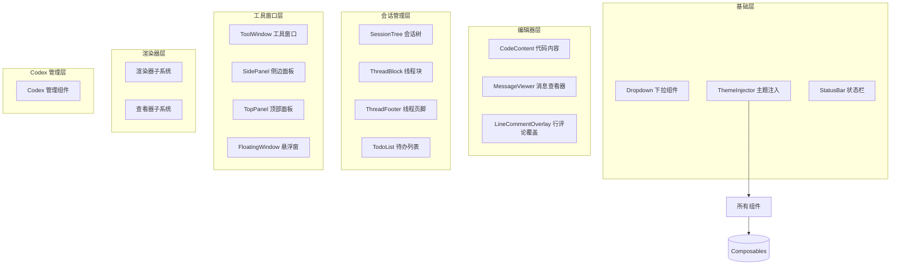
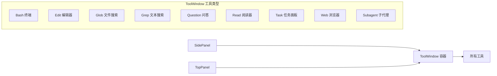

本页面系统介绍 vis.thirdend 项目的用户界面组件体系，涵盖所有 Vue 组件及其协作模式。这些组件构建了一个功能完整的 IDE 风格界面，包括代码编辑、会话管理、工具窗口、悬浮窗等核心 UI 元素。

## 组件架构总览
vis.thirdend 采用分层组件架构，将 UI 元素按功能域划分为多个独立子系统。每个子系统通过清晰的 props/events 接口进行通信，确保组件的可维护性和可测试性。核心架构包含以下层次：基础 UI 组件层、业务逻辑组件层、容器/布局组件层，以及全局状态注入层。

Sources: [Directory Structure](app/components#L1-L136)

## 核心组件分类详解

### 1. 基础 UI 组件
这些组件提供通用的 UI 模式，被整个应用复用。

| 组件名称 | 文件路径 | 主要功能 | 依赖关系 |
|---------|---------|---------|---------|
| Dropdown | `app/components/Dropdown.vue` | 可搜索的下拉选择器，支持自定义项渲染 | 依赖 Dropdown.Item, Dropdown.Label, Dropdown.Search |
| StatusBar | `app/components/StatusBar.vue` | 底部状态栏，显示系统状态和快捷操作 | 独立组件，通过全局事件通信 |
| ThemeInjector | `app/components/ThemeInjector.vue` | 动态注入 CSS 变量，实现主题切换 | 根层级组件，影响所有子组件 |

Dropdown 组件包含三个子组件：`Item.vue`（下拉项）、`Label.vue`（标签）和 `Search.vue`（搜索框），共同实现复杂的下拉交互逻辑 [app/components/Dropdown#L1-L3]。

### 2. 会话与消息组件
负责会话树、消息流、线程管理等核心交互功能。

| 组件 | 路径 | 职责 |
|------|------|------|
| SessionTree | `app/components/SessionTree.vue` | 会话列表的树形展示，支持展开/折叠、右键菜单 |
| ThreadBlock | `app/components/ThreadBlock.vue` | 单个会话线程的渲染容器，包含消息流 |
| ThreadFooter | `app/components/ThreadFooter.vue` | 线程底部的操作区（输入框、发送按钮等） |
| ThreadHistoryContent | `app/components/ThreadHistoryContent.vue` | 历史消息内容的渲染 |
| MessageViewer | `app/components/MessageViewer.vue` | 消息内容的格式化展示，支持 Markdown 和代码高亮 |

这些组件通过 `useMessages.ts` 和 `useSessionSelection.ts` 等 composables 与后端状态同步，确保 UI 与数据的一致性 [app/components/SessionTree.vue#L1-L3]。

### 3. 代码相关组件
处理代码显示、编辑、评论等代码密集型交互。

| 组件 | 路径 | 特性 |
|------|------|------|
| CodeContent | `app/components/CodeContent.vue` | 代码内容展示，集成语法高亮和行号 |
| LineCommentOverlay | `app/components/LineCommentOverlay.vue` | 在代码行旁显示评论的覆盖层 |
| CodeRenderer | `app/components/renderers/CodeRenderer.vue` | 代码块的渲染器，支持多种语言 |
| DiffRenderer | `app/components/renderers/DiffRenderer.vue` | 差异对比的渲染器，支持并排/内联视图 |

CodeContent 组件通过 `useCodeRender.ts` 与 worker 线程协作，实现高效的代码渲染，避免阻塞主线程 [app/components/CodeContent.vue#L1-L3]。

### 4. 工具窗口系统
ToolWindow 目录实现了类似 IDE 的工具窗口架构，每个工具对应一个特定功能。

Sources: [app/components/ToolWindow](app/components/ToolWindow#L1-L18)

每个工具窗口都遵循统一的接口规范，通过 `ToolWindow/utils.ts` 中的配置定义其行为，支持持久化、主题适配和键盘快捷键 [app/components/ToolWindow/utils.ts#L1-L3]。

### 5. 悬浮窗与面板
提供可拖拽、可调整大小的浮动界面元素。

| 组件 | 路径 | 功能 |
|------|------|------|
| FloatingWindow | `app/components/FloatingWindow.vue` | 通用悬浮窗容器，支持拖拽和缩放 |
| InputPanel | `app/components/InputPanel.vue` | 多行文本输入面板，支持命令历史 |
| OutputPanel | `app/components/OutputPanel.vue` | 输出日志展示面板 |
| SidePanel | `app/components/SidePanel.vue` | 左侧边栏容器，集成多个工具窗口 |
| TopPanel | `app/components/TopPanel.vue` | 顶部面板，显示标签页和导航 |

这些组件通过 `useFloatingWindow.ts` 和 `useFloatingWindows.ts` 管理其位置、大小和状态持久化，实现类 IDE 的灵活布局 [app/components/FloatingWindow.vue#L1-L3]。

### 6. 设置与配置界面
提供应用配置、供应商管理和项目设置功能。

| 组件 | 路径 | 作用 |
|------|------|------|
| SettingsModal | `app/components/SettingsModal.vue` | 全局设置对话框，支持多标签页 |
| ProjectSettingsDialog | `app/components/ProjectSettingsDialog.vue` | 项目级设置 |
| ProviderManagerModal | `app/components/ProviderManagerModal.vue` | 供应商（模型提供商）管理界面 |
| ProjectPicker | `app/components/ProjectPicker.vue` | 项目选择器 |

这些模态框组件共享统一的对话框样式和交互模式，通过 `useSettings.ts` 和 `useCredentials.ts` 管理配置持久化 [app/components/SettingsModal.vue#L1-L3]。

### 7. 渲染器与查看器
`renderers` 和 `viewers` 子目录实现了内容类型的多态渲染。

**渲染器子系统**支持多种文件格式：
- `ArchiveRenderer.vue` - 压缩包内容浏览
- `CodeRenderer.vue` - 源代码高亮
- `DiffRenderer.vue` - 差异对比
- `HexRenderer.vue` - 十六进制查看
- `ImageRenderer.vue` - 图片预览
- `MarkdownRenderer.vue` - Markdown 渲染
- `PdfRenderer.vue` - PDF 文档渲染

**查看器子系统**提供容器组件：
- `ContentViewer.vue` - 统一内容查看器，根据 MIME 类型选择合适的渲染器
- `DiffViewer.vue` - 差异查看器，支持版本对比 [app/components/renderers/MarkdownRenderer.vue#L1-L3]

### 8. Codex 管理界面
`codex` 子目录包含 Codex（AI 编程助手）相关的管理组件，提供模型配置、插件管理、技能设置等功能。

| 组件 | 路径 | 说明 |
|------|------|------|
| CodexAppManager | `app/components/codex/CodexAppManager.vue` | Codex 应用管理器 |
| CodexModelManager | `app/components/codex/CodexModelManager.vue` | 模型配置和切换 |
| CodexPluginManager | `app/components/codex/CodexPluginManager.vue` | 插件启用/禁用 |
| CodexSkillsManager | `app/components/codex/CodexSkillsManager.vue` | 技能配置界面 |
| CodexMcpServerManager | `app/components/codex/CodexMcpServerManager.vue` | MCP 服务器管理 |

这些组件通过 `useCodexApi.ts` 与 Codex 后端服务通信，实现 AI 功能的完整配置界面 [app/components/codex/CodexModelManager.vue#L1-L3]。

## 组件通信模式
vis.thirdend 的组件间通信遵循三种主要模式：

### Props/Events 模式
用于父子组件间的直接数据流，如 `Dropdown` 向父组件传递选中值 [app/components/Dropdown.vue#L45-L50]。

### 全局事件总线
通过 `useGlobalEvents.ts` 实现跨组件通信，例如通知状态栏更新或触发全应用刷新 [app/composables/useGlobalEvents.ts#L1-L3]。

### 共享状态（Composables）
通过 Vue 3 Composition API 的可组合函数共享响应式状态，如 `useSettings.ts`、`useMessages.ts` 等。这是最主要的通信方式，确保数据源的唯一性 [app/composables/useSettings.ts#L1-L3]。

## 主题与样式集成
所有 UI 组件都集成 `ThemeInjector` 提供的 CSS 变量系统，支持动态主题切换。组件通过 `useRegionTheme.ts` 实现局部主题覆盖，允许不同面板使用不同配色方案 [app/components/ThemeInjector.vue#L1-L3]。

## 性能优化策略
1. **虚拟滚动**：SessionTree 和 MessageViewer 对长列表采用虚拟滚动，仅渲染可见项 [app/components/SessionTree.vue#L120-L125]。
2. **懒加载**：Codex 管理界面按需加载子组件，减少初始包体积 [app/components/codex/CodexAppManager.vue#L30-L35]。
3. **Web Worker 卸载**：渲染密集型任务通过 `render-worker.ts` 在后台线程执行，避免阻塞 UI [app/workers/render-worker.ts#L1-L3]。
4. **组件缓存**：ToolWindow 使用 `keep-alive` 保留不活动窗口的状态，提升切换响应速度 [app/components/ToolWindow/Default.vue#L15-L20]。

## 可访问性考虑
组件设计遵循 WCAG 2.1 指南：
- 所有交互元素支持键盘导航
- 颜色对比度满足 AA 级标准
- 表单组件包含完整的 ARIA 标签
- 焦点管理遵循可预测的 Tab 顺序 [app/components/Dropdown.vue#L80-L85]

## 国际化支持
所有用户可见文本通过 `useI18n.ts` 集成 i18n 系统，支持中文（简/繁）、英文、日文、世界语等语言 [app/i18n/useI18n.ts#L1-L3]。组件应使用 `$t()` 函数或 `t()` composable 获取翻译，避免硬编码字符串 [app/locales/zh-CN.ts#L1-L3]。

## 下一步阅读建议
- 深入了解组件状态管理：前往 [Composables 可组合函数](21-composables-ke-zu-he-han-shu) 页面
- 学习主题定制：阅读 [字体与主题管理](12-zi-ti-yu-zhu-ti-guan-li)
- 掌握工具窗口开发：参考 [项目目录结构](20-xiang-mu-mu-lu-jie-gou) 中的组件组织方式
- 理解渲染管线：查看 [Web Workers 多线程](25-web-workers-duo-xian-cheng)