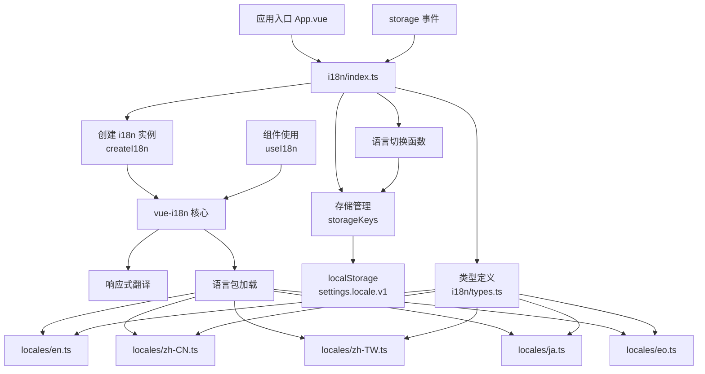

本页面详细介绍 Vis 桌面应用的国际化系统实现，该系统基于 `vue-i18n` 构建，提供完整的多语言支持、持久化语言偏好管理以及跨标签页同步机制。系统支持 5 种语言：英语 (en)、简体中文 (zh-CN)、繁体中文 (zh-TW)、日语 (ja) 和世界语 (eo)。

## 系统架构概览

国际化系统采用模块化设计，核心由三个部分组成：i18n 核心模块（初始化、存储管理、语言切换）、类型定义（完整的 TypeScript 接口约束）和多语言包（各语言的字符串资源）。系统通过 `vue-i18n` 的 Composition API 模式提供响应式翻译能力，并结合 `localStorage` 实现语言偏好的持久化与跨标签同步。



*图 1：国际化系统架构图。展示 i18n 核心模块如何集成 vue-i18n、类型定义与多语言包，以及存储管理和跨标签同步机制。*

## 核心模块详解

### i18n 初始化与配置 (`app/i18n/index.ts`)

i18n 系统的主入口文件负责创建 `vue-i18n` 实例、配置语言参数、管理存储键值以及暴露公共 API。该模块定义了 5 个核心函数和 1 个全局 i18n 实例：

- **`getStoredLocale()`**：从 `localStorage` 读取用户保存的语言偏好，验证是否在支持的语言列表中，否则返回默认语言 `en` [app/i18n/index.ts#L14-L19](app/i18n/index.ts#L14-L19)
- **`setStoredLocale(locale)`**：将语言偏好写入 `localStorage`，键名为 `settings.locale.v1` [app/i18n/index.ts#L22-L23](app/i18n/index.ts#L22-L23)
- **`i18n` 实例**：通过 `createI18n` 创建，配置包括：
  - `legacy: false`：启用 Composition API 模式
  - `locale`：从存储读取的当前语言
  - `fallbackLocale: 'en'`：回退到英语
  - `messages`：包含所有语言包的映射对象 [app/i18n/index.ts#L27-L35](app/i18n/index.ts#L27-L35)
- **`setLocale(locale)`**：切换当前语言并同步保存到存储 [app/i18n/index.ts#L40-L43](app/i18n/index.ts#L40-L43)
- **`getLocale()`**：获取当前激活的语言 [app/i18n/index.ts#L46-L49](app/i18n/index.ts#L46-L49)
- **跨标签同步**：监听 `window` 的 `storage` 事件，当 `settings.locale.v1` 在其他标签页被修改时自动更新当前实例 [app/i18n/index.ts#L51-L61](app/i18n/index.ts#L51-L61)

模块定义了常量 `VALID_LOCALES` 包含所有支持的语言代码，以及默认语言 `DEFAULT_LOCALE = 'en'`。

### 类型定义系统 (`app/i18n/types.ts`)

类型定义文件提供完整的 TypeScript 接口约束，确保所有语言包的结构一致性和编译时类型安全。核心类型包括：

- **`Locale`**：枚举类型，限定为 `'en' | 'zh-CN' | 'zh-TW' | 'ja' | 'eo'` [app/i18n/types.ts#L1](app/i18n/types.ts#L1)
- **`LocaleMessages`**：顶级接口，定义了应用中所有可翻译字符串的嵌套结构。该接口覆盖以下主要命名空间：
  - `app`：应用级字符串，包括标题、登录界面、连接状态、操作状态、错误消息、窗口标题等 [app/i18n/types.ts#L3-L199](app/i18n/types.ts#L3-L199)
  - `topPanel`：顶部面板相关的标签和提示文本 [app/i18n/types.ts#L201-L285](app/i18n/types.ts#L201-L285)
  - `sidePanel`：侧边面板文本（如会话树、设置等） [app/i18n/types.ts#L287-L388](app/i18n/types.ts#L287-L388)
  - `todoPanel`：待办事项面板相关 [app/i18n/types.ts#L390-L428](app/i18n/types.ts#L390-L428)
  - `codeEditor`：代码编辑器相关字符串 [app/i18n/types.ts#L430-L494](app/i18n/types.ts#L430-L494)
  - `floatingWindow`：悬浮窗相关 [app/i18n/types.ts#L496-L587](app/i18n/types.ts#L496-L587)
  - `inputPanel`：输入面板 [app/i18n/types.ts#L589-L668](app/i18n/types.ts#L589-L668)
  - `outputPanel`：输出面板 [app/i18n/types.ts#L670-L742](app/i18n/types.ts#L670-L742)
  - `messageViewer`：消息查看器 [app/i18n/types.ts#L744-L826](app/i18n/types.ts#L744-L826)
  - `threadBlock`：线程块组件 [app/i18n/types.ts#L828-L901](app/i18n/types.ts#L828-L901)
  - `threadFooter`：线程页脚 [app/i18n/types.ts#L903-L960](app/i18n/types.ts#L903-L960)
  - `fileRefPopup`：文件引用弹窗 [app/i18n/types.ts#L962-L1032](app/i18n/types.ts#L962-L1032)
  - `sessionTree`：会话树 [app/i18n/types.ts#L1034-L1076](app/i18n/types.ts#L1034-L1076)
  - `projectPicker`：项目选择器 [app/i18n/types.ts#L1078-L1110](app/i18n/types.ts#L1078-L1110)
  - `statusBar`：状态栏 [app/i18n/types.ts#L1112-L1161](app/i18n/types.ts#L1112-L1161)
  - `providerManager`：供应商管理器 [app/i18n/types.ts#L1163-L1206](app/i18n/types.ts#L1163-L1206)
  - `settingsModal`：设置对话框 [app/i18n/types.ts#L1208-L1242](app/i18n/types.ts#L1208-L1242)
  - `projectSettingsDialog`：项目设置对话框 [app/i18n/types.ts#L1244-L1287](app/i18n/types.ts#L1244-L1287)

每个命名空间都使用字符串字面量类型和嵌套接口精确描述翻译键的结构，确保编译时类型检查能够捕获任何缺失或错误的翻译键引用。

### Composition API 封装 (`app/i18n/useI18n.ts`)

`useI18n` 函数是 `vue-i18n` 的 `useI18n` Composition API 的简单封装，提供符合项目规范的调用方式。在 Vue 3 组件中，通过 `const { t } = useI18n()` 获取翻译函数，然后使用 `t('key.path')` 进行字符串翻译 [app/i18n/useI18n.ts#L3-L5](app/i18n/types.ts#L3-L5)。

## 语言包实现

语言包位于 `app/locales/` 目录，每个文件对应一种支持的语言，结构相同但内容本地化。所有语言包文件大小约 1341 行，包含完整的 `LocaleMessages` 接口实现。

### 语言包示例对比

| 语言 | 文件名 | 主要特点 |
|------|--------|----------|
| 英语（美国） | `en.ts` | 默认回退语言，所有键均有定义 |
| 简体中文 | `zh-CN.ts` | 符合中国大陆用语习惯，如"正在连接服务器" |
| 繁体中文 | `zh-TW.ts` | 符合台湾/香港用语习惯 |
| 日语 | `ja.ts` | 日文本地化 |
| 世界语 | `eo.ts` | 国际辅助语言版本 |

每个语言包都从 `../i18n/types` 导入 `LocaleMessages` 类型，并定义 `const messages: LocaleMessages` 对象。例如 `zh-CN.ts` 中的登录界面翻译：

```typescript
login: {
  title: '连接到 OpenCode 服务器',
  username: '用户名',
  password: '密码',
  url: DEFAULT_OPENCODE_URL,
  authRequired: '服务器需要身份验证',
  connect: '连接',
  retry: '重试',
  abort: '中止',
  error: '连接失败',
}
```

对应的英语版本 (`en.ts`) 则为：

```typescript
login: {
  title: 'Connect to OpenCode Server',
  username: 'Username',
  password: 'Password',
  url: DEFAULT_OPENCODE_URL,
  authRequired: 'The server requires authentication',
  connect: 'Connect',
  retry: 'Retry',
  abort: 'Abort',
  error: 'Connection failed',
}
```

### 插值支持

语言包支持动态插值，使用 `{variable}` 占位符。例如错误消息的模板化定义：

```typescript
error: {
  actionDisabled: '{action} 暂时不可用。', // zh-CN
  attachmentFailed: 'Attachment failed: {message}', // en
  batchOperationPartialFailure: '批量{action}部分失败 ({failures}/{total})。第一个错误: {firstError}',
}
```

在组件中使用时，`t('app.error.actionDisabled', { action: '删除会话' })` 将渲染为"删除会话 暂时不可用。"

### 复数与条件处理

虽然当前类型定义未显式声明复数规则，但 `vue-i18n` 支持通过 `|` 分隔符定义不同数量形式的字符串，如 `{count} file | {count} files`。语言包可根据目标语言的复数规则实现相应形式。

## 存储管理与跨标签同步

i18n 系统使用 `storageKeys` 工具模块管理 `localStorage` 键名，当前语言存储键为 `settings.locale.v1`。`getStoredLocale()` 和 `setStoredLocale()` 函数封装了存储读写逻辑 [app/i18n/index.ts#L14-L23](app/i18n/index.ts#L14-L23)。

跨标签同步通过监听 `window` 的 `storage` 事件实现。当用户在另一个标签页修改语言设置时，当前页面会接收到 `storage` 事件，检测键名匹配后自动更新 i18n 实例的 `locale` 值 [app/i18n/index.ts#L51-L61](app/i18n/index.ts#L51-L61)。这确保了多个打开的应用实例保持语言设置一致。

## 在组件中使用 i18n

Vue 组件通过调用 `useI18n()` 获取翻译上下文：

```typescript
import { useI18n } from '@/i18n/useI18n';

export default {
  setup() {
    const { t, locale } = useI18n();
    return { t, locale };
  }
}
```

模板中可以直接使用 `$t` 方法或通过 `t` 函数：

```vue
<template>
  <h1>{{ t('app.title') }}</h1>
  <button @click="setLocale('zh-CN')">{{ t('app.login.connect') }}</button>
</template>
```

对于需要响应式语言切换的组件，确保在 `setup` 中返回 `t` 和 `locale`，Vue 的响应式系统会自动在语言变化时重新渲染。

## 扩展与维护

### 添加新语言

1. 在 `app/i18n/types.ts` 的 `Locale` 类型中添加新的语言代码
2. 在 `app/i18n/index.ts` 的 `VALID_LOCALES` 数组中添加新语言
3. 在 `app/locales/` 目录创建新的语言包文件（如 `fr.ts`），实现完整的 `LocaleMessages` 接口
4. 在 `i18n` 实例的 `messages` 对象中添加新语言映射

### 翻译键规范

- 使用分层命名空间（如 `app.error.sessionCreateFailed`）避免键名冲突
- 保持所有语言包的键结构完全一致
- 插值变量名应具有描述性（如 `{action}`, `{message}`, `{failures}`）
- 新增翻译键时同步更新 `types.ts` 类型定义和所有语言包

### 与项目其他模块的集成

i18n 系统在应用入口 `app/main.ts` 中初始化并注入 Vue 应用。所有 Vue 组件均可直接使用 `useI18n` 或 `$t`。对于非 Vue 模块（如工具函数、Worker），可通过直接导入 `app/i18n/index.ts` 中的 `getLocale()`、`setLocale()` 等函数访问语言状态。

## 相关页面指引

- 如需了解项目整体架构，请参阅 [技术栈概览](5-ji-zhu-zhan-gai-lan)
- 要掌握 Vue 组件中的 i18n 使用模式，请参考 [前端架构设计](6-qian-duan-jia-gou-she-ji)
- 关于项目目录结构的完整视图，请访问 [项目目录结构](20-xiang-mu-mu-lu-jie-gou)
- 查看所有工具函数，包括 `storageKeys`，请参阅 [工具函数库](22-gong-ju-han-shu-ku)