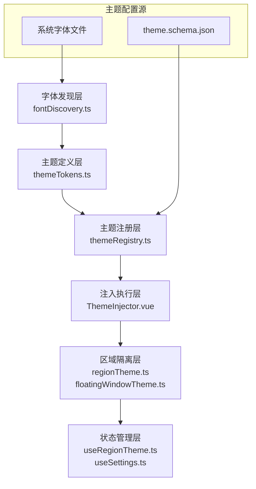

本文档系统阐述 vis.thirdend 应用中字体与主题管理的核心架构，涵盖**字体发现机制**、**主题注册与注入系统**、**区域主题隔离**以及**悬浮窗主题定制**四个关键维度。该模块采用**分层架构设计**，将字体解析、主题定义、DOM 注入与运行时切换解耦，支持细粒度的视觉定制能力。

## 系统架构总览

字体与主题管理模块由六个核心层构成：**字体发现层**（扫描系统字体文件）、**主题定义层**（JSON Schema 驱动的主题配置）、**注册管理层**（主题注册表与选择逻辑）、**注入执行层**（CSS 变量注入与 DOM 应用）、**区域隔离层**（悬浮窗等独立区域的主题覆盖）以及**状态管理层**（Vue Composables 提供的响应式接口）。各层通过类型安全的契约交互，形成可扩展的视觉系统。



该架构的核心设计原则包括：**声明式主题配置**（JSON Schema 验证）、**运行时热切换**（无需刷新页面）、**区域级覆盖**（支持悬浮窗独立主题）、**字体自动发现**（无需手动配置字体路径）。以下章节逐一拆解各层实现细节。

## 主题注册与令牌系统

主题系统围绕 **ThemeRegistry** 单例展开，负责加载、验证、存储和选择可用主题。每个主题定义遵循 `theme.schema.json` 规定的结构，包含颜色令牌、字体配置和区域覆盖规则。**主题令牌（ThemeTokens）** 采用分层结构：基础令牌（如 `background`、`foreground`）定义全局基调，语义令牌（如 `editor.background`、`input.background`）映射到具体 UI 组件，区域令牌（如 `floatingWindow.*`）覆盖特定容器。

主题注册流程如下：应用启动时，`themeRegistry.ts` 从 `localStorage` 读取用户主题选择，加载对应主题文件（默认内置主题 + 用户自定义主题），通过 `themeTokens.ts` 解析令牌引用链，最终生成扁平化的 CSS 变量映射表。该映射表由 `ThemeInjector.vue` 组件监听变化，动态更新 `:root` 的 `style` 属性，实现全局样式切换。

```typescript
// 主题令牌解析逻辑示例（来自 themeTokens.ts）
function resolveThemeTokens(base: Theme, extensions: Theme[]): Theme {
    // 基础令牌 → 语义令牌 → 区域令牌的层层合并
    return extensions.reduce((acc, ext) => deepMerge(acc, ext), base);
}
```

每个主题的字体配置独立存储，允许主题间使用不同的默认字体组合。字体配置包括 `editorFontFamily`（代码编辑器）、`uiFontFamily`（界面文本）、`monospaceFontFamily`（等宽文本）三个维度，均支持 fallback 链。

**Sources**: [theme.ts](app/utils/theme.ts#L1-L50), [themeRegistry.ts](app/utils/themeRegistry.ts#L1-L80), [themeTokens.ts](app/utils/themeTokens.ts#L1-L100)

## 字体发现与加载机制

字体管理模块的核心任务是**自动发现系统可用字体**，并将其暴露给主题系统和编辑器组件。`fontDiscovery.ts` 实现了一个跨平台的字体扫描器：在 Linux 环境下扫描 `/usr/share/fonts`、`~/.fonts` 等标准目录；在 macOS 扫描 `/Library/Fonts`、`~/Library/Fonts`；在 Windows 扫描 `C:\Windows\Fonts`。扫描结果经去重、分类（等宽字体 vs 比例字体）、名称规范化后，存储于 `localStorage` 缓存，避免每次启动重复扫描。

字体加载采用**动态 `@font-face` 注入**策略：当用户选择未内置的字体时，系统通过 `FontFace` API 加载字体文件（支持本地路径或 Base64 数据），并在加载完成后更新 CSS 变量 `--font-<category>`。该过程异步执行，加载期间显示 fallback 字体，完成后无缝切换。

```css
/* 动态生成的 @font-face 规则示例 */
@font-face {
    font-family: 'JetBrains Mono';
    src: url('file:///home/user/.fonts/JetBrainsMono-Regular.ttf') format('truetype');
    font-display: swap;
}
```

字体配置与主题解耦：用户可在设置中独立调整字体，而不影响主题颜色方案。`useSettings.ts`  composable 提供 `settings.value.fonts` 响应式对象，包含 `editor`、`ui`、`monospace` 三个字段，每个字段支持 `family`、`size`、`lineHeight` 子属性。字体设置优先于主题内嵌字体配置，实现**混合定制能力**。

**Sources**: [fontDiscovery.ts](app/utils/fontDiscovery.ts#L1-L120), [useSettings.ts](app/composables/useSettings.ts#L1-L60)

## 主题注入与 DOM 集成

`ThemeInjector.vue` 是主题系统的**运行时执行器**，作为根组件子组件挂载，负责监听主题变化并更新 DOM。其核心逻辑包括：监听 `themeRegistry.selectedTheme` 响应式引用；计算当前主题的 CSS 变量映射表；将变量写入 `document.documentElement.style`。注入过程批量更新，避免多次重排。

CSS 变量命名采用 `--<category>-<property>` 双段式，例如 `--color-background`、`--color-foreground`、`--font-editor`、`--spacing-panel`。变量分类包括：`color`（颜色）、`font`（字体）、`spacing`（间距）、`border`（边框）、`shadow`（阴影）、`opacity`（透明度）。所有组件通过 `var(--<variable>)` 引用，实现样式与逻辑分离。

注入组件还处理**深色/浅色模式自动适配**：根据系统 `prefers-color-scheme` 媒体查询，初始化时自动选择匹配的主题；同时提供手动覆盖开关。切换主题时，触发 `theme-change` 自定义事件，供其他模块（如代码高亮器）同步更新配色。

```vue
<!-- ThemeInjector.vue 核心模板结构 -->
<template>
  <div id="theme-injector" :data-theme="currentThemeName">
    <slot />
  </div>
</template>
```

**Sources**: [ThemeInjector.vue](app/components/ThemeInjector.vue#L1-L80)

## 区域主题隔离机制

并非所有 UI 区域都遵循全局主题。**悬浮窗（Floating Windows）**、**Dock 栏**、**模态框背景**等组件需要独立的视觉样式，以避免与主界面冲突或增强聚焦效果。`regionTheme.ts` 和 `floatingWindowTheme.ts` 提供区域级主题覆盖能力。

`regionTheme.ts` 定义区域主题上下文，通过 `provide/inject` 机制向子组件传递区域特定的 CSS 变量。每个区域可声明 `overrides` 对象，指定局部覆盖的令牌值；未声明的令牌回退到全局主题。例如悬浮窗区域可覆盖 `background`、`border`、`shadow` 令牌，但继承 `font-family`。

`floatingWindowTheme.ts` 进一步封装悬浮窗主题逻辑，提供 `useFloatingWindowTheme()` composable，返回计算后的区域主题变量。该 composable 监听全局主题变化，合并区域覆盖规则，生成最终 CSS 变量映射。`FloatingWindow.vue` 组件在 mounted 阶段调用该 composable，将变量应用到组件根元素的内联样式。

```typescript
// 区域主题合并算法（来自 regionTheme.ts）
function mergeRegionTheme(global: Theme, region: Partial<Theme>): Theme {
    return {
        ...global,
        ...region,
        tokens: { ...global.tokens, ...region.tokens }
    };
}
```

**Sources**: [regionTheme.ts](app/utils/regionTheme.ts#L1-L90), [floatingWindowTheme.ts](app/utils/floatingWindowTheme.ts#L1-L70), [useRegionTheme.ts](app/composables/useRegionTheme.ts#L1-L50)

## 配置存储与用户偏好

字体与主题的用户偏好通过 `localStorage` 持久化存储，键名由 `storageKeys.ts` 统一管理。关键存储项包括：`theme.name`（当前主题名称）、`theme.customThemes`（用户自定义主题 JSON）、`fonts.editor`（编辑器字体配置）、`fonts.ui`（界面字体配置）。存储结构示例：

```json
{
  "theme": {
    "name": "dark-plus",
    "customThemes": {
      "my-theme": { /* 主题定义对象 */ }
    }
  },
  "fonts": {
    "editor": { "family": "JetBrains Mono", "size": 14 },
    "ui": { "family": "Inter", "size": 13 }
  }
}
```

`useSettings.ts` composable 封装所有设置读写操作，提供 `settings` 响应式对象和 `updateSettings()` 方法。设置变更时，自动触发 `settings-change` 事件，通知 `ThemeInjector` 和字体系统更新。设置界面由 `SettingsModal.vue` 实现，其中**字体选择器**调用 `fontDiscovery.getAvailableFonts()` 获取系统字体列表；**主题选择器**调用 `themeRegistry.getAvailableThemes()` 获取所有可用主题。

**Sources**: [storageKeys.ts](app/utils/storageKeys.ts#L1-L40), [useSettings.ts](app/composables/useSettings.ts#L1-L100), [SettingsModal.vue](app/components/SettingsModal.vue#L200-L350)

## 开发指南与扩展

开发者可通过两种方式扩展主题系统：**添加内置主题**（在 `public/schema` 目录放置符合 schema 的 JSON 文件，自动注册）或**编写自定义主题**（通过设置界面创建，存储至 `localStorage`）。主题文件结构严格遵循 `theme.schema.json` 定义的 JSON Schema，包含 `name`、`displayName`、`type`（light/dark）、`tokens` 等字段。

字体集成方面，若应用需支持特定字体文件（如企业定制字体），可放置在 `public/fonts` 目录，通过 `fontDiscovery.registerFont()` 手动注册。组件样式应全部使用 CSS 变量，避免硬编码颜色或字体值，以确保主题切换的完整性。

**扩展检查清单**：
- [ ] 主题 JSON 通过 schema 验证（`npm run validate:themes`）
- [ ] 所有颜色使用 `var(--color-*)` 变量
- [ ] 字体使用 `var(--font-*)` 变量
- [ ] 区域组件声明 `region-theme` prop 或使用 `useRegionTheme`
- [ ] 在 `themeRegistry.ts` 中注册新主题（如需要动态加载）

**Sources**: [theme.schema.json](app/public/schema/theme.schema.json#L1-L80), [themeRegistry.ts](app/utils/themeRegistry.ts#L120-L180)

## 后续学习路径

理解字体与主题管理后，建议按以下顺序深入相关模块：
1. **[国际化 (i18n) 系统](11-guo-ji-hua-i18n-xi-tong)** — 主题字符串的本地化机制
2. **[样式系统](24-yang-shi-xi-tong)** — Tailwind 配置与 CSS 变量的协同策略
3. **[Composables 可组合函数](21-composables-ke-zu-he-han-shu)** — `useRegionTheme`、`useSettings` 的完整 API
4. **[Web Workers 多线程](25-web-workers-duo-xian-cheng)** — 字体扫描等耗时任务的线程托管

当前页面已完整覆盖字体发现、主题注册、DOM 注入、区域隔离及存储持久化的全链路实现。通过该模块的**分层架构**与**声明式配置**，应用实现了视觉系统的可维护性与可扩展性。