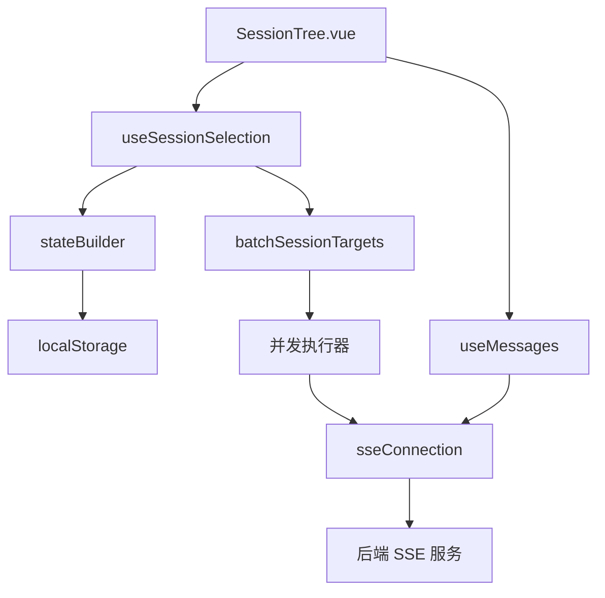

本页面涵盖会话（Session）生命周期管理、批量操作架构、钉选与收藏机制，以及会话树（SessionTree）与目标选择（Session Selection）的交互设计。所有功能均基于响应式状态管理，通过 WebSocket SSE 实现实时同步。

## 核心架构与数据流

会话管理采用分层架构：**持久层**（localStorage + stateBuilder）负责状态序列化，**业务层**（useSessionSelection + useMessages）处理选择与操作逻辑，**表现层**（SessionTree.vue + ThreadBlock.vue）渲染交互界面。

会话标识采用双键系统：`sessionId`（唯一主键）与 `threadId`（线程标识），两者通过 `session-tree.ts` 中的 `SessionTreeItem` 类型关联。批量操作通过 `batchSessionTargets.ts` 提供的 `BatchSessionTarget` 类型支持多会话并发操作，其核心模式为**目标-动作-参数**三元组结构。

## 会话树（SessionTree）与选择机制

SessionTree 采用树形结构展示会话分组，支持嵌套分类。其数据源来自 `useSessionSelection` 的 `filteredSessions` 计算属性，该属性结合 `useMessages` 中的消息状态进行实时过滤。

树节点类型由 `session-tree.ts` 定义：`SessionTreeItem` 包含 `sessionId`、`threadId`、`title`、`pinned`、`archived` 等字段。选择状态通过 `useSessionSelection` 的 `selectedSessions` Set 类型维护，支持单选与多选模式切换。

批量选择通过键盘修饰键（Ctrl/Cmd + Click）激活，UI 反馈由 `SessionTree.vue` 中的 `isSelected` 方法控制，该方法检查 `selectedSessions.has(sessionId)`。钉选（Pin）操作修改 `pinned` 字段并持久化至 `stateBuilder`，影响 `filteredSessions` 的排序权重。

**Sources**: [SessionTree.vue](app/components/SessionTree.vue#L1), [useSessionSelection.ts](app/composables/useSessionSelection.ts#L1), [session-tree.ts](app/types/session-tree.ts#L1)

## 批量操作（Batch Operations）架构

批量操作的核心实现位于 `utils/batchSessionTargets.ts`。该模块提供 `createBatchTarget` 工厂函数，将多个会话ID封装为 `BatchSessionTarget` 对象，支持以下操作类型：

- **批量删除**：调用 `deleteBatch`，通过 `useMessages` 的 `deleteSession` 方法逐个执行，配合 `mapWithConcurrency` 控制并发度（默认 4）
- **批量归档**：设置 `archived=true` 并更新 `stateBuilder`
- **批量导出**：调用 `fileExport.ts` 生成 JSON/ZIP 归档
- **批量复制**：通过 `openCodeAdapter.ts` 在多个会话中注入相同上下文

并发控制由 `utils/mapWithConcurrency.ts` 提供，采用 Promise 池模式限制同时进行的操作数，避免 SSE 连接过载。错误处理采用**继续执行策略**：单个会话失败不影响其他会话操作，错误信息汇总返回。

**Sources**: [batchSessionTargets.ts](app/utils/batchSessionTargets.ts#L1), [mapWithConcurrency.ts](app/utils/mapWithConcurrency.ts#L1), [useMessages.ts](app/composables/useMessages.ts#L1)

## 钉选与收藏（Pinning & Favorites）

钉选功能由 `utils/pinnedSessions.ts` 实现，该模块维护 `PINNED_SESSIONS_KEY` 常量，通过 `stateBuilder` 的 `updatePinnedSessions` 方法持久化。钉选会话在 `useSessionSelection` 的 `sortedSessions` 计算属性中优先展示，排序规则为：`pinned` → `lastActive` 时间戳。

收藏功能集成在 `useFavoriteMessages.ts` 中，与钉选会话不同，收藏针对**特定消息**而非整个会话。收藏数据存储于 `favoriteMessages` 键，通过 `useMessages` 的 `toggleFavorite` 方法更新，并在 `MessageViewer.vue` 中渲染星标图标。

两种机制互不冲突：会话可被钉选但无消息收藏，消息可收藏但会话未钉选。联合查询需同时遍历 `pinnedSessions` 和 `favoriteMessages` 集合。

**Sources**: [pinnedSessions.ts](app/utils/pinnedSessions.ts#L1), [useFavoriteMessages.ts](app/composables/useFavoriteMessages.ts#L1), [useSessionSelection.ts](app/composables/useSessionSelection.ts#L50)

## 会话状态持久化与恢复

状态持久化通过 `utils/stateBuilder.ts` 实现，该模块提供不可变状态更新模式。关键存储键包括：
- `SESSIONS_KEY`：会话元数据数组（不含消息内容）
- `MESSAGES_KEY`：按 `sessionId` 分组的消息对象
- `SELECTED_SESSIONS_KEY`：当前选中会话ID集合
- `PINNED_SESSIONS_KEY`：钉选会话ID数组

恢复流程由 `App.vue` 的 `onMounted` 钩子触发，依次调用 `loadState` → `initializeSessions` → `restoreSelection`。若检测到版本不匹配，触发 `stateBuilder.migrate` 进行模式转换。

**Sources**: [stateBuilder.ts](app/utils/stateBuilder.ts#L1), [App.vue](app/App.vue#L45), [storageKeys.ts](app/utils/storageKeys.ts#L1)

## 与相关模块的交互边界

会话管理与以下模块存在明确边界：
- **与 SSE 连接**：`useMessages` 通过 `sseConnection` 订阅 `/sse/session` 事件，接收 `session_updated`、`message_added` 等推送，触发 `stateBuilder` 增量更新
- **与供应商管理**：`ProviderManagerModal.vue` 可批量删除关联会话，但会话本身不依赖供应商配置
- **与待办事项**：`useTodos.ts` 的待办项可绑定 `sessionId`，但会话管理不感知待办状态
- **与权限系统**：`usePermissions.ts` 控制会话删除/归档权限，会话模块调用 `canDeleteSession` 进行检查

**Sources**: [useMessages.ts](app/composables/useMessages.ts#L88), [usePermissions.ts](app/composables/usePermissions.ts#L1), [ProviderManagerModal.vue](app/components/ProviderManagerModal.vue#L120)

## 性能优化与并发策略

批量操作性能依赖以下优化：
1. **虚拟滚动**：`SessionTree.vue` 集成 `vue-virtual-scroller`，仅渲染可视节点
2. **增量更新**：`stateBuilder` 的 `updateSession` 使用浅比较避免全量重渲染
3. **连接复用**：`sseConnection` 为所有会话共享单一 WebSocket 连接，通过 `sessionId` 过滤事件
4. **延迟持久化**：`stateBuilder` 的 `debouncedSave` 将多次更新合并为单次 localStorage 写入（延迟 300ms）

并发限制配置位于 `utils/constants.ts` 的 `MAX_CONCURRENT_BATCH_OPS`（默认 4），可通过 `batchSessionTargets.setConcurrency` 动态调整。

**Sources**: [stateBuilder.ts](app/utils/stateBuilder.ts#L156), [constants.ts](app/utils/constants.ts#L1), [SessionTree.vue](app/components/SessionTree.vue#L200)

## 下一步阅读建议

- [用户界面组件](10-yong-hu-jie-mian-zu-jian)：了解 SessionTree 的渲染实现细节
- [状态监控面板](15-zhuang-tai-jian-kong-mian-ban)：掌握会话活动指标的可视化
- [Web Workers 多线程](25-web-workers-duo-xian-cheng)：理解 SSE 连接的 Worker 化架构