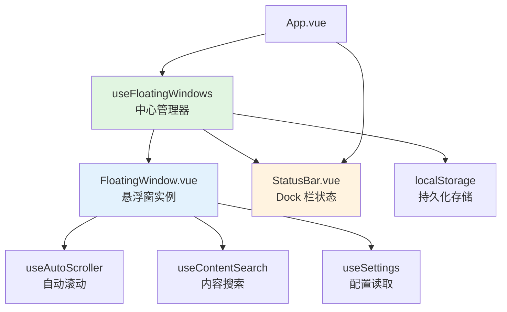
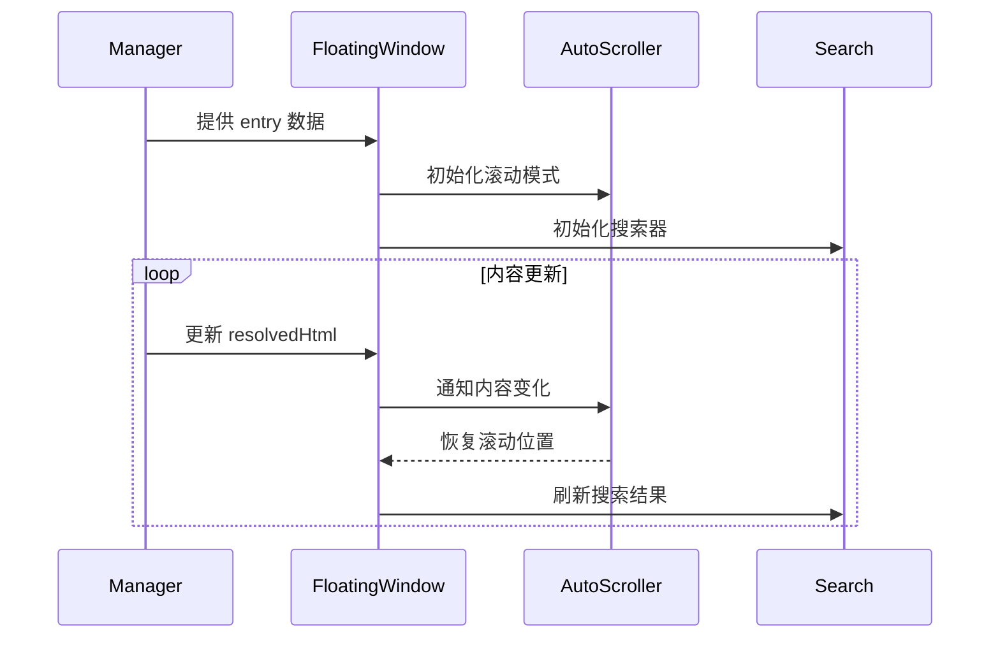

本页面详细说明 vis.thirdend 应用中悬浮窗（Floating Windows）与状态栏（Dock Bar）系统的架构设计、核心功能及使用方式。悬浮窗系统支持多窗口浮动显示代码内容、推理过程、子代理任务等上下文信息，Dock 栏则提供全局状态监控与快捷操作入口。

## 架构概览
悬浮窗系统采用中心化管理与独立渲染相结合的设计模式，通过 `useFloatingWindows` composable 统一管理所有悬浮窗实例的生命周期、位置状态与 z-index 排序，每个悬浮窗实例通过 `FloatingWindow.vue` 组件独立渲染。Dock 栏作为常驻底部状态面板，集成 `StatusBar.vue` 组件展示全局状态信息。



系统核心数据流：`FloatingWindowEntry` 接口定义每个悬浮窗的元数据（key、标题、内容、位置、尺寸、状态等），管理器负责维护所有 entry 的响应式集合，并通过 provide/inject 模式向子组件暴露 `FloatingWindowAPI` 以进行内容更新与生命周期控制。

Sources: [app/components/FloatingWindow.vue](app/components/FloatingWindow.vue#L1-L50) [app/composables/useFloatingWindows.ts](app/composables/useFloatingWindows.ts) [app/composables/useFloatingWindow.ts](app/composables/useFloatingWindow.ts)

## 核心组件详析

### FloatingWindow.vue
主悬浮窗组件，支持多种内容变体（code、diff、text、markdown、shell）与滚动模式（manual、follow、auto）。关键特性包括：

**动态样式计算**：基于窗口类型（普通窗口 vs shell 终端）应用不同的主题变量与字体设置，shell 窗口使用终端专用字体与背景色，非 shell 窗口支持背景图片与透明度控制。位置与尺寸通过 CSS 变量 `--win-x`、`--win-y`、`width`、`height` 动态绑定。



**滚动位置保持**：通过 `watch` 监听内容变化，在手动模式下自动保存并恢复 `scrollTop`，避免用户阅读位置跳跃。`shouldPreserveScrollPosition` 逻辑区分滚动模式，仅当模式为 `follow` 且未处于跟随状态时保持位置。

**搜索集成**：内置 `useContentSearch` composable，提供实时搜索、高亮、结果计数与导航功能，搜索输入框通过 `searchInputEl` 引用实现键盘快捷操作。

Sources: [app/components/FloatingWindow.vue](app/components/FloatingWindow.vue#L90-L150) [app/composables/useAutoScroller.ts](app/composables/useAutoScroller.ts) [app/composables/useContentSearch.ts](app/composables/useContentSearch.ts)

### StatusBar.vue
底部常驻状态栏，采用左右分栏布局展示系统状态。左侧显示推理/思考过程摘要，右侧显示当前操作状态（错误、重试、运行中等）。样式上使用固定 z-index 确保始终位于顶层，文字截断处理适配有限宽度。

Sources: [app/components/StatusBar.vue](app/components/StatusBar.vue#L1-L62)

## 生命周期管理

### 窗口创建与销毁
悬浮窗通过 `useFloatingWindows` 的 `create` 方法实例化，支持指定唯一 key（命名空间前缀：`reasoning:`、`subagent:`、`file-viewer:`、`shell:`、`output:` 等）。关键约束：推理窗口（`reasoning:`）与子代理窗口（`subagent:`）标记为不可关闭（`closable: false`），确保核心流程不中断。

**位置记忆**：窗口坐标（x, y）与尺寸（width, height）在移动/调整大小时实时更新至 entry，可通过 `minimized` 状态折叠为标题栏高度（22px）。`bringToFront` 操作提升 z-index 实现焦点切换。

Sources: [app/composables/useFloatingWindows.ts](app/composables/useFloatingWindows.ts#L40-L120)

### 内容更新策略
提供三种内容注入方式：
- `setContent(text)`：完全替换内容
- `appendContent(text)`：增量追加（适用于流式输出）
- `notifyContentChange(smooth)`：通知滚动器内容变更，可选平滑滚动

内容源支持直接文本或 HTML，`resolvedHtml` computed 属性处理代码高亮与 Diff 渲染，通过 `useCodeRender` 与 Web Worker 异步处理大文件。

Sources: [app/composables/useFloatingWindow.ts](app/composables/useFloatingWindow.ts#L80-L150) [app/utils/useCodeRender.ts](app/utils/useCodeRender.ts)

## 主题与样式系统

### 主题变量映射
悬浮窗样式通过 CSS 变量动态注入，主题类型由 `resolveFloatingWindowThemeType` 根据 entry key 推断（`reasoning`、`subagent`、`shell`、`default` 等），支持独立配置透明度、背景图、强调色。

```css
:root {
  --theme-floating-reasoning-accent: #6366f1;
  --theme-floating-subagent-accent: #10b981;
  --theme-floating-shell-background-color: #050505;
  --floating-surface-base: #1e1e1e;
}
```

**终端特殊处理**：shell 窗口禁用背景图片与 body 透明度，强制使用终端字体与行高，确保命令行的可读性。

Sources: [app/utils/floatingWindowTheme.ts](app/utils/floatingWindowTheme.ts) [app/components/FloatingWindow.vue](app/components/FloatingWindow.vue#L70-L95)

## 交互特性

### 搜索与导航
`useContentSearch` 提供正则表达式搜索，结果高亮通过 CSS 类 `search-highlight` 实现，当前匹配项标记 `search-current`。导航支持键盘快捷键（Enter / Shift+Enter）循环切换，搜索框自动聚焦支持 Ctrl+F 快速唤起。

Sources: [app/composables/useContentSearch.ts](app/composables/useContentSearch.ts#L1-L100)

### 自动滚动模式
三种滚动行为：
- `manual`：完全用户控制
- `follow`：新内容到达时自动滚动到底部，用户手动向上滚动可暂停跟随（显示"恢复跟随"按钮）
- `auto`：强制自动滚动，无暂停逻辑
- `none`：禁用滚动条

`useAutoScroller` 通过 `ResizeObserver` 监听内容区域高度变化，触发平滑滚动。暂停状态通过 `isFollowing` 响应式变量控制 UI 显隐。

Sources: [app/composables/useAutoScroller.ts](app/composables/useAutoScroller.ts#L30-L90)

### 编辑器打开集成
文件查看器窗口（`file-viewer:` 前缀）在满足条件时显示"在编辑器中打开"按钮：配置项 `showOpenInEditorButton` 启用且文件大小 ≤ `openInEditorMaxSizeMb`。点击触发 `open:key` 事件，由父组件协调 IDE 编辑器打开。

Sources: [app/components/FloatingWindow.vue](app/components/FloatingWindow.vue#L160-L175) [app/composables/useSettings.ts](app/composables/useSettings.ts#L50-L80)

## 配置选项

全局配置通过 `useSettings` composable 读取持久化设置：

| 配置键 | 类型 | 默认值 | 说明 |
|--------|------|--------|------|
| `showMinimizeButtons` | boolean | true | 显示最小化按钮 |
| `showOpenInEditorButton` | boolean | true | 文件查看器显示打开按钮 |
| `openInEditorMaxSizeMb` | number | 5 | 允许打开的最大文件大小（MB） |
| `floatingPreviewWordWrap` | boolean | true | 代码预览自动换行 |

Sources: [app/composables/useSettings.ts](app/composables/useSettings.ts#L40-L90)

## 与 Dock 栏的协同

Dock 栏（`StatusBar.vue`）与悬浮窗共享状态源，通过 `useServerState` 或 `useMessages` 获取实时状态文本。状态分类包括：
- 常规信息（蓝色）
- 错误状态（红色，`isStatusError`）
- 重试提示（橙色，`isRetryStatus`）

状态更新触发 `statusText` 响应式刷新，配合 `aria-live="polite"` 实现无障碍屏幕阅读器通告。

Sources: [app/components/StatusBar.vue](app/components/StatusBar.vue#L10-L25)

## 最佳实践

**窗口 key 设计**：采用 `<namespace>:<identifier>` 格式，如 `reasoning:task-123`、`subagent:search-456`、`file-viewer:/path/to/file.py:789`，确保唯一性与可预测性。

**内容流式更新**：对于长耗时任务（如代码生成），优先使用 `appendContent` 实现增量显示，配合 `scrollMode: 'follow'` 保持用户视角同步。

**主题一致性**：自定义悬浮窗时，遵循现有主题变量命名规范（`--theme-floating-<type>-<property>`），避免硬编码颜色值。

**性能优化**：大文件渲染（>10MB）应使用 `useCodeRender` 的 Web Worker 异步模式，避免阻塞主线程；搜索功能建议限制结果数量（默认 1000 项）以保持响应。

Sources: [app/composables/useFloatingWindow.ts](app/composables/useFloatingWindow.ts#L200-L250) [app/utils/useCodeRender.ts](app/utils/useCodeRender.ts#L50-L120)

## 调试与故障排除

**窗口位置错乱**：检查 `entry.x`、`entry.y` 是否被意外重置，CSS 变量注入顺序是否正确。可通过 `useFloatingWindows` 的 `entries` 响应式数组实时查看所有窗口状态。

**搜索无结果**：确认 `search.query` 已激活，`bodyEl` 引用非空，内容已完全渲染（`resolvedHtml` 非空）。搜索高亮依赖 `search-highlight` CSS 类，需确保样式未覆盖。

**滚动不跟随**：验证 `scrollMode` 是否为 `'follow'`，`isFollowing` 是否因用户手动滚动而暂停。点击"恢复跟随"按钮或调用 `resumeFollow()` 可重置。

Sources: [app/components/FloatingWindow.vue](app/components/FloatingWindow.vue#L120-L145) [app/composables/useAutoScroller.ts](app/composables/useAutoScroller.ts#L50-L80)

## 相关页面导航
- 了解更多 composables 设计模式：[Composables 可组合函数](21-composables-ke-zu-he-han-shu)
- 查看样式系统与主题变量：[样式系统](24-yang-shi-xi-tong)
- 了解 Web Workers 渲染优化：[Web Workers 多线程](25-web-workers-duo-xian-cheng)
- 探索窗口架构全局设计：[窗口架构设计](35-chuang-kou-jia-gou-she-ji)