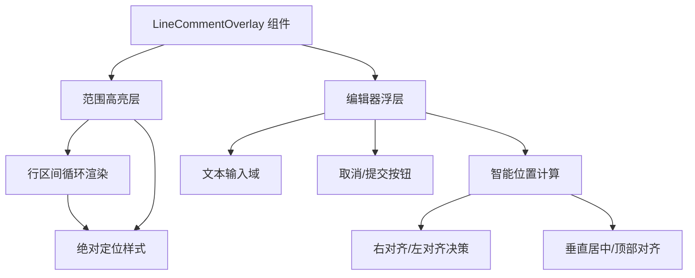

本文档详细说明 vis.thirdend 应用中代码行评论功能的实现机制、用户交互方式及技术架构。该功能允许用户对代码文件中的特定行或行范围添加注释评论，并通过浮层编辑器进行内容输入与提交。

## 功能概述
代码行评论功能通过 `LineCommentOverlay.vue` 组件实现，它是一个绝对定位的覆盖层，渲染在代码编辑器之上。该组件负责两个核心视觉元素：**范围高亮**显示选中的行区间，以及**评论编辑器**卡片用于输入和提交评论内容。编辑器位置会根据可用屏幕空间动态调整，确保始终可见且不超出边界。 Sources: [LineCommentOverlay.vue](app/components/LineCommentOverlay.vue#L1-L37)

组件接收三个关键 props：`editingLine` 表示当前正在编辑的行号（null 表示未激活），`selectedRange` 表示高亮的行区间 `{start, end}`，以及 `rowRects` 数组记录每一行的屏幕坐标信息 `{top, height, right}`。容器宽度 `containerWidth` 用于计算编辑器的水平位置。 Sources: [LineCommentOverlay.vue](app/components/LineCommentOverlay.vue#L45-L50)

## 视觉架构
组件视觉结构分为两个层次：底层是范围高亮层，顶层是编辑器浮层。高亮层通过绝对定位的 div 元素为每一行应用黄色半透明背景和左侧边框，形成连续的视觉区块。编辑器浮层则采用深色主题，与代码编辑器风格保持一致，包含文本域和操作按钮。 Sources: [LineCommentOverlay.vue](app/components/LineCommentOverlay.vue#L168-L200)

## 范围高亮机制
当 `selectedRange` 存在时，组件遍历从 `start` 到 `end` 的每一行，从 `rowRects` 获取对应的屏幕矩形数据，生成绝对定位样式对象。每个高亮元素占据整行宽度，高度与行高一致，通过黄色背景 `rgba(250, 204, 21, 0.18)` 和左侧强调边框 `rgba(250, 204, 21, 0.55)` 提供清晰的视觉反馈。 Sources: [LineCommentOverlay.vue](app/components/LineCommentOverlay.vue#L80-L95)

如果 `selectedRange.start` 与 `end` 相等（单行选择），则不显示范围标签；否则在编辑器上方显示 "Lines X–Y" 的区间标识。这种设计确保了单行评论与多行评论的视觉区分。 Sources: [LineCommentOverlay.vue](app/components/LineCommentOverlay.vue#L74-L78)

## 编辑器位置算法
编辑器浮层的位置计算基于当前编辑行 `editingLine` 的矩形数据 `editRect`，结合容器总宽度 `containerWidth` 进行智能布局决策。算法首先判断右侧空间是否足够容纳最大宽度（360px + 16px 边距），若足够则尝试右对齐，否则左对齐。垂直方向上，当行位于屏幕顶部区域（top < 100px）时放置在行下方，否则垂直居中对齐。 Sources: [LineCommentOverlay.vue](app/components/LineCommentOverlay.vue#L97-L130)

| 条件 | 水平位置 | 垂直位置 | 变换 |
|------|----------|----------|------|
| 右侧空间充足 + 靠近顶部 | `right` 对齐 | `top + height + 8px` | `translate(0, 0)` |
| 右侧空间充足 + 其他位置 | `right` 对齐 | `垂直居中` | `translate(0, -50%)` |
| 右侧空间不足 + 靠近顶部 | `left` 对齐 | `top + height + 8px` | `translate(-100%, 0)` |
| 右侧空间不足 + 其他位置 | `left` 对齐 | `垂直居中` | `translate(-100%, -50%)` |

## 交互设计
编辑器激活时，文本域自动聚焦并清空之前的内容。用户可通过键盘快捷键完成操作：按下 `Escape` 键取消编辑并关闭编辑器，按下 `Ctrl+Enter`（macOS 为 `Cmd+Enter`）提交评论内容。提交时自动去除首尾空白，空内容将被忽略。 Sources: [LineCommentOverlay.vue](app/components/LineCommentOverlay.vue#L132-L152)

编辑器包含两个操作按钮：**取消**按钮触发 `cancel` 事件，**评论**按钮触发 `submit` 事件并传递用户输入的文本内容。两个按钮均支持鼠标点击操作，完成交互闭环。 Sources: [LineCommentOverlay.vue](app/components/LineCommentOverlay.vue#L27-L34)

## 事件流与状态管理
组件采用 Vue 3 Composition API 模式，通过 `defineEmits` 声明两个事件：`submit` 传递评论文本字符串，`cancel` 不携带参数。父组件通过监听这些事件更新评论数据存储，通常与后端 API 交互持久化评论内容。 Sources: [LineCommentOverlay.vue](app/components/LineCommentOverlay.vue#L52-L55)

当 `editingLine` prop 发生变化时，watch 监听器会重置文本值为空字符串，并在下一个 DOM 更新周期后自动聚焦文本域，确保每次打开编辑器时都处于就绪状态。 Sources: [LineCommentOverlay.vue](app/components/LineCommentOverlay.vue#L132-L142)

## 样式与主题集成
组件样式采用 scoped CSS，确保样式隔离不影响全局。背景色和边框使用 CSS 变量 `var(--theme-surface-panel-elevated)` 和 `var(--theme-border-default)` 实现主题适配，使编辑器能够随应用主题切换自动调整外观。阴影效果使用 `var(--theme-dropdown-shadow)` 保持一致的设计语言。 Sources: [LineCommentOverlay.vue](app/components/LineCommentOverlay.vue#L182-L195)

高亮层的黄色系配色与评论功能的语义定位相符，半透明背景确保不影响下方代码的可读性，左侧边框提供明确的边界指示。整体 z-index 设置为 50，确保覆盖层位于代码内容之上但位于其他 UI 元素之下。 Sources: [LineCommentOverlay.vue](app/components/LineCommentOverlay.vue#L168-L180)

## 数据流与集成点
`LineCommentOverlay` 作为纯展示组件，不直接管理评论数据的持久化。其典型集成模式是：父组件（如代码查看器或编辑器面板）维护当前选中行、行矩形数据以及评论状态，当用户提交评论后，父组件调用 [消息系统](10-yong-hu-jie-mian-zu-jian) 或直接通过 [后端服务](8-hou-duan-fu-wu-yu-api) 接口存储评论数据。 Sources: [LineCommentOverlay.vue](app/components/LineCommentOverlay.vue#L1-L37)

行矩形数据 `rowRects` 通常由代码渲染器或虚拟滚动组件提供，每行代码的屏幕位置变化时需要同步更新以确保高亮和编辑器位置准确。这种设计将布局计算与评论逻辑解耦，提高了组件的复用性。 Sources: [LineCommentOverlay.vue](app/components/LineCommentOverlay.vue#L48-L49)

## 后续探索
- 了解评论数据的存储与检索机制，参考 [后端服务与 API](8-hou-duan-fu-wu-yu-api) 中的评论相关接口
- 查看评论在代码视图中的持久化显示方式，参考 [代码查看器组件](19-dai-ma-yu-diff-cha-kan-qi) 的实现
- 研究主题系统如何影响覆盖层外观，参考 [字体与主题管理](12-zi-ti-yu-zhu-ti-guan-li)