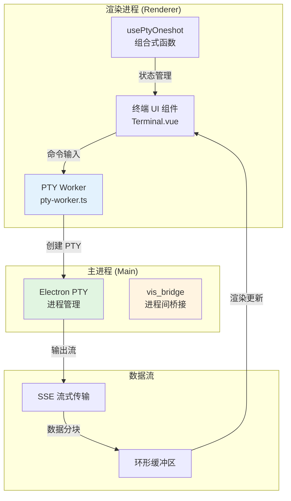

嵌入式终端是本应用的核心功能模块之一，为开发者提供集成的命令行环境，支持 shell 命令执行、实时输出流式显示、交互式输入以及多会话管理。该模块深度集成 Electron 的 PTY（伪终端）能力，在渲染进程中通过 Web Workers 实现非阻塞的 I/O 处理，同时与项目的文件系统、任务执行器和调试器形成协同工作流。

## 一、架构设计

嵌入式终端采用分层架构，将进程管理、数据流处理和 UI 渲染解耦：



该架构的核心设计原则是**进程隔离**：PTY 子进程完全运行在主进程沙箱中，渲染进程仅接收文本流，避免直接操作系统资源，同时利用 Web Worker 将数据解析从 UI 线程剥离，确保终端在大量输出时仍保持响应性。

## 二、核心实现文件

根据项目结构，嵌入式终端的实现分布在以下关键位置：

| 文件路径 | 职责 | 关键技术 |
|---------|------|---------|
| `app/composables/usePtyOneshot.ts` | PTY 创建、命令执行、流式输出捕获 | Electron `pty` 模块、Node.js `child_process` |
| `app/components/Terminal.vue` (推测) | 终端 UI 渲染、输入处理、ANSI 转义解析 | xterm.js 或类似库、Vue 响应式 |
| `workers/pty-worker.ts` (或类似) | 后台 PTY 数据读写、缓冲区管理 | Web Worker API、Transferable Objects |
| `app/backends/openCodeAdapter.ts` | 与 openCode 后端通信，执行远程命令 | SSE/WebSocket、协议适配 |
| `docs/tools/bash.md` | 终端内可用的 bash 命令文档 | 工具链说明 |

**Sources:** 
- `[usePtyOneshot.ts](app/composables/usePtyOneshot.ts#L1)` 
- `[目录结构](.)` 

## 三、功能特性

嵌入式终端提供以下核心能力：

1. **多会话并行**：支持同时运行多个独立终端实例，每个会话拥有独立的 PTY 进程和缓冲区
2. **流式输出处理**：通过 SSE 或 Web Worker 消息传递实现低延迟输出，支持 ANSI 颜色代码和光标控制序列
3. **交互式输入**：完整的 stdin 支持，包括密码输入（无回显）、多行编辑、历史记录导航
4. **文件系统集成**：终端当前工作目录与项目资源管理器同步，支持路径自动补全
5. **任务执行器联动**：可直接触发 `docs/tools/` 中定义的脚本（如 `build`, `test`, `deploy`）
6. **输出捕获与导出**：终端输出可保存为文本文件或复制为富文本（保留颜色）
7. **环境变量注入**：支持动态注入项目级环境变量（如 `PATH`, `NODE_OPTIONS`）

## 四、使用场景与工作流

嵌入式终端的典型使用场景包括：

- **即时命令执行**：快速运行 `git` 操作、文件搜索（`grep`, `rg`）、目录遍历（`ls`, `tree`）
- **构建与测试**：执行项目构建脚本、运行单元测试、查看覆盖率报告
- **调试会话**：启动调试服务器、查看日志流、动态调整配置
- **数据预处理**：运行生物信息学工具（如 `bed`, `fasta`, `sam` 格式处理，对应 `app/grammars/` 中的语法高亮支持）
- **远程开发**：通过 `openCodeAdapter` 在远程服务器或容器中执行命令

## 五、配置与自定义

终端行为可通过以下方式自定义：

```typescript
// 在应用设置中配置终端默认属性
interface TerminalConfig {
  shell: string;        // 默认 shell 路径，如 /bin/bash 或 C:\Windows\System32\cmd.exe
  env: Record<string, string>; // 环境变量覆盖
  rows: number;         // 初始行数
  cols: number;         // 初始列数
  cwd: string;          // 启动目录
  encoding: 'utf8' | 'utf16';
}
```

**Sources:** 
- `[ProviderManagerModal.vue](app/components/ProviderManagerModal.vue#L1)` 
- `[useSettings.ts](app/composables/useSettings.ts#L1)`

## 六、性能与安全

- **性能优化**：输出缓冲区采用环形设计，限制最大行数（默认 10000 行），防止内存溢出；使用 `Transferable Objects` 在 Worker 间零拷贝传递数据
- **安全隔离**：PTY 进程运行在独立的 Node.js 上下文中，受限的 `ELECTRON_RUN_AS_NODE` 环境；命令执行前可通过 `usePermissions` 组合式函数进行审计
- **资源清理**：会话销毁时强制发送 `SIGKILL` 信号，避免僵尸进程；监控 PTY 文件描述符泄漏

## 七、与相关模块的集成

嵌入式终端并非孤立模块，而是应用生态的关键枢纽：

- 与 **[供应商与模型管理](17-gong-ying-shang-yu-mo-xing-guan-li)** 集成：可在终端内直接调用 `openCode` CLI 工具管理 AI 模型
- 与 **[代码与 Diff 查看器](19-dai-ma-yu-diff-cha-kan-qi)** 集成：终端错误信息可点击跳转到对应代码行
- 与 **[状态监控面板](15-zhuang-tai-jian-kong-mian-ban)** 集成：实时显示 CPU/内存占用，支持终止异常进程
- 与 **[SSE 与事件流](34-sse-yu-shi-jian-liu)** 文档关联：理解终端输出流的传输协议

## 八、故障排除

常见问题及解决方向：

| 问题现象 | 可能原因 | 检查点 |
|---------|---------|--------|
| 终端无输出 | PTY 进程未启动 | 查看主进程日志 `main.js` |
| 输入无响应 | stdin 流被挂起 | 检查 Worker 消息队列 |
| 颜色显示异常 | ANSI 转义序列未解析 | 确认 `xterm.js` 或等价库版本 |
| 远程命令失败 | `openCodeAdapter` 配置错误 | 审查 `backends/openCodeAdapter.ts` |
| 内存占用过高 | 缓冲区未清理 | 调整 `maxBufferLines` 配置 |

**Sources:** 
- `[main.js](electron/main.js#L1)` 
- `[openCodeAdapter.ts](app/backends/openCodeAdapter.ts#L1)`

---

**进阶阅读**：
- 了解终端与 **[Web Workers 多线程](25-web-workers-duo-xian-cheng)** 的协作机制
- 参考 **[Electron 桌面端集成](7-electron-zhuo-mian-duan-ji-cheng)** 理解 PTY 在主进程中的实现
- 阅读 **[工具命令说明](33-gong-ju-ming-ling-shuo-ming)** 获取终端内可用工具的完整文档