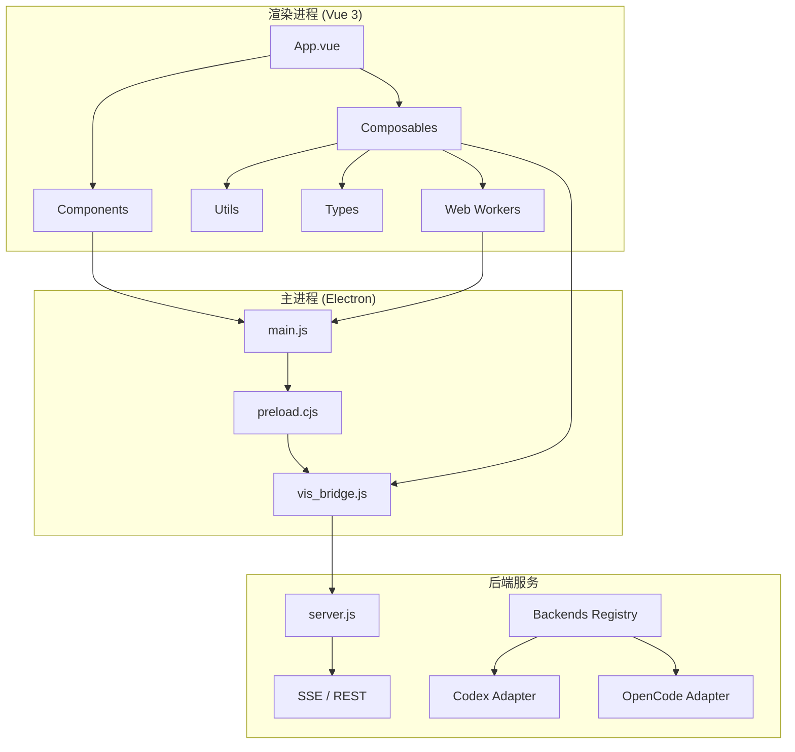

本页面提供 vis.thirdend 项目的完整目录结构概览，帮助开发者理解代码组织方式、核心模块划分以及技术栈架构。项目采用 **Electron + Vue 3 + TypeScript + Vite** 的现代前端技术栈，结合 Web Workers 实现多线程处理，并通过 vis_bridge 实现前后端通信。

## 顶层目录结构

项目根目录包含配置文件、构建脚本、文档资源以及核心应用代码，其组织遵循 Monorepo 工作区模式（通过 `pnpm-workspace.yaml` 管理）：

```
.
├── .git/                    # Git 版本控制
├── .github/workflows/       # GitHub Actions CI/CD 流水线配置
├── app/                     # 主应用代码（Vue 3 + TypeScript）
├── electron/                # Electron 主进程与预加载脚本
├── build/                   # 应用图标与打包配置文件
├── docs/                    # Markdown 文档与工具命令说明
├── scripts/                 # 开发与构建辅助脚本
├── .zread/wiki/             # 内部 Wiki 文档系统（当前版本、草稿、归档）
├── package.json             # 项目依赖与脚本定义
├── pnpm-workspace.yaml       # PNPM Monorepo 工作区配置
├── vite.config.ts            # Vite 构建工具配置
├── tsconfig.json             # TypeScript 编译配置
├── vis_bridge.js/.d.ts       # 前后端桥接器实现与类型定义
├── server.js                 # 本地开发服务器
└── postcss.config.mjs        # PostCSS 样式处理配置
```

## 应用核心目录：app/

`app/` 目录是整个前端应用的核心，采用功能模块化组织，包含组件、逻辑组合、工具函数、类型定义及 Web Workers。其结构如下：

```
app/
├── App.vue                    # 根组件，应用入口
├── main.ts                    # 应用初始化与挂载
├── index.html                 # HTML 模板
├── vite-env.d.ts              # Vite 环境类型声明
├── components/                # Vue 组件库
├── composables/               # Vue 3 Composition API 可组合函数
├── utils/                     # 通用工具函数库
├── types/                     # TypeScript 类型定义
├── workers/                   # Web Workers 后台线程
├── backends/                  # 后端服务适配层
├── grammars/                  # TextMate 语法高亮文件
├── i18n/                      # 国际化核心逻辑
├── locales/                   # 多语言翻译资源
├── styles/                    # 全局样式（Tailwind CSS）
└── public/                    # 静态资源（图标、Schema）
```

### components/：用户界面组件

组件目录按功能领域划分，包含面板、模态框、树视图等 UI 元素。关键组件包括：

- **CodeContent.vue** - 代码内容渲染组件
- **CodexPanel.vue** - Codex 智能助手面板
- **InputPanel.vue / OutputPanel.vue** - 输入输出面板
- **SidePanel.vue / TopPanel.vue** - 侧边栏与顶部面板
- **StatusBar.vue** - 状态栏
- **SessionTree.vue** - 会话树视图
- **ThreadBlock.vue / ThreadFooter.vue** - 线程块与页脚
- **ProviderManagerModal.vue** - 供应商管理模态框
- **FloatingWindow.vue** - 悬浮窗容器
- **Dropdown.vue** - 下拉选择组件
- **ToolWindow/** - 工具窗口目录

此外，还包含 `renderers/` 和 `viewers/` 子目录，用于处理特定内容的渲染与查看逻辑。`codex/` 子目录则包含与 Codex 功能相关的子组件。

**Sources: [directory structure provided]**

### composables/：可组合函数

该目录封装了 Vue 3 组合式 API 逻辑，实现状态管理、副作用处理与业务逻辑复用。每个文件通常对应一个独立的功能域：

- **useCodexApi.ts** - Codex API 调用封装
- **useMessages.ts** - 消息会话状态管理
- **useSettings.ts** - 用户设置持久化
- **useFloatingWindow.ts / useFloatingWindows.ts** - 悬浮窗生命周期管理
- **useCredentials.ts** - 凭证安全存储
- **useOpenCodeApi.ts** - OpenCode 接口适配
- **useRegionTheme.ts** - 区域主题切换
- **useStreamingWindowManager.ts** - 流式响应窗口调度
- **useThinkingAnimation.ts** - 思考动画状态
- **useFileTree.ts** - 文件树操作
- **usePermission.ts** - 权限控制

多数 `composables` 伴随对应的测试文件（`.test.ts`），确保逻辑正确性。

**Sources: [directory structure provided]**

### utils/：工具函数库

提供纯函数与业务辅助工具，涵盖数据处理、网络通信、文件解析、主题管理等：

- **sseConnection.ts** - Server-Sent Events 连接管理
- **eventEmitter.ts** - 事件发布订阅
- **theme.ts / themeRegistry.ts / themeTokens.ts** - 主题系统
- **regionTheme.ts** - 区域主题适配
- **formatters.ts** - 数据格式化
- **path.ts** - 路径处理
- **archiveParser.ts** - 归档文件解析
- **diffCompression.ts** - Diff 数据压缩
- **messageDiff.ts** - 消息差异计算
- **providerConfig.ts** - 供应商配置解析
- **opencode.ts** - OpenCode 协议工具
- **storageKeys.ts** - 本地存储键常量
- **notificationManager.ts** - 通知管理
- **mapWithConcurrency.ts** - 并发映射控制

工具函数普遍配备单元测试，保障稳定性。

**Sources: [directory structure provided]**

### types/：类型定义

集中管理 TypeScript 接口与类型，确保跨模块类型一致：

- **message.ts** - 消息与会话数据结构
- **session-tree.ts** - 会话树节点类型
- **sse.ts** - SSE 事件类型
- **sse-worker.ts** - Worker 通信消息类型
- **worker-state.ts** - Worker 状态管理类型
- **git.ts** - Git 操作相关类型

**Sources: [directory structure provided]**

### workers/：Web Workers

利用 Web Workers 实现后台计算与流式处理，避免阻塞主线程：

- **render-worker.ts** - 内容渲染 Worker
- **sse-shared-worker.ts** - SSE 共享 Worker，处理服务器推送事件

**Sources: [directory structure provided]**

### backends/：后端适配层

抽象后端服务接口，提供可插拔的后端实现：

- **registry.ts** - 后端服务注册与发现
- **openCodeAdapter.ts** - OpenCode 协议适配器
- **types.ts** - 后端服务类型定义
- **codex/** - Codex 特定后端实现

**Sources: [directory structure provided]**

### grammars/：语法高亮

存放 TextMate 语法定义文件（`.tmLanguage.json`），支持生物信息学格式（BED、FASTA、FASTQ、GTF、SAM、VCF）的语法高亮。

**Sources: [directory structure provided]**

### i18n/ 与 locales/：国际化

- **i18n/** - 国际化核心逻辑（useI18n 组合函数、类型定义、索引导出）
- **locales/** - 多语言翻译资源（英语、世界语、日语、简体中文、繁体中文）

**Sources: [directory structure provided]**

### styles/ 与 public/

- **styles/tailwind.css** - Tailwind CSS 全局样式
- **public/** - 静态资源（应用图标、JSON Schema 文件）

**Sources: [directory structure provided]**

## 桌面端集成目录：electron/

Electron 应用的主进程与预加载脚本，负责窗口管理、系统集成与安全上下文隔离：

```
electron/
├── main.js      # Electron 主进程入口，创建窗口与菜单
└── preload.cjs  # 预加载脚本，安全地暴露 API 给渲染进程
```

**Sources: [directory structure provided]**

## 构建与打包配置

```
build/
├── README.md          # 构建说明
├── icon.*             # 多平台应用图标（.icns、.ico、.png、.svg）
└── entitlements.mac.plist  # macOS 权限与沙盒配置
```

**Sources: [directory structure provided]**

## 文档资源目录：docs/

包含 Markdown 格式的项目文档、工具说明与截图：

```
docs/
├── API.md                    # API 参考文档
├── SSE.md                    # SSE 事件流说明
├── codex.md                  # Codex 功能文档
├── projects.md               # 项目管理说明
├── window-arch.md            # 窗口架构设计
├── demo.gif                  # 演示动画
├── screenshots/              # 界面截图集合
└── tools/                    # 内置工具命令详细文档（apply_patch、bash、edit、grep、lsp 等）
```

**Sources: [directory structure provided]**

## 内部 Wiki 系统：.zread/wiki/

项目的自研文档系统，用于管理当前文档状态、草稿与历史版本：

```
.zread/wiki/
├── current/    # 当前发布版本文档
├── drafts/     # 待审阅草稿
└── versions/   # 历史归档版本
```

**Sources: [directory structure provided]**

## 配置与脚本文件

根目录配置文件的职责说明：

| 文件 | 用途 |
|------|------|
| `package.json` | 定义项目元数据、依赖包、npm 脚本 |
| `pnpm-workspace.yaml` | 配置 PNPM 工作区，管理多包依赖 |
| `vite.config.ts` | Vite 构建配置（插件、路径别名、开发服务器） |
| `tsconfig.json` | TypeScript 编译选项与路径映射 |
| `postcss.config.mjs` | PostCSS 插件配置（通常用于 Tailwind） |
| `electron-builder.yml` | Electron 打包分发配置（平台、归档、签名） |
| `.oxlintrc.json` / `.oxfmtrc.json` | 代码检查与格式化规则 |
| `.gitignore` | Git 忽略文件规则 |

**Sources: [directory structure provided]**

## 架构概览

项目的整体架构可概括为三层：



渲染进程通过 `vis_bridge.js` 与 Electron 主进程通信，主进程再与后端服务交互。Web Workers 承担密集型计算任务，Composables 负责状态与逻辑抽象，Utils 提供纯函数支持。

**Sources: [directory structure provided]**

## 目录结构设计原则

1. **功能聚合**：按职责划分目录，组件、逻辑、工具分别存放，便于定位与复用
2. **类型安全**：集中类型定义，确保跨模块接口一致性
3. **并发处理**：使用 Web Workers 分离渲染与计算，提升响应性能
4. **可扩展性**：后端适配器注册机制支持多种服务端实现
5. **国际化优先**：语言资源独立，便于多语言维护
6. **测试覆盖**：核心模块配套单元测试，保障代码质量

## 下一步阅读建议

要深入理解项目各子系统，请参考以下文档页面：

- [前端架构设计](6-qian-duan-jia-gou-she-ji) - Vue 3 组件树、状态流转、路由方案
- [Electron 桌面端集成](7-electron-zhuo-mian-duan-ji-cheng) - 主进程、预加载脚本、IPC 通信
- [Composables 可组合函数](21-composables-ke-zu-he-han-shu) - 各 useX 函数的详细说明与使用示例
- [工具函数库](22-gong-ju-han-shu-ku) - 核心工具模块的 API 文档
- [类型定义](23-lei-xing-ding-yi) - 关键数据结构的类型定义
- [Web Workers 多线程](25-web-workers-duo-xian-cheng) - Worker 通信模式与性能考量
- [SSE 与事件流](34-sse-yu-shi-jian-liu) - 服务端推送的实现机制

**Sources: [directory structure provided]**