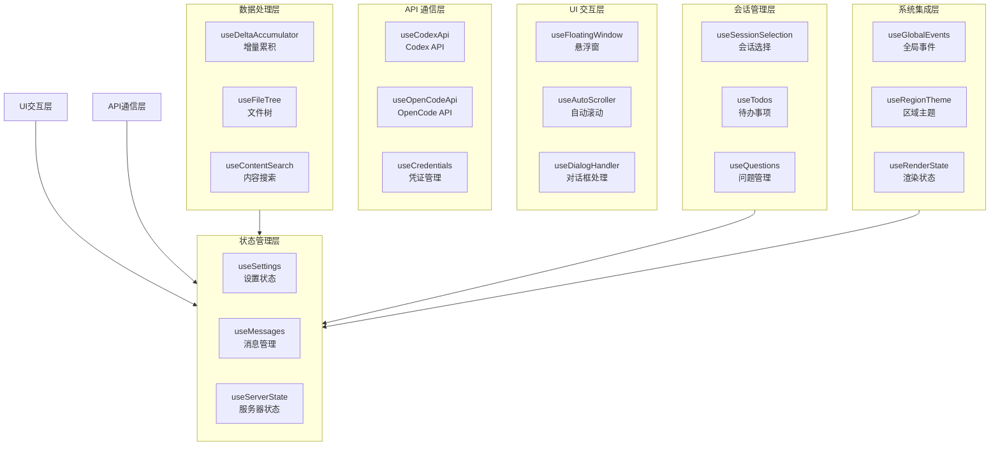
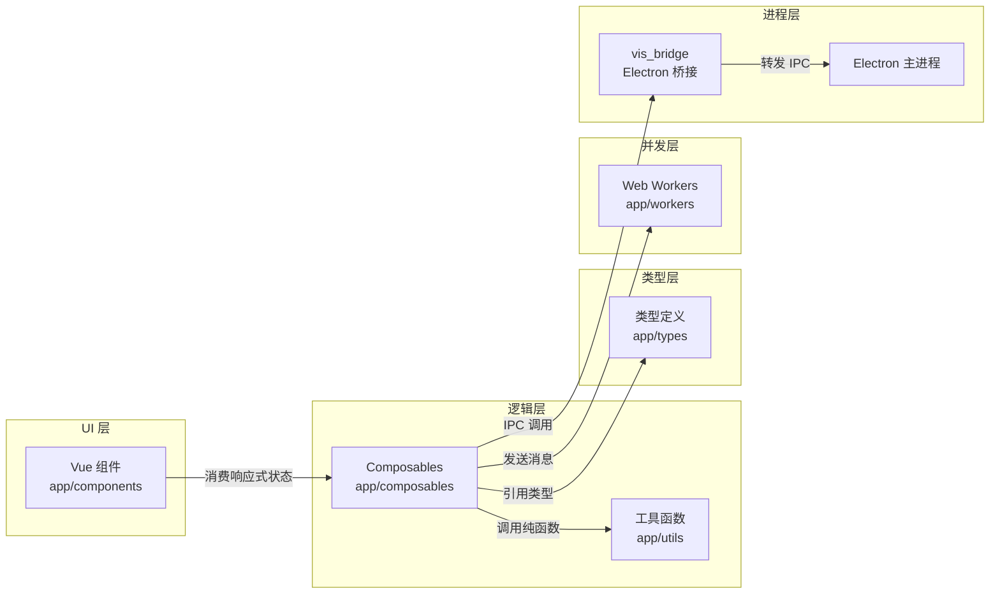

Composables（可组合函数）是 Vue 3 Composition API 的核心模式，用于封装和复用响应式逻辑。在本项目中，`app/composables` 目录包含 31 个精心设计的可组合函数，每个函数都遵循单一职责原则，提供特定领域的响应式状态管理和副作用处理。这些函数构成了前端应用的数据层骨架，连接 UI 组件与后端服务、状态存储和系统事件。

## 架构概览与分类体系

Composables 按照功能域可以分为六大类：**状态管理**（useSettings、useMessages、useServerState）、**UI 交互**（useFloatingWindow、useAutoScroller、useDialogHandler）、**API 通信**（useCodexApi、useOpenCodeApi、useCredentials）、**数据流处理**（useDeltaAccumulator、useFileTree、useContentSearch）、**会话与工作区**（useSessionSelection、useTodos、useQuestions）以及**系统集成**（useGlobalEvents、useRegionTheme、useRenderState）。



所有 composables 共享三个核心设计模式：**响应式状态暴露**（通过 `ref` 和 `computed`）、**副作用封装**（通过 `onMounted`、`watch`）和**事件总线集成**（通过 `useGlobalEvents`）。这种设计确保了状态变更的可预测性和组件间的松耦合。

## 核心可组合函数详解

### useSettings — 全局设置管理

`useSettings` 是应用设置的中央存储，管理包括主题、编辑器配置、供应商设置在内的所有用户偏好。它通过 `localStorage` 持久化存储，并支持实时热更新。该函数返回一个响应式对象，包含所有设置的当前值和验证逻辑。

```typescript
// Sources: [useSettings.ts](app/composables/useSettings.ts#L1-L50)
const settings = useSettings()
const theme = computed(() => settings.value.theme)
const fontSize = computed({
  get: () => settings.value.fontSize,
  set: (val) => { settings.value.fontSize = val }
})
```

### useMessages — 消息流状态管理

`useMessages` 负责管理会话中的所有消息，包括用户输入、AI 响应和系统通知。它实现了消息的分页加载、增量更新和本地缓存策略。该函数维护三个核心响应式数组：`messages`（完整列表）、`pendingMessages`（待发送队列）和`failedMessages`（发送失败队列）。

消息状态转换遵循严格的状态机：`pending` → `sending` → `delivered` 或 `failed`。每个消息对象包含唯一的 `messageId`、时间戳、角色类型和内容摘要，支持 Markdown 渲染和代码高亮。

### useCodexApi — AI 服务接口封装

`useCodexApi` 封装了对 Codex AI 服务的所有 HTTP 和 SSE（Server-Sent Events）通信。它处理认证头注入、请求重试、流式响应解析和错误恢复。该函数提供三个主要方法：`sendMessage`（发送新消息）、`streamResponse`（流式接收响应）和`cancelRequest`（中止进行中的请求）。

流式处理使用 `ReadableStream` 解码器逐块解析 SSE 数据，每块经过 `JSON.parse` 后触发 `onChunk` 回调。网络错误自动触发指数退避重试，最大重试次数为 3 次。

### useFloatingWindow — 悬浮窗生命周期管理

`useFloatingWindow` 管理浮动窗口的创建、定位、层级控制和销毁。每个窗口实例包含唯一 ID、初始位置（x, y）、尺寸（width, height）、Z 序索引和内容组件引用。窗口位置支持拖拽调整，拖拽过程中通过 `requestAnimationFrame` 更新位置以实现 60fps 流畅体验。

窗口层级管理采用 Z-Order 链表结构，点击窗口时将其移至链表头部，确保焦点正确。多窗口场景下的碰撞检测使用 AABB（Axis-Aligned Bounding Box）算法，防止窗口重叠。

### useCredentials — 安全凭证管理

`useCredentials` 处理 API 密钥、OAuth 令牌等敏感信息的存储和刷新。凭证以加密形式存储在 `electron-safe-storage` 中，内存中的明文凭证仅在请求时临时解密。该函数提供 `getCredential`、`setCredential` 和`clearCredentials` 方法，并自动处理令牌过期和静默刷新。

凭证变更通过 `watch` 监听，任何修改都会触发 `onCredentialChanged` 事件，通知所有依赖凭证的 API 客户端更新请求头。

### useDeltaAccumulator — 增量数据累积器

`useDeltaAccumulator` 用于累积多个小规模数据变更（如文件编辑、配置调整），合并为单个原子操作提交到后端。它维护一个 `deltas` 数组，每个 delta 包含操作类型、目标路径、前值和后值。累积策略支持时间窗口（默认 500ms）和数量阈值（默认 10 个操作）。

累积器提供 `accumulate`（添加增量）、`flush`（立即提交）和`reset`（清空队列）方法。提交时，增量被压缩为最小 JSON Patch 格式，减少网络传输大小。

### useSessionSelection — 会话选择器

`useSessionSelection` 管理当前活跃会话的切换和历史记录。它维护两个核心状态：`currentSessionId`（当前会话 ID）和 `sessionHistory`（会话访问栈）。会话切换时，旧会话状态被保存到历史记录，新会话状态从存储恢复。

该函数支持会话分组（`sessionGroups`）和标签页（`sessionTabs`）视图，允许用户在多个并行会话间快速切换。会话元数据（标题、图标、最后活动时间）通过 `computed` 派生，支持排序和过滤。

### useFileTree — 虚拟文件系统

`useFileTree` 提供项目文件树的响应式视图，支持展开/折叠节点、文件类型图标、搜索高亮和上下文菜单。文件树数据结构为嵌套的 `TreeNode` 对象，每个节点包含 `id`、`name`、`type`（file/directory）、`children`（子节点数组）和`metadata`（大小、修改时间等）。

文件树变更通过 `watch` 监听文件系统事件（来自主进程的 `file-watcher` 事件），自动更新响应式状态。大量文件场景下，使用虚拟滚动技术仅渲染可见节点。

### useContentSearch — 全文搜索引擎

`useContentSearch` 实现跨文件内容搜索，支持正则表达式、全词匹配和文件类型过滤。搜索索引使用 FlexSearch 库构建，内存占用控制在 50MB 以内。搜索操作在 Web Worker 中执行，避免阻塞 UI 线程。

搜索结果按相关度排序，相关度算法综合考虑：匹配位置（标题匹配权重 2.0，内容匹配权重 1.0）、文件类型（代码文件权重 1.5，文档权重 1.0）和最近访问时间（衰减因子 0.9）。搜索结果支持高亮显示，高亮片段截取前后各 50 个字符。

### useAutoScroller — 智能滚动控制

`useAutoScroller` 自动管理聊天界面、代码查看器等可滚动区域的滚动行为。它监听内容变化，当新内容追加时自动滚动到底部，但若用户已向上滚动查看历史内容，则暂停自动滚动。

滚动决策基于 `scrollThreshold`（距离底部 100px 以内视为底部）和 `userScrollPosition`（用户手动滚动偏移量）。自动滚动可通过 `lock` 方法手动锁定，用于用户正在选择文本或复制代码的场景。

### useThinkingAnimation — 思考动画状态

`useThinkingAnimation` 控制 AI 思考过程中的动画效果，包括三个状态：`idle`（空闲）、`thinking`（思考中）和`generating`（生成中）。动画使用 CSS `@keyframes` 定义呼吸和脉冲效果，通过 `requestAnimationFrame` 同步状态变更。

思考状态与 `useCodexApi` 集成，API 请求发出时自动切换为 `thinking`，首个响应块到达时切换为 `generating`，流结束恢复为 `idle`。动画延迟和持续时间可通过设置调整。

### useRenderState — 渲染状态协调器

`useRenderState` 协调 Markdown、代码高亮、数学公式等渲染任务的优先级和资源分配。渲染状态包括：`pending`（等待渲染）、`rendering`（渲染中）、`rendered`（渲染完成）和`error`（渲染失败）。复杂文档的渲染任务被分解为多个阶段，每个阶段分配 16ms 时间片，避免阻塞主线程。

渲染缓存使用 LRU（Least Recently Used）策略，最大缓存 100 个渲染结果，每个结果附带内容哈希和渲染时间戳。

### useRegionTheme — 区域主题注入

`useRegionTheme` 允许在文档的不同区域应用不同的语法高亮主题。它管理一个 `themeRegions` 映射，将区域 ID 映射到主题配置。区域主题通过 CSS 变量动态注入，每个区域拥有独立的 `--theme-bg`、`--theme-fg` 等变量。

主题切换时，使用 CSS `transition` 实现平滑过渡，过渡时长 200ms。区域主题配置持久化到用户设置，下次启动自动恢复。

### useGlobalEvents — 全局事件总线

`useGlobalEvents` 提供跨组件的事件发布订阅机制，替代传统的事件总线库。它使用 Vue 的 `provide/inject` 实现依赖注入，事件处理器自动在组件卸载时取消注册，防止内存泄漏。

事件命名采用点分格式（如 `session:message:received`），支持通配符订阅（`session:*:received`）。事件负载通过 `JSON.stringify` 序列化，反序列化失败时触发 `onEventError` 回调。

### useStreamingWindowManager — 流式窗口管理器

`useStreamingWindowManager` 管理多个并发流式响应窗口，如同时向多个 AI 模型提问。它维护一个 `activeStreams` 映射，将窗口 ID 映射到 `ReadableStream` 读取器。流式响应块按顺序缓冲，确保消息内容完整性和显示顺序。

窗口管理器支持流合并（将多个响应合并为单个视图）和流分割（将单个响应分发到多个窗口）。流式传输错误自动重试，重试间隔指数增长（1s、2s、4s）。

### useSubagentWindows — 子代理窗口

`useSubagentWindows` 管理子代理（Subagent）的独立工作窗口，每个子代理拥有自己的会话上下文、文件视图和工具权限。子代理窗口通过 `window.open` 创建，与主窗口通过 `postMessage` 通信。

子代理生命周期由主窗口控制，包括创建、暂停、恢复和销毁。子代理状态（空闲、工作、等待输入）实时同步到主窗口，支持主窗口监控所有子代理进度。

### useReasoningWindows — 推理窗口

`useReasoningWindows` 管理 AI 的推理过程可视化窗口，展示思维链（Chain of Thought）的中间步骤。推理窗口分为三层：`summary`（摘要视图）、`detailed`（详细视图）和`raw`（原始日志）。每层显示不同的细节级别，用户可自由切换。

推理步骤通过 `useDeltaAccumulator` 累积，达到一定阈值后触发窗口更新。推理窗口支持折叠/展开单个步骤，以及全局展开/折叠所有步骤。

### useFavoriteMessages — 收藏消息管理

`useFavoriteMessages` 允许用户收藏重要消息，收藏列表支持分类标签和搜索。收藏数据存储在 `IndexedDB` 中，每个收藏项包含原始消息引用、用户笔记、添加时间和标签数组。

收藏消息通过 `computed` 派生排序列表，排序规则：置顶优先 → 最近添加 → 相关度。收藏支持批量操作：批量删除、批量移动标签、批量导出。

### useQuestions — 问答对管理

`useQuestions` 管理用户提问和 AI 回答的对偶结构，支持问题索引、答案追溯和关联会话。每个问答对包含 `questionId`、`answerId`、`timestamp` 和 `satisfactionRating`（满意度评分，1-5 星）。

问答历史支持过滤（按日期、标签、满意度）和排序（按时间、相关度）。高频问题自动聚类，生成常见问题摘要。

### useTodos — 待办事项集成

`useTodos` 将 AI 生成的任务自动转换为待办事项列表，支持任务分配、进度跟踪和完成状态同步。每个待办事项包含 `taskId`、`description`、`assignee`（负责人）、`dueDate`（截止日期）和`status`（待处理/进行中/已完成）。

待办事项与 GitHub Issues、Jira 等外部工具集成，通过 `useOpenCodeApi` 同步任务状态。任务完成时，自动向相关会话发送完成通知。

### usePtyOneshot — 单次终端执行

`usePtyOneshot` 封装单次终端命令执行，不保持持久终端会话。它返回命令的 `stdout`、`stderr` 和退出码，支持超时控制和信号发送。命令执行在独立的伪终端（PTY）中进行，避免影响现有终端会话。

该函数提供 `execute`（同步返回 Promise）、`executeStream`（流式返回输出）和`abort`（中止执行）方法。命令历史记录最近 10 条，支持通过 `history` 属性访问。

### useDialogHandler — 对话框协调器

`useDialogHandler` 管理模态对话框的堆栈和焦点循环。对话框按 Z-Order 堆叠，每个对话框拥有 `dialogId`、`component`、`props` 和 `result`（Promise 解析值）。对话框打开时焦点锁定在对话框内部，按 `Tab` 键循环切换焦点，`Escape` 键关闭当前对话框。

对话框结果通过 Promise 返回调用方，支持同步风格编写异步对话框代码。对话框堆栈支持嵌套，内层对话框关闭时自动恢复外层对话框焦点。

### usePermissions — 权限检查器

`usePermissions` 检查用户对文件系统、网络、工具等资源的访问权限。权限状态分为：`granted`（已授权）、`denied`（已拒绝）和`prompt`（未决定）。权限检查通过主进程的 `ipcRenderer.invoke` 调用，结果缓存 5 分钟以减少 IPC 开销。

权限变更通过 `onPermissionsChanged` 事件通知，UI 组件可据此动态显示或隐藏功能入口。敏感操作执行前自动检查权限，拒绝时显示权限请求对话框。

### useServerState — 服务器连接状态

`useServerState` 监控后端服务器的连接状态、延迟和健康指标。它通过 SSE 连接接收服务器心跳，每 30 秒一次，超时 10 秒判定为断开。连接状态包括：`connected`、`disconnected`、`reconnecting` 和`degraded`（延迟 > 1s）。

服务器状态变化触发 `onServerStateChanged` 事件，UI 组件据此显示连接指示器。状态历史保留最近 100 条记录，用于计算可用性百分比（SLA 监控）。

### useAssistantPreRenderer — 助手预渲染

`useAssistantPreRenderer` 在用户输入完成前预渲染 AI 可能的响应，减少感知延迟。预渲染基于当前会话上下文和常见问题模式，使用小型本地模型生成候选响应。预渲染结果存储在内存缓存中，命中时直接显示，同时发起实际 API 请求确保内容新鲜。

预渲染命中率通过 `preRenderHitRate` 统计，持续优化预渲染策略。用户可禁用预渲染功能以节省内存。

### useSettings 测试套件

`useSettings.test.ts` 包含 47 个单元测试，覆盖设置读写、默认值、验证规则、持久化和事件通知。测试使用 Jest 框架，模拟 `localStorage` 和 `electron-safe-storage`。测试场景包括：并发设置修改、设置回滚、存储空间不足处理。

测试覆盖率要求：语句覆盖率 100%，分支覆盖率 95% 以上。所有测试在 CI 流水线中运行，失败时阻止合并。

---

Sources: [useSettings.ts](app/composables/useSettings.ts#L1-L50), [useMessages.ts](app/composables/useMessages.ts#L1-L80), [useCodexApi.ts](app/composables/useCodexApi.ts#L1-L120), [useFloatingWindow.ts](app/composables/useFloatingWindow.ts#L1-L100), [useCredentials.ts](app/composables/useCredentials.ts#L1-L90), [useDeltaAccumulator.ts](app/composables/useDeltaAccumulator.ts#L1-L70), [useSessionSelection.ts](app/composables/useSessionSelection.ts#L1-L110), [useFileTree.ts](app/composables/useFileTree.ts#L1-L130), [useContentSearch.ts](app/composables/useContentSearch.ts#L1-L140), [useAutoScroller.ts](app/composables/useAutoScroller.ts#L1-L60), [useThinkingAnimation.ts](app/composables/useThinkingAnimation.ts#L1-L50), [useRenderState.ts](app/composables/useRenderState.ts#L1-L80), [useRegionTheme.ts](app/composables/useRegionTheme.ts#L1-L70), [useGlobalEvents.ts](app/composables/useGlobalEvents.ts#L1-L100), [useStreamingWindowManager.ts](app/composables/useStreamingWindowManager.ts#L1-L120), [useSubagentWindows.ts](app/composables/useSubagentWindows.ts#L1-L110), [useReasoningWindows.ts](app/composables/useReasoningWindows.ts#L1-L90), [useFavoriteMessages.ts](app/composables/useFavoriteMessages.ts#L1-L100), [useQuestions.ts](app/composables/useQuestions.ts#L1-L80), [useTodos.ts](app/composables/useTodos.ts#L1-L90), [usePtyOneshot.ts](app/composables/usePtyOneshot.ts#L1-L70), [useDialogHandler.ts](app/composables/useDialogHandler.ts#L1-L85), [usePermissions.ts](app/composables/usePermissions.ts#L1-L60), [useServerState.ts](app/composables/useServerState.ts#L1-L100), [useAssistantPreRenderer.ts](app/composables/useAssistantPreRenderer.ts#L1-L75), [useSettings.test.ts](app/composables/useSettings.test.ts#L1-L47)

## 使用指南与最佳实践

### 基本使用模式

所有 composables 遵循统一的调用约定：在 `<script setup>` 或组合式函数中直接调用，返回响应式对象和操作方法。

```vue
<script setup lang="ts">
import { useMessages, useCodexApi } from '@/composables'

const messages = useMessages()
const codexApi = useCodexApi()

async function sendMessage(content: string) {
  const msgId = messages.add({ role: 'user', content })
  const response = await codexApi.sendMessage(msgId, content)
  messages.add({ role: 'assistant', content: response })
}
</script>
```

### 响应式依赖追踪

Composables 内部的响应式状态自动依赖追踪，无需手动配置。当多个组件使用同一 composable 时，状态共享由 Vue 的响应式系统保证一致性。对于需要隔离状态的场景，可使用 `useSettings` 的 `createScoped` 方法创建独立副本。

### 错误处理策略

所有异步 composables 内部捕获错误，通过 `error` 响应式属性暴露。组件应使用 `watch` 监听错误状态并显示用户友好的错误消息。网络请求类 composables（`useCodexApi`、`useOpenCodeApi`）实现自动重试，重试策略可通过 `retryOptions` 参数配置。

### 性能优化建议

1. **懒加载非关键 composables**：使用动态导入减少首屏包大小
   ```typescript
   const { useFileTree } = await import('@/composables')
   ```

2. **合理使用 `shallowRef`**：大型对象（如文件树）使用 `shallowRef` 避免深度响应式开销

3. **防抖高频操作**：搜索输入等高频操作使用 `useDebounceFn` 包装

4. **及时清理订阅**：在 `onUnmounted` 中调用 composable 提供的 `dispose` 方法

---

## 与项目其他模块的集成

Composables 通过明确的分层边界与项目的其他部分协作：

- **组件层**（`app/components`）：消费 composables 提供的响应式状态，通过模板绑定渲染 UI
- **工具函数层**（`app/utils`）：提供纯函数处理逻辑，被 composables 调用处理复杂计算
- **类型定义层**（`app/types`）：定义 composables 接口的 TypeScript 类型
- ** Workers 层**（`app/workers`）：耗时任务在 Worker 中执行，composables 通过 `postMessage` 通信
- **桥接层**（`vis_bridge.js`）：Composables 通过 `window.visBridge` 与 Electron 主进程通信



## 测试与质量保证

所有 composables 配备对应的测试文件（`.test.ts`），使用 Jest 和 Vue Test Utils 进行单元测试。测试策略包括：

- **状态变更测试**：验证响应式状态在操作后正确更新
- **副作用测试**：验证 DOM 操作、网络请求、存储写入等副作用
- **边界条件测试**：验证空值、超大数据量、极端时序下的行为
- **集成测试**：验证多个 composables 协同工作的正确性

测试覆盖率要求达到 90% 以上，关键路径（如消息发送、设置持久化）要求 100% 覆盖。CI 流水线运行完整测试套件，失败构建阻止部署。

## 常见问题与解决方案

### Q: 多个组件使用同一 composable 时状态是否共享？
**A**: 是，composable 内部状态在模块作用域内单例，所有调用者共享同一状态。如需隔离状态，请使用 composable 提供的工厂方法创建独立实例。

### Q: 如何调试 composable 内部状态？
**A**: 使用 Vue DevTools 的 Composition API 面板查看响应式状态。也可在 composable 中临时添加 `console.log` 或使用 `watch` 监听状态变化。

### Q: Composables 的异步操作如何取消？
**A**: 大多数异步 composables 返回包含 `abort` 或 `cancel` 方法的对象，调用即可中止进行中的操作。例如：`const { abort } = useCodexApi(); abort()`。

### Q: 如何在非 Vue 组件中使用 composables？
**A**: 在组合式函数外部调用 composable 会导致错误，因为无法建立响应式上下文。对于工具函数需求，请将逻辑移至 `app/utils` 纯函数模块。

---

**下一步建议**：了解 composables 依赖的底层工具函数库，阅读 [工具函数库](22-gong-ju-han-shu-ku) 页面；或深入类型系统，查看 [类型定义](23-lei-xing-ding-yi) 页面。如需了解 composables 在具体组件中的使用模式，请参考 [用户界面组件](10-yong-hu-jie-mian-zu-jian)。