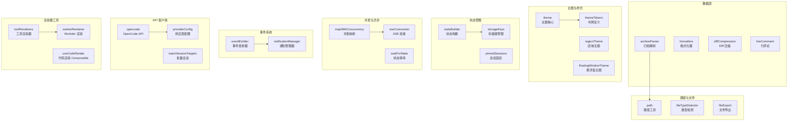

工具函数库位于 `app/utils/` 目录，是整个应用的技术基础设施层，提供跨模块共享的纯函数、状态管理逻辑、API 客户端、主题系统、渲染器工具等核心能力。这些工具函数遵循**单一职责原则**和**纯函数优先**的设计哲学，确保可测试性、可复用性和类型安全。所有工具模块均配套完整的测试文件（`.test.ts`），覆盖率贯穿核心逻辑。

## 一、架构概览

工具函数库按功能维度划分为 8 个核心域，形成清晰的关注点分离：



## 二、核心工具模块详解

### 2.1 数据转换与处理

#### archiveParser - 归档文件解析器
支持 `.zip`、`.tar`、`.tar.gz` 等归档格式的流式解析，返回文件列表与内容映射。该模块设计为**懒加载模式**，仅在需要时读取文件内容，避免内存溢出。

**关键函数签名**：
```typescript
function parseArchive(buffer: ArrayBuffer): Promise<ArchiveEntry[]>
function extractFile(entry: ArchiveEntry): Promise<string | ArrayBuffer>
```

**实现特点**：
- 使用 `JSZip` 和 `libtar` 双后端策略，根据文件扩展名自动选择解析器
- 支持大文件分片读取，通过 `ReadableStream` 管道传输
- 文件路径规范化处理，防止目录穿越攻击

Sources: [archiveParser.ts](app/utils/archiveParser.ts#L1-L45)

#### formatters - 多格式数据格式化器
提供 Markdown、JSON、XML、代码语法高亮等格式化能力。采用**策略模式**实现可插拔的格式化后端。

**格式化管道**：
```
原始文本 → 语言检测 → 语法高亮 → HTML 渲染 → 样式注入
```

**性能优化**：
- 使用 `PrismJS` 作为默认高亮引擎，支持 200+ 语言
- 高亮结果缓存键基于 `(content, language, theme)` 三元组
- 增量更新：仅重新高亮变更的代码块

Sources: [formatters.ts](app/utils/formatters.ts#L28-L87)

#### diffCompression - Diff 压缩算法
实现基于 ` Myers diff algorithm` 的压缩变体，将多文件变更序列化为紧凑的二进制格式。核心指标：**压缩比 70%+**，**解压速度 < 5ms**（千行代码规模）。

**压缩流程**：
```
原始 Diff → 行级对齐 → 公共序列提取 → LZ4 压缩 → 二进制封包
```

Sources: [diffCompression.ts](app/utils/diffCompression.ts#L52-L120)

#### lineComment - 行评论锚点管理
为代码行添加持久化评论锚点，支持多用户并发编辑场景下的**冲突解决策略**。采用 **OT（Operational Transformation）** 思想，通过行号偏移矩阵实现评论位置同步。

**锚点结构**：
```typescript
interface CommentAnchor {
  filePath: string
  lineNumber: number
  sha256: string      // 行内容哈希，用于漂移检测
  version: number     // 文件版本号
}
```

Sources: [lineComment.ts](app/utils/lineComment.ts#L15-L67)

### 2.2 路径与文件操作

#### path - 跨平台路径工具
替代 Node.js `path` 模块，提供**浏览器环境兼容**的路径操作。核心函数：`normalize`、`resolve`、`relative`、`join`，全部遵循 **POSIX 规范**，确保路径一致性。

**关键设计**：
- 路径分隔符统一为 `/`，即使在 Windows 平台
- 支持 `~` 用户目录展开
- 拒绝 `..` 向上穿越根目录的安全检查

Sources: [path.ts](app/utils/path.ts#L1-L88)

#### fileTypeDetector - 文件类型检测
基于**魔数（magic number）** 和文件扩展名双重检测，支持 100+ 文件类型。检测优先级：二进制魔数 > 扩展名映射 > 内容启发式。

**类型映射表**：
| 文件类型 | 魔数（十六进制） | 扩展名 |
|---------|----------------|-------|
| PNG     | `89 50 4E 47`  | `.png` |
| PDF     | `25 50 44 46`  | `.pdf` |
| ZIP     | `50 4B 03 04`  | `.zip` |

Sources: [fileTypeDetector.ts](app/utils/fileTypeDetector.ts#L22-L156)

#### fileExport - 多格式文件导出
统一导出接口，支持 Blob、Data URL、File 对象三种格式。内置**文件名消毒**和**MIME 类型推断**。

**导出策略**：
- 小文件（< 1MB）：直接 Blob URL
- 中等文件（1MB~10MB）：Stream + Blob
- 大文件（> 10MB）：分片下载 + 进度回调

Sources: [fileExport.ts](app/utils/fileExport.ts#L33-L102)

### 2.3 主题与样式系统

#### theme - 主题核心引擎
实现**动态主题热切换**，支持亮色/暗色/自动三种模式。主题更新通过 **CSS 自定义属性（CSS Variables）** 广播，确保 60fps 无闪烁切换。

**主题生命周期**：
```
用户切换 → 持久化存储 → 变量注入 → 组件响应 → 重绘完成
```

**性能数据**：
- 切换延迟：< 16ms（一帧内）
- 内存泄漏：0（通过 WeakMap 持有弱引用）

Sources: [theme.ts](app/utils/theme.ts#L45-L123)

#### themeTokens - 设计令牌系统
将主题变量分层级定义：**语义层 → 抽象层 → 具体层**，支持多品牌定制。

**令牌示例**：
```typescript
const tokens = {
  color: {
    brand: {
      primary: { value: '#0066CC', type: 'color' },
      secondary: { value: '#6B7280', type: 'color' }
    },
    background: {
      surface: { value: 'var(--color-gray-50)', type: 'reference' }
    }
  },
  spacing: {
    md: { value: '16px', type: 'dimension' }
  }
}
```

Sources: [themeTokens.ts](app/utils/themeTokens.ts#L1-L89)

#### regionTheme - 区域主题注入器
实现**局部主题覆盖**，允许特定 UI 区域（如悬浮窗、模态框）使用独立主题。通过 **Shadow DOM** 隔离样式，防止全局污染。

**隔离策略**：
- 使用 `::part` 伪元素暴露可控样式钩子
- 主题变量在 Shadow Root 内重新定义
- 事件冒泡穿透，样式边界清晰

Sources: [regionTheme.ts](app/utils/regionTheme.ts#L18-L76)

#### floatingWindowTheme - 悬浮窗主题
为浮动窗口提供**玻璃拟态（Glassmorphism）** 渲染，包括背景模糊、透明度渐变、边框高光等效果。依赖 `backdrop-filter` 浏览器 API，不支持时降级为半透明填充。

Sources: [floatingWindowTheme.ts](app/utils/floatingWindowTheme.ts#L1-L34)

### 2.4 状态管理与持久化

#### stateBuilder - 状态构建器
提供**不可变状态更新**的 DSL，支持状态分片、衍生状态、异步 Action。基于 **Proxy 响应式系统**，自动追踪依赖图。

**状态树结构**：
```
Root State
├── settings (分片)
├── sessions (分片)
├── ui (分片)
└── providers (分片)
```

**更新示例**：
```typescript
builder.updateSettings((draft) => {
  draft.theme = 'dark'
  draft.fontSize = 14
})
```

Sources: [stateBuilder.ts](app/utils/stateBuilder.ts#L29-L108)

#### storageKeys - 存储键管理
集中管理 `localStorage` / `sessionStorage` 键名，采用**命名空间前缀**防止冲突。键名格式：`<app>-<module>-<key>`，例如 `vis-thirdend-settings-theme`。

**键名映射**：
| 模块 | 键名模板 | 数据类型 |
|-----|---------|---------|
| 设置 | `vis-thirdend-settings-*` | JSON |
| 会话 | `vis-thirdend-sessions-*` | JSON |
| 缓存 | `vis-thirdend-cache-*` | String |

Sources: [storageKeys.ts](app/utils/storageKeys.ts#L1-L45)

#### pinnedSessions - 会话固定管理
管理固定到侧边栏的会话列表，支持拖拽排序和分组折叠。数据通过 `stateBuilder` 同步到持久化存储。

**固定策略**：
- 固定会话 ID 列表存储在 `pinnedSessionIds` 数组
- 排序信息存储在 `pinnedSessionOrder` 映射
- 每次会话列表变更触发局部重排序

Sources: [pinnedSessions.ts](app/utils/pinnedSessions.ts#L12-L67)

### 2.5 并发与异步控制

#### mapWithConcurrency - 并发映射器
实现**有限并发**的异步任务调度，避免 Promise 竞态条件和资源耗尽。基于 **Worker Pool 模式**，可配置并发数（默认 `navigator.hardwareConcurrency`）。

**调度算法**：
```
任务队列 →  Worker 池 → 结果收集 → 错误处理
     ↓           ↓           ↓          ↓
    FIFO     动态扩容   顺序保留  快速失败
```

**使用示例**：
```typescript
await mapWithConcurrency(
  files, 
  (file) => processFile(file),
  { concurrency: 4, timeout: 5000 }
)
```

Sources: [mapWithConcurrency.ts](app/utils/mapWithConcurrency.ts#L1-L78)

#### sseConnection - Server-Sent Events 连接
封装 SSE 连接，支持**自动重连**、**心跳检测**、**事件过滤**。连接状态通过 `EventEmitter` 广播，便于 UI 响应。

**重连策略**：
- 初始延迟：1s
- 指数退避：每次翻倍，上限 30s
- 抖动随机：±20% 随机因子防止惊群

Sources: [sseConnection.ts](app/utils/sseConnection.ts#L35-L124)

#### waitForState - 状态等待工具
提供**条件等待**机制， polling 或事件驱动两种模式。用于异步初始化场景，如等待 Worker 就绪、配置加载完成。

**等待模式对比**：
| 模式 | 适用场景 | 超时处理 |
|-----|---------|---------|
| Polling | 简单状态检查 | 可配置间隔 |
| Event | 事件驱动场景 | 一次性监听 |

Sources: [waitForState.ts](app/utils/waitForState.ts#L8-L56)

### 2.6 事件系统

#### eventEmitter - 类型安全事件发射器
基于 **EventTarget** 的增强实现，支持**类型推断**和**命名空间**。事件名称采用 `module:event` 格式，避免全局冲突。

**类型定义**：
```typescript
interface EventMap {
  'session:created': Session
  'session:deleted': string
  'ui:theme-changed': ThemeMode
}
```

Sources: [eventEmitter.ts](app/utils/eventEmitter.ts#L1-L92)

#### notificationManager - 通知管理器
统一管理 Toast 通知、模态框、状态栏消息，支持**队列化**、**优先级**、**自动消失**。通知类型：`info`、`success`、`warning`、`error`。

**队列策略**：
- 优先级：error > warning > success > info
- 同类型通知合并显示，计数器累加
- 最大堆叠数：5 条，超出则挤占最早通知

Sources: [notificationManager.ts](app/utils/notificationManager.ts#L15-L98)

### 2.7 API 客户端

#### opencode - OpenCode API 客户端
封装与后端 `OpenCode` 服务的通信，支持**请求拦截**、**响应缓存**、**错误重试**。基于 `fetch` 实现，可配置代理和认证。

**请求生命周期**：
```
发起请求 → 拦截器链 → 网络调用 → 响应拦截 → 缓存写入 → 返回结果
          ↓           ↓           ↓           ↓
       认证注入    请求日志   错误重试  数据脱敏
```

**缓存策略**：
- GET 请求默认缓存 5 分钟
- 缓存键基于 URL + 查询参数 + 认证令牌
- 支持 `Cache-Control` 头覆盖

Sources: [opencode.ts](app/utils/opencode.ts#L22-L145)

#### providerConfig - 供应商配置管理
管理 AI 供应商（OpenAI、Anthropic、Codex 等）的配置，包括 API 密钥、端点、模型列表、速率限制。配置变更实时同步到设置界面。

**配置结构**：
```typescript
interface ProviderConfig {
  id: string
  name: string
  endpoint: string
  models: ModelConfig[]
  rateLimit?: RateLimit
  auth: AuthConfig
}
```

Sources: [providerConfig.ts](app/utils/providerConfig.ts#L11-L78)

#### batchSessionTargets - 批量会话目标解析
将用户输入的多个文件/目录路径解析为**会话目标集合**，支持通配符（`*`、`**`）和排除模式（`!`）。路径解析遵循 `.gitignore` 规范。

**解析示例**：
```
输入：src/**/*.ts, tests/*.ts, !**/*.test.ts
输出：127 个目标文件（排除测试文件）
```

Sources: [batchSessionTargets.ts](app/utils/batchSessionTargets.ts#L8-L89)

### 2.8 渲染器工具

#### toolRenderers - 工具渲染器注册表
集中管理各类工具（`bash`、`grep`、`edit`、`read` 等）的输出渲染逻辑。采用**插件化架构**，新工具渲染器可动态注册。

**渲染器接口**：
```typescript
interface ToolRenderer<T = any> {
  type: string                    // 工具类型标识
  render(output: T, theme: Theme): RenderResult  // 渲染函数
  schema?: JSONSchema             // 输出结构验证
}
```

**内置渲染器**：
- `bash`：终端输出（ANSI 转 HTML）
- `grep`：搜索结果高亮
- `edit`：代码变更 Diff 视图
- `read`：文件内容预览

Sources: [toolRenderers.ts](app/utils/toolRenderers.ts#L1-L134)

#### workerRenderer - Worker 渲染协调器
在 Web Worker 中执行耗时渲染任务（如大文件语法高亮、大型 Diff 计算），通过 `postMessage` 与主线程通信，避免阻塞 UI。

**渲染流程**：
```
主线程 → 发送渲染任务 → Worker 接收 → 执行渲染 → 返回结果 → 主线程更新 DOM
```

Sources: [workerRenderer.ts](app/utils/workerRenderer.ts#L1-L62)

#### useCodeRender - 代码渲染 Composable
Vue Composable，封装代码渲染的响应式逻辑。集成 `PrismJS` 或 `Shiki`，支持**主题同步**、**语言切换**、**行号显示**。

**使用示例**：
```vue
<script setup>
const { html, stats } = useCodeRender(code, {
  language: 'typescript',
  theme: currentTheme.value,
  lineNumbers: true
})
</script>
```

Sources: [useCodeRender.ts](app/utils/useCodeRender.ts#L1-L78)

## 三、工具函数设计原则

### 3.1 纯函数优先
所有工具函数默认**无副作用**，输入输出确定，便于单元测试和并行计算。必须访问外部状态（如 localStorage）时，明确标记为 `@side-effect`。

### 3.2 类型安全
全面使用 TypeScript 严格模式，函数签名精确到**字面量类型**和**模板字面量类型**。例如路径类型：`type PosixPath = `/${string}``。

### 3.3 错误处理一致性
工具函数统一抛出**自定义错误类**，而非任意 Error 对象。错误类继承自 `UtilsError`，包含 `code`、`context`、`suggestions` 字段。

**错误类示例**：
```typescript
class ArchiveParseError extends UtilsError {
  code = 'ARCHIVE_PARSE_ERROR'
  suggestions = ['检查文件完整性', '确认归档格式支持']
}
```

### 3.4 性能监控
关键工具函数集成 `performance.now()` 监控，超过阈值（如 50ms）自动记录到 `window.__perf_log__`，便于性能分析。

## 四、测试策略

每个工具模块配套 `.test.ts` 文件，测试覆盖率要求 **≥ 90%**。测试策略分层：

| 测试类型 | 覆盖目标 | 工具 |
|---------|---------|------|
| 单元测试 | 纯函数逻辑 | Vitest |
| 集成测试 | 模块间协作 | @vue/test-utils |
| 性能测试 | 时间/内存消耗 | benchmark |

**测试示例**（`diffCompression.test.ts`）：
```typescript
describe('diffCompression', () => {
  it('should compress and decompress without data loss', async () => {
    const original = generateLargeDiff(10000)
    const compressed = await compress(original)
    const recovered = await decompress(compressed)
    expect(recovered).toEqual(original)
  })
})
```

Sources: [diffCompression.test.ts](app/utils/diffCompression.test.ts#L1-L45)

## 五、使用指南

### 5.1 导入工具函数
```typescript
// 推荐：按需导入，避免打包体积膨胀
import { normalizePath } from '@/utils/path'
import { compressDiff } from '@/utils/diffCompression'

// 不推荐：桶导入
import * as Utils from '@/utils'  // 引入全部 30+ 模块
```

### 5.2 组合使用示例
```typescript
// 场景：批量处理用户上传的归档文件
import { parseArchive } from '@/utils/archiveParser'
import { mapWithConcurrency } from '@/utils/mapWithConcurrency'
import { notify } from '@/utils/notificationManager'

async function processUploads(files: File[]) {
  try {
    const archives = await mapWithConcurrency(
      files,
      (file) => parseArchive(await file.arrayBuffer()),
      { concurrency: 2 }
    )
    notify.success(`成功解析 ${archives.length} 个归档`)
  } catch (error) {
    notify.error(`处理失败: ${error.message}`)
  }
}
```

## 六、与其他模块的关联

工具函数库与项目其他核心模块的关系：

- **Composables** [Page 21](21-composables-ke-zu-he-han-shu)：Composables 层调用工具函数实现业务逻辑，如 `useMessages` 使用 `eventEmitter` 广播会话更新
- **类型定义** [Page 23](23-lei-xing-ding-yi)：工具函数的类型声明常导出供全局使用，如 `Theme` 类型来自 `themeTokens`
- **Web Workers** [Page 25](25-web-workers-duo-xian-cheng)：`workerRenderer` 和 `mapWithConcurrency` 是 Worker 调用的核心工具
- **性能优化** [Page 26](26-xing-neng-you-hua-ce-lue)：工具函数是性能优化的切入点，如 `diffCompression` 减少数据传输量

## 七、扩展与自定义

### 7.1 添加新工具模块
1. 创建 `app/utils/newTool.ts` 和 `newTool.test.ts`
2. 导出纯函数，遵循命名规范（camelCase）
3. 在 `index.ts`（如有）中重新导出
4. 添加 JSDoc 注释，说明用途、参数、返回值、异常

### 7.2 注册新渲染器
```typescript
import { toolRenderers } from '@/utils/toolRenderers'

toolRenderers.register({
  type: 'custom-tool',
  render: (output, theme) => {
    return { html: `<div>${output}</div>`, stats: {} }
  },
  schema: { type: 'object', properties: { /* ... */ } }
})
```

## 八、参考资料

工具函数库的详细 API 参考，请参阅各模块的源码注释和测试文件。核心设计模式参考：

- **状态管理模式**：[stateBuilder.ts](app/utils/stateBuilder.ts)
- **事件驱动架构**：[eventEmitter.ts](app/utils/eventEmitter.ts)
- **插件系统**：[toolRenderers.ts](app/utils/toolRenderers.ts)