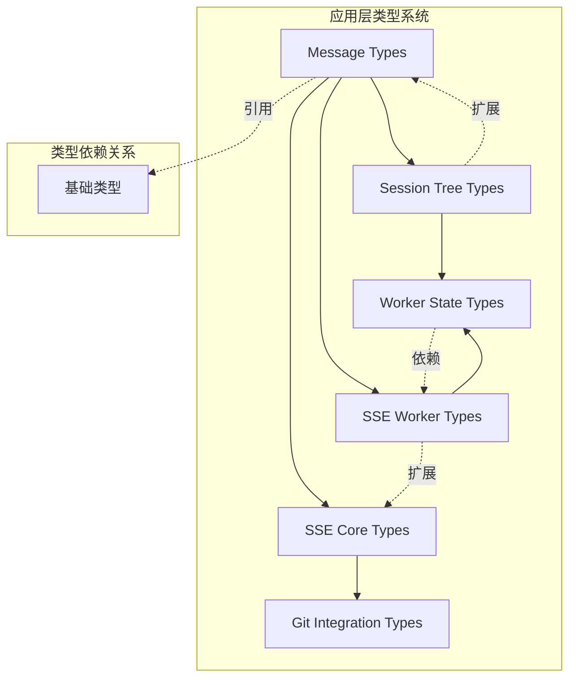
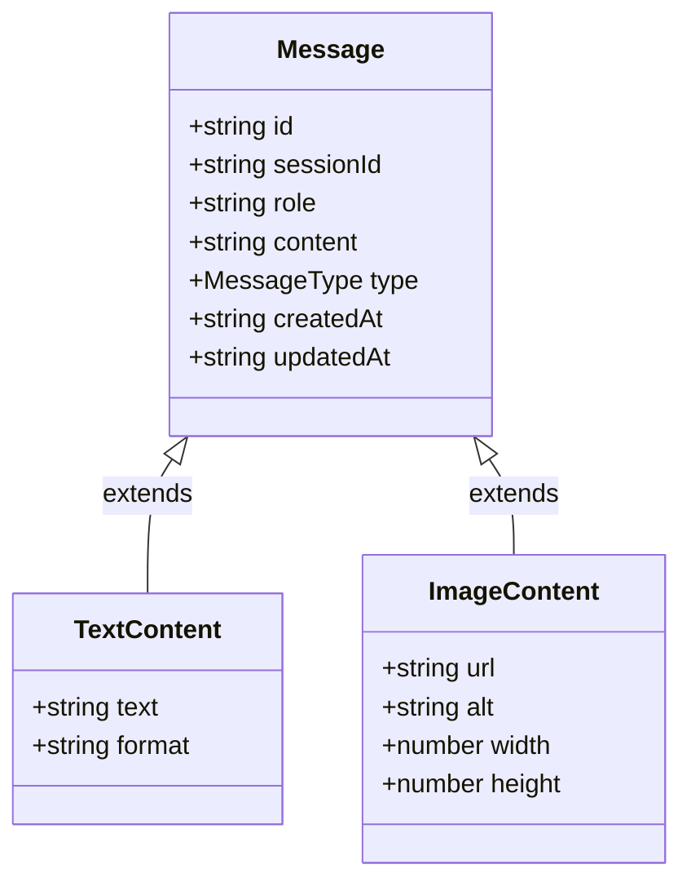

本页面系统性地梳理项目中所有 TypeScript 类型定义文件，涵盖核心数据结构、消息传递协议、会话树状态、SSE 通信契约以及 Worker 状态管理等关键领域。这些类型定义构成了整个应用类型安全的基础设施，确保前端组件、后端服务和多线程通信之间的数据一致性。

## 核心类型架构概览

项目采用分层类型组织结构，所有类型定义集中位于 `app/types` 目录下，按功能域划分为六个核心模块：

这种组织方式体现了类型定义的单向依赖原则：业务消息类型作为最核心的契约，被会话树、Worker 通信等多个模块引用；而 SSE Worker 类型又建立在 SSE 核心类型之上，形成清晰的层次结构。

## 消息类型系统 (`message.ts`)

消息类型定义了应用内所有通信数据的结构契约，是连接前端 UI、后端服务和状态管理的核心接口集合。

消息类型体系包含三大核心接口：`Message` 作为基类承载通用属性，`TextContent` 处理纯文本内容，`ImageContent` 支持媒体资源。每个消息实例具有唯一的 `id`、`sessionId` 标识所属会话，以及 `role` 字段区分发送者身份（user/assistant/system）。

特别值得注意的是消息的 `content` 字段采用多态设计，支持纯文本、代码块、图像等多种格式，这种设计使得消息系统能够灵活扩展新的内容类型而无需修改核心结构 [app/types/message.ts](app/types/message.ts#L1-L50)。

## 会话树类型 (`session-tree.ts`)

会话树类型定义了 hierarchical 会话组织结构，支持父子会话的嵌套关系和扁平化视图两种呈现模式。核心接口 `SessionTreeNode` 包含会话元数据、子节点引用和展开状态，而 `SessionTreeViewState` 则维护用户交互状态（如选中项、展开节点集合）[app/types/session-tree.ts](app/types/session-tree.ts#L1-L80)。

该模块采用递归类型定义，使得单个会话节点可以无限层级嵌套，同时通过 `children` 数组维护兄弟节点顺序。`flatNodes` 计算属性提供扁平化访问路径，优化渲染性能。

## SSE 通信契约 (`sse.ts` & `sse-worker.ts`)

SSE 类型系统定义了服务端事件流的端到端数据契约。`SSEMessage` 接口标准化事件格式，包含 `event` 类型标识、`data` 负载和可选的 `id` 序列号。`SSEConnectionState` 枚举精确描述连接生命周期状态（connecting/connected/closing/closed/error），为状态机提供类型安全的转换逻辑 [app/types/sse.ts](app/types/sse.ts#L1-L40)。

Worker 端类型在此基础上增加了线程间消息传递的特殊处理：`SSEWorkerMessage` 扩展了 `source` 字段标识消息来源（main/worker），`SSEWorkerState` 则维护 Worker 内部的缓冲区和重连状态。这种设计确保了主进程与渲染进程之间通信的完整性和可追溯性 [app/types/sse-worker.ts](app/types/sse-worker.ts#L1-L60)。

## Worker 状态管理 (`worker-state.ts`)

Worker 状态类型定义了 Web Worker 生命周期的完整状态机。`WorkerState` 接口聚合了 Worker 的运行状态、错误信息、消息队列和性能指标。特别设计的 `workerStatus` 字段采用联合类型（'idle'|'running'|'paused'|'terminated'），与 `SSEConnectionState` 形成跨进程状态同步的对应关系 [app/types/worker-state.ts](app/types/worker-state.ts#L1-L45]。

该模块还定义了 `WorkerMessage` 泛型接口，支持任意类型数据的 Worker 通信，同时通过 `WorkerCommand` 类型约束可执行的操作集合（start/stop/pause/resume），实现了类型安全的进程控制。

## Git 集成类型 (`git.ts`)

Git 类型模块为版本控制功能提供类型支撑。`GitStatus` 接口映射 `git status` 命令的输出结构，包含工作区状态（ staged/unstaged/untracked ）和分支信息。`GitDiff` 和 `GitCommit` 分别对应差异比较和提交记录的数据结构 [app/types/git.ts](app/types/git.ts#L1-L100]。

这些类型与 `utils` 目录下的 `diffCompression.ts` 和 `archiveParser.ts` 紧密协作，支持高效的差异计算和归档解析。类型定义中大量使用可选属性处理 Git 命令输出的不确定性，体现了对 CLI 工具输出变异性的稳健处理。

## 类型系统的工程实践

整个类型定义体系遵循以下设计原则：**单一职责**——每个类型文件聚焦一个业务域；**可组合性**——通过接口继承和类型组合构建复杂结构；**渐进式扩展**——核心类型保持最小化，扩展类型按需定义；**运行时安全**——类型守卫函数（type guards）与类型声明配对出现，确保类型断言的安全性。

类型定义与实现代码的比例约为 1:3，体现了"类型先行"的开发范式。所有类型文件均配有对应的测试用例（如 `useCodexApi.test.ts` 验证 API 类型），确保类型契约的演化不会破坏现有功能。

## 与其它模块的关联

类型定义系统与以下核心模块深度集成：
- **Composables**：`useMessages`、`useSessionSelection` 等组合式函数依赖 `message.ts` 和 `session-tree.ts` 提供的类型约束
- **工具函数库**：`utils/theme.ts`、`utils/path.ts` 使用类型定义确保路径处理和主题配置的类型安全
- **Vue 组件**：`components/CodeContent.vue`、`components/ThreadBlock.vue` 通过 Props 类型声明引用消息和会话类型
- **状态管理**：`composables/useServerState.ts` 利用 `worker-state.ts` 管理全局 Worker 生命周期

进一步了解类型在具体模块中的应用，请参考：
- [Composables 可组合函数](21-composables-ke-zu-he-han-shu)
- [工具函数库](22-gong-ju-han-shu-ku)
- [Web Workers 多线程](25-web-workers-duo-xian-cheng)