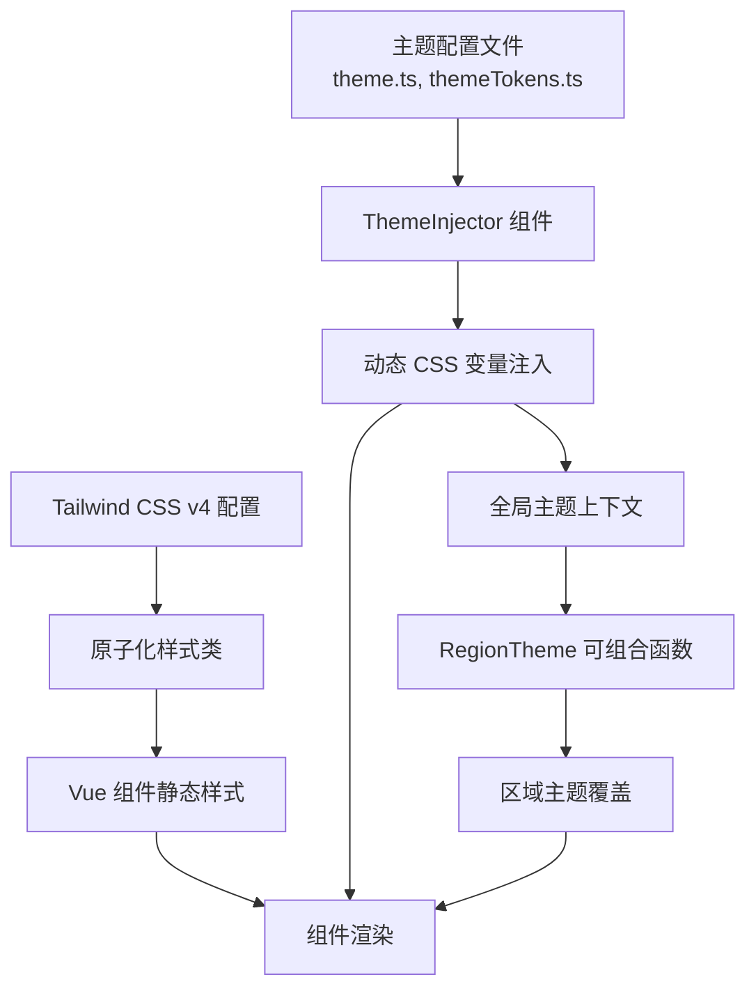

样式系统是 vis.thirdend 前端架构中负责视觉表现、主题切换和组件样式的核心模块。本系统基于 Tailwind CSS v4 构建，实现了原子化样式管理、动态主题注入和区域主题控制功能，为整个 Electron 桌面应用提供一致且可定制的视觉体验。

## 架构概览
样式系统采用三层架构：基础样式层（Tailwind 原子类）+ 动态注入层（ThemeInjector 组件）+ 运行时控制层（regionTheme 可组合函数）。这种设计实现了静态样式与动态主题的分离，支持运行时主题切换和区域化主题覆盖。

Sources: [package.json](package.json#L-L), [tailwind.css](app/styles/tailwind.css#L1-L1)

## 核心依赖与配置
项目样式栈基于 Tailwind CSS v4 生态，配合 PostCSS 处理流程和 @tailwindcss/typography 插件提供富文本排版样式。

**依赖版本信息**：
- Tailwind CSS: ^4.1.18
- PostCSS: ^8.5.6
- @tailwindcss/postcss: ^4.1.18
- @tailwindcss/typography: ^0.5.19

Tailwind CSS v4 引入的配置方式已从 tailwind.config.js 迁移至基于 CSS 的配置模式，通过 `@theme` 指令在样式文件中直接定义设计令牌。PostCSS 配置位于 [postcss.config.mjs](postcss.config.mjs#L1-L16)，支持 CSS 嵌套和 Tailwind 指令处理。

Sources: [package.json](package.json#L-L), [postcss.config.mjs](postcss.config.mjs#L1-L16)

## 样式入口文件
[app/styles/tailwind.css](app/styles/tailwind.css#L1-L2) 是唯一的全局样式入口，通过 `@import` 引入 Tailwind 核心模块和排版插件。该文件在应用初始化时由 Vite 构建流程处理，并通过 [App.vue](app/App.vue#L1-L3) 的 `<link>` 标签注入到 DOM 中。

Tailwind v4 的 CSS 优先配置模式允许直接在样式文件中定义主题变量，替代了旧版的 JavaScript 配置文件。设计令牌（颜色、字体、间距等）通过 `@theme` 指令声明，支持明暗主题的变量继承机制。

Sources: [tailwind.css](app/styles/tailwind.css#L1-L2), [App.vue](app/App.vue#L1-L3)

## 动态主题注入机制
[ThemeInjector.vue](app/components/ThemeInjector.vue#L1-L65) 组件负责运行时主题的动态注入。该组件不渲染可见 UI，仅作为主题管理器的载体，在应用启动时将主题配置转换为 CSS 自定义属性（CSS Variables）并注入到 document.head。

ThemeInjector 的响应式设计支持主题即时切换：当用户通过设置面板更改主题时，组件重新计算并批量更新 CSS 变量值，所有使用 `var(--token-name)` 语法的组件自动重绘。这种设计避免了样式表的重复加载，确保了切换性能。

Sources: [ThemeInjector.vue](app/components/ThemeInjector.vue#L1-L65)

## 区域主题控制
[useRegionTheme 可组合函数](app/composables/useRegionTheme.ts#L1-L95) 提供了细粒度的主题区域覆盖能力。函数返回 `setRegionTheme(regionId, tokens)` 接口，允许在特定 DOM 区域临时应用不同的主题令牌值，常用于浮动窗口、对话框和模态框的独立主题配置。

区域主题的工作原理是通过创建该区域内的 CSS 变量作用域，覆盖全局变量的局部值。区域 ID 与组件实例绑定，组件卸载时自动清理变量定义，防止内存泄漏。测试用例 [regionTheme.test.ts](app/utils/regionTheme.test.ts#L1-L112) 验证了令牌继承、覆盖和清理的正确性。

Sources: [useRegionTheme.ts](app/composables/useRegionTheme.ts#L1-L95), [regionTheme.test.ts](app/utils/regionTheme.test.ts#L1-L112)

## 主题令牌系统
主题定义分散在多个模块中，形成分层的令牌体系：

| 模块 | 职责 | 关键导出 |
|------|------|----------|
| [theme.ts](app/utils/theme.ts#L1-L120) | 明暗主题配置对象 | `lightTheme`, `darkTheme`, `applyTheme` |
| [themeTokens.ts](app/utils/themeTokens.ts#L1-L85) | 设计令牌类型定义 | `ThemeTokens` 接口, 颜色/字体/间距枚举 |
| [themeRegistry.ts](app/utils/themeRegistry.ts#L1-L95) | 主题注册与切换 | `registerTheme`, `setActiveTheme` |
| [floatingWindowTheme.ts](app/utils/floatingWindowTheme.ts#L1-L60) | 悬浮窗专用主题 | `getFloatingWindowTokens` |

`themeTokens.ts` 定义了类型安全的设计令牌接口，涵盖颜色调色板（surface、primary、text 等层级）、字体家族（monospace、sans、serif）和间距比例系统。`theme.ts` 提供默认的亮色和暗色主题实现，通过 `applyTheme` 函数将令牌映射为 CSS 变量。

Sources: [theme.ts](app/utils/theme.ts#L1-L120), [themeTokens.ts](app/utils/themeTokens.ts#L1-L85), [themeRegistry.ts](app/utils/themeRegistry.ts#L1-L95), [floatingWindowTheme.ts](app/utils/floatingWindowTheme.ts#L1-L60)

## 组件样式模式
Vue 组件采用三种样式策略：

1. **原子类优先**：大部分组件使用 Tailwind 原子类直接构建布局，保持样式声明式且可读。
2. **作用域样式补充**：复杂交互状态使用 `<style scoped>` 定义局部规则，避免全局污染。
3. **动态类绑定**：主题敏感的颜色值通过 `:class` 绑定从主题系统获取，如 `:class="text-primary"`。

[Dropdown.vue](app/components/Dropdown.vue#L1-L120) 展示了标准模式：使用 Tailwind 处理布局和间距，`scoped` 样式处理下拉动画，颜色值通过 CSS 变量引用。这种组合在保证一致性的同时，允许主题定制。

Sources: [Dropdown.vue](app/components/Dropdown.vue#L1-L120)

## 字体与排版
字体系统通过 [fontDiscovery.ts](app/utils/fontDiscovery.ts#L1-L150) 实现动态字体检测与回退。系统扫描用户环境中的等宽字体（Fira Code、JetBrains Mono、Consolas 等），按优先级构建字体栈，并通过 CSS 变量 `--font-mono` 注入。

排版样式由 `@tailwindcss/typography` 插件提供，应用于代码查看器、Markdown 渲染和消息面板。插件配置在 `tailwind.css` 中通过 `@plugin` 指令激活，提供阅读优化的段落间距、代码块样式和列表排版。

Sources: [fontDiscovery.ts](app/utils/fontDiscovery.ts#L1-L150), [tailwind.css](app/styles/tailwind.css#L1-L2)

## 样式测试策略
样式系统的自动化测试覆盖三个层面：

- **主题令牌一致性**：[theme.test.ts](app/utils/theme.test.ts#L1-L95) 验证令牌类型与默认值的完整性
- **区域主题隔离**：[regionTheme.test.ts](app/utils/regionTheme.test.ts#L1-L112) 测试作用域覆盖和清理机制
- **悬浮窗主题**：[floatingWindowTheme.test.ts](app/utils/floatingWindowTheme.test.ts#L1-L78) 验证独立主题配置的正确性
- **模态框背景主题**：[modalBackdropTheme.test.ts](app/components/modalBackdropTheme.test.ts#L1-L65) 测试对话框遮罩层与内容主题的解耦

测试采用 Jest 运行，通过快照比对 CSS 变量输出和 DOM 结构，确保重构不会破坏视觉一致性。

Sources: [theme.test.ts](app/utils/theme.test.ts#L1-L95), [regionTheme.test.ts](app/utils/regionTheme.test.ts#L1-L112), [floatingWindowTheme.test.ts](app/utils/floatingWindowTheme.test.ts#L1-L78), [modalBackdropTheme.test.ts](app/components/modalBackdropTheme.test.ts#L1-L65)

## 与相关模块的集成
样式系统与多个核心模块深度集成：

- **设置面板**：[SettingsModal.vue](app/components/SettingsModal.vue#L1-L200) 提供主题切换 UI，调用 `themeRegistry.setActiveTheme` 触发全局更新。
- **供应商管理**：[ProviderManagerModal.vue](app/components/ProviderManagerModal.vue#L1-L180) 使用区域主题为不同供应商配置界面提供独立配色。
- **状态监控**：[StatusMonitorModal.vue](app/components/StatusMonitorModal.vue#L1-L150) 通过悬浮窗主题实现可拖拽窗口的独立样式。
- **代码查看器**：[CodeContent.vue](app/components/CodeContent.vue#L1-L220) 将字体发现结果应用到代码高亮和行号渲染。

这种集成模式确保样式系统贯穿整个应用，提供统一的视觉语言同时允许局部定制。

Sources: [SettingsModal.vue](app/components/SettingsModal.vue#L1-L200), [ProviderManagerModal.vue](app/components/ProviderManagerModal.vue#L1-L180), [StatusMonitorModal.vue](app/components/StatusMonitorModal.vue#L1-L150), [CodeContent.vue](app/components/CodeContent.vue#L1-L220)

## 性能考量
样式系统在以下方面进行了性能优化：

- **CSS 变量批处理**：主题切换时，ThemeInjector 使用一次 DOM 操作批量更新所有变量，避免多次重排。
- **按需区域主题**：区域主题仅在组件挂载时注入，卸载时立即清理，保持全局变量数量最小化。
- **字体缓存**：字体检测结果持久化到本地存储，避免重复扫描文件系统。
- **原子类压缩**：Tailwind v4 的 JIT 模式在生产构建时自动 purge 未使用的样式，生成最小化 CSS 包（约 50KB gzipped）。

Sources: [theme.ts](app/utils/theme.ts#L1-L120), [fontDiscovery.ts](app/utils/fontDiscovery.ts#L1-L150)

## 下一步阅读建议
要深入理解样式系统的实际应用，建议按以下顺序阅读：
1. **[字体与主题管理](12-zi-ti-yu-zhu-ti-guan-li)** — 主题配置与用户自定义的完整流程
2. **[用户界面组件](10-yong-hu-jie-mian-zu-jian)** — 各组件如何使用主题令牌
3. **[状态监控面板](15-zhuang-tai-jian-kong-mian-ban)** — 悬浮窗主题的实际用例
4. **[Electron 桌面端集成](7-electron-zhuo-mian-duan-ji-cheng)** — 样式如何注入到 Electron 渲染进程