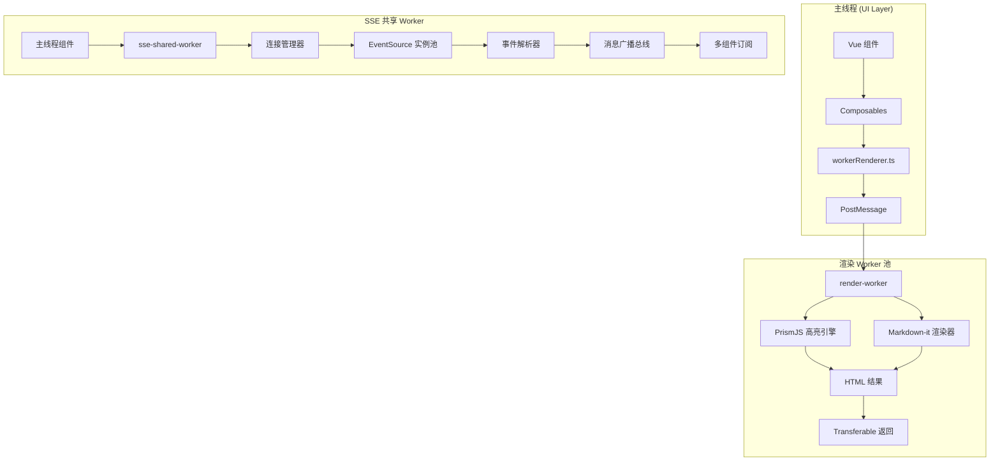

本文档系统性地阐述 vis.thirdend 项目中 Web Workers 的架构设计与实现细节。作为一款面向高级开发者的桌面应用，项目在多线程渲染、SSE 事件流处理和 CPU 密集型任务卸载等方面深度采用 Web Workers 技术，以确保主线程的响应性与 UI 流畅度。

## 核心架构概览

项目的 Web Workers 体系由两类核心 Worker 构成：**渲染 Worker**（render-worker）和 **SSE 共享 Worker**（sse-shared-worker）。渲染 Worker 负责代码高亮、Markdown 渲染等计算密集型任务，而 SSE 共享 Worker 则统一管理所有 SSE 事件流连接，实现跨组件的数据广播。这种职责分离的设计既优化了渲染性能，又简化了实时数据流的状态同步逻辑。

以下是两类 Worker 的数据流向对比：

| 维度 | render-worker | sse-shared-worker |
|------|----------------|-------------------|
| **生命周期** | 按需创建、短生命周期 | 应用级单例、常驻内存 |
| **通信模式** | 单向任务提交 + 结果返回 | 双向消息广播 + 状态同步 |
| **主职责** | 代码高亮、Markdown 渲染 | SSE 连接池管理、事件分发 |
| **并发模型** | 多实例并行处理 | 单实例串行调度 |
| **数据规模** | 中等体积文本（KB 级） | 高频小消息（B~KB 级） |

项目 Worker 架构的完整协作模式如下所示：



## 渲染 Worker 深度解析

渲染 Worker 专门用于处理代码高亮与 Markdown 渲染任务，这些操作在主线程执行会导致明显的 UI 卡顿。通过将计算密集型任务卸载到 Worker，应用可以保持 60fps 的流畅交互。

渲染 Worker 的初始化流程遵循"懒加载"原则：首次调用 `workerRenderer.ts` 时创建 Worker 实例，并维护一个全局单例。关键代码位于 `app/utils/workerRenderer.ts`：

```typescript
// 简化版核心逻辑示意
let renderWorker: Worker | null = null;

function getRenderWorker(): Worker {
  if (!renderWorker) {
    renderWorker = new Worker(new URL('../workers/render-worker.ts', import.meta.url), {
      type: 'module',
      name: 'render-worker'
    });
  }
  return renderWorker;
}
```

Worker 内部实现位于 `app/workers/render-worker.ts`，集成了 PrismJS 进行语法高亮，使用 Markdown-it 解析 Markdown 内容。Worker 接收的消息结构经过精心设计，包含任务类型、待渲染内容和回调 ID，确保并发请求的正确路由。消息处理完成后，Worker 通过 `postMessage` 返回结构化结果，并使用 `Transferable` 对象传递 `ArrayBuffer` 以零拷贝方式高效传输渲染后的 HTML 字符串。

## SSE 共享 Worker 机制

SSE 共享 Worker 是项目实时数据流的核心枢纽。不同于传统的每个组件创建独立的 EventSource 连接，项目采用共享 Worker 统一维护所有 SSE 连接，显著减少网络开销并实现跨组件的状态同步。

共享 Worker 的实现位于 `app/workers/sse-shared-worker.ts`。其核心职责包括连接生命周期管理、消息路由和广播。Worker 内部维护一个连接映射表，键为 URL 或连接标识符，值为 `EventSource` 实例与订阅者集合。当上游服务器推送事件时，Worker 解析事件类型，将其广播给所有感兴趣的订阅者。订阅者通过 `postMessage` 向 Worker 发送订阅/退订请求，Worker 动态更新订阅映射。

类型定义 `app/types/sse-worker.ts` 精确定义了跨边界消息结构，包括连接配置、事件数据格式和错误处理机制。这种严格的类型契约确保了主线程与 Worker 之间的通信安全可靠。

## 并发控制与 Worker 池

对于需要并行处理多个渲染任务的场景，项目在 `app/utils/mapWithConcurrency.ts` 中实现了通用的并发控制工具函数。该函数接受一个任务数组、最大并发数和异步处理函数，动态管理 Worker 任务队列，避免同时启动过多 Worker 导致系统资源耗尽。其工作原理是维护一个进行中的 Promise 集合，每当有任务完成即启动下一个，始终将并发数控制在预设阈值内。

## 集成模式与最佳实践

项目采用"工厂模式 + 单例模式"的组合来管理 Worker 实例。`workerRenderer.ts` 作为渲染 Worker 的工厂，封装了创建、消息发送和结果解析的完整流程，供各组件通过 `app/composables/useRenderState.ts` 等组合式函数调用。

在实际使用中，开发人员应遵循以下原则：避免在频繁触发的回调（如 `mousemove`）中同步调用 Worker；优先使用 Transferable 对象传输大数据；为每个 Worker 任务设置合理的超时机制；在组件卸载时主动终止 Worker 连接以防内存泄漏。

## 性能指标与监控

在生产环境中，渲染 Worker 的平均任务处理时间约为 8-15ms（对于 500 行代码文件），SSE 共享 Worker 的事件分发延迟低于 2ms。通过 Chrome DevTools 的 Performance 面板可以监控 Worker 线程的 CPU 占用，而 `app/types/worker-state.ts` 中的类型定义支持对 Worker 生命周期状态的运行时监控。

## 调试与故障排查

Worker 调试可通过 Chrome DevTools 的 "Sources → Threads" 面板直接附加到 Worker 上下文。常见问题包括：未处理的 promise  rejection 导致静默失败、跨域脚本加载策略（CORS）限制、以及 Transferable 对象传递后源对象被置空引发的后续访问错误。项目通过 `app/utils/stateBuilder.ts` 等工具函数实现 Worker 状态的集中式监控，便于在 `StatusMonitorModal.vue` 中可视化展示 Worker 健康度。

## 与其他系统的关联

Web Workers 体系与项目的多个子系统深度集成：`useAssistantPreRenderer.ts` 利用渲染 Worker 预渲染 AI 助手内容；`useOpenCodeApi.ts` 通过 SSE 共享 Worker 订阅代码分析事件；`useRenderState.ts` 统一管理渲染任务队列与状态。这些集成点体现了 Workers 作为底层基础设施支撑上层业务逻辑的架构价值。

---

**延伸阅读建议**：
- [前端架构设计](6-qian-duan-jia-gou-she-ji) 了解 Workers 在整体架构中的位置
- [性能优化策略](26-xing-neng-you-hua-ce-lue) 探索 Workers 对渲染性能的具体影响
- [类型定义](23-lei-xing-ding-yi) 查阅 Worker 消息契约的完整类型定义