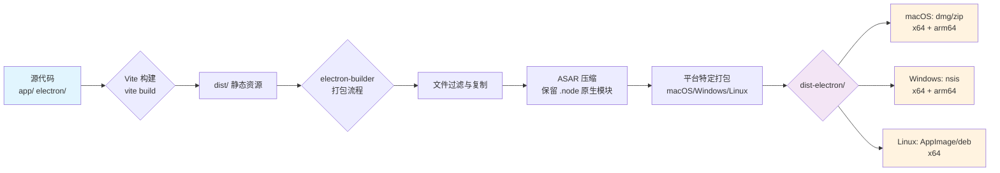

本页系统阐述 Vis 应用的 Electron 打包与多平台分发机制，涵盖配置架构、构建流水线、平台特定参数及自动化发布策略。核心依赖 electron-builder 实现跨平台打包，结合 Vite 构建前端资源，形成完整的桌面应用分发方案。

## 打包配置架构

Electron 打包配置集中于 `electron-builder.yml`，采用声明式 YAML 结构定义应用元数据、文件包含规则、平台目标及发布渠道。该配置与 `package.json` 的脚本命令协同工作，通过 `electron:build` 和 `electron:preview` 触发完整构建流程。

**核心配置文件**：
- `[electron-builder.yml](electron-builder.yml#L1-L106)` - 主打包配置
- `[package.json](package.json#L31-L42)` - 构建脚本定义
- `[vite.config.ts](vite.config.ts#L1-L69)` - 前端构建配置

**构建脚本映射**：
| 脚本命令 | 执行流程 | 用途 |
|---------|---------|------|
| `pnpm electron:build` | `vite build` → `electron-builder` | 生产环境完整打包 |
| `pnpm electron:preview` | `vite build` → `electron-builder --dir` | 生成未签名调试包 |
| `prepack` 钩子 | 自动执行 `vite build` | 确保 npm 发布前资源就绪 |

## 多平台构建流水线

构建流程分为两个阶段：前端资源编译与 Electron 二进制打包。Vite 将 `app/` 目录的 Vue 应用编译为静态资源输出至 `dist/`，随后 electron-builder 合并前端资源、Electron 主进程代码及依赖库，生成平台特定安装包。



**关键构建参数**（源自 `[vite.config.ts](vite.config.ts#L43-L53)`）：
- `outDir: '../dist'` - 相对于 `app/` 根目录的输出位置
- `emptyOutDir: true` - 每次构建清空输出目录
- `chunkSizeWarningLimit: 1000` - 代码分块警告阈值（KB）
- `manualChunks` 策略：按库类型分离 `vendor-vue-i18n`、`vendor-vue`、`vendor-ui`、`vendor-terminal`、`vendor-utils`

## 文件包含与排除策略

`electron-builder.yml` 的 `files` 数组精确控制打包内容，确保安装包精简且合规。**包含规则**优先匹配 `dist/**/*` 和 `electron/**/*`，**排除规则**过滤开发及版本控制文件。

```yaml
files:
  - "dist/**/*"      # Vite 构建产物（前端资源）
  - "electron/**/*"  # Electron 主进程与预加载脚本
  - "package.json"   # 应用元数据与依赖声明
  # 排除项：
  - "!node_modules"           # 依赖通过 npm install 安装
  - "!**/*.{iml,o,hprof,...}" # 编译中间文件
  - "!**/.DS_Store"           # macOS 系统文件
  - "!**/.github"             # CI 配置
  - "!**/.git"                # Git 元数据
  - "!**/docs"                # 文档目录
```

**ASAR 压缩策略**（`[electron-builder.yml](electron-builder.yml#L18-L20)`）：asar 封装提升加载性能并防止资源篡改，但 `asarUnpack` 必须排除 `.node` 原生模块以确保动态链接库正常加载。

## 平台特定配置详解

### macOS 配置

`[electron-builder.yml](electron-builder.yml#L22-L32)` 定义双重架构支持与 Gatekeeper 兼容性：

| 配置项 | 值 | 说明 |
|------|-----|------|
| `category` | `public.app-category.developer-tools` | App Store 分类 |
| `targets` | dmg + zip | 两种安装介质 |
| `arch` | x64, arm64 | Intel 与 Apple Silicon |
| `hardenedRuntime` | true | 启用强化运行时（需签名） |
| `entitlements` | `build/entitlements.mac.plist` | 权限配置文件 |
| `artifactName` | `Vis-${version}-${arch}-MacOS.${ext}` | 输出文件名模板 |

**DMG 布局**（`[electron-builder.yml](electron-builder.yml#L42-L48)`）：窗口尺寸 540×380px，应用程序图标位于 (130, 220)，Applications 快捷方式链接位于 (410, 220)。

### Windows 配置

`[electron-builder.yml](electron-builder.yml#L34-L39)` 采用 NSIS 安装器，支持自定义安装目录：

| NSIS 配置项 | 值 | 功能 |
|------------|-----|------|
| `oneClick` | false | 显示向导页面 |
| `allowToChangeInstallationDirectory` | true | 允许选择安装路径 |
| `createDesktopShortcut` | true | 创建桌面快捷方式 |
| `createStartMenuShortcut` | true | 创建开始菜单项 |
| `deleteAppDataOnUninstall` | false | 保留用户数据 |

### Linux 配置

`[electron-builder.yml](electron-builder.yml#L41-L50)` 提供 AppImage（便携式）与 Deb（系统集成）两种格式，均仅支持 x64 架构：

| 配置项 | 值 | 说明 |
|------|-----|------|
| `targets` | AppImage, deb | 便携包与系统包 |
| `executableName` | `vis` | 可执行文件名 |
| `category` | `Development` | 桌面文件分类 |
| `maintainer` | `Xenodrive, Inc.` | 维护者信息 |
| `synopsis` | `Vis - OpenCode Visualizer` | 简短描述 |

## 发布与自动化

`[electron-builder.yml](electron-builder.yml#L53-L58)` 配置 GitHub Release 自动发布，生成草稿 Release 供人工验证后正式发布：

```yaml
publish:
  provider: github
  owner: qiyuanhuakai
  repo: opencode-visualizer-cn
  releaseType: draft  # 需手动转为正式发布
```

**GitHub Actions 集成**：`[.github/workflows/build-electron.yml](.github/workflows/build-electron.yml)` 定义 CI/CD 流水线，在代码推送或 Release 时自动触发跨平台构建，利用 `electron-builder` 的多平台镜像完成 macOS、Windows、Linux 的并行打包。

## 开发调试工作流

`[package.json](package.json#L38-L39)` 的 `electron:start` 脚本调用 `[scripts/electron-start.mjs](scripts/electron-start.mjs)`，实现开发模式下 Electron 与 Vite 热重载的集成。该脚本启动 Vite 开发服务器并加载 Electron 主进程，使前端修改即时生效，无需重复打包。

**调试与生产对比**：
| 维度 | 开发模式 (`electron:start`) | 生产模式 (`electron:build`) |
|-----|---------------------------|---------------------------|
| 构建速度 | 即时加载 | 完整编译 + 打包 |
| 代码 sourcemap | 完整映射 | 压缩混淆 |
| 更新机制 | 手动重启 | 自动更新（需配置） |
| 输出目录 | 内存/临时目录 | `dist-electron/` 持久化 |

## 依赖安装与原生模块

`[package.json](package.json#L44-L45)` 的 `postinstall` 钩子执行 `electron-builder install-app-deps`，自动编译原生 Node 模块（如 `libarchive-wasm`）以匹配当前 Electron 版本，确保 `.node` 文件在 ASAR 解压后正常运行。

## 最佳实践建议

1. **版本同步**：确保 `electron`、`electron-builder` 及原生模块版本兼容，定期检查 `[pnpm-lock.yaml](pnpm-lock.yaml)` 锁定版本。
2. **签名配置**：macOS 强化运行时需配置开发者证书，可通过 `electron-builder` 环境变量 `CSC_LINK`、`CSC_KEY_PASSWORD` 注入。
3. **资源优化**：利用 Vite 的 `manualChunks` 减少主包体积，ASAR 压缩可提升冷启动速度约 15-30%。
4. **跨架构测试**：arm64（Apple Silicon/Windows on ARM）需在对应硬件或模拟环境验证原生模块兼容性。

## 相关文档链接

- [构建配置](28-gou-jian-pei-zhi) - Vite 构建选项与优化策略
- [GitHub Actions 自动化](30-github-actions-zi-dong-hua) - CI/CD 流水线详解
- [项目目录结构](20-xiang-mu-mu-lu-jie-gou) - 源代码组织规范
- [类型定义](23-lei-xing-ding-yi) - TypeScript 类型与 Electron 集成