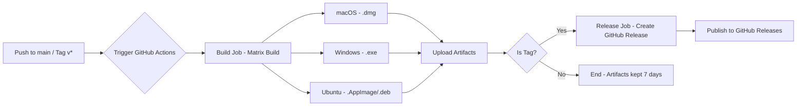

本页面详细说明项目基于 GitHub Actions 实现的持续集成与持续部署（CI/CD）流水线，涵盖多平台构建、制品管理和自动发布全流程。该自动化体系确保代码质量、加速交付周期，并支持跨平台分发。

## 流水线架构概览
整个 CI/CD 流水线由两个核心作业（job）组成：**build** 负责跨平台编译与打包，**release** 负责基于 Git 标签创建 GitHub Release。两者通过 `needs` 关键字建立依赖关系，形成串行执行链。采用矩阵策略（matrix）同时运行于 macOS、Windows 和 Ubuntu 三大平台，确保原生安装包的兼容性与一致性。



Sources: [.github/workflows/build-electron.yml](.github/workflows/build-electron.yml#L1-L92)

## 触发条件配置
流水线由两种事件驱动：推送到 `main` 分支触发常规构建，创建以 `v` 开头的标签（如 `v1.0.0`）触发完整构建并进入发布流程。这种设计支持开发阶段的持续验证与发布阶段的自动化分发。

```yaml
on:
  push:
    branches: [main]
    tags:
      - 'v*'
```

Sources: [.github/workflows/build-electron.yml](.github/workflows/build-electron.yml#L4-L7)

## 多平台构建矩阵
`build` 作业使用 `strategy.matrix` 定义操作系统矩阵，在 `macos-latest`、`windows-latest`、`ubuntu-latest` 三个 Runner 环境中并行执行。`fail-fast: false` 确保单一平台失败不影响其他平台继续构建，便于独立排查问题。每个平台使用对应的操作系统镜像作为运行环境。

Sources: [.github/workflows/build-electron.yml](.github/workflows/build-electron.yml#L11-L16)

## 依赖安装与缓存优化
构建过程采用 pnpm 作为包管理器，通过 `actions/setup-node@v4` 配置 Node.js 22 环境。缓存机制基于 pnpm store 目录，使用 `pnpm-lock.yaml` 的哈希值生成缓存键，实现依赖精准复用。首次运行后，后续构建可跳过依赖下载，显著缩短执行时间。

```bash
# 缓存键逻辑
key: ${{ runner.os }}-pnpm-store-${{ hashFiles('**/pnpm-lock.yaml') }}
```

Sources: [.github/workflows/build-electron.yml](.github/workflows/build-electron.yml#L27-L41)

## 构建与打包流程
依赖安装完成后，执行两条核心命令：`pnpm vite build` 触发 Vite 构建管道，生成前端资源；`npx electron-builder --publish never` 调用 Electron Builder 进行桌面应用打包，`--publish never` 参数禁用自动发布（由独立 release 作业处理）。构建产物输出至 `dist-electron` 目录。

Sources: [.github/workflows/build-electron.yml](.github/workflows/build-electron.yml#L46-L47)

## 构建制品上传与保留策略
构建完成后，`actions/upload-artifact@v4` 将各平台产物上传为 GitHub Actions 制品（artifact）。上传路径按平台匹配对应的安装包格式：macOS 为 `.dmg`，Windows 为 `.exe`，Ubuntu 为 `.AppImage` 与 `.deb`，同时包含 `.blockmap`（增量更新元数据）和 `.yml`（构建配置）。制品保留期为 7 天，`if-no-files-found: warn` 确保无产物时仅警告而不中断流程。

| 平台 | 产物格式 | 说明 |
|------|---------|------|
| macOS | `.dmg` | 磁盘镜像安装包 |
| Windows | `.exe` | 可执行安装程序 |
| Ubuntu | `.AppImage` | 通用 Linux 包 |
| Ubuntu | `.deb` | Debian 系包管理器格式 |

Sources: [.github/workflows/build-electron.yml](.github/workflows/build-electron.yml#L49-L62)

## 自动发布作业（Release）
`release` 作业定义为 `needs: build`，仅在 `build` 成功后执行，且仅当触发事件为标签推送（`startsWith(github.ref, 'refs/tags/v')`）时运行。作业运行于 Ubuntu 环境，拥有 `contents: write` 权限以创建 Release。流程包括：下载所有平台制品、使用 `softprops/action-gh-release@v2` 创建草稿（draft）Release、自动生成发布说明（`generate_release_notes: true`），并将所有安装包关联至 Release。`GITHUB_TOKEN` 由 GitHub 自动提供，用于身份验证。

Sources: [.github/workflows/build-electron.yml](.github/workflows/build-electron.yml#L64-L91)

## 权限与安全模型
Release 作业显式声明 `permissions: contents: write`，遵循最小权限原则，仅授予创建 Release 所需权限。`GITHUB_TOKEN` 作为 Secret 自动注入，无需额外配置，确保操作可追溯且符合 GitHub 安全规范。

Sources: [.github/workflows/build-electron.yml](.github/workflows/build-electron.yml#L68-L69)

## 集成建议与后续步骤
该自动化流水线与项目构建配置深度集成。理解本流程后，建议进一步阅读：
- [构建配置](28-gou-jian-pei-zhi) 了解 Vite 与 Electron Builder 的本地配置细节
- [Electron 打包与分发](29-electron-da-bao-yu-fen-fa) 掌握产物分发策略与安装包签名
- [测试框架配置](27-ce-shi-kuang-jia-pei-zhi) 补充单元测试与端到端测试的 CI 集成方案