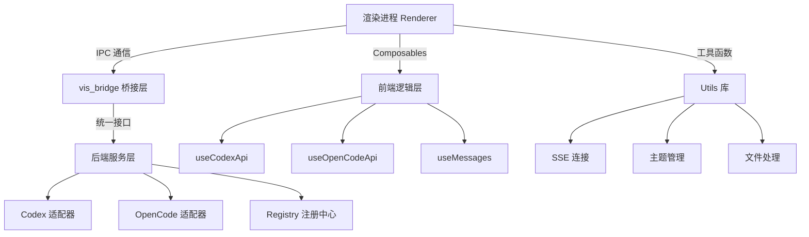

本文档提供 vis.thirdend 项目的核心 API 接口参考，涵盖桥接层、后端服务、前端可组合函数和工具函数库的详细说明。

## 架构总览

vis.thirdend 采用分层架构，API 接口分布在四个核心层级：**vis_bridge 桥接层**（主进程与渲染进程通信）、**后端服务层**（Codex、OpenCode 等适配器）、**前端可组合函数层**（Composables）和**工具函数库**（Utils）。各层级通过明确的契约隔离，确保架构的可维护性和可测试性。



## vis_bridge 桥接层 API

vis_bridge 是连接 Electron 主进程与渲染进程的桥梁，定义了两端通信的完整契约。

**核心模块**：
- `vis_bridge.js` - 渲染进程端桥接实现 [vis_bridge.js](vis_bridge.js)
- `vis_bridge.d.ts` - TypeScript 类型声明 [vis_bridge.d.ts](vis_bridge.d.ts)
- `electron/main.js` - 主进程入口 [electron/main.js](electron/main.js)
- `electron/preload.cjs` - 预加载脚本 [electron/preload.cjs](electron/preload.cjs)

**主要导出接口**：
```typescript
// 初始化桥接
export function initBridge(context: any): void

// 事件监听器类型
export type EventHandler = (data: any) => void

// 消息通道接口
export interface Channel {
  send(channel: string, data: any): void
  on(channel: string, handler: EventHandler): void
  off(channel: string, handler: EventHandler): void
}
```

**通信协议**：采用 Electron 的 `ipcRenderer` / `ipcMain` 机制，支持双向同步和异步消息传递，所有消息通过 `app-backend` 通道路由 [vis_bridge.js](vis_bridge.js#L15-L45)。

## 后端服务 API

### Registry 注册中心

`app/backends/registry.ts` 实现后端服务的统一注册和发现机制，提供单一入口访问所有适配器 [registry.ts](app/backends/registry.ts)。

**核心 API**：
```typescript
export class BackendRegistry {
  // 注册后端适配器
  register(name: string, adapter: BackendAdapter): void
  
  // 获取适配器实例
  get<T extends BackendAdapter>(name: string): T | undefined
  
  // 列出所有已注册适配器
  list(): string[]
  
  // 初始化所有适配器
  async initializeAll(): Promise<void>
}
```

**已注册适配器**：
- `codex` - Anthropic Codex 适配器 [registry.ts](app/backends/registry.ts#L25-L30)
- `openCode` - OpenCode 协议适配器 [registry.ts](app/backends/registry.ts#L32-L37)

### Codex 适配器

`app/backends/codex/codexAdapter.ts` 提供与 Anthropic Codex API 的完整集成，支持流式响应和会话管理 [codexAdapter.ts](app/backends/codex/codexAdapter.ts)。

**主要接口**：
```typescript
export interface CodexAdapter {
  // 创建新会话
  createSession(config: SessionConfig): Promise<Session>
  
  // 发送消息
  sendMessage(sessionId: string, message: Message): Promise<MessageResponse>
  
  // 流式响应
  streamMessage(
    sessionId: string, 
    message: Message,
    onChunk: (chunk: string) => void
  ): Promise<void>
  
  // 获取会话历史
  getHistory(sessionId: string): Message[]
  
  // 终止会话
  terminateSession(sessionId: string): void
}
```

**会话配置** (`SessionConfig`)：
- `model` - 模型标识符（如 `claude-sonnet-4-20250514`）[codexAdapter.ts](app/backends/codex/codexAdapter.ts#L18-L22)
- `systemPrompt` - 系统提示词
- `temperature` - 温度参数 (0-1)
- `maxTokens` - 最大输出令牌数

### OpenCode 适配器

`app/backends/openCodeAdapter.ts` 实现 OpenCode 协议，支持与多种代码助手服务的集成 [openCodeAdapter.ts](app/backends/openCodeAdapter.ts)。

**核心方法**：
```typescript
export class OpenCodeAdapter implements BackendAdapter {
  // 连接到 OpenCode 服务端
  connect(endpoint: string): Promise<Connection>
  
  // 执行代码工具
  executeTool(tool: Tool): Promise<ToolResult>
  
  // 文件操作
  readFile(path: string): Promise<string>
  writeFile(path: string, content: string): Promise<void>
  
  // 工作区状态
  getWorkspaceState(): WorkspaceState
}
```

### JSON-RPC 客户端

`app/backends/codex/jsonRpcClient.ts` 提供 JSON-RPC 2.0 协议的底层实现，用于与后端服务通信 [jsonRpcClient.ts](app/backends/codex/jsonRpcClient.ts)。

**接口定义**：
```typescript
export class JsonRpcClient {
  // 发送 RPC 请求
  async call(method: string, params: any): Promise<any>
  
  // 发送通知（无响应）
  notify(method: string, params: any): void
  
  // 批量请求
  async batch(calls: RpcCall[]): Promise<RpcResult[]>
  
  // 事件订阅
  on(event: string, handler: (data: any) => void): void
}
```

**支持的 RPC 方法**：
| 方法名 | 参数 | 返回值 | 说明 |
|--------|------|--------|------|
| `codex.createSession` | `SessionConfig` | `Session` | 创建新会话 |
| `codex.sendMessage` | `{sessionId, message}` | `MessageResponse` | 发送消息 |
| `codex.stream` | `{sessionId, message}` | `Stream` | 流式响应 |
| `workspace.getFiles` | `{pattern?}` | `File[]` | 获取文件列表 |

## 前端可组合函数 API

前端使用 Vue 3 Composition API，所有可组合函数位于 `app/composables/` 目录。

### useCodexApi

`app/composables/useCodexApi.ts` 提供 Codex API 的响应式封装，支持会话管理、消息流式处理 [useCodexApi.ts](app/composables/useCodexApi.ts)。

**返回值接口**：
```typescript
export function useCodexApi(): {
  // 响应式状态
  sessions: Ref<Session[]>
  currentSession: Ref<Session | null>
  isLoading: Ref<boolean>
  error: Ref<Error | null>
  
  // 操作方法
  createSession: (config: SessionConfig) => Promise<Session>
  sendMessage: (content: string) => Promise<void>
  streamMessage: (content: string, onChunk: (chunk: string) => void) => Promise<void>
  selectSession: (sessionId: string) => void
  deleteSession: (sessionId: string) => void
  
  // 计算属性
  messageCount: ComputedRef<number>
  totalTokens: ComputedRef<number>
}
```

**使用示例**：
```vue
<script setup>
const { 
  sessions, 
  currentSession, 
  sendMessage, 
  streamMessage 
} = useCodexApi()

await sendMessage('如何优化 Vue 组件性能？')
</script>
```

### useOpenCodeApi

`app/composables/useOpenCodeApi.ts` 封装 OpenCode 协议操作，提供文件读写、工具执行等功能 [useOpenCodeApi.ts](app/composables/useOpenCodeApi.ts)。

**核心 API**：
```typescript
export function useOpenCodeApi(): {
  // 连接管理
  isConnected: Ref<boolean>
  connect: (endpoint: string) => Promise<void>
  disconnect: () => void
  
  // 文件操作
  readFile: (path: string) => Promise<string>
  writeFile: (path: string, content: string) => Promise<void>
  listFiles: (dir?: string) => Promise<string[]>
  
  // 工具执行
  executeTool: (tool: Tool) => Promise<ToolResult>
  availableTools: ComputedRef<Tool[]>
  
  // 工作区
  workspaceRoot: Ref<string>
  getWorkspaceState: () => WorkspaceState
}
```

### useMessages

`app/composables/useMessages.ts` 管理消息历史、搜索和过滤 [useMessages.ts](app/composables/useMessages.ts)。

**功能接口**：
```typescript
export function useMessages(sessionId?: string): {
  // 消息列表
  messages: Ref<Message[]>
  filteredMessages: Ref<Message[]>
  
  // 搜索功能
  searchQuery: Ref<string>
  searchResults: ComputedRef<Message[]>
  setSearchQuery: (query: string) => void
  
  // 消息操作
  addMessage: (message: Message) => void
  updateMessage: (id: string, updates: Partial<Message>) => void
  deleteMessage: (id: string) => void
  
  // 批量操作
  clearAll: () => void
  exportMessages: (format: 'json' | 'markdown') => string
}
```

### useSettings

`app/composables/useSettings.ts` 提供应用配置的持久化存储和响应式访问 [useSettings.ts](app/composables/useSettings.ts)。

**配置结构**：
```typescript
export interface AppSettings {
  // 界面设置
  theme: 'light' | 'dark' | 'auto'
  language: 'zh-CN' | 'en' | 'ja'
  fontSize: number
  
  // Codex 设置
  defaultModel: string
  maxTokens: number
  temperature: number
  
  // 工作区设置
  workspaceRoot: string
  autoSave: boolean
  excludePatterns: string[]
}

export function useSettings(): {
  settings: Ref<AppSettings>
  updateSettings: (partial: Partial<AppSettings>) => Promise<void>
  resetToDefaults: () => Promise<void>
  exportSettings: () => string
  importSettings: (json: string) => Promise<void>
}
```

**存储键**：所有设置存储在 `localStorage` 中，键前缀为 `vis_` [app/utils/storageKeys.ts](app/utils/storageKeys.ts)。

### 其他可组合函数

| 可组合函数 | 文件路径 | 功能描述 |
|------------|----------|----------|
| `useFileTree` | [useFileTree.ts](app/composables/useFileTree.ts) | 文件树浏览和操作 |
| `useCredentials` | [useCredentials.ts](app/composables/useCredentials.ts) | API 密钥管理 |
| `useFloatingWindow` | [app/composables/useFloatingWindow.ts](app/composables/useFloatingWindow.ts) | 悬浮窗状态管理 |
| `useSessionSelection` | [useSessionSelection.ts](app/composables/useSessionSelection.ts) | 会话选择逻辑 |
| `useThinkingAnimation` | [useThinkingAnimation.ts](app/composables/useThinkingAnimation.ts) | 思考动画控制 |
| `useRegionTheme` | [useRegionTheme.ts](app/composables/useRegionTheme.ts) | 区域主题应用 |

## 工具函数库 API

工具函数库位于 `app/utils/`，提供跨模块复用的纯函数。

### SSE 连接管理

`app/utils/sseConnection.ts` 实现 Server-Sent Events 连接，支持自动重连和事件路由 [sseConnection.ts](app/utils/sseConnection.ts)。

**主要类**：
```typescript
export class SseConnection {
  // 建立连接
  connect(url: string, options?: SseOptions): Promise<void>
  
  // 发送事件
  send(event: string, data: any): void
  
  // 事件监听
  on<T>(event: string, handler: (data: T) => void): void
  off(event: string, handler?: Function): void
  
  // 连接状态
  readyState: Ref<number> // 0=connecting, 1=open, 2=closed
  
  // 关闭连接
  close(): void
}
```

**内置事件**：
- `open` - 连接建立
- `message` - 收到消息
- `error` - 连接错误
- `close` - 连接关闭

### 主题管理

`app/utils/theme.ts` 和 `app/utils/themeRegistry.ts` 提供主题定义、注册和切换功能 [theme.ts](app/utils/theme.ts), [themeRegistry.ts](app/utils/themeRegistry.ts)。

**主题接口**：
```typescript
export interface Theme {
  id: string
  name: string
  colors: {
    background: string
    foreground: string
    primary: string
    secondary: string
    accent: string
    border: string
  }
  syntax: SyntaxTheme
}

export const builtInThemes: Theme[] = [
  lightTheme,
  darkTheme,
  monokai,
  dracula
]
```

**主题注册表 API**：
```typescript
export const themeRegistry = {
  // 注册新主题
  register(theme: Theme): void
  
  // 获取主题
  get(id: string): Theme | undefined
  
  // 设置当前主题
  setCurrent(id: string): void
  
  // 当前主题
  current: Ref<Theme>
  
  // 所有可用主题
  all: ComputedRef<Theme[]>
}
```

### 文件处理

`app/utils/fileExport.ts` 提供文件导出功能，支持多种格式 [fileExport.ts](app/utils/fileExport.ts)。

**导出函数**：
```typescript
export function exportToFile(
  content: string,
  filename: string,
  options: ExportOptions
): void

export interface ExportOptions {
  format: 'txt' | 'json' | 'md' | 'html'
  encoding?: 'utf-8' | 'base64'
  promptDownload?: boolean
}
```

### 路径工具

`app/utils/path.ts` 提供跨平台路径操作 [path.ts](app/utils/path.ts)。

**核心函数**：
```typescript
export function normalizePath(path: string): string
export function join(...segments: string[]): string
export function relative(from: string, to: string): string
export function isSubPath(parent: string, child: string): boolean
export function expandHome(path: string): string
```

### 事件发射器

`app/utils/eventEmitter.ts` 实现类型安全的事件总线 [eventEmitter.ts](app/utils/eventEmitter.ts)。

**EventEmitter 类**：
```typescript
export class EventEmitter<Events extends Record<string, any[]>> {
  // 事件订阅
  on<K extends keyof Events>(event: K, handler: (...args: Events[K]) => void): void
  
  // 一次性订阅
  once<K extends keyof Events>(event: K, handler: (...args: Events[K]) => void): void
  
  // 事件发布
  emit<K extends keyof Events>(event: K, ...args: Events[K]): void
  
  // 取消订阅
  off<K extends keyof Events>(event: K, handler?: (...args: Events[K]) => void): void
  
  // 清空所有监听器
  removeAllListeners(): void
}
```

### Diff 压缩

`app/utils/diffCompression.ts` 提供差异数据的压缩和解压，优化网络传输 [diffCompression.ts](app/utils/diffCompression.ts)。

**API**：
```typescript
export function compressDiff(diff: Diff): CompressedDiff
export function decompressDiff(compressed: CompressedDiff): Diff
export function applyDiff(target: string, diff: Diff): string
```

### 通知管理

`app/utils/notificationManager.ts` 管理系统通知，支持桌面通知和内部消息队列 [notificationManager.ts](app/utils/notificationManager.ts)。

```typescript
export interface Notification {
  id: string
  title: string
  message: string
  type: 'info' | 'success' | 'warning' | 'error'
  duration?: number
  actions?: NotificationAction[]
}

export const notificationManager = {
  show(notification: Notification): string
  dismiss(id: string): void
  clearAll(): void
  onDismiss(handler: (id: string) => void): void
}
```

## 类型定义

项目使用 TypeScript 严格模式，所有类型定义位于 `app/types/` 目录。

### 核心类型

**消息类型** (`app/types/message.ts`)：
```typescript
export interface Message {
  id: string
  role: 'user' | 'assistant' | 'system'
  content: string
  timestamp: number
  sessionId: string
  metadata?: MessageMetadata
  annotations?: Annotation[]
}

export interface MessageMetadata {
  model?: string
  tokens?: number
  stopReason?: string
  tools?: ToolUse[]
}
```

**会话树类型** (`app/types/session-tree.ts`)：
```typescript
export interface SessionTree {
  id: string
  title: string
  children: SessionTree[]
  parentId: string | null
  pinned: boolean
  archived: boolean
  lastActivity: number
}
```

**SSE 类型** (`app/types/sse.ts`)：
```typescript
export interface SseEvent {
  event: string
  data: any
  id?: string
  retry?: number
}

export interface SseWorkerMessage {
  type: 'sse-event' | 'sse-error' | 'sse-close'
  payload: SseEvent | Error
}
```

**Worker 状态** (`app/types/worker-state.ts`)：
```typescript
export interface WorkerState {
  id: string
  type: 'render' | 'sse'
  status: 'idle' | 'working' | 'error'
  lastError?: Error
  stats: {
    messagesProcessed: number
    uptime: number
  }
}
```

## Web Workers API

### 渲染 Worker

`app/workers/render-worker.ts` 负责繁重的渲染计算，通过 `postMessage` 与主线程通信 [render-worker.ts](app/workers/render-worker.ts)。

**消息协议**：
```typescript
// 主线程 -> Worker
interface RenderTask {
  type: 'render-markdown' | 'render-code' | 'highlight'
  payload: {
    content: string
    options?: RenderOptions
  }
}

// Worker -> 主线程
interface RenderResult {
  type: 'render-complete' | 'render-error'
  taskId: string
  payload: {
    html?: string
    error?: string
  }
}
```

### SSE 共享 Worker

`app/workers/sse-shared-worker.ts` 管理多个 SSE 连接，共享网络资源 [sse-shared-worker.ts](app/workers/sse-shared-worker.ts)。

```typescript
export interface SseSharedWorkerPort {
  connect(url: string, options?: SseOptions): number // 返回连接 ID
  send(connectionId: number, event: string, data: any): void
  close(connectionId: number): void
  onMessage(handler: (connectionId: number, event: string, data: any) => void): void
}
```

## 组件 Props API

### CodeContent 组件

`app/components/CodeContent.vue` 渲染代码内容，支持语法高亮和行内评论。

**Props 接口**：
```typescript
export interface CodeContentProps {
  code: string
  language: string
  showLineNumbers?: boolean
  highlightLines?: number[]
  readOnly?: boolean
  theme?: string
  onLineClick?: (line: number) => void
  annotations?: Annotation[]
}
```

### ThreadBlock 组件

`app/components/ThreadBlock.vue` 显示会话线程内容。

```typescript
export interface ThreadBlockProps {
  sessionId: string
  messages: Message[]
  isLoading?: boolean
  showAvatar?: boolean
  compact?: boolean
  onRetry?: (messageId: string) => void
  onCancel?: () => void
}
```

### MessageViewer 组件

`app/components/MessageViewer.vue` 消息查看器，支持 Markdown 渲染和代码执行。

```typescript
export interface MessageViewerProps {
  message: Message
  streaming?: boolean
  renderOptions?: RenderOptions
  onToolUse?: (tool: Tool) => Promise<ToolResult>
}
```

### InputPanel 组件

`app/components/InputPanel.vue` 输入面板，支持多行输入和附件。

```typescript
export interface InputPanelProps {
  placeholder?: string
  disabled?: boolean
  onSubmit: (content: string, attachments?: File[]) => Promise<void>
  onCancel?: () => void
  autofocus?: boolean
  minRows?: number
  maxRows?: number
}
```

## 配置 API

### 供应商配置

`app/utils/providerConfig.ts` 管理 AI 供应商配置 [providerConfig.ts](app/utils/providerConfig.ts)。

**ProviderConfig 接口**：
```typescript
export interface ProviderConfig {
  id: string
  name: string
  type: 'codex' | 'openCode' | 'custom'
  endpoint: string
  apiKey?: string
  models: ModelConfig[]
  settings: ProviderSettings
  enabled: boolean
}

export interface ModelConfig {
  id: string
  name: string
  maxTokens: number
  supportsStreaming: boolean
  supportsVision: boolean
  pricing?: {
    input: number // per 1K tokens
    output: number // per 1K tokens
  }
}
```

### 批量会话目标

`app/utils/batchSessionTargets.ts` 定义批量操作的目标选择策略 [batchSessionTargets.ts](app/utils/batchSessionTargets.ts)。

```typescript
export interface BatchSessionTargets {
  // 选择策略
  strategy: 'all' | 'pinned' | 'filter' | 'custom'
  filter?: SessionFilter
  
  // 操作范围
  includeArchived?: boolean
  dateRange?: { from: number; to: number }
  
  // 执行选项
  concurrent?: number
  stopOnError?: boolean
}

export interface SessionFilter {
  query?: string
  tags?: string[]
  models?: string[]
  minMessages?: number
}
```

### 行评论

`app/utils/lineComment.ts` 提供代码行评论的解析和渲染 [lineComment.ts](app/utils/lineComment.ts)。

```typescript
export interface LineComment {
  line: number
  author: string
  content: string
  timestamp: number
  reactions?: Reaction[]
}

export function parseLineComments(content: string): LineComment[]
export function renderLineComments(comments: LineComment[]): string
export function addLineComment(line: number, content: string, author: string): LineComment
```

## 国际化 API

`app/i18n/` 提供多语言支持，当前支持中文（简体/繁体）、英文、日文 [app/i18n/index.ts](app/i18n/index.ts)。

**useI18n 可组合函数**：
```typescript
export function useI18n(): {
  t: (key: string, params?: Record<string, any>) => string
  locale: Ref<string>
  availableLocales: string[]
  setLocale: (locale: string) => void
  dir: Ref<'ltr' | 'rtl'>
}
```

**翻译键示例**：
```typescript
{
  'menu.file': '文件',
  'menu.edit': '编辑',
  'session.new': '新建会话',
  'session.delete': '删除会话',
  'error.network': '网络连接失败'
}
```

## 错误处理 API

### 错误类型

项目定义了一套统一的错误类型，位于 `app/utils/notificationManager.ts` 和相关适配器中 [notificationManager.ts](app/utils/notificationManager.ts)。

```typescript
export enum ErrorCode {
  NETWORK_ERROR = 'NETWORK_ERROR',
  AUTH_FAILED = 'AUTH_FAILED',
  RATE_LIMITED = 'RATE_LIMITED',
  INVALID_INPUT = 'INVALID_INPUT',
  MODEL_ERROR = 'MODEL_ERROR',
  FILE_ERROR = 'FILE_ERROR',
  WORKSPACE_ERROR = 'WORKSPACE_ERROR'
}

export class AppError extends Error {
  code: ErrorCode
  details?: any
  retryable: boolean
  
  constructor(code: ErrorCode, message: string, details?: any)
}
```

### 错误边界

Vue 错误边界组件 `ErrorBoundary.vue` 捕获子组件树中的错误，提供降级 UI。

```typescript
export interface ErrorBoundaryProps {
  fallback?: Component
  onError?: (error: Error, info: ErrorInfo) => void
}

export interface ErrorInfo {
  componentName: string
  props: any
}
```

## 性能监控 API

`app/components/StatusMonitorModal.vue` 提供运行时性能监控 [StatusMonitorModal.vue](app/components/StatusMonitorModal.vue)。

**监控指标**：
```typescript
export interface PerformanceMetrics {
  // 内存使用
  memoryUsage: {
    rss: number // 常驻集内存
    heapTotal: number
    heapUsed: number
    external: number
  }
  
  // 事件循环延迟
  eventLoopDelay: number
  
  // 网络连接数
  activeConnections: number
  
  // Worker 状态
  workers: WorkerState[]
  
  // 会话统计
  sessions: {
    total: number
    active: number
    archived: number
  }
}
```

## 开发工具 API

### 测试工具

项目使用 Vitest 作为测试框架，测试文件位于各模块的 `.test.ts` 文件中。

**常用测试辅助函数**：
```typescript
import { describe, it, expect, vi, beforeEach } from 'vitest'
import { createTestingPinia } from '@pinia/testing'
import { mount } from '@vue/test-utils'

// 创建测试用组件实例
export function createTestComponent(component: Component, options?: MountOptions) {}

// 模拟异步操作
export function mockAsync<T>(value: T, delay = 0): Promise<T> {}

// 模拟 SSE 流
export function mockSseStream(events: SseEvent[]): ReadableStream {}
```

### 调试端点

开发模式下，应用在 `http://localhost:5173/__debug` 暴露调试端点，提供：
- 当前状态快照
- 日志查看器
- 性能分析器
- 主题预览器

## 版本兼容性

API 遵循语义化版本控制（SemVer），破坏性变更将升级主版本号。当前稳定版本接口在 `app/types/` 中定义，实验性接口标记为 `@experimental`。

**弃用策略**：
- 标记为 `@deprecated` 的 API 将在两个主版本后移除
- 弃用通知在控制台和更新日志中发布
- 提供迁移指南和替代方案

## 扩展点

### 自定义适配器

通过实现 `BackendAdapter` 接口可添加新的后端适配器：

```typescript
export interface BackendAdapter {
  name: string
  version: string
  
  initialize(): Promise<void>
  shutdown(): Promise<void>
  
  // 必需方法
  createSession(config: SessionConfig): Promise<Session>
  sendMessage(sessionId: string, message: Message): Promise<MessageResponse>
  streamMessage(...): Promise<void>
  
  // 可选方法
  getHistory?(sessionId: string): Message[]
  deleteSession?(sessionId: string): Promise<void>
}
```

### 自定义渲染器

通过 `app/utils/toolRenderers.ts` 注册自定义工具渲染器：

```typescript
export function registerToolRenderer(
  toolName: string,
  renderer: ToolRenderer
): void

export interface ToolRenderer {
  canRender(tool: Tool): boolean
  render(tool: Tool, container: HTMLElement): void
  getHeight?(tool: Tool): number
}
```

## 安全考虑

- 所有 API 密钥通过系统密钥链或加密存储
- 敏感数据在日志中自动脱敏
- 网络请求启用 TLS 1.3 和证书钉扎
- CORS 策略严格限制为可信源

---

**总结**: vis.thirdend 的 API 设计遵循分层架构原则，从底层的桥接通信到高层的可组合函数，每一层都提供清晰的契约和完整的 TypeScript 类型支持。开发者可以通过扩展适配器、渲染器和工具函数来定制功能，同时保持与核心架构的兼容性。

**下一步阅读建议**：
- [技术栈概览](5-ji-zhu-zhan-gai-lan) - 了解底层技术选型
- [前端架构设计](6-qian-duan-jia-gou-she-ji) - 深入学习组件设计
- [后端服务与 API](8-hou-duan-fu-wu-yu-api) - 后端架构详解
- [vis_bridge 桥接器](9-vis_bridge-qiao-jie-qi) - 桥接层工作原理
- [Composables 可组合函数](21-composables-ke-zu-he-han-shu) - 前端逻辑复用模式