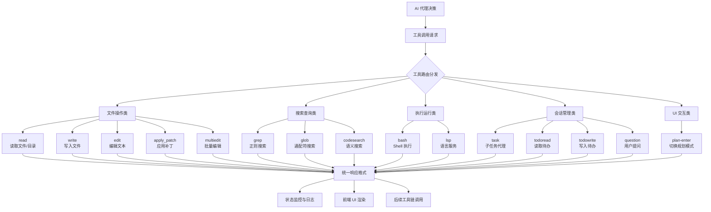

本页面提供 vis.thirdend 项目中所有可用工具命令的概览与分类说明。这些工具构成了 AI 代理与代码库交互的核心能力集，涵盖文件操作、代码搜索、终端执行、任务管理等关键功能域。工具系统基于结构化 JSON 输入/输出模式设计，支持原子化组合与批量并行执行，是自动化工作流的基础构件。

## 工具架构概览

工具系统采用统一的输入/输出协议，每个工具接收 JSON 格式的参数对象，返回标准化的响应结构，包含 `title`（标题）、`output`（文本输出）和 `metadata`（结构化元数据）三个核心字段。这种设计确保了工具的可组合性与结果的可预测性。

上图中，工具系统分为五大功能类别：文件操作类提供对工作区的读写能力；搜索查询类支持代码定位；执行运行类处理外部命令与语言服务；会话管理类负责子代理协调与待办事项；UI 交互类实现人机协作。所有工具最终统一输出格式，便于状态监控、UI 渲染与链式调用。

## 文件操作工具

文件操作工具是 AI 代理访问和修改代码库的基础接口，提供从简单读取到复杂补丁应用的全谱系能力。

### read：文件与目录读取

`read` 工具用于读取文件内容或目录列表，支持分页与偏移量控制，是信息获取的最基本入口。

| 参数 | 类型 | 必需 | 说明 |
|------|------|------|------|
| `filePath` | string | 是 | 目标文件或目录的绝对路径 |
| `offset` | number | 否 | 起始行号（文件）或条目序号（目录），1 基索引 |
| `limit` | number | 否 | 读取数量上限，默认 2000 行/条目 |

文件读取输出采用 XML 结构包装，每行内容以 `{行号}: ` 前缀标识，便于程序化解析。目录读取返回排序后的条目列表，子目录与符号链接目录以 `/` 后缀区分。系统在读取图像和 PDF 文件时返回 base64 编码的附件而非文本内容。文件总字节数限制为 50 KB，单行限制 2000 字符，超出时输出会包含截断提示。[docs/tools/read.md](docs/tools/read.md#L1-L94)

### write：文件写入

`write` 工具将完整内容写入指定路径，触发文件监视器与语言服务器更新，确保编辑即时生效。

| 参数 | 类型 | 必需 | 说明 |
|------|------|------|------|
| `content` | string | 是 | 待写入的完整内容 |
| `filePath` | string | 是 | 输出文件路径 |

写入操作会检查编辑权限，成功后更新 LSP 索引，使代码导航与诊断功能即时反映变更。元数据包含文件是否存在标志及 LSP 诊断信息。[docs/tools/write.md](docs/tools/write.md#L1-L29)

### edit：单次文本替换

`edit` 工具执行单次字符串替换操作，支持可选的全局替换模式。系统会尝试多种替换策略以容忍空白字符与转义差异，当匹配结果不唯一时会失败并请求更多上下文信息。

| 参数 | 类型 | 必需 | 说明 |
|------|------|------|------|
| `filePath` | string | 是 | 目标文件路径 |
| `oldString` | string | 是 | 待替换的原始文本 |
| `newString` | string | 是 | 替换后的新文本（必须不同） |
| `replaceAll` | boolean | 否 | 是否替换所有匹配项，默认 false |

输出包含统一差异格式（unified diff）及前后文件内容对比，同时返回 LSP 诊断信息供调用方检查编辑是否引入新问题。[docs/tools/edit.md](docs/tools/edit.md#L1-L37)

### apply_patch：多文件补丁应用

`apply_patch` 工具支持同时修改多个文件，使用自定义的 `*** Begin Patch` ... `*** End Patch` 格式描述变更集合。补丁在应用前会经过验证，无效或空的变更块会导致失败。

| 参数 | 类型 | 必需 | 说明 |
|------|------|------|------|
| `patchText` | string | 是 | 完整补丁文本 |

补丁支持四种操作类型：`add`（新增文件）、`update`（更新内容）、`move`（重命名）、`delete`（删除）。元数据结构提供每个文件的绝对路径、工作区相对路径、变更类型、差异对比及增减行数统计。权限检查与 LSP 更新在补丁应用后自动触发。[docs/tools/apply_patch.md](docs/tools/apply_patch.md#L1-L35)

### multiedit：批量顺序编辑

`multiedit` 工具在单个文件上按顺序应用一系列编辑操作，后一次编辑基于前一次编辑的结果执行，适用于需要多步转换的复杂重构场景。

| 参数 | 类型 | 必需 | 说明 |
|------|------|------|------|
| `filePath` | string | 是 | 目标文件路径 |
| `edits[]` | array | 是 | 编辑操作数组 |

内部实现依次调用 `edit` 工具并聚合各步骤的元数据，最终输出以最后一次编辑的结果为准。[docs/tools/multiedit.md](docs/tools/multiedit.md#L1-L39)

## 搜索查询工具

搜索查询工具提供多层次的代码定位能力，从精确模式匹配到语义检索，覆盖不同粒度的探索需求。

### grep：正则表达式搜索

`grep` 工具基于 ripgrep 引擎实现，在指定目录中递归搜索匹配正则表达式的代码行。

| 参数 | 类型 | 必需 | 说明 |
|------|------|------|------|
| `pattern` | string | 是 | 正则表达式模式 |
| `path` | string | 否 | 搜索起始目录，默认工作区根 |
| `include` | string | 否 | 文件 Glob 过滤器，如 `*.ts` |

输出按文件分组列出匹配行及行号，元数据统计匹配总数与截断状态。即使 ripgrep 返回非零退出码（如权限错误），只要产生匹配结果仍会返回有效输出。[docs/tools/grep.md](docs/tools/grep.md#L1-L30)

### glob：文件路径模式匹配

`glob` 工具使用通配符模式匹配文件路径，适用于基于文件类型或目录结构的批量操作。

| 参数 | 类型 | 必需 | 说明 |
|------|------|------|------|
| `pattern` | string | 是 | Glob 模式，如 `src/**/*.ts` |
| `path` | string | 否 | 搜索基目录 |

匹配结果以绝对路径列表形式返回，最多 100 条记录，超出时标记截断。路径按字典序排序，便于人工阅读与程序处理。[docs/tools/glob.md](docs/tools/glob.md#L1-L27)

### codesearch：语义代码搜索

`codesearch` 工具对外部 MCP API 发起语义搜索请求，适用于基于自然语言描述查找代码片段或 API 用法示例。

| 参数 | 类型 | 必需 | 说明 |
|------|------|------|------|
| `query` | string | 是 | 搜索查询文本 |
| `tokensNum` | number | 否 | 上下文大小，范围 1000-50000，默认 5000 |

该工具通过 HTTP POST 发送请求，以 Server-Sent Events (SSE) 流式接收响应并解析 `data:` 行。网络超时或服务不可用会返回明确的错误信息。[docs/tools/codesearch.md](docs/tools/codesearch.md#L1-L27)

## 执行运行工具

执行运行工具赋予 AI 代理在受控环境中执行外部命令和调用语言服务的能力。

### bash：Shell 命令执行

`bash` 工具在工作区内执行 Shell 命令，支持可选的工作目录设置与超时控制。

| 参数 | 类型 | 必需 | 说明 |
|------|------|------|------|
| `command` | string | 是 | 待执行的 Shell 命令 |
| `timeout` | number | 否 | 超时时间（毫秒） |
| `workdir` | string | 否 | 工作目录路径 |
| `description` | string | 否 | 简短描述（5-10 词） |

命令在运行前会经过解析与权限检查。超时或中断时，元数据会追加到输出文本中，便于事后分析执行状态。标准输出与标准错误合并为单一文本流返回。[docs/tools/bash.md](docs/tools/bash.md#L1-L33)

### lsp：语言服务器协议操作

`lsp` 工具直接调用语言服务器协议 (Language Server Protocol) 操作，提供代码导航与深度分析能力。

| 参数 | 类型 | 必需 | 说明 |
|------|------|------|------|
| `operation` | string | 是 | LSP 操作名称 |
| `filePath` | string | 是 | 目标文件路径 |
| `line` | number | 是 | 1 基行号 |
| `character` | number | 是 | 1 基字符索引 |

支持的操作包括：`goToDefinition`（跳转定义）、`findReferences`（查找引用）、`hover`（悬停信息）、`documentSymbol`（文档符号）、`workspaceSymbol`（工作区符号）、`goToImplementation`（跳转实现）、`prepareCallHierarchy`（调用层次准备）、`incomingCalls`（传入调用）、`outgoingCalls`（传出调用）。若无对应语言服务器则返回错误。[docs/tools/lsp.md](docs/tools/lsp.md#L1-L31)

## 会话管理工具

会话管理工具支持子代理任务分解与待办事项跟踪，实现复杂工作流的协作式执行。

### task：子代理任务创建

`task` 工具创建子代理会话，将复杂任务委托给专用代理并行处理。子代理继承父会话的上下文但拥有独立的工具调用权限与模型配置。

| 参数 | 类型 | 必需 | 说明 |
|------|------|------|------|
| `description` | string | 是 | 简短任务描述（3-5 词） |
| `prompt` | string | 是 | 子代理的任务指令 |
| `subagent_type` | string | 是 | 子代理类型标识 |
| `task_id` | string | 否 | 现有子会话 ID（用于继续） |
| `command` | string | 否 | 触发该任务的命令标识 |

输出包含子会话 `task_id`、使用的模型提供商与模型 ID，以及工具执行摘要数组。注意 `todowrite` 和 `todoread` 工具在子代理会话中被禁用，以避免递归更新死锁。[docs/tools/task.md](docs/tools/task.md#L1-L38)

### todoread：待办事项读取

`todoread` 工具读取当前会话的待办事项列表，主要用于在会话恢复时重新加载任务状态。

| 参数 | 类型 | 必需 | 说明 |
|------|------|------|------|
| （无） | - | - | 空对象 |

返回待办数组，每个条目包含 `id`、`content`、`status`（`pending`/`in_progress`/`completed`/`cancelled`）和 `priority`（`high`/`medium`/`low`）。[docs/tools/todoread.md](docs/tools/todoread.md#L1-L26)

### todowrite：待办事项写入

`todoread` 工具以完整替换方式写入待办事项列表，非增量更新模式。

| 参数 | 类型 | 必需 | 说明 |
|------|------|------|------|
| `todos[]` | array | 是 | 完整的待办列表 |

输出包含未完成任务计数摘要及持久化后的待办数组。该工具通常与 `todoread` 配合使用，形成读取-修改-写入的闭环。[docs/tools/todowrite.md](docs/tools/todowrite.md#L1-L31)

## 工作流辅助工具

工作流辅助工具提供批量执行、用户交互与模式切换等支撑能力。

### batch：批量并行执行

`batch` 工具将多个工具调用打包为原子操作并行执行，最大支持 25 个子调用。批量操作要么全部成功，要么部分失败，结果以汇总形式返回。

| 参数 | 类型 | 必需 | 说明 |
|------|------|------|------|
| `tool_calls[]` | array | 是 | 工具调用数组 |

每个子调用指定 `tool` 名称与 `parameters` 对象。输出统计成功与失败数量，并聚合所有子工具产生的附件。嵌套 `batch` 调用不被支持，防止无限递归。[docs/tools/batch.md](docs/tools/batch.md#L1-L36)

### question：交互式提问

`question` 工具向用户呈现多选问题，收集人工输入以辅助决策。

| 参数 | 类型 | 必需 | 说明 |
|------|------|------|------|
| `questions[]` | array | 是 | 问题数组 |
| `questions[].question` | string | 是 | 完整问题文本 |
| `questions[].header` | string | 是 | 短标签 |
| `questions[].options[]` | array | 是 | 选项数组 |
| `options[].label` | string | 是 | 选项标签 |
| `options[].description` | string | 是 | 选项描述 |
| `questions[].multiple` | boolean | 否 | 是否允许多选 |

返回用户选择的标签数组及回答摘要。系统内部处理 `custom` 选项，该选项不出现在输入模式中。[docs/tools/question.md](docs/tools/question.md#L1-L39)

### plan-enter：规划模式切换

`plan-enter` 工具将当前会话切换到规划代理模式，由规划代理接管后续决策。

| 参数 | 类型 | 必需 | 说明 |
|------|------|------|------|
| （无） | - | - | 空对象 |

切换前显示确认提示，用户批准后创建合成用户消息完成模式转换。内部工具标识为 `plan_enter`。[docs/tools/plan-enter.md](docs/tools/plan-enter.md#L1-L23)

### plan-exit：退出规划模式

`plan-exit` 工具结束规划代理模式，恢复为标准代理会话。该工具无参数，直接返回切换完成信息。[docs/tools/plan-exit.md](docs/tools/plan-exit.md)

## 工具使用最佳实践

基于对工具接口与行为模式的系统分析，以下实践建议可提升工具调用的可靠性与效率：

**文件编辑策略**：对于简单的单处修改，优先使用 `edit` 工具；对于跨多文件的系统性变更，采用 `apply_patch` 工具以保持变更的原子性与可审查性；当同一文件需按顺序应用多个独立修改时，使用 `multiedit` 工具避免重复读取开销。

**搜索策略**：精确模式匹配首选 `grep`，文件名模式匹配使用 `glob`，自然语言语义查询调用 `codesearch`。对于大型代码库，建议先用 `glob` 缩小范围再用 `grep` 精确定位。

**错误处理**：所有工具输出应检查 `metadata` 字段与 `output` 文本中的诊断信息。`edit` 工具在匹配不明确时失败，此时应扩大 `oldString` 上下文或改用 `apply_patch` 提供更精确的定位。

**并发控制**：`batch` 工具适合执行独立的并行查询，如同时读取多个文件或运行多个 `grep` 搜索。但依赖链式结果的操作不宜批量，应保持顺序执行以确保数据一致性。

**会话管理**：子代理任务（`task`）用于分解复杂目标，但需注意待办工具在子会话中的禁用限制。主会话应通过 `todoread` 与 `todowrite` 维护全局任务视图。

## 工具系统集成点

工具系统与 vis.thirdend 的其他核心模块存在紧密集成。文件操作工具与 LSP 服务器联动，确保编辑即时触发诊断与索引更新。`bash` 工具与嵌入式终端模块通信，实现命令执行结果的流式显示。`task` 工具与会话管理服务交互，创建独立的子代理工作空间。批量工具与并发控制器协作，在 `mapWithConcurrency` 的约束下执行并行操作。[docs/API.md](docs/API.md)

如需深入了解工具的具体实现细节与扩展机制，请参阅 [工具函数库](22-gong-ju-han-shu-ku) 与 [类型定义](23-lei-xing-ding-yi) 页面。