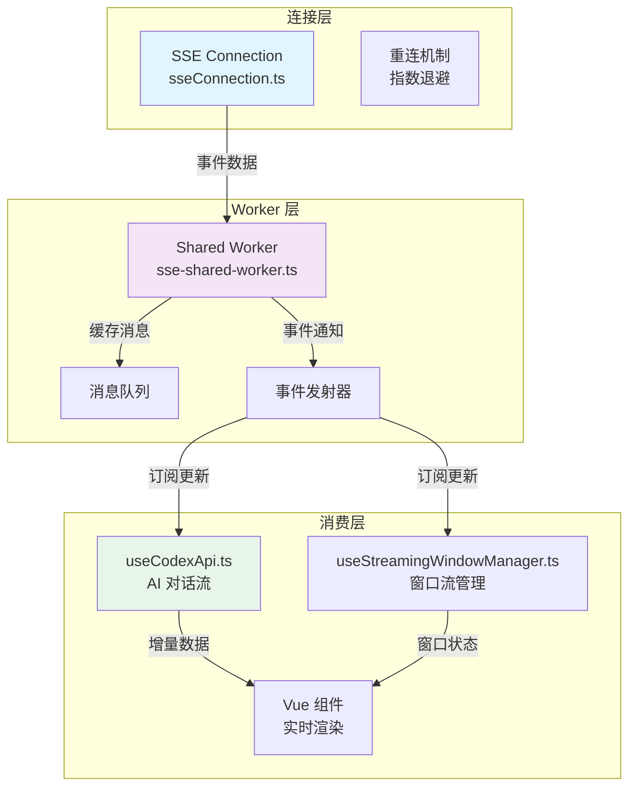

SSE (Server-Sent Events) 是此应用程序中实现实时数据传输的核心技术之一，主要用于处理 AI 对话中的流式响应、实时状态更新和异步事件通知。本页面全面介绍 SSE 在该项目中的架构设计、实现细节和使用模式。

## 架构概览

应用程序采用**多层 SSE 架构**，将网络连接、事件分发和 UI 渲染解耦，确保高性能和可维护性。核心架构包含三个层次：**连接层**（`sseConnection.ts`）负责建立和维持 SSE 连接；**Worker 层**（`sse-shared-worker.ts`）在独立线程中处理事件流；**消费层**（`useCodexApi.ts`、`useStreamingWindowManager.ts`）将数据绑定到 Vue 组件。



该架构的关键设计原则是：**单一连接多路复用**——一个 SSE 连接可承载多种事件类型（对话流、状态更新、错误通知），通过 `event` 字段区分；**Off-Main-Thread 处理**——所有网络 I/O 和解析逻辑在 Shared Worker 中执行，避免阻塞主线程渲染；**状态快照与恢复**——Worker 维护事件流的历史记录，支持页面刷新后重建 UI 状态。

## 核心类型定义

SSE 系统的类型定义位于 `app/types/sse.ts` 和 `app/types/sse-worker.ts`，明确定义了事件结构、连接配置和消息格式。

**事件类型分类**：
- `text` - 纯文本流，用于 AI 生成的对话内容
- `tool_use` - 工具调用事件，携带工具名称和参数
- `tool_result` - 工具执行结果
- `error` - 错误事件，包含错误码和消息
- `done` - 流结束标记
- `ping` - 心跳事件，维持连接活跃

**消息结构**：
```typescript
interface SSEMessage {
  id: string;              // 消息唯一标识
  type: SSEEventType;      // 事件类型
  data: any;               // 事件负载
  created_at: number;      // 时间戳
  thread_id?: string;      // 关联的对话线程 ID
}
```

**连接配置** (`app/utils/sseConnection.ts#L15-L45`)：
```typescript
interface SSEConfig {
  url: string;                     // SSE 端点 URL
  retries?: number;                // 最大重试次数
  retryDelay?: number;             // 初始重试延迟（毫秒）
  backoffFactor?: number;          // 退避因子
  headers?: Record<string, string>; // 自定义请求头
  eventSourceInit?: object;        // EventSource 配置
}
```

## 连接管理机制

`app/utils/sseConnection.ts` 实现了**健壮的 SSE 连接管理器**，处理连接生命周期、自动重连和错误恢复。核心逻辑包括：

1. **连接建立**：使用浏览器原生 `EventSource` API，支持自定义请求头（携带认证令牌）
2. **事件监听**：监听 `message`、`error`、`open` 事件，根据 `event` 字段路由到不同处理器
3. **重连策略**：指数退避算法，初始延迟 1000ms，每次重试延迟乘以 1.5，上限 30000ms
4. **连接状态**：维护 `CONNECTING`、`OPEN`、`CLOSED` 状态，避免重复连接

```typescript
// 连接建立流程（简化）
const connect = () => {
  if (source?.readyState === EventSource.OPEN) return;
  
  source = new EventSource(config.url, {
    headers: config.headers,
    ...config.eventSourceInit
  });
  
  source.onopen = () => { /* 记录连接时间 */ };
  source.onmessage = (event) => parseAndDispatch(event);
  source.onerror = (error) => handleError(error);
};
```

**重连机制**在 `app/utils/sseConnection.ts#L78-L112` 中实现，当连接断开时，根据重试计数计算延迟，使用 `setTimeout` 调度重连。如果达到最大重试次数，则触发 `failed` 事件通知上层组件。

## Shared Worker 事件处理

`app/workers/sse-shared-worker.ts` 创建**共享 Worker**，允许多个浏览器上下文（如多个标签页）共享同一 SSE 连接，减少服务器负载。Worker 的核心职责：

1. **连接池管理**：维护多个 SSE 连接的映射，以 `connectionId` 标识
2. **事件广播**：使用 `BroadcastChannel` 或 `postMessage` 向所有连接的端口发送事件
3. **消息缓存**：为每个连接缓存最近 N 条消息（默认 1000 条），支持新连接快速同步历史
4. **线程间通信**：处理主线程的 `connect`、`disconnect`、`subscribe`、`unsubscribe` 指令

```typescript
// Worker 消息处理逻辑
self.onmessage = (event: MessageEvent<WorkerMessage>) => {
  const { type, payload } = event.data;
  
  switch (type) {
    case 'connect':
      establishSSE(payload.connectionId, payload.url);
      break;
    case 'disconnect':
      closeConnection(payload.connectionId);
      break;
    case 'subscribe':
      addSubscriber(payload.connectionId, event.ports[0]);
      break;
  }
};
```

Worker 使用**发布-订阅模式**，每个 SSE 连接可以有多个订阅者（例如，一个对话流同时更新消息列表和状态栏）。订阅者通过 `MessagePort` 接收事件，实现**解耦的事件分发**。

## 流式对话实现

`app/composables/useCodexApi.ts` 展示了 SSE 在 AI 对话中的典型应用。该组合函数封装了 Codex API 调用，处理流式响应并更新 Vue 响应式状态。

**核心流程**：
1. 用户提交消息，调用 `sendMessage` 创建新对话线程
2. 建立 SSE 连接，监听 `thread.message.created` 和 `thread.message.delta` 事件
3. 增量更新消息内容：`delta` 事件携带 `text_delta` 字段，使用 `appendText` 累积到当前消息
4. 工具调用处理：`tool_use` 事件触发工具执行，`tool_result` 事件收集结果
5. 完成处理：`done` 事件标记对话结束，更新线程状态

```typescript
// 增量更新逻辑（useCodexApi.ts）
const handleDelta = (delta: MessageDelta) => {
  if (delta.type === 'text_delta') {
    const index = delta.index ?? currentMessageIndex.value;
    messages.value[index].content += delta.text_delta;
  }
};
```

**错误恢复机制**：当 SSE 连接中断时，`useCodexApi.ts` 自动尝试重连，并查询服务器获取未完成的消息增量。这通过 `app/composables/useServerState.ts` 与后端同步状态实现，确保用户数据不丢失。

## 流窗口管理器

`app/composables/useStreamingWindowManager.ts` 管理**多个并发流式窗口**（例如，同时进行多个 AI 对话）。该组合函数维护窗口状态集合，每个窗口独立订阅 SSE 事件，通过 `window_id` 标识。

**关键能力**：
- **窗口生命周期**：创建、聚焦、关闭窗口，自动清理关联的 SSE 订阅
- **事件路由**：根据事件负载中的 `window_id` 将事件分发到对应窗口
- **状态聚合**：收集所有窗口的流状态（生成中、完成、错误），供全局 UI 显示
- **资源清理**：窗口关闭时取消 SSE 订阅，断开无用的网络连接

## 前端集成模式

SSE 事件流与 Vue 3 响应式系统集成时，采用**命令式转声明式**的模式。`useCodexApi` 和 `useStreamingWindowManager` 将 SSE 事件转换为响应式状态（`ref`、`reactive`），组件通过模板绑定自动更新。

**最佳实践**：
1. **防抖更新**：高频 `delta` 事件使用 `nextTick` 批量更新，避免过度渲染
2. **虚拟滚动**：消息列表使用 `vue-virtual-scroller`，仅渲染可见区域
3. **乐观 UI**：用户操作立即反馈，SSE 事件作为最终确认
4. **错误边界**：捕获 SSE 解析错误，显示友好错误信息，提供重试按钮

## 性能优化策略

SSE 流可能产生大量事件，项目实施多项优化确保流畅体验：

1. **事件压缩**：`app/utils/messageDiff.ts` 计算消息差异，仅传输变化部分而非完整消息
2. **节流渲染**：`app/composables/useAutoScroller.ts` 控制自动滚动频率，避免每次事件都滚动
3. **Worker 卸载**：页面隐藏时暂停 SSE 连接，恢复时重新同步状态，节省带宽和 CPU
4. **连接复用**：Shared Worker 允许多个组件共享同一 SSE 连接，减少握手开销

## 故障排除与调试

常见 SSE 问题及解决方案：

| 问题现象 | 可能原因 | 诊断方法 | 解决方案 |
|---------|---------|---------|---------|
| 连接断开不重连 | 网络波动或服务器关闭 | 检查 `EventSource` 的 `readyState` | 实现手动重连按钮，检查服务器 CORS 配置 |
| 消息丢失 | Worker 缓存溢出 | 查看 `app/workers/sse-shared-worker.ts` 的 `MAX_HISTORY` | 增大缓存限制，或实现分页加载历史 |
| 重复消息 | 多订阅者重复处理 | 检查 `subscribe` 调用次数 | 确保订阅生命周期与组件匹配，使用 `unsubscribe` 清理 |
| 内存泄漏 | 未关闭连接 | Chrome DevTools Memory 标签页 | 组件卸载时调用 `disconnect`，使用 `onUnmounted` 清理 |

调试工具：`app/utils/sseConnection.test.ts` 包含单元测试，模拟各种网络场景；浏览器开发者工具的 Network 标签页可查看 SSE 流原始数据；`app/utils/eventEmitter.test.ts` 验证事件分发逻辑。

## 与后端集成

SSE 端点通常由 Node.js 后端提供（见 `server.js` 或 `app/backends`）。后端需设置正确的响应头：
```
Content-Type: text/event-stream
Cache-Control: no-cache
Connection: keep-alive
```

事件格式遵循 SSE 规范：每行以 `field: value` 形式，事件间以空行分隔。例如：
```
event: thread.message.delta
id: msg_123
data: {"type":"text_delta","text_delta":"Hello"}

event: thread.message.delta
id: msg_123
data: {"type":"text_delta","text_delta":" World"}
```

## 未来演进方向

根据代码库中的 TODO 注释和设计模式，SSE 系统可能的改进方向：
- **WebSocket 降级策略**：在 SSE 不支持的环境（如某些代理）自动降级为长轮询
- **服务端发送压缩**：启用 `Content-Encoding: gzip` 减少传输体积
- **断点续传**：基于 `Last-Event-ID` 头实现更精确的事件恢复
- **多租户隔离**：Shared Worker 中为不同用户/会话提供连接隔离

## 相关文档链接

- [Web Workers 多线程](25-web-workers-duo-xian-cheng) - 了解 Shared Worker 的完整使用模式
- [Composables 可组合函数](21-composables-ke-zu-he-han-shu) - 学习 `useCodexApi` 和其他流式组合函数
- [后端服务与 API](8-hou-duan-fu-wu-yu-api) - 查看 SSE 服务器端实现
- [性能优化策略](26-xing-neng-you-hua-ce-lue) - 深入了解流式渲染优化技术