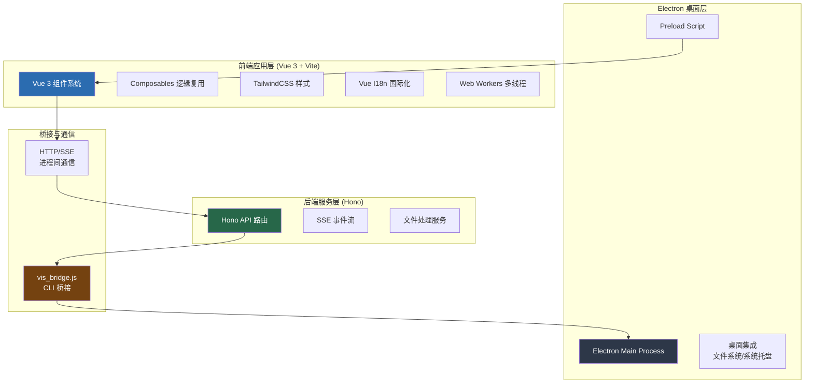

本文档系统性地梳理 vis.thirdend 项目的完整技术栈构成，涵盖前端框架、构建工具、桌面端集成、后端服务以及核心功能库等层级。通过本概览，开发者可以快速理解项目的技术选型依据与架构分层。

## 一、整体架构分层
项目采用 **前后端分离 + Electron 桌面封装** 的三层架构。前端基于 Vue 3 + Vite 构建现代化 SPA，后端基于 Hono 框架提供轻量级 API 服务，二者通过本地 `vis_bridge` 桥接器或 HTTP 通信协作。Electron 层负责系统级集成（文件系统、进程管理等）。该设计确保了 Web 与桌面端的能力对齐，同时保持代码的可测试性与可部署性。

## 二、前端核心栈
### 2.1 框架与运行时
- **Vue 3** (^3.5.28)：采用组合式 API (Composition API) 构建响应式组件系统，利用 `<script setup>` 语法糖提升开发效率。
- **TypeScript** (^6.0.3)：提供全栈类型安全，前端代码通过 `vue-tsc` 进行类型检查。
- **Vite** (^7.3.1)：作为下一代构建工具，提供极速冷启动、按需编译与原生 ESM 支持，开发体验显著优于传统 bundler。

### 2.2 样式与 UI
- **TailwindCSS** (^4.1.18)：原子化 CSS 框架，通过工具类快速构建一致的设计系统。
- **PostCSS** (^8.5.6) + **Autoprefixer** (^10.4.24)：处理 CSS 兼容性与自动前缀。
- **@tailwindcss/typography** (^0.5.19)：为 Markdown 渲染内容提供排版优化。

### 2.3 国际化
- **Vue I18n** (^11.3.0)：集成于 `i18n/` 目录，支持中文（简/繁）、英文、世界语、日语四语言，通过 `useI18n`  Composables 实现动态切换。语言包定义于 `locales/` 目录。

### 2.4 代码高亮与渲染
- **Shiki** (^3.22.0)：基于 TextMate 语法的语法高亮引擎，提供精准的代码着色。
- **@shikijs/markdown-it** (^3.22.0)：将 Shiki 集成至 Markdown 渲染管线。
- **Markdown-it** (^14.1.1)：核心 Markdown 解析器，支持插件扩展。

## 三、Electron 桌面端集成
### 3.1 核心依赖
- **Electron** (^35.0.0)：提供跨平台桌面运行时，主进程代码位于 `electron/main.js`，预加载脚本为 `electron/preload.cjs`。
- **Electron Builder** (^26.0.0)：负责应用打包与分发，配置文件为 `electron-builder.yml`。

### 3.2 启动流程
开发模式通过 `npm run electron:start` 调用 `scripts/electron-start.mjs` 启动 Vite 开发服务器并加载 Electron 窗口；生产构建执行 `vite build` 后由 electron-builder 打包为可执行文件。构建后需执行 `electron-builder install-app-deps` 编译原生依赖。

Sources: [package.json](package.json#L28-L39)

## 四、后端服务与 API
### 4.1 Web 框架
- **Hono** (^4.12.3)：轻量级 TypeScript Web 框架，运行于 Node.js 或 Edge 环境。后端入口文件为 `server.js`，提供 API 路由与 SSE 事件流支持。
- **@hono/node-server** (^1.19.9)：Hono 的 Node.js 适配器，用于在本地启动 HTTP 服务。

### 4.2 核心能力
后端服务主要承担以下职责：
- 代理大语言模型（LLM）API 请求
- 提供 Server-Sent Events (SSE) 实时流式响应
- 处理文件读写、压缩包解析等本地 I/O 操作
- 管理会话状态与缓存

Sources: [package.json](package.json#L40-L51), [server.js](server.js)

## 五、桥接器与 CLI 工具
### 5.1 vis_bridge
- **CLI 入口**：`vis_bridge.js` 与 `vis_bridge.d.ts`（类型声明）
- **作用**：作为前端与本地系统的安全桥梁，封装文件系统操作、子进程执行等敏感能力，通过标准输入/输出与主进程通信。用户可在终端通过 `vis_bridge` 命令调用。

### 5.2 设计模式
vis_bridge 采用 **子进程模式**：前端通过 `child_process.spawn` 启动桥接进程，以 JSON 消息协议交换数据。这种隔离设计限制了权限攻击面，同时保持 Node.js API 的可用性。

Sources: [package.json](package.json#L16-L19), [vis_bridge.js](vis_bridge.js)

## 六、核心功能库
### 6.1 数据流与状态管理
- **SSE 连接**：`utils/sseConnection.ts` 实现 Server-Sent Events 客户端，支持自动重连与心跳检测。
- **事件总线**：`utils/eventEmitter.ts` 提供轻量级发布订阅模式，用于跨组件通信。
- **状态构建器**：`utils/stateBuilder.ts` 集中管理全局状态初始化逻辑。

### 6.2 文件处理
- **压缩包解析**：`utils/archiveParser.ts` 集成 `jszip`、`fflate`、`libarchive-wasm`、`nanotar` 四种解析引擎，根据文件类型自动选择最优方案。
- **文件类型检测**：`utils/fileTypeDetector.ts` 通过魔数 (magic number) 识别文件格式。
- **差异压缩**：`utils/diffCompression.ts` 针对代码 Diff 场景优化传输体积。

### 6.3 并发控制
- **mapWithConcurrency**：`utils/mapWithConcurrency.ts` 提供带并发限制的异步任务调度，避免资源耗尽。

### 6.4 字体与主题
- **字体发现**：`utils/fontDiscovery.ts` 扫描系统可用字体。
- **主题系统**：`utils/theme.ts`、`themeRegistry.ts`、`themeTokens.ts` 共同构成可扩展的主题引擎；`useRegionTheme.ts` Composables 实现局部主题覆盖。

### 6.5 通知与反馈
- **通知管理器**：`utils/notificationManager.ts` 统一处理 Toast、模态框等用户反馈。
- **思考动画**：`composables/useThinkingAnimation.ts` 为 AI 响应提供视觉暗示。

### 6.6 渲染管线
- **Worker 渲染**：`workers/render-worker.ts` 在独立线程执行高开销渲染任务。
- **工具渲染器**：`utils/toolRenderers.ts` 将各类工具输出（终端、Diff、PDF 等）格式化为统一视图。

## 七、开发工具链
### 7.1 代码质量
- **Oxlint** (^1.47.0)：基于 Oxc 的快速 Linter，配合 `oxlint-tsgolint` (^0.12.2) 扩展 TypeScript 规则。
- **Oxfmt** (^0.32.0)：代码格式化工具，与 Oxlint 同源保证风格统一。

### 7.2 类型检查
- **vue-tsc** (^3.2.4)：Vue 3 专用类型检查器，确保模板类型安全。
- **TypeScript** (^6.0.3)：提供严格模式配置（见 `tsconfig.json`）。

### 7.3 测试框架
- **Vitest** (^4.1.2)：Vite 原生测试框架，支持组件测试与单元测试。
- **Happy DOM** (^17.0.0)：轻量级 DOM 模拟环境，替代 jsdom 提升测试速度。

## 八、项目配置摘要
| 配置文件 | 用途 |
|---------|------|
| `vite.config.ts` | Vite 构建配置，定义别名、插件、CSS 处理等 |
| `tsconfig.json` | TypeScript 编译器选项，启用 strict 模式 |
| `electron-builder.yml` | Electron 打包参数（图标、平台、签名等） |
| `pnpm-workspace.yaml` | PNPM 工作区定义（本项目为单包） |
| `.oxlintrc.json` | Oxlint 规则配置 |
| `.oxfmtrc.json` | Oxfmt 格式化配置 |

Sources: [vite.config.ts](vite.config.ts), [tsconfig.json](tsconfig.json), [electron-builder.yml](electron-builder.yml)

## 九、技术栈演进与选择依据
本项目的技术选型体现了 **"现代优先、渐进增强"** 的原则：
- **Vue 3 + Vite** 替代 React + Webpack，降低学习曲线并提升开发体验。
- **Hono** 替代 Express/Koa，因其 TypeScript 友好、性能优异且适配边缘计算。
- **Shiki** 替代 highlight.js，因其基于 TextMate 语法的准确性与主题一致性。
- **TailwindCSS 4** 采用新架构，减少运行时体积并提升构建性能。

该技术栈在保持中小型项目轻量的同时，具备向大型分布式系统扩展的潜力。

## 十、后续阅读建议
为深入理解各层实现，建议按以下路径探索：
- **[前端架构设计](6-qian-duan-jia-gou-she-ji)**：了解 Vue 组件组织与 Composables 设计模式
- **[Electron 桌面端集成](7-electron-zhuo-mian-duan-ji-cheng)**：掌握主进程/渲染进程通信机制
- **[后端服务与 API](8-hou-duan-fu-wu-yu-api)**：解析 Hono 路由与 SSE 流式响应
- **[vis_bridge 桥接器](9-vis_bridge-qiao-jie-qi)**：研究本地桥接的安全模型
- **[Web Workers 多线程](25-web-workers-duo-xian-cheng)**：理解渲染管线卸载策略
- **[构建配置](28-gou-jian-pei-zhi)**：熟悉 Vite 插件生态与打包优化