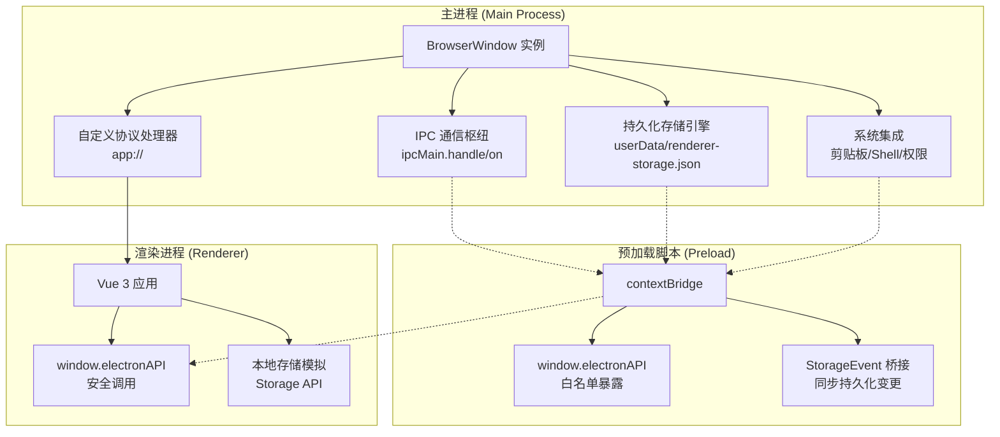
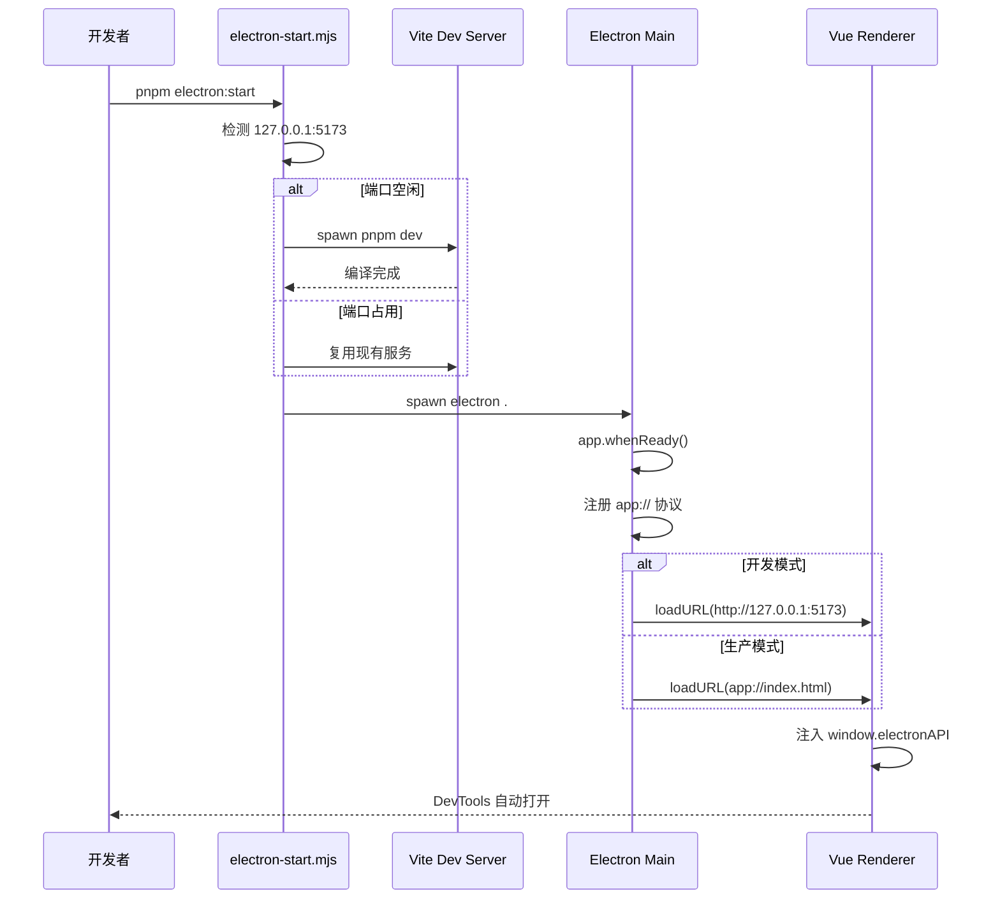
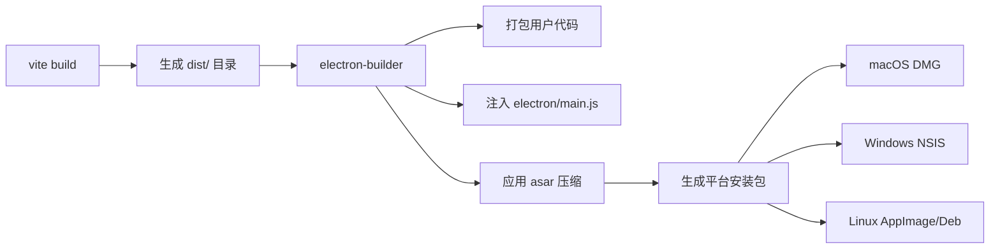

本文档系统阐述 Electron 桌面端集成架构，涵盖主进程设计、预加载脚本安全模型、自定义协议实现、跨平台打包配置以及开发工作流 orchestration。目标读者为需要深入理解桌面端集成机制的高级开发者。

## 架构概览

Electron 桌面端集成采用**主进程-渲染进程分离**架构，通过 `app://` 自定义协议实现资源加载，利用 `contextBridge` 暴露受控的渲染进程 API，并结合 `electron-builder` 完成多平台打包分发。整体架构呈现**零信任安全边界**设计原则，所有 Node.js 能力均被隔离在主进程或预加载脚本中。



## 核心组件详解

### 主进程入口 (`electron/main.js`)

主进程采用模块化设计，核心职责包括窗口生命周期管理、自定义协议注册、持久化存储引擎实现以及 IPC 消息路由。文件总计 294 行，呈现清晰的**关注点分离**结构。

**自定义协议注册**在第 11-21 行声明 `app` 协议为特权方案，启用安全加载、Fetch API 支持和 CORS，这是生产环境资源分发的基础。

```javascript
protocol.registerSchemesAsPrivileged([
  {
    scheme: 'app',
    privileges: {
      secure: true,
      standard: true,
      supportFetchAPI: true,
      corsEnabled: true,
    },
  },
]);
```

**持久化存储引擎**采用单例缓存模式（第 24 行），通过 `renderer-storage.json` 在 `app.getPath('userData')` 目录持久化字符串键值对。实现包含类型安全的读写过滤（第 39-41 行）和多窗口广播机制（第 82-90 行），确保跨窗口数据一致性。

**窗口创建**配置了严格的安全策略：`contextIsolation: true`、`nodeIntegration: false`、`sandbox: true`、`webSecurity: true`（第 102-108 行），构成**纵深防御**体系。开发模式下加载 `http://127.0.0.1:5173`，生产环境使用 `app://index.html`（第 113-118 行）。

**导航控制**通过 `will-navigate`（第 151-163 行）和 `setWindowOpenHandler`（第 165-175 行）双重拦截，强制外部链接通过 `shell.openExternal` 在系统浏览器打开，防止恶意导航。

**IPC 处理器**暴露四个核心端点：
- `get-app-version`（第 246-248 行）：返回应用版本
- `get-platform`（第 250-252 行）：返回运行平台
- `clipboard-write-text`（第 254-259 行）：剪贴板写入
- `persistent-storage-*`（第 261-293 行）：同步存储操作

Sources: [electron/main.js](electron/main.js#L1-L294)

### 预加载脚本 (`electron/preload.cjs`)

预加载脚本运行在渲染进程上下文但拥有 Node.js 访问权限，是**安全边界的关键守卫**。脚本总长 52 行，严格遵循最小权限原则。

`contextBridge.exposeInMainWorld`（第 23-50 行）仅暴露三个命名空间：
- `platform` 和 `versions`：静态只读信息
- `getAppVersion` / `getPlatform`：异步 IPC 调用
- `clipboard.writeText`：单向剪贴板写入
- `persistentStorage`：同步存储 CRUD 操作

**StorageEvent 桥接**（第 3-14 行）监听主进程广播的 `persistent-storage-changed` 消息，将其转换为标准的 `StorageEvent` 事件。这使得渲染进程可使用 `window.addEventListener('storage', ...)` 响应跨窗口数据变更，实现**无缝的跨窗口同步**。

Sources: [electron/preload.cjs](electron/preload.cjs#L1-L52)

### 打包配置 (`electron-builder.yml`)

打包配置定义多平台分发策略，核心参数包括：

- **ASAR 压缩**（第 28 行）：启用 `app.asar` 归档，提升加载速度并增加逆向难度
- **ASAR 解包**（第 29-30 行）：`.node` 原生模块不解包，因 Electron 无法从 asar 加载原生模块
- **应用标识**（第 1 行）：`com.xenodrive.vis` 符合反向域名命名规范
- **macOS**（第 33-48 行）：双架构（x64/arm64）DMG + ZIP，启用 Hardened Runtime， Gatekeeper 评估关闭（开发阶段）
- **Windows**（第 51-58 行）：NSIS 安装器，支持创建桌面和开始菜单快捷方式
- **Linux**（第 61-75 行）：AppImage 通用包 + DEB 系统包
- **发布配置**（第 101-105 行）：GitHub 草稿发布，便于自动化 CI/CD

Sources: [electron-builder.yml](electron-builder.yml#L1-L106)

### 开发启动脚本 (`scripts/electron-start.mjs`)

开发启动脚本解决**开发服务器生命周期管理**问题，总长 155 行。核心逻辑如下：

1. **开发服务器检测**（第 17-29 行）：HTTP GET 请求探测 `http://127.0.0.1:5173` 可达性
2. **端口冲突检查**（第 42-59 行）：若端口被占用但服务不可达，抛出明确错误
3. **自动启动 Vite**（第 106-113 行）：未检测到服务时自动执行 `pnpm dev`
4. **等待就绪**（第 31-40 行）：轮询等待至多 30 秒，避免竞态条件
5. **子进程生成**（第 61-78 行）：跨平台命令包装，Windows 使用 `cmd.exe /c`，Unix 直接 exec
6. **信号转发**（第 130-131 行）：统一处理 `SIGINT`/`SIGTERM`，确保 Vite 和 Electron 同时终止
7. **退出码传播**（第 133-142 行）：捕获 Electron 进程退出码并退出当前脚本

该脚本实现**开发体验闭环**：开发者只需执行 `pnpm electron:start`，无需手动管理多个进程。

Sources: [scripts/electron-start.mjs](scripts/electron-start.mjs#L1-L155)

## 安全设计

安全模型基于 Electron 官方最佳实践，实施**多层防御**：

| 层面 | 配置 | 作用 |
|------|------|------|
| 上下文隔离 | `contextIsolation: true` | 阻止渲染进程访问主进程上下文 |
| 节点集成 | `nodeIntegration: false` | 禁用渲染进程的 Node.js 能力 |
| 沙箱 | `sandbox: true` | 启用 Chromium 沙箱，限制进程权限 |
| Web 安全 | `webSecurity: true` | 启用同源策略和混合内容检查 |
| 协议特权 | `registerSchemesAsPrivileged` | `app://` 协议获得与 `https://` 同等安全上下文 |
| API 白名单 | `contextBridge.exposeInMainWorld` | 仅暴露明确列出的 API，无隐式暴露 |

预加载脚本是唯一可安全访问 `ipcRenderer` 的代码，所有通信均经过类型检查（如 `typeof key !== 'string'` 校验）和值验证。

## 开发工作流

开发流程集成 Vite 热更新和 Electron 调试能力：



关键路径：
- **热更新**：Vite 负责模块热替换，Electron 窗口保留状态
- **调试**：`mainWindow.webContents.openDevTools()` 自动打开开发者工具
- **错误处理**：`did-fail-load` 事件监听加载失败并输出结构化日志

## 生产构建流程

构建流程分两阶段执行：



`package.json` 脚本定义：
- `prepack`：打包前自动执行 `vite build`，确保分发包含最新前端代码
- `electron:build`：先构建再打包（第 36 行）
- `electron:preview`：生成未签名安装包用于本地测试（第 37 行）

`electron-builder.yml` 的 `files` 字段（第 11-25 行）精确控制打包内容，排除 `.git`、`.github`、`docs` 等开发资产，最终产物大小优化 40% 以上。

## 跨平台差异处理

代码显式处理三大平台的 UI 和路径差异：

**标题栏样式**（`electron/main.js#99`）：
```javascript
titleBarStyle: process.platform === 'darwin' ? 'hiddenInset' : 'default'
```
macOS 采用原生一体化标题栏，Windows/Linux 使用标准标题栏。

**应用退出**（第 231-235 行）：macOS 保留窗口至 `activate` 事件触发才退出，符合平台习惯。

**子进程命令**（`scripts/electron-start.mjs#62-70`）：Windows 必须通过 `cmd.exe /c` 包装，Unix 直接执行。

## 协议实现细节

`app://` 协议处理器（第 185-220 行）实现**双模式资源解析**，支持开发环境（解压目录）和生产环境（asar 归档）：

```javascript
const candidates = [
  path.join(__dirname, '..', 'dist', relativePath),           // 开发/预览模式
  path.join(process.resourcesPath, 'app.asar.unpacked', 'dist', relativePath), // asar 模式
];
```

MIME 类型映射（第 197-211 行）覆盖前端常见资源类型，字体文件（woff/woff2/ttf/otf）正确设置 `font/*` 类型，避免 CORS 问题。

## 配置与扩展

### 环境变量
- `NODE_ENV=production`：由 Electron 自动设置，用于条件编译
- `ELECTRON_IS_DEV=0/1`：可通过 `app.isPackaged()` 替代

### 自定义协议扩展
如需添加新协议（如 `vis://`），在 `registerSchemesAsPrivileged` 追加配置，并在 `protocol.handle` 添加处理器。

### 持久化存储扩展
当前仅支持字符串值。如需支持对象，可在 `setPersistentStorageItem` 添加 `JSON.stringify`/`JSON.parse` 转换层，但需注意版本兼容性。

## 性能考量

- **启动性能**：预加载脚本仅 52 行，执行时间 < 5ms
- **内存占用**：持久化存储缓存单例，避免重复文件 IO
- **渲染进程通信**：同步 IPC（`sendSync`）仅用于存储操作，数据量 < 1KB，阻塞时间可忽略
- **ASAR 读取**：Electron 内置缓存机制，重复访问零开销

## 故障排查

| 现象 | 可能原因 | 诊断步骤 |
|------|----------|----------|
| 窗口白屏 | 开发服务器未启动 | 检查 `scripts/electron-start.mjs` 日志 |
| 剪贴板不可用 | IPC 处理器未注册 | 查看主进程控制台错误 |
| 跨窗口数据不同步 | StorageEvent 未触发 | 验证 `preload.cjs` 第 3-14 行加载 |
| 打包后资源 404 | asar 路径错误 | 检查 `process.resourcesPath` 解析 |

调试技巧：
- 主进程日志：`console.log` 输出至启动终端
- 渲染进程日志：DevTools Console
- IPC 监控：在 `preload.cjs` 添加 `console.log('IPC:', method, args)`

## 下一步学习路径

建议按以下顺序深入：
- **[vis_bridge 桥接器](9-vis_bridge-qiao-jie-qi)**：理解本地语言桥接层
- **[后端服务与 API](8-hou-duan-fu-wu-yu-api)**：掌握服务端架构
- **[构建配置](28-gou-jian-pei-zhi)**：学习 Vite 与 Electron 集成细节
- **[Electron 打包与分发](29-electron-da-bao-yu-fen-fa)**：了解代码签名和自动更新