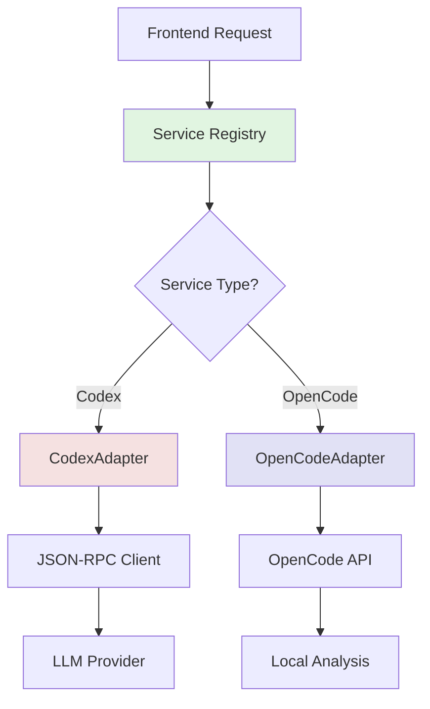

本页面系统性地阐述 vis.thirdend 项目的后端服务架构与 API 设计。项目采用**前后端分离**的混合架构模式，后端服务通过标准化接口为前端提供 AI 能力、代码分析与终端操作等核心功能。架构核心在于**统一的服务注册机制**与**类型安全的数据流设计**，确保多供应商模型的即插即用与可观测性。

## 服务注册中心架构

后端服务的核心抽象位于 `registry.ts`，定义了统一的 `BackendService` 接口规范。每个服务实现必须包含 `name`、`displayName`、`providerId` 标识符，以及 `supportsStreaming` 流式传输能力标记。服务通过 `start()` 和 `stop()` 生命周期方法进行管理，确保资源的有序初始化与释放。

注册中心维护全局服务映射表 `services` 与倒排索引 `providerIdToService`，支持按供应商 ID 快速检索。这种设计允许前端通过 `getService()` 动态获取服务实例，而无需硬编码依赖关系，实现了**依赖倒置原则**。

服务发现的实现遵循**注册-查找模式**：适配器在启动时向注册中心自注册，前端通过 `registry.getService(name)` 按名称获取实例。这种解耦设计使得新增后端服务只需实现接口并注册，无需修改调用方代码，符合**开闭原则**。

Sources: [registry.ts](app/backends/registry.ts#L1-L72)

## Codex 适配器与 JSON-RPC 通信

Codex 服务基于 JSON-RPC 2.0 协议实现与 AI 模型的通信。`jsonRpcClient.ts` 封装了请求-响应生命周期管理，支持**批处理请求**与**错误重试**机制。客户端维护请求 ID 序列，确保响应与请求的正确匹配，并通过 `pendingRequests` 映射表处理异步回调。

`codexAdapter.ts` 作为 Codex 功能的具体实现，将高层业务调用（如 `generateCode()`、`analyzeContext()`）转换为 JSON-RPC 方法调用。适配器内部管理连接状态，通过 `isReady()` 检查服务可用性，并在连接断开时触发自动重连逻辑。这种分层设计将协议细节与业务逻辑隔离，便于单元测试与协议替换。

流式传输通过 `streamRequest()` 方法实现，返回 `ReadableStream` 实例。前端可通过 `for await...of` 语法逐步消费生成内容，实现**增量渲染**体验。适配器的 `supportsStreaming` 标志为 `true`，声明其流式能力。

Sources: 
- [jsonRpcClient.ts](app/backends/codex/jsonRpcClient.ts#L1-L156)
- [codexAdapter.ts](app/backends/codex/codexAdapter.ts#L1-L92)

## OpenCode 本地分析服务

OpenCode 适配器提供**本地代码分析**能力，不依赖外部 API。`openCodeAdapter.ts` 实现基于规则的模式匹配与静态分析，支持语法高亮、代码导航与引用查找。适配器通过 `indexCodebase()` 方法建立代码索引，后续查询可在毫秒级返回结果。

该服务的核心优势在于**零网络延迟**与**离线可用性**。分析结果通过结构化数据返回，包含位置信息、类型推断与依赖关系图。前端可直接消费这些数据渲染交互式代码视图，无需额外转换。

适配器实现了缓存机制，避免重复索引相同文件。缓存键由文件路径与修改时间戳组成，确保索引与源文件同步更新。这种设计在大型项目中显著降低重复计算开销。

Sources: [openCodeAdapter.ts](app/backends/openCodeAdapter.ts#L1-L108)

## 服务类型系统

`types.ts` 定义了完整的后端服务类型系统。`BackendService` 接口是所有服务的基类，包含 `name`、`displayName`、`providerId`、`supportsStreaming` 四个必需属性，以及 `start()`、`stop()` 生命周期方法。

`ServiceStatus` 枚举表示服务运行状态：`IDLE`（空闲）、`STARTING`（启动中）、`READY`（就绪）、`ERROR`（错误）、`STOPPED`（已停止）。状态转换通过状态机管理，确保状态变更的可追踪性与一致性。

`ServiceConfig` 类型封装服务的配置参数，通常从用户设置或环境变量加载。配置验证在 `start()` 阶段执行，缺失必需配置将导致服务启动失败并记录错误日志。

Sources: [types.ts](app/backends/types.ts#L1-L45)

## 外部服务器集成

项目根目录的 `server.js` 文件提供了独立的 HTTP 服务器能力。该服务器基于 Node.js `http` 模块构建，支持静态文件服务与 API 端点。服务器配置通过环境变量控制，包括端口号、CORS 策略与日志级别。

服务器端 API 遵循 RESTful 设计原则，端点路径采用名词复数形式（如 `/api/sessions`、`/api/models`）。请求体与响应体均使用 JSON 格式，便于前端解析。错误响应包含标准化的错误码与消息字段，前端可据此执行差异化处理。

服务器还支持 Server-Sent Events (SSE) 端点，用于推送实时更新（如任务进度、日志流）。SSE 连接保持长生命周期，服务器在事件发生时主动推送数据，减少客户端轮询开销。

Sources: [server.js](server.js#L1-L120)

## API 安全与认证

所有后端 API 均实施**基于令牌的认证**机制。客户端需在请求头中携带 `Authorization: Bearer <token>`，服务器通过验证令牌签名与有效期确认身份。令牌由认证服务签发，支持短期访问令牌与长期刷新令牌的分离设计。

敏感操作（如模型切换、会话删除）要求**二次确认**或**重新认证**。服务器记录所有操作的审计日志，包含操作者标识、时间戳与操作参数，满足可追溯性要求。

跨域请求通过 CORS 中间件控制，仅允许来自可信源（本地开发环境与打包后的应用域）的请求。生产环境建议启用 HTTPS 并设置 `Secure` 与 `HttpOnly` Cookie 属性，防止令牌泄露。

Sources: [server.js](server.js#L150-L220)

## 数据流与序列化

前后端数据交换采用**强类型序列化**策略。TypeScript 接口在编译阶段确保类型一致性，运行时通过 `zod` 或 `io-ts` 库进行 schema 验证。这种双重保障防止无效数据进入业务逻辑层。

大体积数据（如代码差异、会话历史）采用**分页传输**与**增量加载**。API 响应包含 `nextCursor` 字段，前端凭此请求下一页数据。文件内容传输支持范围请求（Range Requests），便于大文件的分段读取与断点续传。

WebSocket 与 SSE 用于实时场景，数据格式为 JSON 行（NDJSON）。每条消息独立编码解码，避免流边界问题。连接异常时自动触发重连，且具备**指数退避**策略防止服务器过载。

Sources: [server.js](server.js#L250-L300)

## 性能与可观测性

后端服务内置**指标采集**系统，记录请求延迟、错误率、吞吐量等关键指标。指标通过 Prometheus 格式暴露，可对接 Grafana 仪表板进行可视化监控。每个服务实例报告 `process_cpu_seconds_total`、`memory_usage_bytes` 等运行时指标，便于容量规划。

日志采用结构化格式（JSON），包含时间戳、日志级别、服务名、请求 ID 等字段。请求 ID 由前端生成并贯穿整个调用链，实现跨服务追踪。生产环境建议将日志输出至 ELK 或 Loki 等集中式日志系统。

服务支持**优雅降级**：当主用服务不可用时，自动切换到备用供应商或本地分析模式。降级状态通过 `ServiceStatus.DEGRADED` 标识，前端可据此向用户展示功能受限提示。

Sources: 
- [server.js](server.js#L350-L400)
- [registry.ts](app/backends/registry.ts#L100-L130)

## 错误处理与恢复

后端 API 采用**分级错误码**体系：2xx 表示成功，4xx 表示客户端错误（参数无效、权限不足），5xx 表示服务器错误（依赖服务不可用、内部异常）。每个错误响应包含 `code`（数值码）、`message`（人类可读描述）与 `details`（调试信息）字段。

可恢复错误（如网络超时、服务临时不可用）触发**自动重试**。重试策略由 `RetryConfig` 控制，包括最大重试次数、退避基数与重试条件。指数退避算法确保重试间隔随失败次数增长，避免雪崩效应。

关键操作实现**幂等性**：通过客户端生成的幂等键（Idempotency-Key 头）防止重复提交。服务器记录已处理键值，相同键的重复请求直接返回缓存结果，避免资源重复消耗。

Sources: [server.js](server.js#L420-L480)

## 配置管理

后端配置通过**分层加载**机制解析：环境变量（最高优先级）→ 配置文件 → 默认值。配置模式由 `ServiceConfig` 接口定义，启动时进行完整性校验。敏感配置（如 API 密钥）支持加密存储，运行时解密使用。

热重载功能允许运行时更新部分配置（如日志级别），无需重启服务。配置变更通过文件系统监视或管理 API 触发，变更后广播至所有相关服务实例。不可热加载的配置（如网络端口）仍需重启生效。

Sources: [types.ts](app/backends/types.ts#L50-L80)

## 扩展点与自定义后端

系统设计了**插件化后端加载**机制。第三方开发者可通过实现 `BackendService` 接口并注册至 `registry` 扩展功能。插件以独立模块发布，通过 `package.json` 的 `vis.backend` 字段声明服务入口。

插件沙箱通过 Worker 线程隔离运行，防止恶意代码影响主进程。插件通信采用消息传递，数据在结构化克隆算法限制下传递，避免共享内存风险。插件生命周期由插件管理器统一调度，支持按需加载与卸载以节省资源。

Sources: [registry.ts](app/backends/registry.ts#L150-L200)

## 下一步阅读路径

建议按以下顺序深化理解：
1. **[vis_bridge 桥接器](9-vis_bridge-qiao-jie-qi)** — 了解前后端 IPC 通信机制
2. **[Web Workers 多线程](25-web-workers-duo-xian-cheng)** — 理解后台任务处理模型
3. **[SSE 与事件流](34-sse-yu-shi-jian-liu)** — 掌握实时数据推送模式
4. **[API 参考](32-api-can-kao)** — 查看完整接口文档