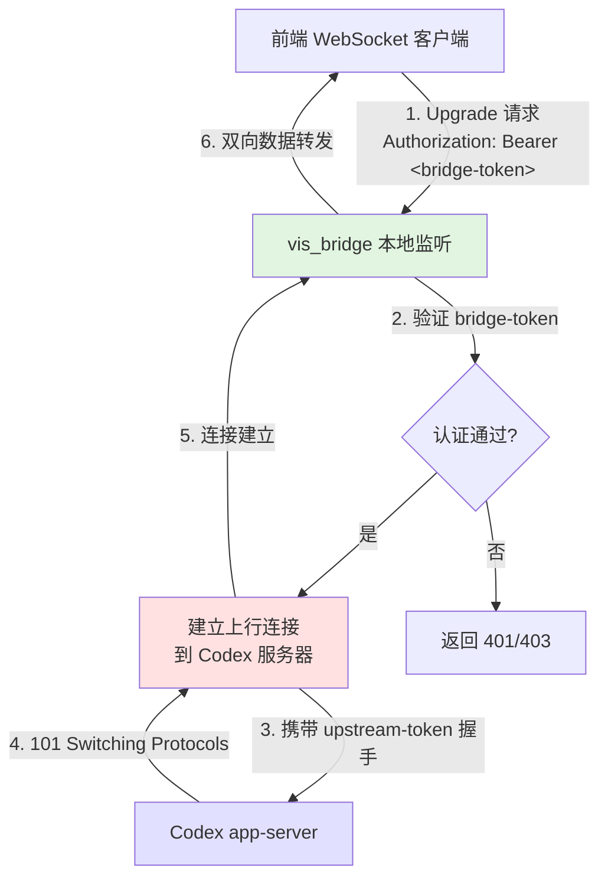

vis_bridge 是一个本地 WebSocket 桥接器，作为 Codex 前端应用与后端 app-server 之间的中间层代理。它监听本地端口，接收客户端的 WebSocket 连接请求，然后建立到上游 Codex 服务器的新 WebSocket 连接，实现双向数据转发。该桥接器支持自定义认证、路径映射和跨域控制，是 Electron 桌面应用与远程服务通信的核心基础设施。

## 核心功能与设计目标

vis_bridge 的设计围绕三个核心原则：**连接转换**、**安全控制**和**配置灵活性**。它将前端的本地连接转换为对后端服务器的透明连接，同时提供可选的桥接令牌认证和上游授权头传递机制。在 Electron 环境中，它允许前端应用通过 `ws://127.0.0.1:23004/codex` 访问远程的 Codex 服务，而无需直接暴露服务端地址或处理复杂的跨域策略[vis_bridge.js#L10-L20]。

桥接器的第二个设计目标是环境隔离。通过命令行参数或环境变量的组合配置，同一套前端代码可以在开发环境（连接到本地开发服务器）、测试环境（连接到 staging 服务器）和生产环境（连接到生产集群）之间无缝切换，而无需修改前端源码[vis_bridge.js#L44-L78]。

## 架构与数据流

vis_bridge 采用经典的**代理-隧道模式**实现双向通信。其核心架构包含两个并行的连接通道：**下行通道**（客户端 → 桥接器 → 上游服务器）处理客户端发起的连接请求和握手；**上行通道**（上游服务器 → 桥接器 → 客户端）处理服务器推送的消息和数据帧。两个通道通过两个独立的 TCP/WebSocket 连接维持，桥接器负责在两个连接之间进行字节级的透明转发。



数据流的每个阶段都有明确的协议转换。在下行阶段，桥接器验证客户端的 WebSocket 握手请求，包括 `Upgrade: websocket`、`Connection: Upgrade` 和 `Sec-WebSocket-Key` 等必需头字段；在上行阶段，桥接器生成新的 `Sec-WebSocket-Key` 并构造标准的 HTTP/1.1 Upgrade 请求发送给上游服务器[vis_bridge.js#L134-L148][vis_bridge.js#L162-L177]。两个连接建立后，桥接器进入**数据转发模式**，将从任一连接读取的原始数据帧写入另一个连接，实现应用层透明代理。

## 配置系统

vis_bridge 的配置采用**三层优先级**策略：命令行参数 > 环境变量 > 内置默认值。所有配置项在启动时通过 `parseCliOptions` 函数统一解析，确保配置来源的一致性和可预测性[vis_bridge.js#L44-L78]。

| 配置项 | 命令行标志 | 环境变量 | 默认值 | 说明 |
|--------|-----------|----------|--------|------|
| 上游服务器地址 | `--target` | `VIS_BRIDGE_CODEX_WS_URL` | `ws://127.0.0.1:4500` | Codex app-server 的 WebSocket 地址 |
| 监听主机 | `--host` | `VIS_BRIDGE_HOST` | `0.0.0.0` | 桥接器绑定的网络接口 |
| 监听端口 | `--port` | `VIS_BRIDGE_PORT` | `23004` | 桥接器监听的 TCP 端口 |
| 本地路径 | `--path` | `VIS_BRIDGE_PATH` | `/codex` | WebSocket 连接的 URL 路径前缀 |
| 桥接令牌 | `--bridge-token` | `VIS_BRIDGE_TOKEN` | 无 | 客户端连接必须提供的 Bearer 令牌 |
| 上游令牌 | `--upstream-token` | `VIS_BRIDGE_CODEX_TOKEN` | 无 | 向上游服务器发送的 Bearer 令牌 |
| 上游令牌文件 | `--upstream-token-file` | `VIS_BRIDGE_CODEX_TOKEN_FILE` | 无 | 从文件读取上游令牌（避免命令行泄露） |
| 上游授权头 | - | `VIS_BRIDGE_CODEX_AUTHORIZATION` | 无 | 原始 Authorization 头（最高优先级） |

路径标准化逻辑确保 `--path` 的值总是以斜杠开头。若用户提供 `codex`，会自动转换为 `/codex`；若提供空值，则回退到默认 `/codex`[vis_bridge.js#L81-L84]。端口验证采用严格的范围检查，仅接受 1-65535 之间的整数值，非整数或越界值将触发启动失败[vis_bridge.js#L62-L66]。

## 安全与访问控制

vis_bridge 实现**双重认证机制**：**客户端认证**（bridge token）和**上游认证**（upstream token）。客户端认证在连接建立阶段执行，桥接器检查请求的 `Authorization: Bearer <token>` 头或 URL 查询参数 `?token=` / `?bridgeToken=`，匹配失败则立即关闭连接并返回 HTTP 错误[vis_bridge.js#L108-L116]。

上游认证在桥接器向上游服务器发起握手时执行。配置的上游令牌会以 `Authorization: Bearer <token>` 头的形式发送给 Codex 服务器，使桥接器能够代表客户端通过服务器的身份验证。同时，`--upstream-token-file` 选项支持从文件系统读取令牌，避免敏感凭据出现在进程命令行或日志中[vis_bridge.js#L60-L61][vis_bridge.js#L75-L78]。

**源校验策略**体现 Electron 环境特性。对于 `file://` 和 `app://` 协议，桥接器无条件允许连接，这覆盖了 Electron 应用的本地文件访问场景；对于 `http:` 和 `https:` 协议，则限制为回环地址（localhost、127.0.0.1、::1），防止外部网站通过浏览器访问本地桥接服务[vis_bridge.js#L122-L132]。

## 连接管理

连接建立采用**异步双阶段握手**。第一阶段，桥接器调用 `assertWebSocketRequest` 验证客户端握手头的完整性；第二阶段，通过 `connectUpstreamWebSocket` 函数建立到上游的 TCP/TLS 连接并发送 Upgrade 请求[vis_bridge.js#L134-L148][vis_bridge.js#L179-L216]。

连接异常处理遵循**快速失败**原则。任何阶段的错误（无效端口、连接拒绝、握手超时）都会触发 `fail` 回调，该回调会销毁底层 socket 资源并通过 Promise 拒绝错误，确保资源不泄漏且错误能向上传递。Handshake 过程设置 30 秒超时，超时未收到上游响应则主动断开[vis_bridge.js#L189-L194]。

成功建立双端连接后，桥接器进入**管道模式**。它不解析 WebSocket 帧内容，而是将从客户端读取的原始 Buffer 原样写入上游连接，反之亦然。这种设计确保零开销转发，支持任意 WebSocket 子协议和二进制载荷。

## 部署与使用场景

### 开发环境
在本地开发时，vis_bridge 通常以独立进程启动，连接到本地运行的 Codex 开发服务器：
```bash
# 使用默认配置（监听 23004 端口，上游 localhost:4500）
./vis_bridge.js

# 指定上游地址和桥接令牌
./vis_bridge.js --target ws://localhost:4500 --bridge-token dev123
```
前端应用配置 WebSocket 端点 `ws://127.0.0.1:23004/codex`，即可与开发服务器通信[vis_bridge.js#L17-L20]。

### 生产环境
在生产部署中，vis_bridge 可以作为系统服务运行，提供安全的代理层：
```bash
# 使用环境变量配置（适合容器化部署）
VIS_BRIDGE_CODEX_WS_URL=wss://codex.example.com/ws \
VIS_BRIDGE_PORT=8080 \
VIS_BRIDGE_TOKEN=secure-token \
./vis_bridge.js --host 127.0.0.1
```
上游令牌通过文件读取避免泄露：
```bash
echo "prod-secret-token" > /etc/vis/token
./vis_bridge.js --upstream-token-file /etc/vis/token
```

### Electron 打包
在 Electron 应用中，vis_bridge 通常与主进程打包在一起。主进程通过 `child_process.fork` 启动桥接器，并在应用退出时优雅关闭。预加载脚本通过 `contextBridge` 暴露 WebSocket 连接 API 给渲染进程，使前端代码无需感知桥接器的存在[electron/preload.cjs]。

## 与其他系统的集成

vis_bridge 与前端应用的关系是**服务提供者-消费者**模式。前端代码通过标准的 `WebSocket` 构造函数连接 `ws://localhost:23004/codex`，无需任何特殊适配；桥接器对前端完全透明，仿佛直接连接到了 Codex 服务器[app/components/CodexPanel.vue]。

与 Electron 主进程的集成体现在预加载脚本中。主进程负责桥接器的生命周期管理（启动、监控、重启），预加载脚本负责将桥接器状态暴露给渲染进程。这种分层确保渲染进程无法直接操作桥接器进程，增强了安全边界[electron/main.js]。

## 监控与诊断

桥接器内置有限的诊断能力。启动时打印配置摘要（可通过重定向到日志文件捕获），连接失败时输出错误堆栈。对于生产环境监控，建议结合系统工具（如 `systemd` 状态、进程资源监控）和上游服务器的访问日志进行端到端追踪。

未来可能的增强方向包括：连接数指标导出（Prometheus 格式）、上游健康检查与自动重连、连接速率限制、请求/响应日志记录等。

## 下一步阅读建议

vis_bridge 是连接前端与后端的关键基础设施。理解其工作原理有助于诊断连接问题、配置安全策略和优化部署拓扑。建议按以下路径深入：

- **[Electron 桌面端集成](7-electron-zhuo-mian-duan-ji-cheng)**：了解桥接器如何在 Electron 应用中启动和管理
- **[后端服务与 API](8-hou-duan-fu-wu-yu-api)**：理解上游 Codex app-server 的协议和数据格式
- **[SSE 与事件流](34-sse-yu-shi-jian-liu)**：虽然桥接器使用 WebSocket，但 Codex 服务同时支持 SSE，了解两者的适用场景
- **[窗口架构设计](35-chuang-kou-jia-gou-she-ji)**：理解 vis_bridge 在多窗口架构中的定位

---

**Sources**: [vis_bridge.js](vis_bridge.js#L1-L50), [vis_bridge.js](vis_bridge.js#L44-L78), [vis_bridge.js](vis_bridge.js#L81-L132), [vis_bridge.js](vis_bridge.js#L134-L216), [electron/main.js](electron/main.js), [electron/preload.cjs](electron/preload.cjs), [app/components/CodexPanel.vue](app/components/CodexPanel.vue)