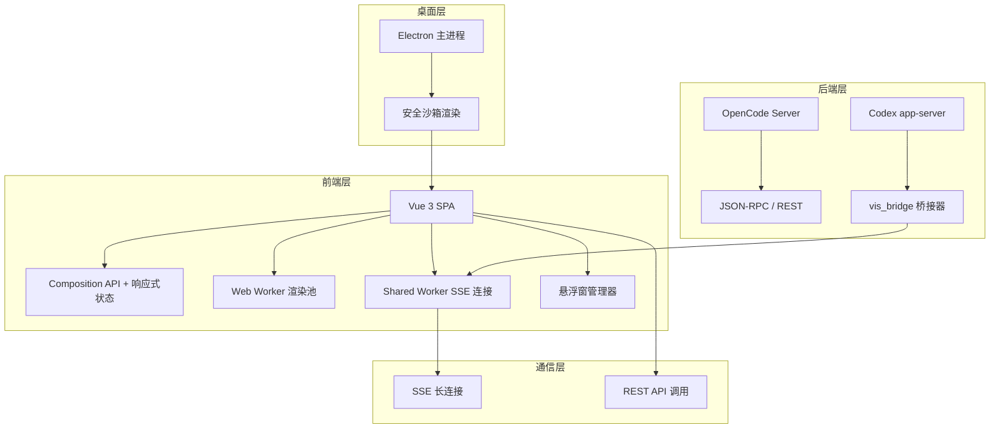
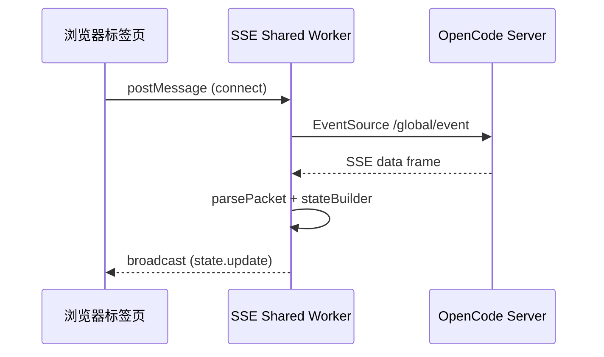

本文档为初学者提供 **OpenCode Visualizer CN**（以下简称 Vis）的整体项目概览，涵盖项目定位、核心架构、功能模块与技术栈，帮助你在深入具体实现前建立全局认知。Vis 是 [OpenCode](https://github.com/sst/opencode) 的第三方 Web UI，fork 自 [xenodrive/vis](https://github.com/xenodrive/vis)，在保留上游全部核心能力的基础上，进行了大量功能增强、性能优化与本地化支持。

Sources: [README.md](README.md#L1-L413)

---

## 项目定位与演进

Vis 的设计初衷是为 OpenCode 提供一个现代化、可扩展的可视化界面。由于上游仓库不再接受 PR，本项目作为独立 fork 持续维护，核心改进方向聚焦于 **国际化（i18n）**、**字体与主题管理**、**会话批量操作与置顶**、**悬浮窗与 Dock 栏管理**、**性能优化** 以及 **桌面应用打包**。当前版本为 `v0.4.5`，已支持简体中文、繁体中文、日语和世界语四种界面语言。

Sources: [README.md](README.md#L1-L30), [package.json](package.json#L3-L4)

---

## 整体架构

Vis 采用 **前后端分离** 的架构模式：前端为基于 Vue 3 的单页应用（SPA），通过 REST API 和 SSE（Server-Sent Events）与 OpenCode 后端通信；同时内置轻量 HTTP 服务器（Hono）用于静态资源托管，并支持 Electron 打包为跨平台桌面应用。

Sources: [app/main.ts](app/main.ts#L1-L28), [server.js](server.js#L1-L44), [electron/main.js](electron/main.js#L1-L200)

---

## 核心功能模块

Vis 的界面由四大区域构成：**顶部栏（TopPanel）**、**侧边栏（SidePanel）**、**输出面板（OutputPanel）** 和 **输入面板（InputPanel）**，辅以全局的 **悬浮窗系统** 和 **主题注入器**。

| 区域 | 职责 | 关键组件 |
|---|---|---|
| **TopPanel** | 项目/会话切换、批量管理、通知、设置入口 | `TopPanel.vue`, `Dropdown.vue` |
| **SidePanel** | 待办列表、会话树、文件树与 Git 状态 | `SidePanel.vue`, `SessionTree.vue`, `TreeView.vue` |
| **OutputPanel** | 消息流展示、虚拟滚动、Token 用量显示 | `OutputPanel.vue`, `ThreadBlock.vue`, `ThreadFooter.vue` |
| **InputPanel** | 消息输入、附件、快捷命令、历史记录 | `InputPanel.vue` |
| **FloatingWindow** | 代码/Diff/图片/终端等悬浮查看器 | `FloatingWindow.vue`, `ContentViewer.vue`, `DiffViewer.vue` |

Sources: [app/App.vue](app/App.vue#L1-L100)

---

## 技术栈一览

| 层级 | 技术选型 | 说明 |
|---|---|---|
| **前端框架** | Vue 3 + Composition API | 响应式 UI 与逻辑复用 |
| **构建工具** | Vite | 极速开发与生产构建 |
| **样式方案** | Tailwind CSS v4 + PostCSS | 原子化 CSS，支持深度主题定制 |
| **终端组件** | xterm.js | 嵌入式终端模拟器 |
| **代码高亮** | Shiki | 语法高亮与 Markdown 渲染，支持 Web Worker  offload |
| **国际化** | Vue I18n | 多语言支持，覆盖全部界面文本 |
| **后端服务** | Hono + `@hono/node-server` | 轻量级静态文件与代理服务 |
| **桌面端** | Electron | 跨平台桌面应用，支持 Windows / macOS / Linux |
| **代码规范** | oxlint + oxfmt | 高性能 JS/TS 检查与格式化 |
| **测试框架** | Vitest | 单元测试，基于 happy-dom |

Sources: [README.md](README.md#L80-L100), [package.json](package.json#L20-L80)

---

## 双后端适配器设计

Vis 支持两种后端模式：**OpenCode**（默认）和 **Codex**（实验性）。通过统一的 `BackendAdapter` 接口与注册表机制，前端代码无需关心底层协议差异。

| 后端 | 协议 | 能力覆盖 | 状态 |
|---|---|---|---|
| **OpenCode** | REST + SSE | 完整：项目、会话、文件、终端、权限、待办 | 稳定 |
| **Codex** | JSON-RPC over WebSocket | 会话、线程、Turn 管理 | Alpha |

适配器注册于 `backends/registry.ts`，运行时通过 `getActiveBackendAdapter()` 获取当前激活后端，所有 API 调用均通过统一接口转发。

Sources: [app/backends/types.ts](app/backends/types.ts#L1-L118), [app/backends/registry.ts](app/backends/registry.ts#L1-L77)

---

## 实时通信：SSE 与 Shared Worker

前端通过 **Shared Worker**（`sse-shared-worker.ts`）管理 SSE 连接，实现多标签页间的连接复用与状态同步。Worker 内部维护连接池、会话状态构建器（`stateBuilder`）和通知管理器，支持并发读取控制（默认 12 并发）与分级 Hydration（预览/完整）。

Sources: [app/workers/sse-shared-worker.ts](app/workers/sse-shared-worker.ts#L1-L200), [app/utils/sseConnection.ts](app/utils/sseConnection.ts#L1-L80)

---

## 渲染性能：Web Worker 渲染池

为降低主线程负担，Vis 将 **Shiki 语法高亮** 与 **Markdown 渲染**  offload 到 Web Worker 池。Worker 池大小根据 `navigator.hardwareConcurrency` 动态调整（4–8 个），并配备 LRU 缓存（默认 200 条）避免重复计算。渲染任务通过 `workerRenderer.ts` 调度，支持取消与缓存命中。

Sources: [app/workers/render-worker.ts](app/workers/render-worker.ts#L1-L200), [app/utils/workerRenderer.ts](app/utils/workerRenderer.ts#L1-L195)

---

## 主题与个性化系统

Vis 拥有一套精细化的主题体系，支持 **区域配色（Region Theme）** 与 **组件级令牌（Theme Tokens）** 双层定制：

- **区域主题**：定义 TopPanel、SidePanel、OutputPanel 等 9 大区域的背景、文字、边框、强调色。
- **组件主题**：细化到 Dropdown、Chip、Dock、FormControl、Tab 等 13 类组件的配色。
- **悬浮窗主题**：按类型（shell / diff / media / reasoning 等）独立配置颜色与透明度。

主题数据持久化于 `localStorage`（Electron 环境下迁移至持久化存储文件），支持预设切换与外部主题导入。

Sources: [app/utils/regionTheme.ts](app/utils/regionTheme.ts#L1-L200), [app/utils/themeTokens.ts](app/utils/themeTokens.ts#L1-L200), [app/utils/themeRegistry.ts](app/utils/themeRegistry.ts#L1-L200)

---

## 存储与持久化

应用状态通过统一的 `storageKeys.ts` 管理，所有键名以 `opencode.` 为前缀，分四大域：

| 域 | 示例键 | 用途 |
|---|---|---|
| `settings` | `settings.locale.v1` | 语言、字体、主题、实验性功能开关 |
| `state` | `state.pinnedSessions.v1` | 侧边栏折叠、会话树展开、置顶状态 |
| `drafts` | `drafts.composer.v1` | 输入框草稿、问题回复草稿 |
| `auth` | `auth.credentials.v1` | 后端 URL、认证信息、Codex Bridge 配置 |

Electron 环境下，存储自动从 `localStorage` 迁移至主进程提供的持久化文件，确保应用重装后配置不丢失。

Sources: [app/utils/storageKeys.ts](app/utils/storageKeys.ts#L1-L138)

---

## 桌面端支持（Electron）

Vis 可通过 Electron 打包为独立桌面应用，主进程（`electron/main.js`）负责窗口管理、持久化存储、CORS 透传与外部链接拦截。渲染进程运行在安全沙箱中（`contextIsolation: true`, `sandbox: true`），通过预加载脚本（`preload.cjs`）暴露受控 API。

Sources: [electron/main.js](electron/main.js#L1-L200), [README.md](README.md#L180-L220)

---

## 阅读路线建议

如果你是初次接触本项目，建议按以下顺序阅读文档，逐步深入：

1. **[快速开始](2-kuai-su-kai-shi)** — 环境准备、安装与启动
2. **[技术栈与环境要求](3-ji-zhu-zhan-yu-huan-jing-yao-qiu)** — Node.js、pnpm、OpenCode Server 配置
3. **[Vue 3 应用入口与生命周期](5-vue-3-ying-yong-ru-kou-yu-sheng-ming-zhou-qi)** — `main.ts` 到 `App.vue` 的启动流程
4. **[全局状态与事件系统](6-quan-ju-zhuang-tai-yu-shi-jian-xi-tong)** — `useServerState`、`useMessages` 与事件总线
5. **[模块化后端适配器设计](7-mo-kuai-hua-hou-duan-gua-pei-qi-she-ji)** — `BackendAdapter` 接口与双后端切换机制
6. **[SSE 连接管理与事件协议](8-sse-lian-jie-guan-li-yu-shi-jian-xie-yi)** — SSE 包格式、事件类型与重连策略
7. **[项目目录结构说明](27-xiang-mu-mu-lu-jie-gou-shuo-ming)** — 完整目录导航与文件职责