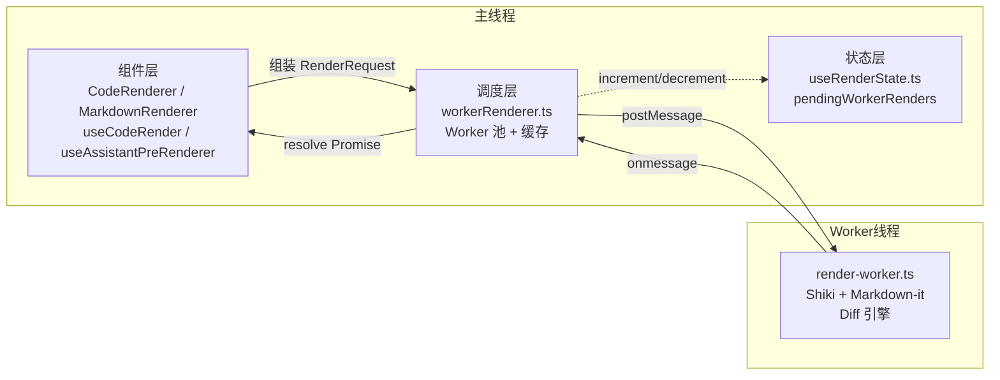

本页深入解析项目中的渲染子系统架构，涵盖 Web Worker 渲染池的调度机制、多层缓存策略、语法高亮引擎（Shiki）的初始化与语言加载，以及主线程与 Worker 之间的消息协议。该子系统负责将代码、Markdown、Diff 等文本内容转换为高亮 HTML，是整个应用中最消耗 CPU 的环节之一，因此其设计核心目标是在保证渲染质量的同时，将计算密集型任务完全移出主线程，避免阻塞 UI 交互。

Sources: [render-worker.ts](app/workers/render-worker.ts#L1-L1069), [workerRenderer.ts](app/utils/workerRenderer.ts#L1-L195), [useRenderState.ts](app/composables/useRenderState.ts#L1-L22)

---

## 架构总览：三层分离的渲染管线

渲染子系统采用严格的三层分离架构：**组件层**负责响应式参数组装与生命周期管理，**调度层**（主线程）负责 Worker 池管理与请求去重，**执行层**（Worker 线程）负责实际的 HTML 生成。这种分层使得语法高亮、Markdown 解析、Diff 计算等重逻辑被完全隔离在独立的线程中运行。



组件层通过 `useCodeRender` 将 Vue 响应式参数转换为 `RenderRequest`，经由 `startRenderWorkerHtml` 提交给调度层；调度层检查缓存后，将任务分发给 Worker 池中的某个实例；Worker 完成渲染后通过 `postMessage` 返回 HTML，调度层解析响应并通知组件层更新 DOM。

Sources: [workerRenderer.ts](app/utils/workerRenderer.ts#L127-L195), [useCodeRender.ts](app/utils/useCodeRender.ts#L1-L92), [render-worker.ts](app/workers/render-worker.ts#L1053-L1069)

---

## Worker 池：动态容量与轮询调度

Worker 池的容量并非硬编码，而是根据设备硬件并发能力动态计算。`WORKER_POOL_SIZE` 的取值规则为：`Math.min(8, Math.max(4, navigator.hardwareConcurrency || 4))`，即在 4 到 8 之间取一个与 CPU 核心数相关的值。这意味着在 8 核设备上最多会创建 8 个 Worker 实例，而在低配置设备上至少保留 4 个，以平衡并行度与内存占用。

```mermaid
flowchart TD
    A[调用 getWorker] --> B{workers.length === 0?}
    B -->|是| C[循环创建 WORKER_POOL_SIZE 个 Worker]
    B -->|否| D[取 workers[workerIndex]]
    C --> D
    D --> E[workerIndex = (workerIndex + 1) % workers.length]
    E --> F[返回 Worker 实例]
```

调度层采用简单的轮询（Round-Robin）策略分配任务，通过 `workerIndex` 循环递增取模实现负载均衡。Worker 实例在首次请求时惰性创建，创建后常驻内存直到页面刷新。每个 Worker 通过 `onmessage` 监听响应，通过 `onerror` 处理异常——当某个 Worker 发生全局错误时，调度层会拒绝当前所有 pending 请求并清空计数器，防止状态泄漏。

Sources: [workerRenderer.ts](app/utils/workerRenderer.ts#L46-L125)

---

## 请求去重与两层缓存体系

渲染系统实现了**主线程缓存**与 **Worker 内部缓存** 相结合的两级缓存策略，分别解决不同层面的性能问题。

### 主线程 completedCache（调度层）

`completedCache` 是一个容量上限为 200 的 `Map<string, string>`，以请求的全部参数拼接成的复合键作为索引。缓存键的生成逻辑覆盖了 `code`、`patch`、`after`、`lang`、`theme`、`gutterMode`、`gutterLines`、`grepPattern`、`lineOffset`、`lineLimit`、`files` 以及所有国际化文案字段，确保“完全相同输入 → 完全相同输出”的精确匹配。命中缓存时直接返回已解析的 HTML Promise，跳过 Worker 通信 entirely。

当缓存超过上限时，采用 FIFO（先进先出）淘汰策略：删除 `Map.keys().next().value`，即最早插入的条目。该缓存位于主线程，因此访问零开销。

Sources: [workerRenderer.ts](app/utils/workerRenderer.ts#L53-L92)

### Worker 内部 codeHtmlCache 与 mdHighlightCache（执行层）

Worker 内部维护两个容量上限为 512 的缓存：`codeHtmlCache` 用于纯代码高亮结果，`mdHighlightCache` 用于 Markdown 中 fence code block 的高亮结果。两者的键格式均为 `${lang}\0${code}`，以零字节分隔语言标识与代码内容。

当缓存超过上限时，触发 `pruneHighlightCache`：将容量削减至上限的一半（256），通过遍历 `Map.keys()` 并逐个删除最早条目实现。这种“批量减半”策略相比逐条淘汰减少了频繁修剪的开销。

**缓存失效条件**：当主题（theme）发生变化时，`getHighlighter` 会重新创建高亮器实例，并同时清空 `codeHtmlCache` 和 `mdHighlightCache`，因为 Shiki 的 HTML 输出包含主题相关的 CSS 类名和颜色值，不同主题之间不可复用。

Sources: [render-worker.ts](app/workers/render-worker.ts#L89-L112), [render-worker.ts](app/workers/render-worker.ts#L181-L199)

---

## 渲染状态计数器：pendingWorkerRenders

`useRenderState` 暴露了一个全局只读响应式计数器 `pendingWorkerRenders`，用于追踪当前正在进行的 Worker 渲染任务数量。调度层在提交任务时调用 `incrementPendingRenders()`，在任务完成、取消或出错时调用 `decrementPendingRenders()`。

该计数器的主要消费方是 `App.vue` 中的 `waitForPendingRenders` 函数：在切换会话或执行某些需要等待渲染完成的操作时，通过 `watch` 监听计数器归零，并额外等待一帧 `requestAnimationFrame` 以确保没有新的 `watchEffect`（如 `useAssistantPreRenderer`）在此期间提交额外任务。这种设计避免了在渲染队列尚未清空时过早执行后续逻辑。

Sources: [useRenderState.ts](app/composables/useRenderState.ts#L1-L22), [App.vue](app/App.vue#L6477-L6502)

---

## 可取消渲染与竞态保护

组件层通过 `startRenderWorkerHtml` 获取一个 `RenderTask` 对象，包含 `promise` 和 `cancel` 两个字段。当组件卸载或输入参数变化时，可以调用 `cancel()` 主动取消前一个未完成的渲染请求。取消操作会从 `pending` Map 中删除对应条目，并拒绝 Promise 为 `RenderCancelledError`；组件层通过 `instanceof` 检查忽略该错误，避免将取消误判为渲染失败。

`useCodeRender` 实现了基于 `requestId` 的竞态保护：每次参数变化时递增本地计数器，仅当返回的 HTML 对应的请求序号与当前计数器一致时才写入 `html.value`。这确保了快速连续输入时，旧请求的回调不会覆盖新请求的结果。

Sources: [workerRenderer.ts](app/utils/workerRenderer.ts#L148-L195), [useCodeRender.ts](app/utils/useCodeRender.ts#L26-L92)

---

## Worker 内部：Shiki 高亮引擎与 Markdown 渲染

`render-worker.ts` 是实际执行渲染的 Worker 脚本，体积约 1069 行，核心职责包括：Shiki 高亮器管理、语言加载与回退、Markdown 渲染、Diff 计算与渲染、Grep 结果高亮。

### Shiki 高亮器初始化与主题切换

Worker 使用 `createHighlighter` 从 `shiki/bundle/web` 创建高亮器实例，初始仅加载 `text` 语言以最小化启动开销。高亮器实例通过 `highlighterPromise` 缓存，同一主题下所有请求共享同一实例。当请求的主题与 `cachedTheme` 不一致时，重新创建高亮器并清空所有相关缓存。

Sources: [render-worker.ts](app/workers/render-worker.ts#L75-L112)

### 语言加载策略：候选链与失败缓存

`resolveLanguage` 函数实现了语言候选链机制。以 `tsx` 为例，候选链为 `['tsx', 'typescript', 'text']`；以 `shellscript` 为例，候选链为 `['bash', 'shellscript', 'sh', 'text']`。Worker 按顺序尝试加载候选语言，第一个成功加载的即被采用，若全部失败则回退到 `text`。

加载结果通过 `loadedLanguageCache`（成功）和 `failedLanguageCache`（失败）两个 `Set` 持久化，避免对同一失败语言重复尝试加载。语言加载支持 Shiki 内置的 bundledLanguages，也支持项目自定义的 6 种生物信息学语法（fasta、fastq、sam、vcf、bed、gtf），这些语法通过 `?raw` 导入 JSON 文件并直接注入高亮器。

Sources: [render-worker.ts](app/workers/render-worker.ts#L114-L179)

### 代码高亮与行提取

`safeCodeToHtml` 是代码高亮的主入口，它先查询 `codeHtmlCache`，未命中则调用 `highlighter.codeToHtml`。若指定语言报错，则自动回退到 `text` 语言再次尝试。生成的 HTML 包含 Shiki 标准的 `<pre class="shiki">` 结构，其中每行代码被包裹在 `<span class="line">` 中。

`extractShikiLines` 负责从完整的 Shiki HTML 中提取出所有行元素，用于后续的 gutter 组装、Diff 对齐或虚拟滚动拆分。该函数通过正则过滤包含 `class="line"` 的行，并清理首尾的多余标签。

Sources: [render-worker.ts](app/workers/render-worker.ts#L181-L199), [render-worker.ts](app/workers/render-worker.ts#L431-L445)

### Markdown 渲染：fence 语言预解析与别名映射

`renderMarkdownHtml` 使用 `markdown-it` 配合 `@shikijs/markdown-it/core` 插件渲染 Markdown。为了正确高亮 fence code block，Worker 在渲染前先通过 `collectMarkdownFenceLanguages` 扫描整个 Markdown 文本，提取所有 ` ```lang ` 形式的语言标识，然后为每个标识调用 `resolveLanguage` 解析为实际加载成功的语言名，最终构建 `langAlias` 映射表注入到 markdown-it 插件中。

Markdown 渲染还包含若干自定义扩展：通过 `taskListEmojiPlugin` 将 `[ ]` 和 `[x]` 替换为 emoji；通过重写 `link_open` 规则为所有外链添加 `target="_blank"` 和 `rel="noopener noreferrer"`；通过重写 `code_inline` 规则实现文件引用、commit hash、CSS 颜色值的智能识别与属性标注。

Sources: [render-worker.ts](app/workers/render-worker.ts#L808-L1008)

---

## Diff 渲染：Myers 算法与 Patch 应用

Diff 渲染是 Worker 中最复杂的逻辑之一，支持三种输入模式：`patch` 字符串、`before + after` 双文本、以及从 diff 文本反向重建源文件。

### Patch 应用与压缩

`applyPatchToCode` 实现了基于统一 diff 格式的 patch 应用算法，逐行解析 `@@` hunk header，通过 `+`、`-`、空格前缀执行插入、删除和保留操作，维护一个 `offset` 变量处理行号漂移。`compactUnifiedDiffPatch`（来自 `diffCompression.ts`）则用于压缩 diff，只保留变更区域及其周围 3 行上下文，减少传输和渲染的数据量。

Sources: [render-worker.ts](app/workers/render-worker.ts#L394-L430), [diffCompression.ts](app/utils/diffCompression.ts#L1-L148)

### 双文本 Diff 生成

当输入为 `before + after` 但未提供 `patch` 时，Worker 通过 `generateUnifiedDiff` 自行计算 diff。该函数实现了 Myers 差分算法（线性空间、O(ND) 时间复杂度），通过 `Int32Array` 存储编辑图的最远可达点，回溯生成编辑脚本后按上下文行数分组为 hunk，最终输出标准统一 diff 格式。

Sources: [render-worker.ts](app/workers/render-worker.ts#L238-L393)

### Diff HTML 构建

`buildDiffHtmlFromCode` 接收 before/after/diff 三份数据，先通过 `safeCodeToHtml` 分别高亮 before 和 after 的完整文本，提取出行数组；然后逐行遍历 diff 文本，根据 `+`、`-`、` `、`@@` 前缀匹配对应的已高亮行或生成回退 HTML，最终输出带有 `line-added`、`line-removed`、`line-hunk` 等 CSS 类的行级 HTML。Gutter 采用双列模式（oldLine / newLine），通过 `buildDiffGutterLines` 计算每行对应的旧/新文件行号。

Sources: [render-worker.ts](app/workers/render-worker.ts#L690-L777)

---

## Grep 渲染：正则匹配高亮

`renderGrepRows` 用于渲染 `grep` 工具的搜索结果。它接收代码文本、正则模式、gutter 行号数组，对每一行执行正则匹配，将匹配结果包裹在 `<span class="grep-match"><strong>...</strong></span>` 中。正则通过 `new RegExp(pattern, 'g')` 构建，若模式非法则静默回退到普通文本渲染。

Sources: [render-worker.ts](app/workers/render-worker.ts#L542-L603)

---

## 组件层封装：useCodeRender 与 useAssistantPreRenderer

### useCodeRender

`useCodeRender` 是一个 Vue 组合式函数，接收一个 `WatchSource<CodeRenderParams | null>`，返回 `{ html, error }`。它内部监听参数变化，每次变化时生成唯一请求 ID，调用 `startRenderWorkerHtml`，并通过 `requestId` 序列号机制防止竞态。组件卸载时自动取消未完成的渲染任务。

该函数被 `CodeRenderer.vue` 和 `DiffRenderer.vue` 使用，分别用于普通代码查看和 Diff 查看。

Sources: [useCodeRender.ts](app/utils/useCodeRender.ts#L1-L92), [CodeRenderer.vue](app/components/renderers/CodeRenderer.vue#L37-L107), [DiffRenderer.vue](app/components/renderers/DiffRenderer.vue#L27-L93)

### useAssistantPreRenderer

`useAssistantPreRenderer` 是一个更高级别的预渲染管理器，专为会话列表中的 Assistant 消息设计。它维护一个以 root session ID 为键的 `assistantHtmlCache`，通过 `watchEffect` 监听可见消息列表、主题和语言的变化，自动为需要渲染的 Assistant 消息提交 Worker 任务。

其核心优化在于**去重与序列号管理**：通过 `lastSubmitted` Map 记录每个 root 最近一次提交的 `(answerId, content, theme, locale)` 四元组，只有当其中任一字段变化时才提交新请求；通过 `submitSeqMap` 和 `appliedSeqMap` 确保只有最新序号的渲染结果才会被写入缓存，旧序号的结果即使后返回也会被丢弃。当文件引用列表变化时，`invalidateForFileRefsIfNeeded` 会清空 `lastSubmitted`，触发重新渲染以更新内联文件引用的交互属性。

Sources: [useAssistantPreRenderer.ts](app/composables/useAssistantPreRenderer.ts#L1-L134), [OutputPanel.vue](app/components/OutputPanel.vue#L355-L365)

---

## 调用方全景

渲染池的公共 API 只有两个函数：`renderWorkerHtml`（一次性、不可取消）和 `startRenderWorkerHtml`（可取消）。以下是项目中所有直接调用方的汇总：

| 调用方 | 使用的 API | 用途 |
|---|---|---|
| `useCodeRender` | `startRenderWorkerHtml` | CodeRenderer / DiffRenderer 的响应式封装 |
| `useAssistantPreRenderer` | `startRenderWorkerHtml` | Assistant 消息预渲染与缓存 |
| `MarkdownRenderer.vue` | `startRenderWorkerHtml` | Markdown 消息内容渲染 |
| `useFloatingWindows` | `renderWorkerHtml` | 悬浮窗内容渲染（open/setContent/appendContent） |
| `App.vue` | `renderWorkerHtml` | 文件读取、Diff 查看等工具窗口内容 |
| `toolRenderers.ts` | `renderWorkerHtml` | bash、grep、glob、list、webfetch、websearch、codesearch、task、batch、write 等工具输出渲染 |

Sources: [workerRenderer.ts](app/utils/workerRenderer.ts#L127-L195)

---

## 配置与构建

Worker 脚本通过 Vite 的 `?worker` 查询参数导入，构建配置中 `worker.format: 'es'` 确保 Worker 以 ES Module 格式输出，与主代码保持一致的模块化标准。Shiki 的 `bundle/web` 入口提供了按需加载的语言包，配合候选链策略，使得 Worker 启动时仅加载最基础的 `text` 语言，其余语言在首次遇到时动态加载。

Sources: [vite.config.ts](vite.config.ts#L25-L27), [workerRenderer.ts](app/utils/workerRenderer.ts#L1)

---

## 与其他页面的关联

本页所述的渲染池是**渲染与性能**篇章的核心基础设施。理解 Worker 池的调度逻辑后，建议继续阅读：

- [虚拟滚动与懒加载优化](11-xu-ni-gun-dong-yu-lan-jia-zai-you-hua) —— 了解 `CodeRenderer.vue` 如何将 Worker 返回的 HTML 与虚拟滚动结合，处理超过 500 行的超大文件
- [消息流处理与增量更新](14-xiao-xi-liu-chu-li-yu-zeng-liang-geng-xin) —— 了解 `useAssistantPreRenderer` 如何与消息流协同，实现 Assistant 回复的渐进式预渲染
- [渲染器与查看器分层架构](16-xuan-ran-qi-yu-cha-kan-qi-fen-ceng-jia-gou) —— 了解 CodeRenderer、DiffRenderer、MarkdownRenderer 如何统一对接 Worker 池
- [代码差异压缩与语法高亮](17-dai-ma-chai-yi-ya-suo-yu-yu-fa-gao-liang) —— 深入了解 `diffCompression.ts` 与 Worker 中 Diff 引擎的协作细节