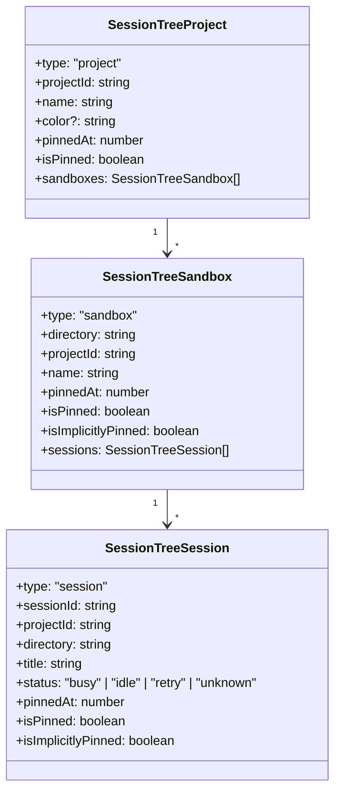
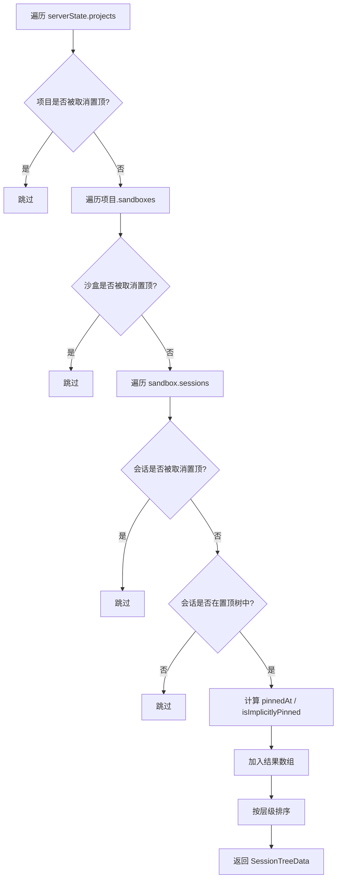

本文档深入解析 Vis 前端中侧边栏「会话树」功能的架构设计与实现机制。会话树采用**目录优先（Directory-First）**的组织策略，将项目（Project）、沙盒（Sandbox）与会话（Session）按三层树形结构呈现，并配合本地乐观置顶（Optimistic Pin）状态与服务器状态的协调机制，实现高性能、低延迟的交互体验。理解这一模型是掌握 Vis 会话管理系统的关键入口。

## 核心数据模型：三层树形结构

会话树的视觉呈现由三个层级构成，其类型定义位于 `app/types/session-tree.ts`。顶层为 **Project**（项目），对应一个代码仓库或工作区；中间层为 **Sandbox**（沙盒），对应 VCS 分支或工作目录；叶子节点为 **Session**（会话），代表一次独立的对话线程。每个层级均携带 `pinnedAt`、`isPinned` 与 `isImplicitlyPinned` 三个状态字段，用于精确控制可见性与排序。

三层结构的数据来源是 `ServerState`（定义于 `app/types/worker-state.ts`），其内部以 `Record<string, ProjectState>` 扁平存储所有项目，每个项目下以 `Record<string, SandboxState>` 存储沙盒，沙盒内再以 `Record<string, SessionState>` 存储会话。`SessionTreeData` 的计算本质上是将这一扁平状态按置顶规则过滤、分组并排序后的视图转换。

Sources: [session-tree.ts](app/types/session-tree.ts#L1-L35), [worker-state.ts](app/types/worker-state.ts#L1-L89)

## 状态构建器：从 SSE 事件到规范化状态

会话树依赖的底层状态由 `createStateBuilder()`（`app/utils/stateBuilder.ts`）维护。该构建器是一个闭包工厂函数，内部持有 `ServerState` 并暴露一系列变异方法，用于将 SSE 事件流转换为规范化状态。构建器维护了三组关键索引：**`projectIdByDirectory`**（目录到项目的反向映射）、**`sessionLocationById`**（会话 ID 到所在项目/沙盒的映射）以及 **`ephemeralLastSeenAt` / `ephemeralLastActiveAt`**（子会话的存活时间戳）。

当会话创建或更新时，`upsertSession` 方法会解析会话的 `parentID`。若存在父会话，则通过 `resolveRootSessionIdInProject` 沿父链追溯至根会话，并将该子会话安置在根会话所在的沙盒目录下——这是「所有子会话均置于根会话沙盒」这一核心设计决策的实现。根会话的顺序由 `updateRootSessionOrder` 按 `timePinned` 或 `timeUpdated` 降序维护，存储于 `sandbox.rootSessions` 数组中。

构建器还负责子会话的自动清理。`pruneEphemeralChildren` 方法遍历所有非根会话，若其状态非 `busy`/`retry` 且最后一次活跃时间超过 `CHILD_SESSION_PRUNE_TTL_MS`（20 分钟），则将其移除。这一机制防止临时分支无限膨胀。

Sources: [stateBuilder.ts](app/utils/stateBuilder.ts#L120-L826)

## 置顶状态的三级继承与本地乐观覆盖

会话树的可见性由**服务器置顶状态**与**本地乐观覆盖状态**共同决定。`app/utils/pinnedSessions.ts` 提供了完整的置顶状态管理工具集。本地置顶存储 `LocalPinnedSessionStore` 是一个 `Record<string, number>`，键的命名规则分为三级：

| 层级 | 键格式 | 示例 |
|------|--------|------|
| 项目 | `project:{projectId}` | `project:my-repo` |
| 沙盒 | `sandbox:{projectId}:{directory}` | `sandbox:my-repo:/feature` |
| 会话 | `{projectId}:{sessionId}` | `my-repo:session-abc` |

值的意义由正负号区分：**正值**表示置顶时间戳（越大越新），**负值**表示用户显式取消置顶的乐观覆盖。这种设计允许在服务器状态尚未同步时，立即响应用户操作，同时保留回滚能力。

三级置顶遵循**继承与覆盖**规则：若项目被置顶，则其下所有沙盒和会话均隐式可见；若沙盒被置顶，则其下所有会话隐式可见；会话也可单独置顶。取消置顶时，若某会话是因父级（沙盒/项目）置顶而隐式可见的，则为其写入负值覆盖；若该会话自身已被服务器置顶，则通过 API 调用取消，并写入负值作为乐观覆盖。

`isSessionEffectivelyPinned` 函数实现了这一逻辑：先检查沙盒/项目级置顶，再检查会话级本地覆盖，最后回退到服务器 `timePinned`。`reconcilePinnedSessionStore` 则在每次状态更新时清理已同步的冗余覆盖项——当本地正值与服务器 `timePinned` 一致时，删除本地键；当服务器已取消置顶（`timePinned` 为 0）且本地为负值时，同样删除。

Sources: [pinnedSessions.ts](app/utils/pinnedSessions.ts#L1-L159), [pinnedSessions.test.ts](app/utils/pinnedSessions.test.ts#L1-L86)

## 会话树数据的计算与缓存

`sessionTreeData`（定义于 `app/App.vue`）是一个 `computed<SessionTreeData>`，负责将 `serverState.projects` 与 `localPinnedSessionStore` 转换为组件可用的树形数据。该计算属性实现了**基于哈希的短周期缓存**：通过 `computeProjectsHash` 对项目状态、置顶存储和已删除沙盒存储进行混合哈希，当哈希未变且缓存时间小于 `TREE_DATA_CACHE_TTL_MS`（15 秒）时直接返回缓存结果。

计算过程按项目 → 沙盒 → 会话三层遍历。每层均执行以下过滤逻辑：首先跳过被显式取消置顶（负值）的节点；然后判断节点是否因自身或父级置顶而处于「置顶树」中；最后为每个节点计算 `pinnedAt`（用于排序）和 `isImplicitlyPinned`（用于 UI 区分）。沙盒层级会优先将主工作目录（`project.worktree`）排在最前，其余按分支名字母序排列。会话层级则按 `pinnedAt` 降序、标题字母序升序排列。

Sources: [App.vue](app/App.vue#L2142-L2261)

## 组件渲染与交互：SessionTree.vue

`SessionTree.vue` 是一个纯展示组件，接收 `projects`、`expandedPaths` 和 `selectedSessionId` 三个 props，通过递归 `v-for` 渲染三层树形结构。每个节点行包含展开切换按钮、图标、标签和置顶按钮。置顶按钮的显示逻辑采用**悬停显隐**：非置顶状态下鼠标悬停才显示，置顶状态始终显示并以黄色高亮。

会话状态通过图标直观呈现：`🤔` 表示忙碌中、`🔴` 表示重试、`🟢` 表示空闲、`⚪` 表示未知。当前选中的会话行以 `is-active` 类高亮，带有左侧蓝色边框和半透明背景。组件通过 9 个 emit 事件将用户操作（展开/收起、选择会话、置顶/取消置顶各三层）上报给父级 `SidePanel.vue`。

展开状态 `expandedPaths` 是字符串数组，路径格式与状态键一致：`project:{projectId}` 和 `sandbox:{projectId}:{directory}`。该数组持久化于 `localStorage`（键为 `opencode.state.sessionTreeExpanded.v1`），在 `toggleSessionTreeExpand` 中通过 Set 增删并回写。

Sources: [SessionTree.vue](app/components/SessionTree.vue#L1-L379)

## 置顶操作的事务级处理

用户点击置顶按钮时，操作由 `App.vue` 中的 `pinProject`、`pinSandbox`、`pinSession` 及对应的 `unpin*` 函数处理。这些函数实现了**乐观更新 + 服务器同步 + 错误回滚**的三段式事务。

以 `pinSession` 为例：若为 Codex 后端则直接调用 `codexApi.pinThread`；若为 OpenCode 后端，则先通过 `setLocalPinnedSession` 写入本地正值覆盖使 UI 立即响应，再异步调用 `openCodeApi.pinSession`。若 API 失败，通过 `restoreLocalPinnedSessionOverride` 恢复先前状态。`unpinSession` 的逻辑更为复杂：若会话是「隐式置顶」（因父级置顶而可见），则仅写入本地负值覆盖，不调用服务器；若会话被直接置顶，则调用 API 并写入负值。取消置顶还支持**级联传播**：若取消某会话后其所在沙盒内再无可见会话，则自动取消沙盒置顶；若沙盒取消后项目内再无可见沙盒，则自动取消项目置顶。

`pinProject` 和 `pinSandbox` 在写入置顶键前，会先调用 `clearNegativeSandboxAndSessionOverridesForProject` 或 `clearNegativeSessionOverridesForSandbox`，清除该范围内的负值覆盖，避免新旧状态冲突。

Sources: [App.vue](app/App.vue#L4161-L4362)

## 已删除沙盒的本地过滤

除置顶机制外，会话树还引入了「已删除沙盒」概念（`app/utils/deletedSandboxes.ts`）。当用户通过 UI 删除一个沙盒目录时，其路径被记录于 `DeletedSandboxStore`（持久化于 `localStorage`）。`sessionTreeData` 的计算会过滤掉这些已标记删除的沙盒，但服务器状态本身不受影响——这允许用户「软删除」某个分支的会话视图，而无需真正删除服务器上的会话数据。`pruneDeletedSandboxStore` 方法会在沙盒从服务器状态消失时自动清理对应的本地记录。

Sources: [deletedSandboxes.ts](app/utils/deletedSandboxes.ts#L1-L125), [deletedSandboxes.test.ts](app/utils/deletedSandboxes.test.ts#L1-L93)

## 与会话选择的协同

会话树的选择状态由 `useSessionSelection` 组合式函数（`app/composables/useSessionSelection.ts`）管理。该函数维护 `selectedProjectId` 和 `selectedSessionId` 两个响应式引用，并提供 `switchSession` 方法。切换会话时，它会通过 `waitForState` 等待目标会话出现在 `serverState` 中（处理 SSE 延迟场景），然后更新选择状态。`ensureSession` 方法则用于「无会话时自动创建」的兜底逻辑：若当前项目无可用会话，则调用 `createSessionFn` 创建新会话并自动选中。

`sessionTreeData` 中的会话节点点击时，通过 `handleSidePanelSessionSelect` 调用 `switchSessionSelection`，确保选择状态与会话树视图同步。

Sources: [useSessionSelection.ts](app/composables/useSessionSelection.ts#L1-L152)

## 相关阅读

- [会话选择、置顶与批量操作](13-hui-hua-xuan-ze-zhi-ding-yu-pi-liang-cao-zuo) — 深入理解 `useSessionSelection` 与批量操作机制
- [消息流处理与增量更新](14-xiao-xi-liu-chu-li-yu-zeng-liang-geng-xin) — 会话消息流的渲染与状态同步
- [待办与会话树面板](19-dai-ban-yu-hui-hua-shu-mian-ban) — 侧边栏整体布局与 Tab 切换机制
- [全局状态与事件系统](6-quan-ju-zhuang-tai-yu-shi-jian-xi-tong) — `useServerState` 与全局状态管理