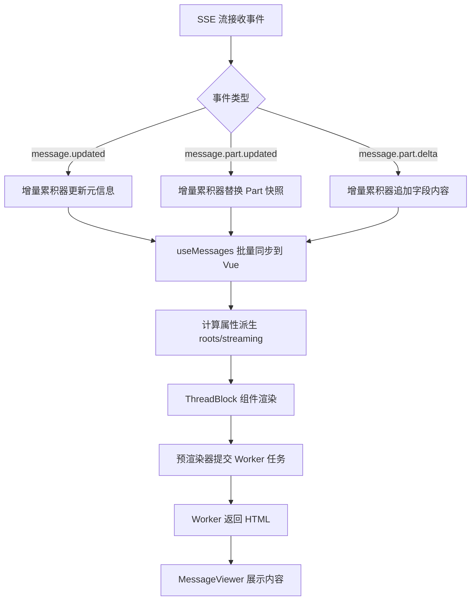

本文档深入讲解 Vis 前端中消息流的接收、状态管理与增量更新机制。核心关注点包括：SSE 事件如何被解析为结构化消息与片段（Part）、`useMessages` 组合式函数如何以最小渲染开销维护消息状态、以及渲染层如何借助 Web Worker 池与预渲染策略实现高性能内容展示。阅读本文前，建议先了解 [SSE 连接管理与事件协议](8-sse-lian-jie-guan-li-yu-shi-jian-xie-yi) 与 [Shared Worker 状态同步机制](9-shared-worker-zhuang-tai-tong-bu-ji-zhi)。

## 消息数据结构

Vis 的消息系统采用双层模型：**消息（Message）** 承载元信息（角色、时间、状态），**片段（Part）** 承载具体内容（文本、工具调用、文件等）。这种分离设计使得同一条消息可以包含多种类型的内容片段，例如文本回答与代码补丁共存。

SSE 协议定义了 12 种 Part 子类型，通过 `type` 字段进行辨识联合（Discriminated Union）区分，包括 `text`、`reasoning`、`tool`、`file`、`patch`、`snapshot`、`subtask`、`agent`、`compaction`、`retry`、`step-start`、`step-finish`。消息本身则通过 `role` 字段区分用户消息（`user`）与助手消息（`assistant`），助手消息额外包含 `parentID` 以建立对话线程的父子关系。

Sources: [app/types/sse.ts](app/types/sse.ts#L307-L417)

## 增量累积器：流式内容的聚合中枢

`useDeltaAccumulator` 是一个模块级单例，负责在 SSE 流式传输期间聚合不完整的消息状态。它监听三类核心事件：

- `message.updated`：接收消息元信息，若消息已完成（有 `completed` 时间戳、`finish` 标记或错误），则从累积器中清理
- `message.part.updated`：接收完整的 Part 快照，替换或新增到对应消息的 Part 映射中
- `message.part.delta`：接收字段级增量（通常为 `text` 字段的追加），直接修改累积器中的字符串引用

这种设计使得高频的 `delta` 事件无需触发 Vue 响应式更新，仅在累积器中完成字符串拼接。当需要刷新 UI 时，`useMessages` 从累积器读取当前完整状态，一次性同步到 Vue 的 `shallowRef` 中。

Sources: [app/composables/useDeltaAccumulator.ts](app/composables/useDeltaAccumulator.ts#L28-L88)

## 消息状态管理：批量刷新与细粒度更新

`useMessages` 是前端消息状态的核心仓库，采用模块级单例模式维护以下数据结构：

- `messages`：`Map<string, ShallowRef<MessageEntry>>`，按消息 ID 索引
- `parts`：`Map<string, ShallowRef<MessagePart>>`，按 `messageId:partId` 组合键索引
- `roots`：计算属性，筛选出对话线程的根消息（无父消息的用户消息或孤儿助手消息）
- `streaming`：计算属性，筛选当前处于流式状态的消息

为减少流式传输期间的渲染抖动，系统实现了**微任务批处理刷新机制**。`scheduleFlush` 使用 `queueMicrotask` 将同一事件循环迭代内的所有更新合并为一次批量触发，通过 `triggerRef` 精确通知 Vue 更新特定消息引用，而非触发整个集合的重新计算。

Sources: [app/composables/useMessages.ts](app/composables/useMessages.ts#L26-L72)

### 状态派生与查询 API

`useMessages` 提供了丰富的只读查询接口，涵盖文本内容提取、图片附件筛选、Token 用量归一化、状态解析（`streaming`/`complete`/`error`）、差异补丁获取等。所有派生状态均基于当前已同步的 `shallowRef` 实时计算，确保 UI 与底层数据的一致性。

Sources: [app/composables/useMessages.ts](app/composables/useMessages.ts#L285-L424)

## 历史加载与增量恢复

当用户切换会话时，系统需要加载历史消息。`loadHistory` 批量处理服务端返回的历史条目，将消息元信息与 Part 列表注入状态仓库。对于大型会话，采用 `loadHistoryIncrementally` 进行分块加载，默认每块 150 条，块间通过 `queueMicrotask` 让出主线程，避免阻塞 UI。

此外，系统维护了一个 LRU 风格的会话缓存（最多 5 个条目）。`saveSessionState` 在会话切换前将当前消息状态序列化到 `sessionCache` 中，`tryLoadFromCache` 则在用户返回会话时优先从缓存恢复，显著减少重复渲染开销。

Sources: [app/composables/useMessages.ts](app/composables/useMessages.ts#L434-L564)

## 渲染架构：Web Worker 池与预渲染

消息内容的渲染是性能敏感路径。Vis 将 Markdown 解析、Shiki 语法高亮、差异比对等重计算任务卸载到 **Web Worker 渲染池**。

### Worker 池管理

`workerRenderer.ts` 维护一个动态大小的 Worker 池（默认 4-8 个，基于 `navigator.hardwareConcurrency`），采用轮询调度分发渲染任务。每个渲染请求通过 `getCacheKey` 生成基于内容、语言、主题等参数的缓存键，命中缓存时直接返回已渲染的 HTML，避免重复计算。缓存上限为 200 条，采用 FIFO 淘汰策略。

Sources: [app/utils/workerRenderer.ts](app/utils/workerRenderer.ts#L46-L92)

### 渲染 Worker 内部实现

`render-worker.ts` 内部集成了 MarkdownIt、Shiki 高亮器与自定义差异算法。关键特性包括：

- **语言解析**：支持别名映射（如 `md` → `markdown`）、自定义语法文件（bioinformatics 格式）与按需加载
- **差异渲染**：支持 Unified Diff 的三栏视图（旧行号、新行号、内容），通过 Myers 差分算法在仅有 before/after 时自动生成 patch
- **Patch 压缩**：`compactUnifiedDiffPatch` 将过大的上下文区域裁剪为 3 行，减少传输与渲染负担
- **Markdown 增强**：任务列表转 Emoji、内联文件引用识别、颜色预览、提交哈希链接等

Sources: [app/workers/render-worker.ts](app/workers/render-worker.ts#L75-L179), [app/utils/diffCompression.ts](app/utils/diffCompression.ts#L1-L148)

### 预渲染与去抖动

`useAssistantPreRenderer` 组合式函数在消息流式传输期间主动预渲染助手回复。它通过 `watchEffect` 监听可见根消息列表，当最终答案的内容、主题或语言环境发生变化时，向 Worker 提交渲染任务。采用序列号机制（`submitSeqMap`/`appliedSeqMap`）确保只有最新的渲染结果会被应用到 UI，旧任务自动取消。

Sources: [app/composables/useAssistantPreRenderer.ts](app/composables/useAssistantPreRenderer.ts#L22-L133)

## 差异处理与代码审查

用户消息的 `summary.diffs` 字段可携带文件变更信息。`useMessages.getDiffs` 将这些原始差异归一化为 `MessageDiffEntry` 结构。`messageDiff.ts` 提供了从 Unified Diff 文本重建 before/after 文件内容的能力，当服务端仅提供 patch 时，通过 `reconstructSourcesFromDiff` 解析 `+`、`-` 与上下文行，按行号填充稀疏数组，最终生成完整的两侧文件视图。

Sources: [app/utils/messageDiff.ts](app/utils/messageDiff.ts#L14-L87)

## 消息状态生命周期

## 性能优化策略总结

| 优化点 | 实现机制 | 效果 |
|---|---|---|
| 批量更新 | `queueMicrotask` + `triggerRef` 聚合同一事件循环内的多次变更 | 减少 Vue 响应式触发次数 |
| 增量累积 | `useDeltaAccumulator` 在模块级聚合 delta，避免高频 Vue 更新 | 流式场景下渲染帧率稳定 |
| Worker 卸载 | 4-8 个 Web Worker 并行处理 Markdown/高亮/差异 | 主线程保持交互响应 |
| 渲染缓存 | 200 条 LRU 缓存已渲染 HTML | 重复内容零延迟展示 |
| 分块历史加载 | 150 条/块的增量加载 + `queueMicrotask` 让出 | 避免大型会话加载卡顿 |
| 会话状态缓存 | 5 条会话级消息快照缓存 | 会话切换秒级恢复 |
| 预渲染去抖 | 序列号机制丢弃过期 Worker 结果 | 避免流式期间内容闪烁 |

## 相关阅读

- [SSE 连接管理与事件协议](8-sse-lian-jie-guan-li-yu-shi-jian-xie-yi) — 了解底层事件流如何建立与解析
- [Shared Worker 状态同步机制](9-shared-worker-zhuang-tai-tong-bu-ji-zhi) — 了解跨标签页的状态共享
- [Web Worker 渲染池与缓存策略](10-web-worker-xuan-ran-chi-yu-huan-cun-ce-lue) — 更深入的 Worker 架构与缓存设计
- [虚拟滚动与懒加载优化](11-xu-ni-gun-dong-yu-lan-jia-zai-you-hua) — 了解 OutputPanel 的虚拟滚动实现
- [代码差异压缩与语法高亮](17-dai-ma-chai-yi-ya-suo-yu-yu-fa-gao-liang) — 差异渲染与压缩的专门讲解