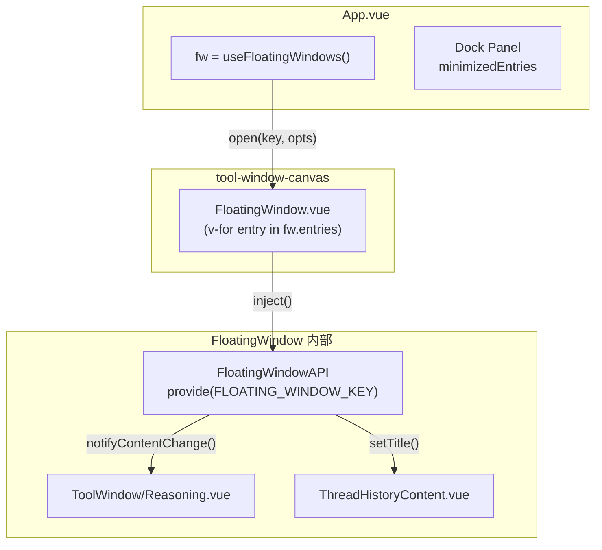

Vis 的悬浮窗系统是一个多实例、可拖拽、支持内容动态渲染的叠加层架构。它并非简单的弹窗组件，而是一套具备完整生命周期管理、自动过期回收、Dock 最小化托盘以及分层 Z-Index 策略的窗口引擎。理解这套系统的关键在于区分「管理器」与「窗口实例」两个层级：管理器负责全局状态与生命周期调度，窗口实例则通过依赖注入向内部内容组件暴露操作接口。本文将围绕悬浮窗的创建、渲染、交互、过期与 Dock 管理展开，帮助开发者掌握如何安全地创建自定义悬浮窗、控制其生命周期，并理解系统层面的回收与层级策略。

## 架构分层：管理器与窗口实例

悬浮窗系统采用双层组合式 API 设计。`useFloatingWindows` 作为全局管理器，维护一个 `Map<string, FloatingWindowEntry>` 存储所有窗口条目，并通过 `shallowRef<FloatingWindowEntry[]>` 向视图层提供响应式列表。每个 `FloatingWindowEntry` 包含位置、尺寸、内容、主题、过期时间等完整配置。管理器提供 `open`、`close`、`bringToFront`、`minimize`、`restore` 等生命周期方法，所有窗口操作都通过 key（如 `shell:${ptyId}`、`file-viewer:/path`）进行寻址。

`useFloatingWindow` 则是一个局部注入式 API，仅在 `FloatingWindow.vue` 内部通过 Vue 的 `provide/inject` 机制向子组件暴露当前窗口的操作能力。子组件（如 `ToolWindow/Reasoning.vue`、`ThreadHistoryContent.vue`）可以调用 `notifyContentChange()` 通知自动滚动器内容已更新，或通过 `setContent`、`setTitle`、`close` 等方法直接修改窗口状态。这种设计避免了子组件反向依赖全局管理器，同时保证了同一窗口内多个嵌套组件都能安全地操作宿主窗口。



Sources: [useFloatingWindows.ts](app/composables/useFloatingWindows.ts#L1-L508), [useFloatingWindow.ts](app/composables/useFloatingWindow.ts#L1-L30), [FloatingWindow.vue](app/components/FloatingWindow.vue#L1-L967)

## 窗口生命周期：从创建到销毁

悬浮窗的完整生命周期包含多个可插拔的阶段。调用 `fw.open(key, opts)` 时，管理器首先合并 `DEFAULT_OPTS`、已有条目与传入参数。若 key 不存在且未指定坐标，系统会在可视区域内随机分配初始位置，并通过 `getAxisBounds` 将窗口约束在至少保留 32px 标题栏可见的边界内。随后依次执行 `beforeOpen` 钩子、设置 `isReady = true`、触发 `rebuildEntries()` 使 Vue 渲染该窗口、异步解析内容、调度过期定时器，最后通过 `nextTick` 执行 `afterOpen` 钩子并将焦点移入窗口主体。

内容解析支持三种模式：若 `content` 为函数则异步调用并捕获异常；若同时提供了 `lang` 则通过 `renderWorkerHtml` 在 Web Worker 中完成语法高亮渲染；否则直接作为原始 HTML 或纯文本使用。为防止快速连续更新导致的竞态，系统使用 `renderVersionMap` 为每次内容请求生成单调递增的版本号，只有异步渲染完成时版本号仍匹配，才会将结果写入 `resolvedHtml`。

关闭流程同样具备钩子机制。`fw.close(key)` 先清除过期定时器，执行 `beforeClose(el)` 钩子（传入 DOM 元素以便执行清理动画），然后从 `entriesMap` 中删除条目并重建列表，最后调用 `afterClose()`。`closeAll` 方法支持通过 `exclude` 回调批量过滤关闭，内部使用 `skipRebuild` 优化避免重复重建。

```mermaid
sequenceDiagram
    participant Caller as 调用方
    participant Manager as useFloatingWindows
    participant Vue as Vue Renderer
    participant DOM as FloatingWindow DOM
    participant Worker as Render Worker

    Caller->>Manager: open(key, opts)
    Manager->>Manager: merge DEFAULT_OPTS + existing + opts
    Manager->>Manager: clamp position to bounds
    opt beforeOpen exists
        Manager->>Caller: await beforeOpen()
    end
    Manager->>Manager: isReady = true; rebuildEntries()
    Manager->>Vue: entries 更新 → 渲染 FloatingWindow
    Manager->>Worker: renderWorkerHtml({code, lang, theme})
    Worker-->>Manager: resolvedHtml
    Manager->>Manager: check renderVersion match
    opt afterOpen exists
        Manager->>DOM: querySelector([data-floating-key])<br/>afterOpen(el)
    end
    opt focusOnOpen
        Manager->>DOM: body.focus()
    end
    Caller->>Manager: close(key)
    Manager->>Manager: clearTimeout(timer)
    opt beforeClose exists
        Manager->>DOM: await beforeClose(el)
    end
    Manager->>Manager: entriesMap.delete(key)
    Manager->>Vue: rebuildEntries() → 卸载组件
    opt afterClose exists
        Manager->>Caller: afterClose()
    end
```

Sources: [useFloatingWindows.ts](app/composables/useFloatingWindows.ts#L207-L311), [useFloatingWindows.ts](app/composables/useFloatingWindows.ts#L441-L463)

## 内容渲染与竞态防护

悬浮窗的内容渲染是一个典型的异步竞态场景。当用户快速切换文件或流式消息频繁更新时，较早发起的渲染请求可能在较晚请求之后完成，导致内容回退。系统通过 `bumpRenderVersion(key)` 为每个窗口的每次内容变更生成一个单调递增的整数版本，存储在 `renderVersionMap` 中。`open`、`setContent`、`appendContent` 都会在发起渲染前 bump 版本，并在异步回调返回后校验 `renderVersionMap.get(key) !== contentVersion`，若版本已落后则直接丢弃结果。

`setContent` 与 `appendContent` 是管理器暴露的两个内容更新方法。前者替换全部内容并支持切换语言，后者在现有内容尾部追加文本。两者都会根据条目的 `variant` 自动决定行号 gutter 模式：`diff` 变体使用双栏 gutter，`code` 使用单栏，其余不显示行号。这种设计使得代码差异查看器与文件查看器可以复用同一套内容更新接口，而无需关心渲染细节。

Sources: [useFloatingWindows.ts](app/composables/useFloatingWindows.ts#L173-L177), [useFloatingWindows.ts](app/composables/useFloatingWindows.ts#L247-L283), [useFloatingWindows.ts](app/composables/useFloatingWindows.ts#L343-L395)

## Z-Index 分层与焦点管理

悬浮窗的层级管理遵循「手动层」与「自动层」双轨策略。`isManualTier` 函数判定规则为：若窗口 `closable === true`，或 key 以 `permission:`、`question:` 开头，则属于手动层。手动层窗口在计算 `zIndex` 时会额外加上 `MANUAL_ZINDEX_OFFSET = 10000`，确保用户主动操作的对话框、权限请求窗口始终浮于自动弹出的工具输出窗口之上。`zIndexCounter` 是一个全局递增计数器，每次 `bringToFront` 都会使其自增，保证最新激活的窗口获得最高层级。

焦点管理方面，`FloatingWindow.vue` 在根节点监听 `@pointerdown.capture="onFocus"`，任何指针按下都会触发 `emit('focus')`，进而调用 `fw.bringToFront(key)` 提升层级。对于需要初始焦点的场景（如 Codex 面板），可在 `open` 时传入 `focusOnOpen: true`，系统会在 `nextTick` 后将焦点移入 `.floating-window-body`。`restore` 操作同样会在恢复后自动聚焦窗口主体，若目标为终端窗口还会额外触发终端的 `focus()`。

Sources: [useFloatingWindows.ts](app/composables/useFloatingWindows.ts#L71-L82), [useFloatingWindows.ts](app/composables/useFloatingWindows.ts#L413-L418), [FloatingWindow.vue](app/components/FloatingWindow.vue#L198-L199), [App.vue](app/App.vue#L485-L499)

## 过期回收与状态驱动 TTL

悬浮窗系统内置了基于状态驱动的自动过期机制，避免已完成或出错的任务窗口长期占用屏幕。`resolveExpiresAt` 函数遵循以下优先级：显式 `expiresAt` > 显式 `expiry`（`Infinity` 表示永久）> 状态推导。当 `status` 为 `completed` 或 `error` 时，窗口获得 `TOOL_COMPLETED_TTL_MS = 2000ms` 的短存活期；非终止状态则获得 `TOOL_RUNNING_TTL_MS = 10分钟` 的长存活期。`updateOptions` 与 `setStatus` 在检测到状态变为终止时，会自动重新计算过期时间并调度定时器。

每个窗口拥有独立的 `setTimeout` 定时器，存储在 `timerMap` 中。`scheduleExpiry` 在调度前会清除已有定时器，防止重复或泄漏。永久窗口（`expiresAt >= Number.MAX_SAFE_INTEGER`）跳过定时器调度，典型用例包括权限对话框、Codex 面板以及用户手动打开的编辑器窗口。当 `useFloatingWindows` 所在的组件卸载时，`onUnmounted` 会遍历并清除所有定时器，避免内存泄漏。

Sources: [useFloatingWindows.ts](app/composables/useFloatingWindows.ts#L117-L132), [useFloatingWindows.ts](app/composables/useFloatingWindows.ts#L181-L196), [useFloatingWindows.ts](app/composables/useFloatingWindows.ts#L402-L411)

## Dock 最小化托盘

Dock 面板是悬浮窗系统的辅助交互层，位于应用底部，用于收纳被最小化的窗口。其显示条件由计算属性 `showDockPanel` 控制：`showMinimizeButtons` 设置项必须为 `true`，且满足 `dockAlwaysOpen === true` 或当前存在最小化窗口之一。`minimizedEntries` 是对 `fw.entries.value` 的简单过滤，仅保留 `minimized === true` 的条目。

每个 Dock 芯片显示窗口标题（或 key 回退），点击后调用 `restoreFloatingWindow(key)`，该函数先执行 `fw.restore(key)`（将 `minimized` 设为 `false` 并 `bringToFront`），然后在 `nextTick` 中恢复焦点。关闭最小化功能时，`watch(showMinimizeButtons)` 会自动调用 `restoreAllMinimizedWindows()` 将所有窗口还原，避免状态不一致。

Dock 的样式采用毛玻璃背景与圆角托盘设计，支持水平滚动以容纳大量芯片。其视觉层级低于悬浮窗画布（`z-index: 20` 对 `tool-window-canvas` 的 `z-index: 20`），但由于画布本身 `pointer-events: none` 且窗口单独启用 `pointer-events: auto`，Dock 的交互不会被悬浮窗遮挡。

Sources: [App.vue](app/App.vue#L207-L220), [App.vue](app/App.vue#L864-L869), [App.vue](app/App.vue#L5456-L5465), [App.vue](app/App.vue#L8910-L8969)

## 拖拽、缩放与边界约束

`FloatingWindow.vue` 的拖拽实现采用了「拖拽期间绕过 Vue 响应式」的性能优化策略。`onDragStart` 记录初始指针位置与窗口坐标，拖拽过程中通过 `applyTransform` 直接修改 CSS 自定义属性 `--win-x` 与 `--win-y`，完全避免触发 Vue 的重新渲染。拖拽结束时，才将最终坐标同步回 `props.entry.x` 与 `props.entry.y`，触发单次重排。若窗口被拖出可视区域，`snapBack` 会计算最近的有效边界并通过 `requestAnimationFrame` 执行 150ms 的 ease-out 回弹动画。

缩放功能通过右下角的 `.floating-window-resizer` 触发，同样使用 Pointer Events API。`onResizeMove` 直接修改 `props.entry.width` 与 `props.entry.height`（最小约束 200×150），结束时调用可选的 `onResize` 回调。窗口位置与尺寸的边界约束逻辑在管理器与组件中各有一份实现：管理器在 `open` 时负责初始位置的 clamp，组件在拖拽过程中实时计算 `getDragBounds` 并应用阻尼效果（越界时移动速度减半）。

Sources: [FloatingWindow.vue](app/components/FloatingWindow.vue#L286-L445), [FloatingWindow.vue](app/components/FloatingWindow.vue#L476-L512), [useFloatingWindows.ts](app/composables/useFloatingWindows.ts#L84-L89)

## 滚动策略与自动跟随

悬浮窗主体支持四种滚动模式：`follow`（智能跟随，用户上翻后暂停）、`force`（强制始终跟随）、`manual`（完全手动）、`none`（禁用滚动）。该功能由 `useAutoScroller` 组合式函数实现，与 `FloatingWindow.vue` 通过 `scrollMode` 计算属性绑定。`follow` 模式下，当内容更新时自动滚动器会检测用户是否位于底部（阈值 8px），若是则平滑滚动到底部；若用户主动上翻，则暂停跟随并显示「恢复跟随」按钮，直到用户点击或重新滚动到底部。

`notifyContentChange()` 是子组件与自动滚动器交互的核心接口。当 `ToolWindow/Reasoning.vue` 或 `ThreadHistoryContent.vue` 完成 Markdown 渲染后，会调用注入的 `floatingWindow.notifyContentChange()`，触发滚动器重新评估是否需要滚动。此外，窗口在内容更新前后会执行滚动位置保护：若当前为 `manual` 或 `follow` 但已暂停跟随，则在 `pre-flush` 阶段记录 `scrollTop`，在 `post-flush` 阶段恢复，防止渲染导致阅读位置丢失。

Sources: [useAutoScroller.ts](app/composables/useAutoScroller.ts#L1-L200), [FloatingWindow.vue](app/components/FloatingWindow.vue#L45-L82), [ToolWindow/Reasoning.vue](app/components/ToolWindow/Reasoning.vue#L1-L52)

## 主题类型与视觉分层

悬浮窗的视觉主题并非单一配置，而是基于窗口 key 前缀自动解析的「类型化主题」。`resolveFloatingWindowThemeType` 函数将 key 映射到 10 种主题类型之一：`shell`、`reasoning`、`subagent`、`tool`、`file`、`diff`、`media`、`dialog`、`history`、`debug`，以及默认的 `default`。每种类型可独立配置强调色、不透明度、背景图、标题栏不透明度等 CSS 变量。`FloatingWindow.vue` 的 `windowStyle` 计算属性会根据解析出的类型动态生成数十个 CSS 自定义属性，覆盖边框色、背景、字体族与字号。

终端窗口（`key.startsWith('shell:')`）享有特殊处理：主体区域背景透明、标题栏不透明、字体使用终端专用族、内边距归零。这种类型化主题机制使得不同用途的悬浮窗可以在视觉上快速区分，同时保持代码层面的高度复用。主题系统的详细令牌定义与配色规则，请参阅 [主题令牌与区域配色系统](21-zhu-ti-ling-pai-yu-qu-yu-pei-se-xi-tong)。

Sources: [floatingWindowTheme.ts](app/utils/floatingWindowTheme.ts#L1-L57), [FloatingWindow.vue](app/components/FloatingWindow.vue#L130-L197)

## 使用模式：流式窗口与对话框

在 Vis 的实际业务中，悬浮窗主要通过两种高层抽象被使用：`useStreamingWindowManager` 与 `useDialogHandler`。流式窗口管理器负责 reasoning 与 subagent 等 SSE 流式内容的实时展示，它维护 `entriesBySession` 聚合同一会话的多段文本，在收到增量更新时通过 `upsertEntry` 合并内容并调用 `fw.open` 打开或刷新窗口。流结束时，它会调度一个延迟关闭定时器（`closeDelayMs`），给用户留出阅读时间。

对话框处理器则封装了权限请求（`permission:`）与问题确认（`question:`）的交互模式。它提供 `upsert`、`refresh`、`remove`、`prune` 等方法，自动管理提交状态与错误提示的 props 传递，并通过 `makeReplyFlow` / `makeRejectFlow` 生成标准化的异步回复流程。这两种模式都建立在 `useFloatingWindows` 的基础之上，开发者可以根据业务需求选择直接使用底层 API，或借鉴上述封装模式构建自己的窗口管理逻辑。

Sources: [useStreamingWindowManager.ts](app/composables/useStreamingWindowManager.ts#L1-L154), [useDialogHandler.ts](app/composables/useDialogHandler.ts#L1-L204), [useReasoningWindows.ts](app/composables/useReasoningWindows.ts#L1-L212)

## 与其他页面的关联

悬浮窗系统与多个功能模块存在紧密协作。内容渲染依赖 [Web Worker 渲染池与缓存策略](10-web-worker-xuan-ran-chi-yu-huan-cun-ce-lue) 完成语法高亮；主题解析由 [主题令牌与区域配色系统](21-zhu-ti-ling-pai-yu-qu-yu-pei-se-xi-tong) 提供令牌定义；文件查看器与代码差异查看器的具体渲染逻辑在 [渲染器与查看器分层架构](16-xuan-ran-qi-yu-cha-kan-qi-fen-ceng-jia-gou) 中详述；而 SSE 流式数据的接收与解析则由 [SSE 连接管理与事件协议](8-sse-lian-jie-guan-li-yu-shi-jian-xie-yi) 负责。若需了解全局事件总线如何协调会话切换与窗口清理，请参阅 [全局状态与事件系统](6-quan-ju-zhuang-tai-yu-shi-jian-xi-tong)。