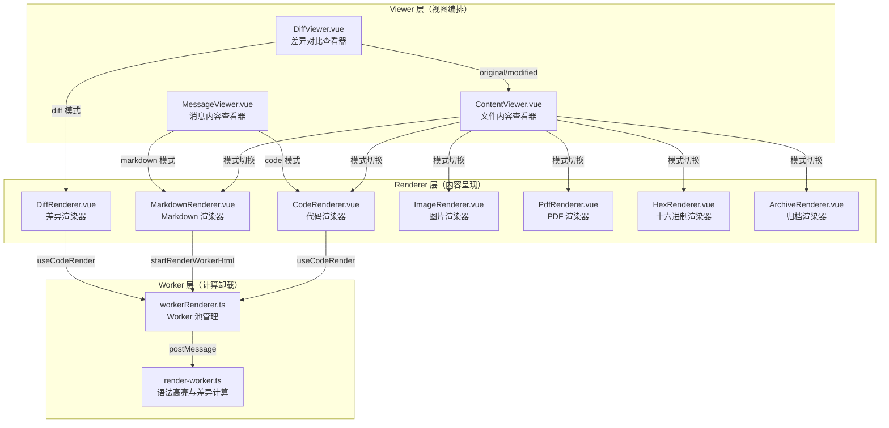

本文档深入解析前端内容展示系统的三层架构设计：Viewer（查看器层）负责内容类型决策与视图切换，Renderer（渲染器层）负责具体内容的呈现实现，Worker（渲染工作线程）负责高计算量的语法高亮与差异计算。这一分层使得代码复用、性能优化和可扩展性得以在同一套系统中协调运作。

## 架构总览

整个内容展示体系由三个清晰的层次构成。**Viewer 层**（`viewers/`）面向业务场景，决定"展示什么"——它根据文件扩展名、MIME 类型、二进制检测结果选择最合适的渲染模式，并提供标签页让用户在多种视图间切换。**Renderer 层**（`renderers/`）面向内容格式，解决"如何展示"——每个渲染器专注于一类内容（代码、图片、PDF、十六进制等）的呈现细节。**Worker 层**（`workers/render-worker.ts`）将 CPU 密集型的语法高亮、差异计算和 Markdown 渲染卸载到独立的 Web Worker 池中，避免阻塞主线程。

Sources: [ContentViewer.vue](app/components/viewers/ContentViewer.vue#L1-L62), [DiffViewer.vue](app/components/viewers/DiffViewer.vue#L1-L52), [MessageViewer.vue](app/components/MessageViewer.vue#L1-L29)

## Viewer 层：内容类型决策与视图编排

Viewer 层是用户直接接触的内容容器，其核心职责是根据输入数据的特征（文件路径、扩展名、二进制标记、内容类型）动态选择可用的渲染模式，并以标签页形式呈现。

### ContentViewer：通用文件查看器

`ContentViewer` 是文件查看场景的核心组件，支持七种渲染模式的自动检测与手动切换。它定义了 `ModeId` 联合类型 `'rendered' | 'source' | 'image' | 'hex' | 'info' | 'archive' | 'pdf'`，并通过一系列计算属性决定哪些模式对当前文件可用。

文件类型检测逻辑遵循三级回退策略：首先信任后端传递的 `binaryBase64` 标记；其次匹配已知的二进制扩展名集合（涵盖图片、可执行文件、归档、文档、媒体、字体等数十种类型）；最后通过内容启发式分析（检查空字节比例和非打印字符比例）进行兜底判断。对于 Markdown 文件，系统同时提供"渲染视图"和"源码视图"两种模式；对于二进制文件，则提供"文件信息"和"十六进制"视图。

`ContentViewer` 的 `activeMode` 计算属性实现了智能默认选择：PDF 文件默认进入 PDF 模式，二进制文件默认显示文件类型信息，其余情况默认显示源码。当用户手动切换标签后，`userSelectedMode` 会记住用户偏好，直到文件路径发生变化时自动重置。

Sources: [ContentViewer.vue](app/components/viewers/ContentViewer.vue#L77-L388)

### DiffViewer：差异对比查看器

`DiffViewer` 专门处理代码差异展示场景，支持两种数据来源：直接的 before/after 文本对，或包含多个文件差异的 `diffTabs` 数组。它提供三层标签结构：当存在多个文件差异时，顶部显示文件切换标签；中部显示"原始/修改后/差异"三种视图模式标签；底部则是实际的渲染区域。

在视图模式选择上，`DiffViewer` 展现出对二进制文件的特别处理：当检测到图片格式的差异时（通过 `BITMAP_EXTENSIONS` 判断），系统仅提供"修改后"和"原始"两种模式，因为差异对比对二进制图片没有意义。对于文本文件，则完整提供三种模式，其中"差异"模式委托给 `DiffRenderer`，"原始"和"修改后"模式则复用 `ContentViewer` 进行单文件展示。

Sources: [DiffViewer.vue](app/components/viewers/DiffViewer.vue#L54-L168)

### MessageViewer：消息内容查看器

`MessageViewer` 服务于聊天消息场景，处理 LLM 回复内容的展示。它只支持两种模式："markdown"（渲染视图）和"code"（源码视图）。与文件查看器不同，消息查看器的模式选择基于 `props.mode` 和 `props.lang` 而非文件扩展名。

一个值得注意的性能优化是 `keepBothRenderersMounted` 策略：当允许模式切换（`allowModeToggle` 为真）时，两种渲染器会同时挂载，仅通过 `v-show` 控制显隐。这避免了频繁切换模式时的重新渲染开销，代价是稍高的内存占用。

Sources: [MessageViewer.vue](app/components/MessageViewer.vue#L32-L127)

## Renderer 层：专用内容呈现

Renderer 层包含七个独立的渲染器组件，每个组件只负责一种内容类型的呈现逻辑，通过统一的 `rendered` 事件向父组件报告渲染完成状态。

### CodeRenderer：代码渲染与交互

`CodeRenderer` 是最复杂的渲染器，它通过 `useCodeRender` 组合式函数与 Worker 层交互获取语法高亮后的 HTML，并在此基础上实现了三项关键功能。

**虚拟滚动**：当代码行数超过 `VIRTUAL_SCROLL_THRESHOLD`（500 行）时，系统启用虚拟滚动。它假设每行固定高度 20 像素，通过计算视口内的起始和结束行索引，只渲染可见区域加上 `OVERSCAN_ROWS`（10 行）缓冲区的内容。上下不可见区域通过 CSS padding 占位维持滚动条尺寸。这一设计使得万行级大文件也能流畅滚动。

**行选择交互**：用户可以通过鼠标拖拽选择连续的多行代码。系统监听 `mousedown`、`mousemove`、`mouseup` 事件，通过 `getLineFromMouse` 将鼠标坐标映射到行号，并计算拖拽距离判断是否构成有效选择。选中后会在对应行添加 `line-highlight` 类，并弹出 `LineCommentOverlay` 供用户添加行级评论。

**行号高亮与跳转**：通过 `props.lines` 传入行号规格（如 `"10-15,20"`），`CodeRenderer` 会在渲染完成后高亮对应行，并自动滚动到第一个高亮行位置。对于虚拟滚动场景，通过直接设置 `scrollTop` 实现跳转；非虚拟滚动场景则使用 `scrollIntoView`。

Sources: [CodeRenderer.vue](app/components/renderers/CodeRenderer.vue#L1-L455)

### MarkdownRenderer：Markdown 渲染与复制交互

`MarkdownRenderer` 同样通过 Worker 层获取渲染后的 HTML，但它额外处理了代码块和 Markdown 全文的复制功能。渲染完成后，组件通过事件委托监听 `.md-copy-btn` 的点击：如果点击发生在代码块内，则复制 `<pre>` 元素的文本内容；如果点击发生在 Markdown 宿主上，则复制 `<template class="md-raw-source">` 中保存的原始 Markdown 源码。

复制操作优先使用 Electron 的 `clipboard.writeText` API，在浏览器环境中回退到 `navigator.clipboard`。复制成功后，对应元素会被添加 `copied` 类，1.5 秒后自动恢复。`MarkdownRenderer` 还支持通过 `props.html` 直接传入预渲染的 HTML，跳过 Worker 调用，这一特性被预渲染系统用于减少首屏延迟。

Sources: [MarkdownRenderer.vue](app/components/renderers/MarkdownRenderer.vue#L15-L183)

### DiffRenderer：差异渲染

`DiffRenderer` 是 `DiffViewer` 在"差异"模式下的实际执行者。它接收 `diffCode`（修改前）、`diffAfter`（修改后）和 `diffPatch`（补丁文本）三种输入，通过 `useCodeRender` 委托给 Worker 层生成带有行级差异高亮的 HTML。

当存在多文件差异时，`DiffRenderer` 提供文件切换标签页，通过 `activeTabIndex` 追踪当前激活的文件，并动态计算当前文件的 `activeDiffCode`、`activeDiffAfter` 和 `activeDiffPatch`。渲染参数中的 `gutterMode` 默认为 `'double'`，在差异视图中同时显示旧行号和新行号。

Sources: [DiffRenderer.vue](app/components/renderers/DiffRenderer.vue#L23-L108)

### 其他专用渲染器

| 渲染器 | 核心依赖 | 关键特性 |
|---|---|---|
| `ImageRenderer` | 原生 `` | 支持滚轮缩放、指针拖拽平移、双击重置视图；缩放以鼠标位置为中心点 |
| `PdfRenderer` | `vue-pdf-embed` | 支持多页导航、页码显示、渲染失败错误提示 |
| `HexRenderer` | `@kikuchan/hexdump` | 虚拟滚动展示二进制字节，每行 16 字节，包含地址、十六进制值和 ASCII 三列 |
| `ArchiveRenderer` | `archiveParser` | 异步解析 ZIP/TAR/GZ 等归档格式，展示文件列表、大小和修改时间 |

Sources: [ImageRenderer.vue](app/components/renderers/ImageRenderer.vue#L1-L154), [PdfRenderer.vue](app/components/renderers/PdfRenderer.vue#L1-L158), [HexRenderer.vue](app/components/renderers/HexRenderer.vue#L1-L143), [ArchiveRenderer.vue](app/components/renderers/ArchiveRenderer.vue#L1-L173)

## CodeContent：渲染结果统一样式容器

`CodeContent` 是所有基于文本的渲染器（CodeRenderer、DiffRenderer、HexRenderer）共用的底层展示组件。它接收 `html` 字符串和 `variant` 变体标识，通过 `v-html` 插入渲染结果，并根据变体应用不同的 CSS 规则。

`variant` 支持六种模式：`code`（标准代码，带单栏行号）、`diff`（差异视图，带差异行背景色和侧边色条）、`message`（消息中的代码块，无行号、自动换行）、`binary`（十六进制视图，等宽字体）、`term`（终端输出，自动换行）、`plain`（纯文本，无行号）。`wordWrap` 设置和 `floatingPreviewWordWrap` 全局配置会影响 `code` 和 `diff` 变体是否启用软换行。

`CodeContent` 的 CSS 通过 `:deep()` 深度选择器覆盖 Shiki 生成的 HTML 结构，确保语法高亮主题与应用程序主题系统协调一致。差异视图的四种行类型（`line-added`、`line-removed`、`line-hunk`、`line-header`）分别对应绿色、红色、蓝色和灰色的背景与左侧边条。

Sources: [CodeContent.vue](app/components/CodeContent.vue#L1-L211)

## Worker 层：渲染计算卸载

Worker 层是整个架构的性能基石，它将所有 CPU 密集型操作从主线程转移到独立的 Web Worker 池中。

### Worker 池管理

`workerRenderer.ts` 维护一个大小自适应的 Worker 池：`WORKER_POOL_SIZE` 根据 `navigator.hardwareConcurrency` 在 4 到 8 之间动态确定。渲染请求通过轮询（round-robin）分发给池中的 Worker，实现负载均衡。

系统实现了两层缓存机制。**渲染结果缓存** `completedCache` 以 LRU 策略存储最多 200 条渲染结果，缓存键由代码内容、语言、主题、差异参数、行号模式等全部输入拼接而成。**高亮缓存** 在 Worker 内部维护，分为 `codeHtmlCache`（代码高亮，上限 512）和 `mdHighlightCache`（Markdown 代码块高亮，上限 512），当缓存超过上限时淘汰一半最旧的条目。

`startRenderWorkerHtml` 返回一个 `RenderTask` 对象，包含 `promise` 和 `cancel` 方法。当组件卸载或输入变化时，可以调用 `cancel` 取消过时的渲染请求，Worker 收到取消后通过 `RenderCancelledError` 静默失败，不会触发错误处理。

Sources: [workerRenderer.ts](app/utils/workerRenderer.ts#L1-L195)

### 渲染工作线程

`render-worker.ts` 是实际执行渲染逻辑的 Web Worker，它集成了 Shiki 语法高亮引擎和 Markdown-it Markdown 解析器。

**语法高亮**：Worker 使用 `createHighlighter` 创建高亮器实例，支持动态加载语言包。对于生物信息学领域特有的文件格式（FASTA、FASTQ、SAM、VCF、BED、GTF），系统内置了自定义的 TextMate 语法定义，通过 `?raw` 导入后直接加载。语言解析采用候选回退策略：例如 `shellscript` 回退到 `bash`，`tsx` 回退到 `typescript`，确保即使精确语言包缺失也能获得合理的高亮效果。

**差异计算**：Worker 实现了基于 Myers 差分算法的统一差异生成器（`generateUnifiedDiff`），时间复杂度为 O(ND)。当用户提供 before/after 文本但没有 patch 时，Worker 自动生成差异文本，再进入差异渲染流程。差异渲染通过 `buildDiffHtmlFromCode` 实现：分别高亮 before 和 after 文本，提取每行的 HTML，然后按照统一差异格式重新组装，为新增、删除、上下文和块头四种类型的行附加不同的 CSS 类。

**Markdown 渲染**：Worker 使用 `@shikijs/markdown-it/core` 将 Shiki 集成到 Markdown-it 中，实现代码块的语法高亮。它还注册了自定义插件：任务列表将 `[ ]` 和 `[x]` 转换为 emoji 符号；内联代码支持文件引用（`data-file-ref`）、提交哈希（`data-commit-ref`）和颜色值（`--preview-color`）的自动识别；所有外部链接自动添加 `target="_blank"` 和 `rel="noopener noreferrer"`。

**Grep 高亮**：当请求包含 `grepPattern` 时，Worker 将正则匹配结果包装在 `` 中，实现搜索结果的高亮展示。

Sources: [render-worker.ts](app/workers/render-worker.ts#L1-L1069)

## useCodeRender：连接 Renderer 与 Worker 的桥梁

`useCodeRender` 是 Renderer 层与 Worker 层之间的标准接口。它接收一个响应式的 `CodeRenderParams` 对象，当参数变化时自动向 Worker 发起新的渲染请求，并将结果暴露为 `html` 和 `error` 两个响应式引用。

该组合式函数实现了请求序号机制：每次参数变化时递增 `requestId`，在 Worker 回调中检查序号是否仍然匹配，从而自动丢弃过时的渲染结果。组件卸载时自动取消进行中的请求，防止内存泄漏。

`CodeRenderParams` 的类型定义揭示了 Worker 支持的全部渲染能力：`code`（源代码）、`lang`（语言标识）、`theme`（主题名称）、`patch`/`after`（差异参数）、`gutterMode`（行号模式：none/single/double）、`gutterLines`（自定义行号文本）、`grepPattern`（搜索高亮模式）、`lineOffset`/`lineLimit`（行范围限制）。

Sources: [useCodeRender.ts](app/utils/useCodeRender.ts#L1-L92)

## 渲染状态监控

`useRenderState` 维护一个全局的 `pendingWorkerRenders` 计数器，`workerRenderer.ts` 在每次发起渲染时递增、完成时递减。这一计数器可用于在 UI 中展示后台渲染队列的繁忙程度，帮助用户感知系统状态。

Sources: [useRenderState.ts](app/composables/useRenderState.ts#L1-L22)

## 消费场景与调用链路

Viewer 和 Renderer 组件通过悬浮窗系统（`useFloatingWindows`）和消息系统被广泛应用。以下是主要的消费场景：

| 场景 | 入口组件 | 使用的 Viewer/Renderer | Worker 调用方式 |
|---|---|---|---|
| 文件查看 | `App.vue` → `openFileViewer` | `ContentViewer` | 通过 `CodeRenderer`/`MarkdownRenderer` 间接调用 |
| Git 差异 | `App.vue` → `openAllGitDiff` | `DiffViewer` | 通过 `DiffRenderer` 间接调用 |
| 消息差异 | `App.vue` → `handleShowMessageDiff` | `DiffViewer` | 通过 `DiffRenderer` 间接调用 |
| 图片查看 | `App.vue` → `handleOpenImage` | `ContentViewer` → `ImageRenderer` | 无（原生渲染） |
| 调试信息 | `App.vue` → `openDebugSessionViewer` | `ContentViewer` | 通过 `CodeRenderer` 间接调用 |
| 聊天消息 | `ThreadBlock.vue`/`ThreadHistoryContent.vue` | `MessageViewer` | 通过 `MarkdownRenderer`/`CodeRenderer` 间接调用 |
| 工具窗口内容 | `useFloatingWindows.ts` | 直接渲染 HTML | `renderWorkerHtml` 直接调用 |
| 预渲染助手 | `useAssistantPreRenderer.ts` | 缓存 HTML 供 `MessageViewer` 使用 | `startRenderWorkerHtml` 直接调用 |

Sources: [App.vue](app/App.vue#L7707-L7723), [useFloatingWindows.ts](app/composables/useFloatingWindows.ts#L260-L395), [useAssistantPreRenderer.ts](app/composables/useAssistantPreRenderer.ts#L22-L133)

## 扩展指南

如需添加新的内容类型支持，遵循以下步骤：

1. **创建 Renderer**：在 `app/components/renderers/` 下新建 Vue 组件，实现特定内容类型的展示逻辑。如果内容需要 Worker 计算，使用 `useCodeRender`；如果可直接渲染，直接处理 `props`。
2. **注册到 ContentViewer**：在 `ContentViewer.vue` 的模板中添加 `v-else-if="activeMode === 'xxx'"` 分支，在 `ModeId` 类型中添加新模式标识，在 `availableModes` 计算属性中定义可用性条件。
3. **更新文件类型检测**（如需要）：在 `ContentViewer.vue` 的扩展名集合或检测逻辑中识别新类型的文件。
4. **考虑 Worker 集成**（如需要）：如果新类型涉及复杂计算，在 `render-worker.ts` 的 `renderRequest` 函数中添加新的分支处理逻辑。

如需修改语法高亮行为，直接编辑 `render-worker.ts`。该文件支持自定义语法定义、语言别名映射、Markdown 插件扩展和差异算法参数调整，所有变更对全部使用 Worker 的组件即时生效。

如需了解悬浮窗如何承载这些 Viewer 组件，请参阅 [悬浮窗生命周期与 Dock 管理](15-xuan-fu-chuang-sheng-ming-zhou-qi-yu-dock-guan-li)。如需了解 Worker 渲染池的缓存与并发策略细节，请参阅 [Web Worker 渲染池与缓存策略](10-web-worker-xuan-ran-chi-yu-huan-cun-ce-lue)。如需了解差异压缩算法，请参阅 [代码差异压缩与语法高亮](17-dai-ma-chai-yi-ya-suo-yu-yu-fa-gao-liang)。